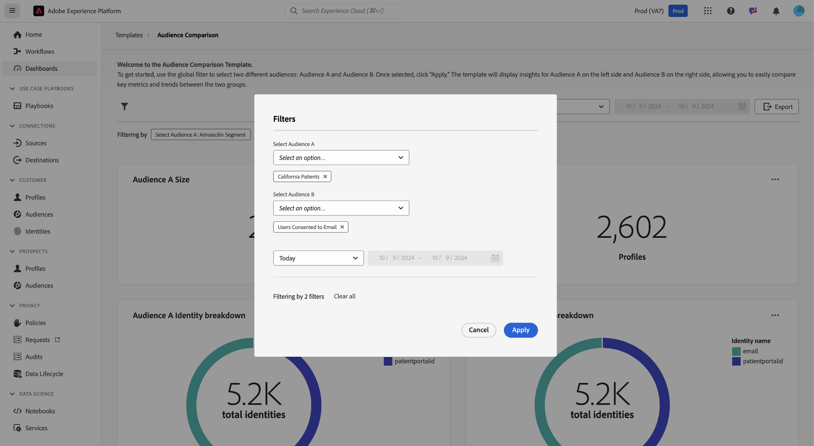
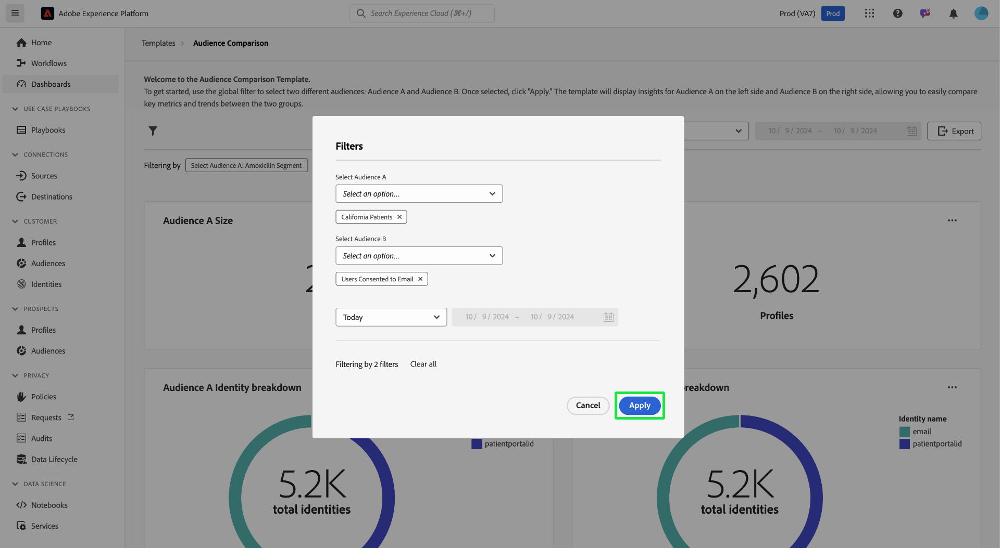
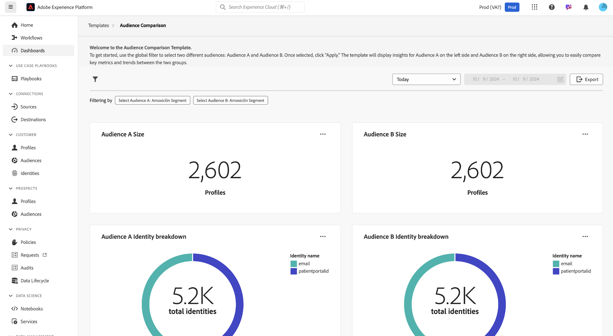
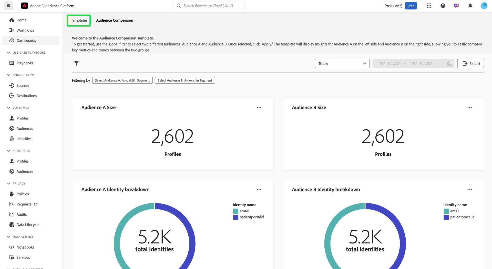

# Audience comparison

The [!UICONTROL Audience comparison] dashboard compares and contrasts key audience metrics in a side-by-side view. From this dashboard, you can perform a variety of actions to compare two audience groups and analyze key metrics between them. You can then make data-driven decisions regarding audience segmentation and targeting strategies.

## Set audience comparisons {#set-audience-comparisons}

To allow for more meaningful insights and comparisons, use the system filters to precisely target the audience segments, and the timeframe you are interested in analyzing. Select the filter icon () to choose two different audiences ([!UICONTROL Audience A] and [!UICONTROL Audience B]) and set specific parameters for comparison. 

The [!UICONTROL Filter] dialog appears. To choose the first audience to analyze, select the **[!UICONTROL Select Audience A]** dropdown. In this example, `California Patients` has been selected as Audience A. This audience appears on the left side of the comparison once the filter is applied.

Next, choose a second audience to compare against [!UICONTROL Audience A] from the **[!UICONTROL Select Audience B]** dropdown. In this image, [!UICONTROL Users Consented to Email] has been selected as [!UICONTROL Audience B]. This audience is displayed on the right side of the [!UICONTROL Audience comparison] dashboard once the filter is applied.

### Adjust date ranges {#adjust-date-ranges}

You can also filter your data by specific time periods, to see how these audiences perform or change over a custom date range. To set a time range to filter the audience data by a specific period, select the start and end dates from the calendar fields.

The dialog also indicates how many filters are applied (in the screenshot below, two filters are being used: Audience A and Audience B, and today as a date range). To remove all applied filters, select **[!UICONTROL Clear all]**.

After setting the audiences and date range, select **[!UICONTROL Apply]** to refresh the [!UICONTROL Audience comparison] dashboard.

The dashboard now shows the comparative charts displayed side-by-side for each audience.

## Available audience comparison charts {#available-charts}

<!-- Potentially could expand this section to include images of each widget.  -->

The dashboard provides several charts to compare insights:

- [[!UICONTROL Audience size]](../../guides/audiences.md#audience-size): Easily track the size of each audience based on the number of profiles that they contain. This metric helps you to understand the scale of the two audiences you're comparing.
- [!UICONTROL Audience identity breakdown]: A pie chart provides a breakdown of the relative composition of identities within each audience. You can view the number of total identities and examine how different identifiers (like email or CRM ID) contribute to that total. This chart helps you to understand the composition of each audience based on identity types. Hover over a section of the pie chart to see an exact number of identities.  
- [[!UICONTROL Audience size trend]](../../guides/audiences.md#audience-size-trend): This chart represents the size trends over time for the chosen audience. Use these charts to visualize how the size of each audience has changed across a selected time period, with peaks and troughs indicating periods of growth or reduction in the number of profiles.
- [[!UICONTROL Audience size change trend]](../../guides/audiences.md#audience-size-change-trend): This chart displays the size change trends for the chosen audience. It visualizes how much the audience size has increased or decreased over time, and allows you to identify significant shifts or trends in the audience population.

>[!NOTE]
>
>The [!UICONTROL Audience size trend] and [!UICONTROL Audience size change trend] charts help you track and compare both the absolute size and fluctuations in size between two audiences over a specified period. This information makes it easier to understand patterns and factors influencing audience changes.

## Export insights {#export-insights}

After you've applied filters and analyzed the audiences, you can export the data for further offline analysis or reporting purposes. To export your insights, select **[!UICONTROL Export]** on the top right of the table. The print PDF dialog appears. From this dialog, you can save as a PDF or print the data shown in the table.

Select **[!UICONTROL Templates]** to return to the [!UICONTROL Template] overview.

## Next steps

After reading this document, you have learned how to compare key metrics between different audience groups using the **Audience Comparison** dashboard. To continue improving your audience segmentation and targeting strategies, explore other Data Distiller Templates that provide additional insights. Refer to the [Audience Trends](./trends.md), [Audience Identity Overlaps](./identity-overlaps.md), and [Advanced Audience Overlaps](./overlaps.md) UI guides to further enhance your decision-making and optimize engagement efforts.
