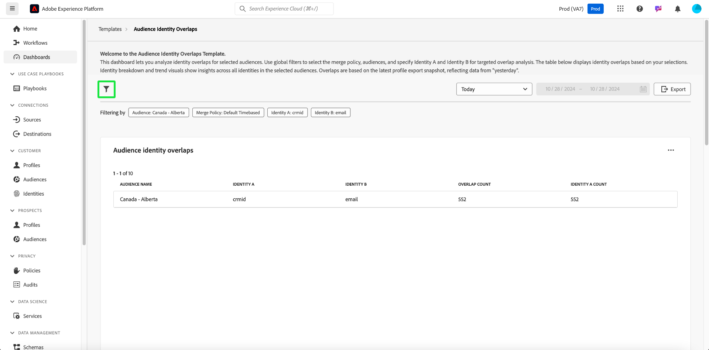
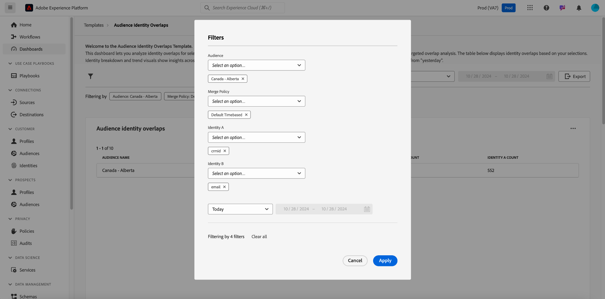
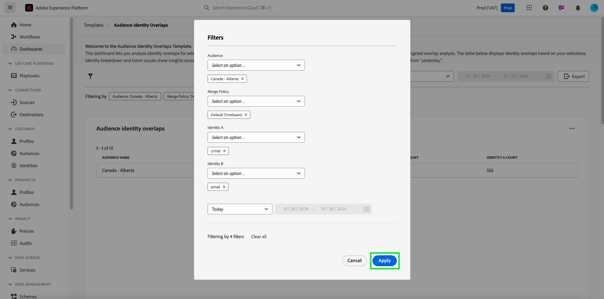
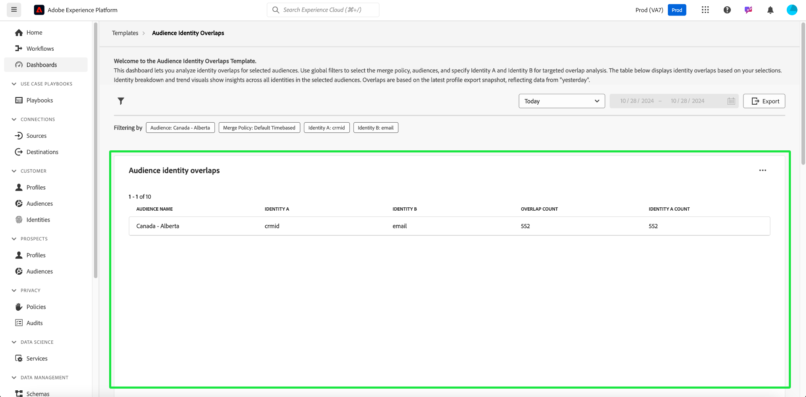
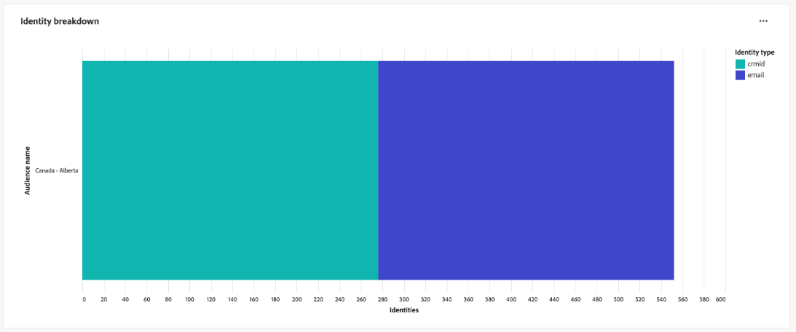
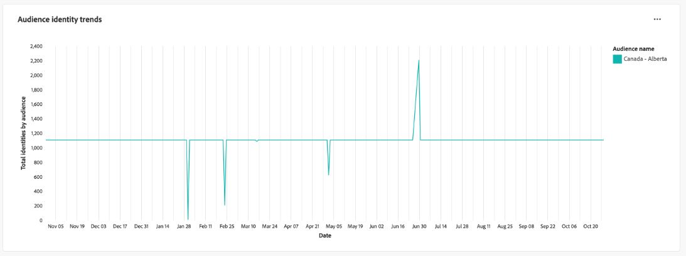
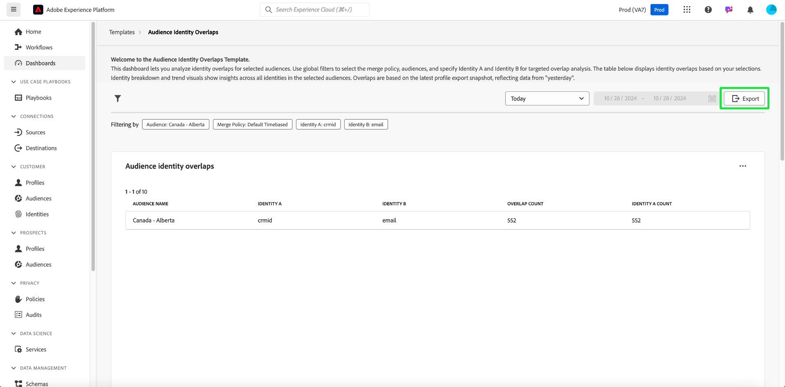

# Audience identity overlaps

Analyze identity overlaps for selected audiences with the [!UICONTROL Audience Identity Overlaps] dashboard. You can use insights into how different identities within an audience relate to each other to optimize stitching strategies, reduce redundancy, and improve customer segmentation accuracy. Develop effective targeting strategies and streamline customer interactions with an improved understanding of the overlap between identity types.

## Filtering audiences {#filter-audiences}

Use custom filters for targeted analysis of specific audiences and identity types to ensure that the presented data aligns with your analysis goals. To start your analysis, select the filter icon (). 

The **[!UICONTROL Filters]** dialog appears. From this view, choose the global filters to configure your audience, merge policy, and the identities for comparison. Select your settings for analysis from each section's dropdown menu

1. Select an **[!UICONTROL Audience]**: Choose the audience segment you want to analyze (for example, **Canada - Alberta**).
2. Specify a **[!UICONTROL Merge Policy]**: Define the merge policy that dictates how identities are combined across the selected audience (in the example screenshot, the **Default time based** policy is selected).
3. Select an **[!UICONTROL Identity A]** and **[!UICONTROL  Identity B]** for comparison**: Choose the two identity types to compare. In the example, **Identity A** is selected as "crmId" and **Identity B** is selected as "email."
4. **Set a date range**: Choose a predefined range like "Today" or manually set the start and end dates using the calendar fields.

>[!TIP]
>
>To clear all of your custom global filters, select **[!UICONTROL Clear all]** from the [!UICONTROL Filters] dialog. To remove a single filter, select the '[!UICONTROL X]'to the right of the filter name.

Once you have chosen the filters, select **[!UICONTROL Apply]** to refresh the dashboard.

## Available dashboard insights {#available-insights}

The **Audience Identity Overlaps** dashboard provides several visualizations and tabulated data to help you understand identity overlaps and trends within your audience.

### Audience Identity Overlaps {#overlaps-table}

The **[!UICONTROL Audience Identity Overlaps]** table displays identity overlaps based on your selected filters. Use this information to assess the overlap between different identity types and understand how effectively identities are being resolved. The table below explains each column in detail:

| Column Name     | Description                   |
|-----------------|-------------------------------|
| **[!UICONTROL Audience Name]**     | The name of the audience being analyzed. This column identifies which audience segment is under review to ensure that the insights are focused on the intended target group. |
| **[!UICONTROL Identity A]** and **[!UICONTROL Identity B]** | The identities being compared (for example, `crmId` and `email`). Knowing which identity types are being compared helps you identify which identity resolution strategies contribute to audience overlap and optimize those relationships. |
| **[!UICONTROL Overlap Count]**     | The count of profiles where both identities are present. This metric provides insights into the extent of identity overlap within the audience. This information is crucial for evaluating how effectively multiple identities are being resolved into unified profiles, which in turn can improve targeting and personalization strategies. |
| **[!UICONTROL Identity A Count]**  | The total number of profiles in the selected audience that contain **Identity A**. Use this information to understand the prevalence of the primary identity type within the audience and assess its role in the overlap analysis. |

### Identity Breakdown {#identity-breakdown}

The **[!UICONTROL Identity Breakdown]** chart shows the relative composition of identities within the selected audience. The X-axis represents the total number of identities within the selected audience, while the Y-axis represents the audience name being analyzed. Use this visualization to understand the prevalence of each identity type and evaluate the impact of your identity management strategy. The chart differentiates between identity types using distinct colors, providing a quick overview of how identities are distributed across your audience.

>[!TIP]
>
>Hover over the columns to see the individual count of profiles for each identity type.

### Audience Identity Trends {#audience-identity-trends}

The **[!UICONTROL Audience Identity Trends]** chart provides insights into how the total number of identities has changed over time. The X-axis represents the date range being analyzed, while the Y-axis represents the total number of identities by audience. Use this metric to track identity growth, assess stability, and measure the effectiveness of ongoing identity management efforts.

>[!TIP]
>
>Hover over a date in the chart to see the total number of identities for the audience on a specific date.

## Export Insights {#export-insights}

After analyzing identity overlaps, you can export the data for offline analysis or reporting. To export your data, select **[!UICONTROL Export]** on the top right of the table. The print PDF dialog appears, allowing you to save the visualized data as a PDF or print it.

The **Audience Identity Overlaps** dashboard provides essential insights into how different identities intersect across your selected audiences. By leveraging these insights, you can refine identity stitching strategies, reduce redundancy, and ensure that your audience segmentation is more accurate and effective.

## Next steps

After reading this document, you have learned how to gain valuable insights into identity overlaps for selected audiences using the **Audience Identity Overlaps** dashboard. To further enhance your understanding of audience segmentation and identity management, explore other Data Distiller Templates that provide comprehensive insights. Refer to the [Audience Trends](./trends.md), [Audience Comparison](./comparison.md), and [Advanced Audience Overlaps](./overlaps.md) UI guides to continue improving your targeting and engagement strategies.
