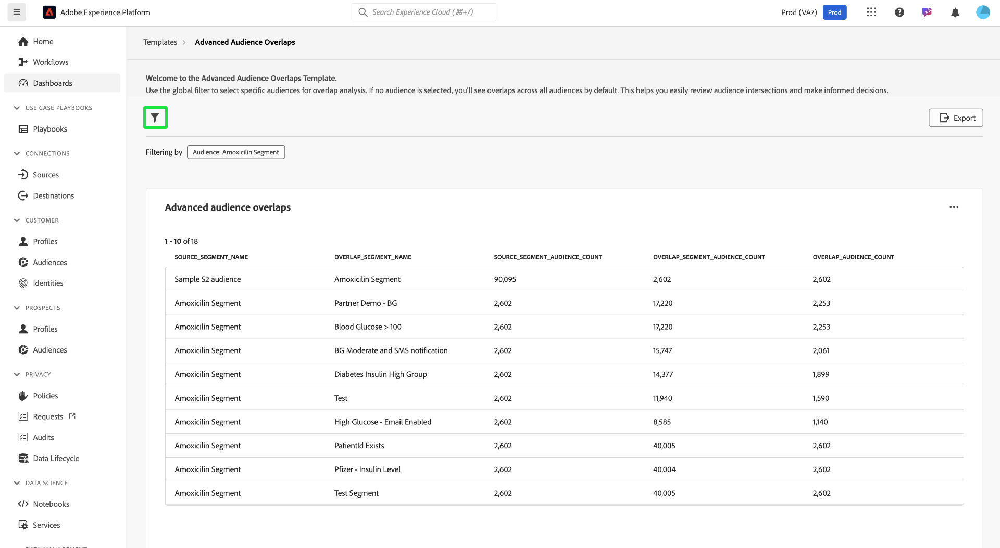
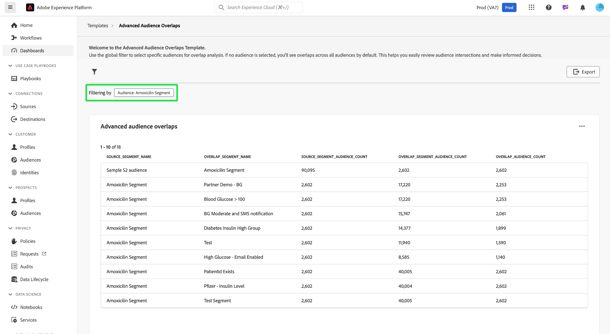
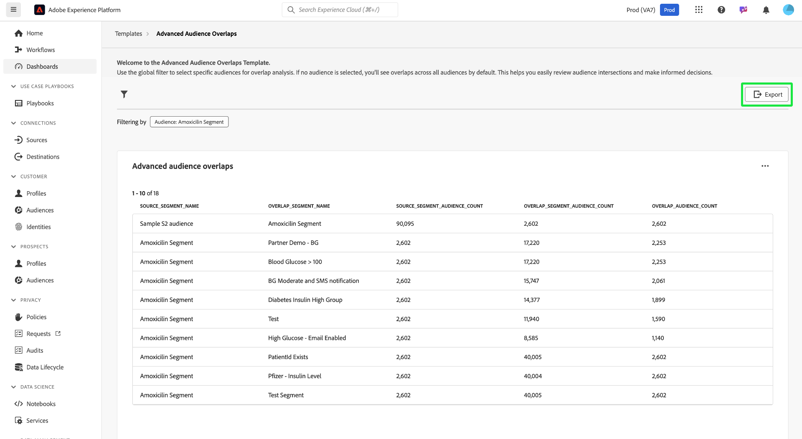
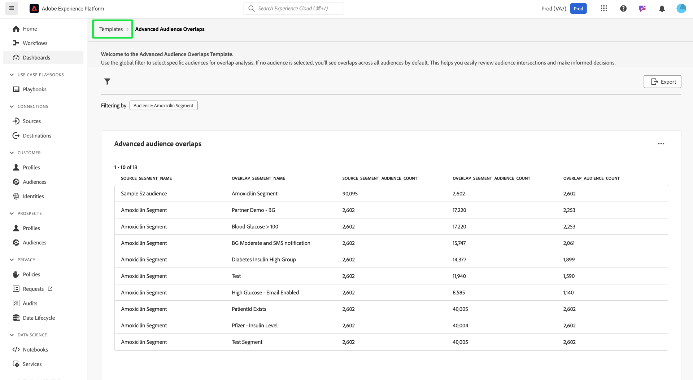

# Advanced Audience Overlaps

Gain valuable insights to optimize your audience segmentation and targeting strategies by analyzing how different audience segments intersect with the [!UICONTROL Advanced Audience Overlaps] dashboard. Examine the tabulated metrics to identify overlaps, refine segmentation, and reduce redundant messaging. Ultimately, you can use these insights to create more targeted campaigns and efficient marketing efforts. On this dashboard, you can review audience intersections, apply filters, and perform detailed overlap analysis to make data-driven decisions and improve engagement outcomes.

## Filter Audiences {#filter-audiences}

To filter specific audiences for overlap analysis, select the filter icon () to open the [!UICONTROL Filter] dialog. From here, you can add or remove audiences from the overlap template to refine your analysis.

The [!UICONTROL Filters] dialog appears. To choose an audience for overlap analysis, select an audience name from the **[!UICONTROL Audience]** dropdown. The name of any audience you add is displayed with a tag below the dropdown. Once added, you can select the 'X' by their name to remove them. To remove all applied filters, select **[!UICONTROL Clear all]**.

## Applied filters {#applied-filters}

Once a filter is applied ([!UICONTROL Amoxicilin Segment] in the screenshot example), the displayed audience data is narrowed down. Any additional audiences that you choose to add are displayed next to the [!UICONTROL Filtering by] tag above the [!UICONTROL Advanced Audience overlaps] chart.

## Advanced Audience Overlaps Table {#advanced-audience-overlaps-table}

The main section of the dashboard displays the [!UICONTROL Advanced Audience Overlaps] table, which provides a detailed comparison of audience overlaps between different segments. The table columns are as follows:

| Column name                        | Description                                                                                  |
|------------------------------------|----------------------------------------------------------------------------------------------|
| **[!UICONTROL Source_Segment_Name]**           | The original audience being analyzed (for example, "Amoxicilin Segment").                   |
| **[!UICONTROL Overlap_Segment_Name]**          | The audience whose overlaps are being compared to (for example, "Blood Glucose > 100").|
| **[!UICONTROL Source_Segment_Audience_Count]** | The total number of profiles of the source audience.                                      |
| **[!UICONTROL Overlap_Segment_Audience_Count]**| The size of the overlapping audience, which varies depending on the overlap.               |
| **[!UICONTROL Overlap_Audience_Count]**        | The size of the actual overlapping audience between the source and overlap audiences.      |

{style="table-layout:auto"}

## Export Insights {#export-insights}

After you've filtered and analyzed the audiences, you can export the data for further offline analysis or reporting purposes. To export your insights, select **[!UICONTROL Export]** on the top right of the table. The print PDF dialog appears, allowing you to save the data as a PDF or print it.

To return to the [!UICONTROL Template] overview, select **[!UICONTROL Templates]**.

## Next steps

After reading this document, you have learned how to analyze audience intersections and make data-driven decisions using the **[!UICONTROL Advanced Audience Overlaps]** dashboard. To further optimize your audience segmentation and targeting strategies, explore other Data Distiller Templates that provide valuable insights. Refer to the [Audience Trends](./trends.md), [Audience Comparison](./comparison.md), and [Audience Identity Overlaps](./identity-overlaps.md) UI guides to continue enhancing your audience engagement and segmentation efforts.
