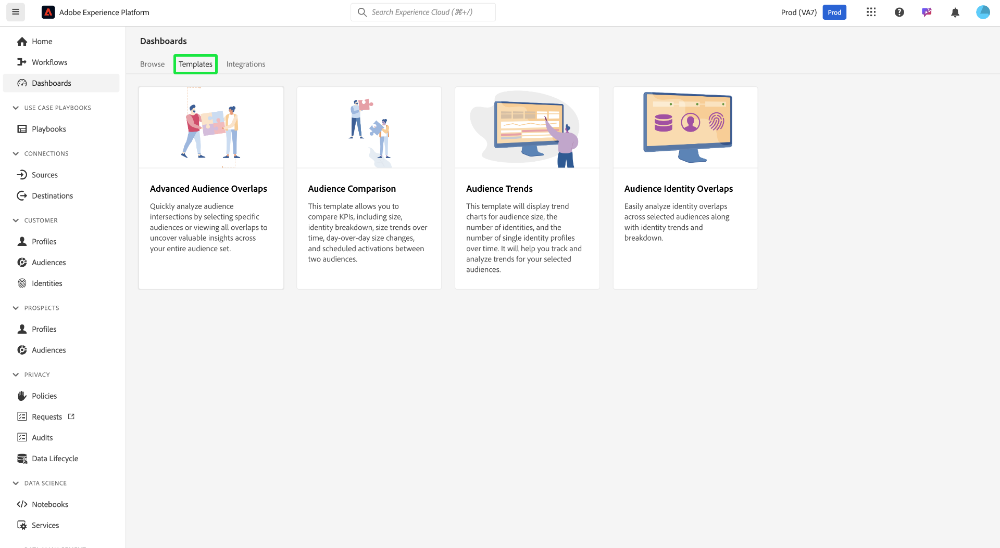

# Data Distiller Templates

>[!AVAILABILITY]
>
>Data Distiller Templates are exclusive to users who have purchased the Data Distiller SKU. Contact your Adobe representative for more information.

**[!UICONTROL Data Distiller Templates]** provide a set of powerful dashboards designed to help you gain insights into your audience data. To help you make data-driven decisions and improve targeting strategies, each template offers a structured guide for analyzing specific aspects of audience behavior, segmentation, and identity management.

These templates ensure consistency and efficiency in your analysis workflows by offering actionable insights that help you refine segmentation, reduce redundancy, and enhance engagement. Whether you are aiming to track audience trends, compare audience groups, or analyze identity overlaps, the Data Distiller Templates provide the tools needed to understand your audience better and drive effective marketing campaigns.

To get started, select the **[!UICONTROL Templates]** tab in the [!UICONTROL Dashboards] Service workspace and choose a template card from the available list.

## Available templates {#available-templates}

The templates currently available in the [!UICONTROL Dashboards] workspace are:

### Advanced Audience Overlaps {#advanced-audience-overlaps}

Use the [!UICONTROL Advanced Audience Overlaps] dashboard to quickly analyze audience intersections for specific audiences or view all overlaps to uncover valuable insights across your entire audience set. Use these insights to refine segmentation, reduce redundant messaging, and create more targeted campaigns for improved marketing efficiency.

### Audience Comparison {#audience-comparison}

The [!UICONTROL Audience Comparison] dashboard allows you to compare key metrics between two audience groups side-by-side. Use this dashboard to analyze important KPIs, such as audience size, identity breakdown, and changes in audience size over time. These insights help you make informed decisions about audience segmentation and improve targeting strategies.

### Audience Trends {#audience-trends}

Use the [!UICONTROL Audience Trends] dashboard to analyze audience metrics over time. Visualize trends for audience size, number of identities, and number of single identity profiles to monitor audience evolution, measure growth, and refine engagement strategies effectively.

### Audience Identity Overlaps {#audience-identity-overlaps}

Use the [!UICONTROL Audience Identity Overlaps] dashboard to analyze identity overlaps within selected audiences. View identity trends and breakdowns to understand how different identity types relate, enhancing identity stitching and improving customer segmentation accuracy.

## Next steps

After reading this document, you have learned about the four Data Distiller Templates available in the Dashboards workspace and how they help you analyze audience data for better decision-making. These templates provide tools for understanding audience intersections, comparing metrics, tracking trends, and analyzing identity overlaps to refine segmentation, reduce redundancy, and enhance engagement.

For more details on each template, refer to the respective guides for [Advanced Audience Overlaps](./overlaps.md), [Audience Comparison](./comparison.md), [Audience Trends](./trends.md), and [Audience Identity Overlaps](./identity-overlaps.md).
