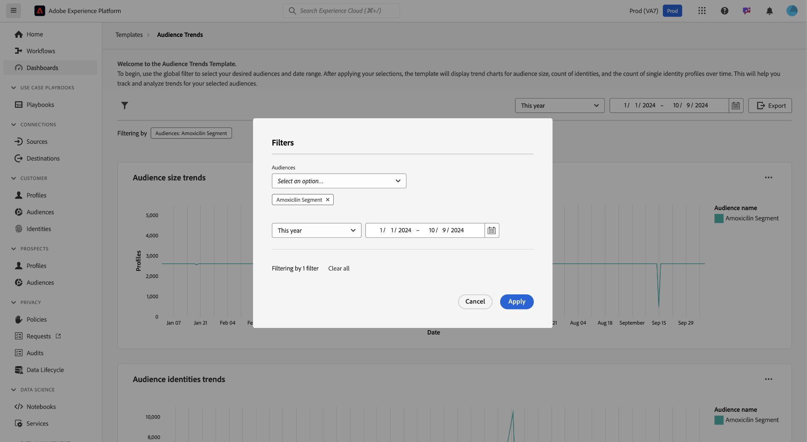
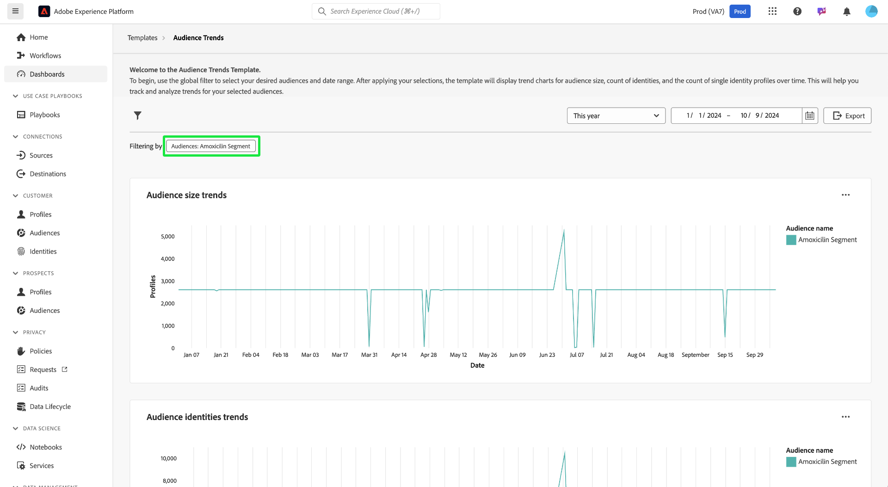
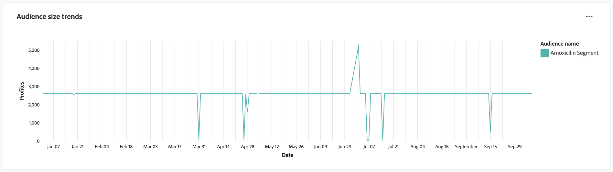
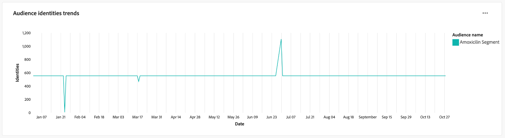
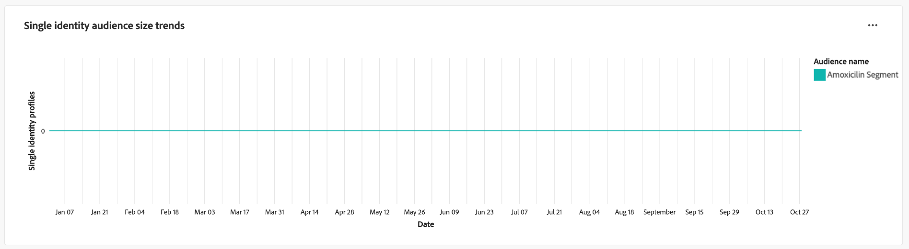
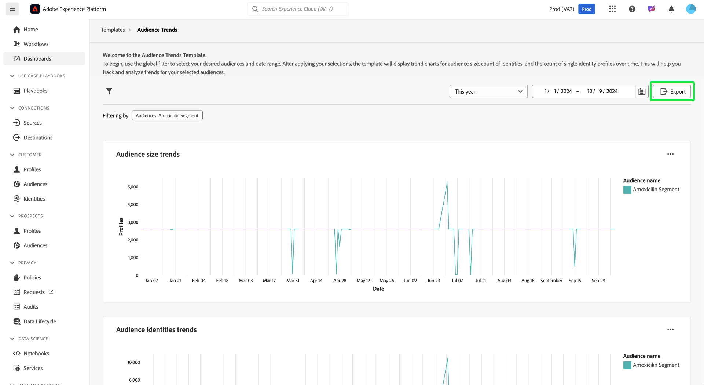

# Audience Trends

Analyze how your audiences change over time with visualizations of key audience metrics on the [!UICONTROL Audience Trends] dashboard. This dashboard helps you track trends such as audience growth, the number of identities, and the count of single identity profiles, and empowers you to make data-driven decisions. By analyzing these metrics, marketers can optimize targeting strategies, improve audience engagement, and refine their segmentation efforts for more effective campaigns.

## Filtering audiences {#filter-audiences}

To begin your analysis, use the global filter to select the specific audiences and the date range you wish to analyze. Select the filter icon () to open the **[!UICONTROL Filter]** dialog, where you can:

1. **Select an audience**: Choose the audience you wish to analyze (in the example screenshot, the **Amoxicillin** audience has been selected).
1. **Set a date range**: Choose a predefined range from the dropdown menu or manually select start and end dates using the calendar fields.

After setting your filters, select **[!UICONTROL Apply]** to update the dashboard. Your chosen filters are applied and focused insights on selected audiences during a particular time period are displayed. Your custom filters ensure that the data is relevant to your analysis goals.

## Available audience trend charts {#available-charts}

There are three main charts to help you understand audience metrics over time. For each chart, you can select the ellipse (`...`) in the top right followed by [!UICONTROL View more] to view either a tabulated form of the results, or download the data as a CSV file to view in a spreadsheet. For more details, refer to the [View more guide](../view-more.md).

>[!TIP]
>
>You can hover over a specific date in any chart to display the individual profile count in a dialog.

### Audience Size Trends {#audience-size-trends}

The **[!UICONTROL Audience size trends]** chart shows the number of profiles within the selected audience over time. It helps track audience growth or reduction. You can use this chart to monitor engagement effectiveness and understand changes in audience size.

### Audience Identities Trends {#audience-identities-trends}

The **[!UICONTROL Audience identities trends]** chart provides insights into the total number of identities within the audience segment. Use this chart to understand how unique identities are contributing to the overall size of the audience. It provides an indication of audience stability and engagement.

### Single Identity Audience Size Trends {#single-identity-audience-size-trends}

The **[!UICONTROL Single identity audience size trends]** chart shows the count of audience members with only a single identity. This metric is valuable for understanding the composition of your audience, particularly in terms of identity uniqueness, and helps gauge the effectiveness of identity stitching efforts.

## Export Insights {#export-insights}

After analyzing the metrics and applying relevant filters, you can export the data for further offline analysis or reporting purposes. To do this, select **[!UICONTROL Export]** on the top right of the table. The print PDF dialog appears. From that dialog you can save the visualized data as a PDF or print it.

## Next steps

After reading this document, you have learned how to gain valuable insights into audience behavior over time from the **Audience Trends** dashboard. To learn about other Data Distiller Templates that can help you to make informed decisions, optimize segmentation, and improve engagement strategies, refer to the [Audience Comparison](./comparison.md), [Audience Identity Overlaps](./identity-overlaps.md), and [Advanced Audience Overlaps](./overlaps.md) UI guides.
