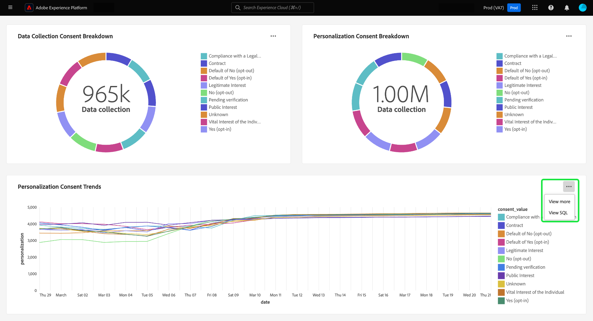
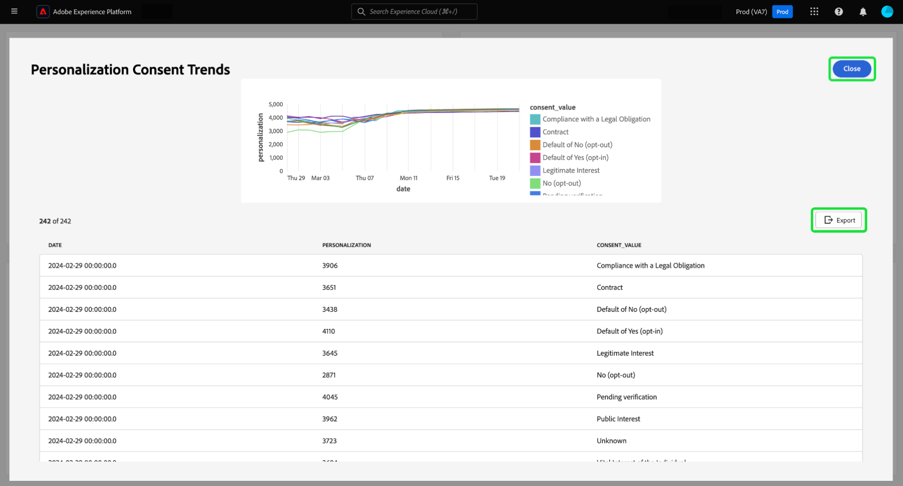
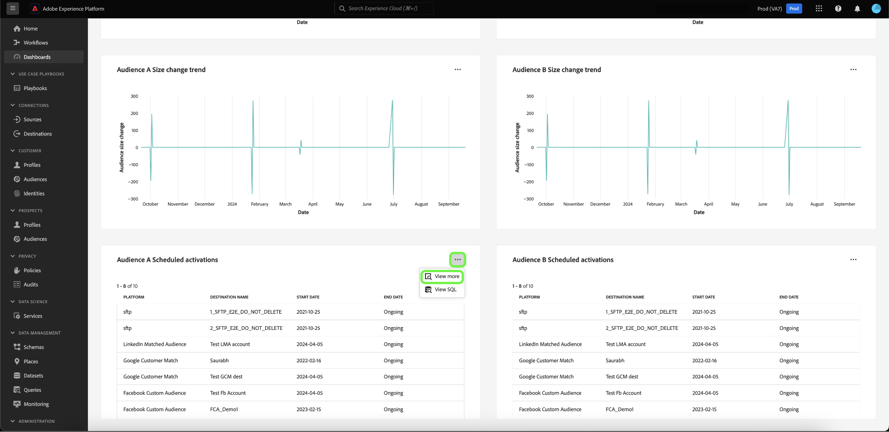
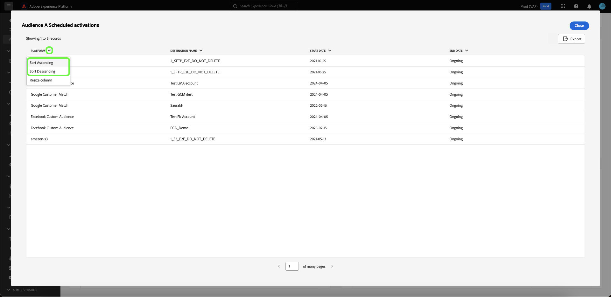
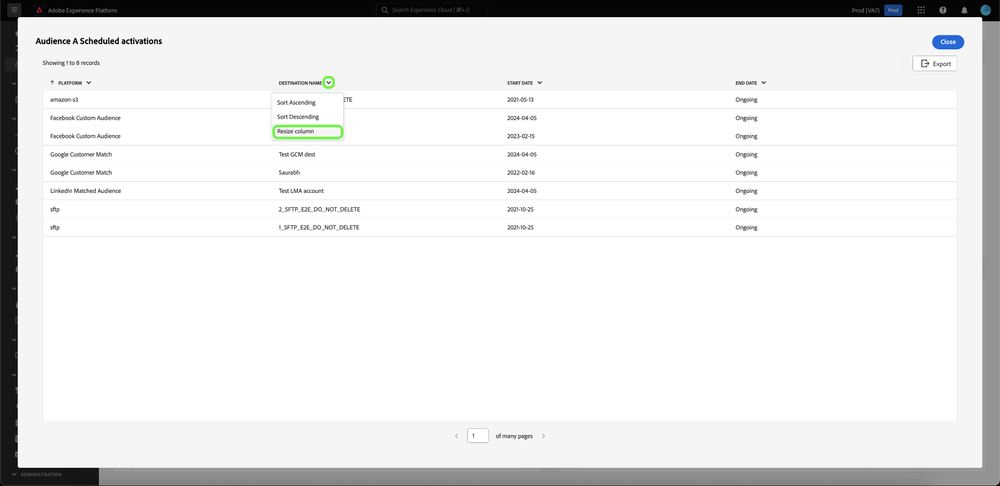
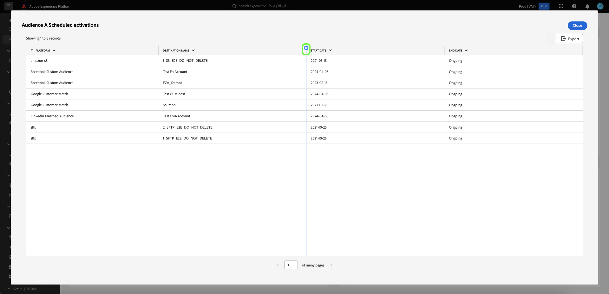
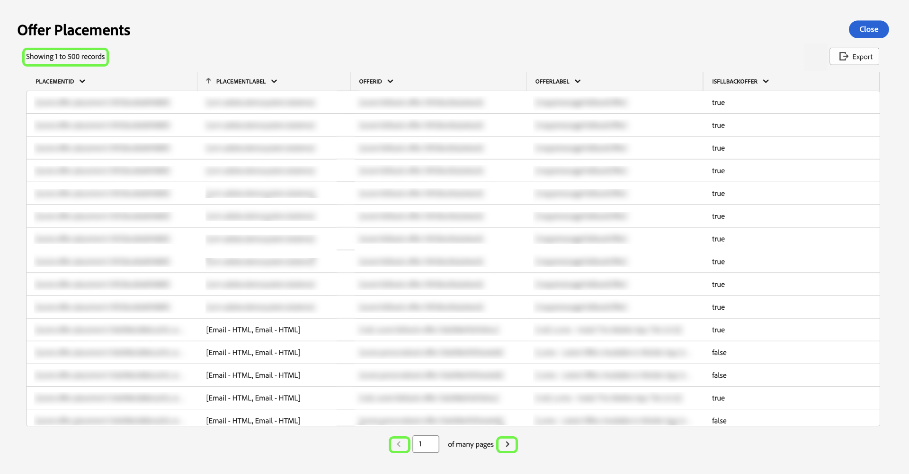

# View more {#view-more}

Once you have created a [custom insight](./overview.md) with [query pro mode](./overview.md#query-pro-mode), you can view your chart data in different formats. You can view either a tabulated form of the results, or export the data in CSV format or via email.

## Tabulated results {#tabulated-results}

For every chart authored using the query pro mode through SQL, you can view the tabulated results of your analysis within the Experience Platform UI. 

From your custom dashboard, select the ellipses (`...`) on any widget to access the [!UICONTROL View more] and [!UICONTROL View SQL] options.

## Export {#export}

From the **[!UICONTROL View more]** dialog, you can export the data shown in the table by downloading it directly as a CSV file or sending it by email for secure download later. 

>[!IMPORTANT]
>
>To access the export options, your admin must grant you the **[!UICONTROL Export Dashboard Data]** permission. If the [!UICONTROL Export] button is grayed out, contact your administrator. See the [Access control overview](../../access-control/home.md) for more details.

>[!NOTE]
>
>Visualization-only exports do not require the [!UICONTROL Export Dashboard Data] permission. Such as exporting the processed data from your [custom dashboard insights in PDF format](./export-pdf.md), or [Platform UI dashboard insights](../download.md).

### Download CSV {#download-csv}

The [!UICONTROL View more] feature displays the specific data points for the chart in tabular form. Select **[!UICONTROL Export]** then choose **[!UICONTROL Download CSV]** to download your data in CSV format.

>[!NOTE]
>
>The CSV download is limited to the first 500 records.

### Send as email {#send-as-email}

To export more than 500 records, select **[!UICONTROL Export]** and choose **[!UICONTROL Send as email]**. This option securely sends a download link to your Adobe-associated email address.

When selected:

- A secure background job generates the report.
- You'll receive an email with a link to download the file.
- You must authenticate to access the file, and Adobe verifies the recipient before allowing access.

To protect your data, Adobe does not send exports directly via email. Instead, exported files are securely hosted and made available only after you authenticate through the Platform UI. Once authenticated, Adobe also verifies that the person downloading the file is the intended recipient. These added layers of security help ensure that your data remains private and protected throughout the export process.

This method allows you to export **up to 10,000 records** and ensures secure access to sensitive data.

## Sort by column {#sort-column}

When viewing tabulated results, you can use the sort functionality to sort by column in ascending or descending order. From your custom dashboard, select the ellipses (`...`) on any table to access the [!UICONTROL View more] option.

You can sort columns by selecting the drop down menu beside the column name and then selecting **[!UICONTROL Sort Ascending]** or **[!UICONTROL Sort Descending]**.

>[!NOTE]
>
>The [!UICONTROL Sort Ascending] and [!UICONTROL Sort Descending] options will only appear for columns that have been configured with [sorting functionality](./overview.md#advanced-attributes).

## Resize a column {#resize-column}

You can resize columns in tabulated results to improve data readability. From your custom dashboard, select the ellipses (`...`) for your table to access the [!UICONTROL View more] option. Use the drop down menu beside the column name to resize it, then select **[!UICONTROL Resize column]**.

Select the slider and drag to the left or right to adjust the column size as required.

## Table pagination {#table-pagination}

Pagination is automatically applied to your tables in the [!UICONTROL View more] feature, eliminating the need for you to manually modify your SQL queries. This feature ensures that your data is presented in a more manageable format, which facilitates the process of navigating through large datasets.

You can see up to 500 records per page. To navigate through the records, use the **[!UICONTROL >]** located at the bottom of the page.

## Next steps

After reading this document, you now know how to view the tabulated results of your custom chart's SQL analysis and export the data. See the view SQL document to learn how to [view the SQL behind your custom insights](./view-sql.md). 

You can also learn how to generate charts from existing data models in the Adobe Experience Platform UI with the [guided design mode guide](../standard-dashboards.md).
