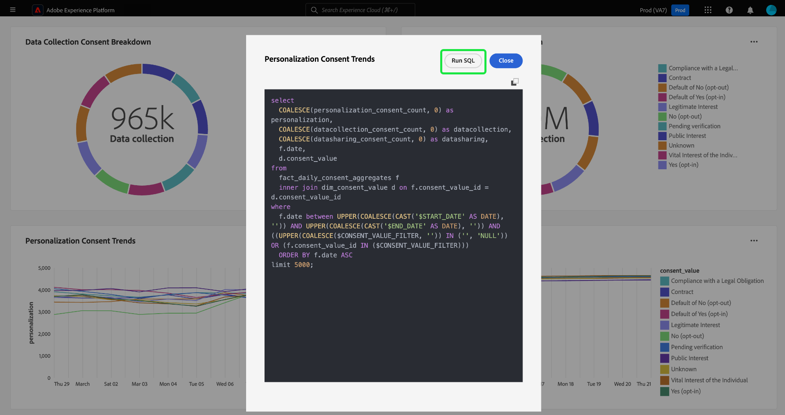

# View SQL {#view-sql}

Once you have created a [custom insight](./overview.md) with [query pro mode](./overview.md#query-pro-mode), you can view the SQL that populates your charts with the View SQL capability.

From your custom dashboard, select the ellipses (`...`) on any widget to access the [!UICONTROL View more] and [!UICONTROL View SQL] options.

To view the SQL behind your customized insights, select the **[!UICONTROL View SQL]** option. The dialog is titled with the name of the insight. From this view, you can copy the SQL to your clipboard to use as a base for future chart authoring in query pro mode, or open the SQL directly in the Query Editor. Select **[!UICONTROL Run SQL]** to open the query in the Query Editor. 

Select **[!UICONTROL Close]** to close the dialog.

## Next steps

After reading this document, you now know how to view the SQL behind your custom insights. See the view more document to learn how to [compare your custom chart with the tabulated results of your SQL analysis](./view-more.md). 

You can also learn how to generate charts from existing data models in the Adobe Experience Platform UI with the [guided design mode guide](../standard-dashboards.md).
