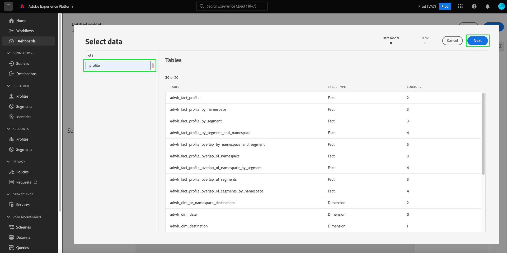
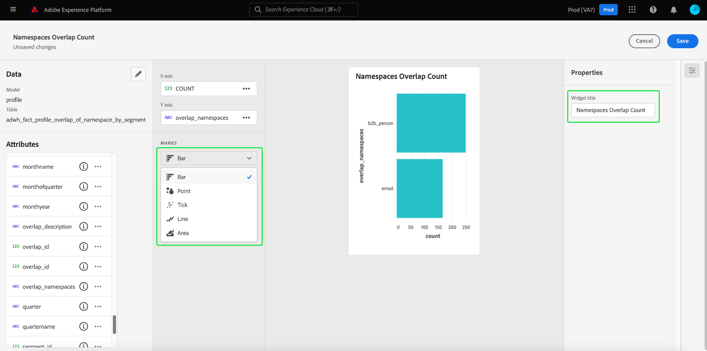
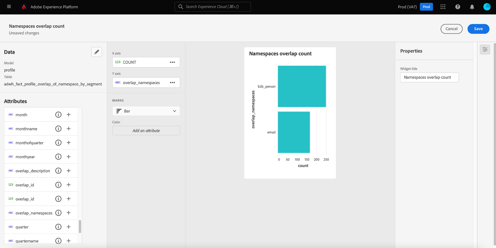

# User-defined dashboards

Adobe Experience Platform Dashboards helps you to expedite insights and customize visualization through the user-defined dashboards feature. This feature enables you to build and manage custom dashboards where you can create, add, and edit bespoke widgets to visualize key metrics relevant to your organization.

<!-- Getting started / permissions section commented out for Beta. This will be necessary after GA only

## Getting started

To view dashboards in Adobe Experience Platform you must have the appropriate permissions enabled. Please read the [dashboards permissions documentation](./permissions.md#available-permissions) to learn how to grant users the ability to view, edit, and update Experience Platform dashboards using Adobe Admin Console. If you do not have administrator privileges for your organization, contact your product administrator to obtain the required permissions. -->

## Create custom dashboards

To create a custom dashboard, first, navigate to the dashboard inventory. Select **[!UICONTROL Dashboards]** from the left navigation of the Platform UI followed by **[!UICONTROL Create dashboard]**.

Before adding a custom dashboard, the dashboards inventory is empty and displays a "No dashboards found." message. Once created, all of your user-defined dashboards are listed in the dashboard inventory.

The [!UICONTROL Create dashboard] dialog appears. Enter a human-friendly, descriptive name for the collection of widgets you intend to create, and select **[!UICONTROL Save]**.

The newly created blank dashboard appears with your chosen name in the top left corner of the view.

## Create a widget {#create-widget}

>[!CONTEXTUALHELP]
>id="platform_dashboards_udd_maxwidgets"
>title="Maximum number of widgets"
>abstract="User-defined dashboards support up to ten widgets. After you have added ten widgets to your dashboard, the [!UICONTROL Add new widget] option is disabled and appears gray."

From your new dashboard view, select **[!UICONTROL Add new widget]** to begin the widget creation process.

>[!IMPORTANT]
>
>User-defined dashboards support up to ten widgets. After you have added ten widgets to your dashboard, the [!UICONTROL Add new widget] option is disabled and appears gray.

### Widget composer

The widget composer workspace appears. Next, select **[!UICONTROL Select data]** to choose the data model from which to add attributes to your widgets. 

The [!UICONTROL Select data] dialog appears. Select a data model from the left column to display a preview list of all available tables. 

>[!NOTE]
>
>User-defined dashboards currently only supports the profile data model. More options will be supported.

The preview list provides details about the tables contained in the data model. The table below provides descriptions of the column fields and their potential values.

| Column field | Description |
|---|---|
|[!UICONTROL Title] | The name of the table.|
|[!UICONTROL Table type] | The type of table. Potential types include: `fact`, `dimension`, and `none`. |
|[!UICONTROL Lookups] | The number of tables joined to the chosen table.|

Select **[!UICONTROL Next]** to confirm your choice of data model. The next view displays a list of the available tables in the left rail. Select a table to see a comprehensive breakdown of the data contained in your selected table.

The [!UICONTROL Preview] panel contains tabs for [!UICONTROL Sample records] and [!UICONTROL Attributes]. The [!UICONTROL Sample records] tab provides a subset of the records from the selected table in a tabulated view. The [!UICONTROL Attributes] tab provides the attribute name, data type, and source table for every attribute associated with the selected table. 

Select a table from the list available in the left rail to provide data for your widget and select **[!UICONTROL Select]** to return to the widget composer.

The widget composer is now populated with data from your chosen table.

The data model and currently selected table are displayed at the top of the left rail, and the attributes available to create your widget are listed in the attributes column.

>[!TIP]
>
>You can change the chosen data model by selecting the pencil icon () in the left rail.

Select the add icon (./images/user-defined-dashboards/add-icon.png) next to an attribute name to add an attribute to either the X or the Y axis.

Next, select the type of graph or chart from the [!UICONTROL Marks] dropdown to generate a preview visualization of your widget's current settings. In the [!UICONTROL Properties] rail on the right side of the screen, enter a name for the widget in the [!UICONTROL Widget title] text field. 

When you are satisfied with your widget select **[!UICONTROL Save]**. A tick icon underneath the widget name indicates that the widget has been saved. 

>[!NOTE]
>
>Saving in the widget composer saves the widget locally to your dashboard. If you exit the dashboard editor without saving the dashboard, the widget will not be saved to the dashboard.

Select **[!UICONTROL Cancel]** to return to your custom dashboard.

>[!TIP]
>
>Select the setting icon next to the dashboard name to see details about its creation. You can change the name of your dashboard in the dialog that appears.

Widgets can be re-arranged and resized while in this workspace. Select **[!UICONTROL Save]** to preserve your dashboard name and configured layout.

To ensure that each query for an Adobe Real-Time Customer Data Platform insights dashboard has enough resources to execute efficiently, the API tracks resource usage by assigning concurrency slots to each query. The system can process up to four concurrent queries, and therefore four concurrent query slots are available at any given time. Queries are put into a queue based on concurrency slots, then wait in the queue until enough concurrency slots are available.

## Next steps

By reading this document you have a better understanding of how to create a custom dashboard and how to create, edit, and update custom widgets for that dashboard.

To discover the available pre-configured metrics and visualizations for the [profiles](./guides/profiles.md#standard-widgets), [segments](./guides/segments.md#standard-widgets), and [destinations](./guides/destinations.md#standard-widgets) dashboards, see the list of standard widgets in their respective documentation.
