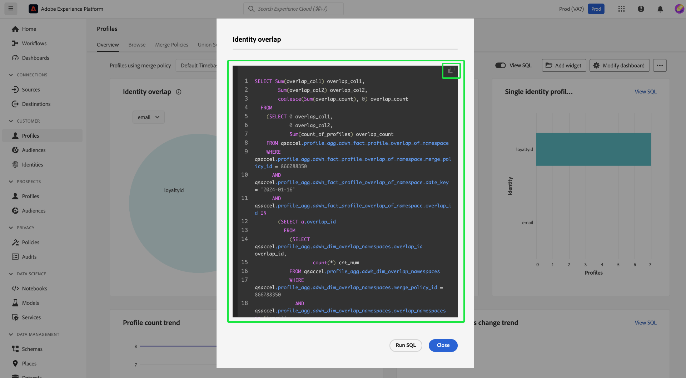
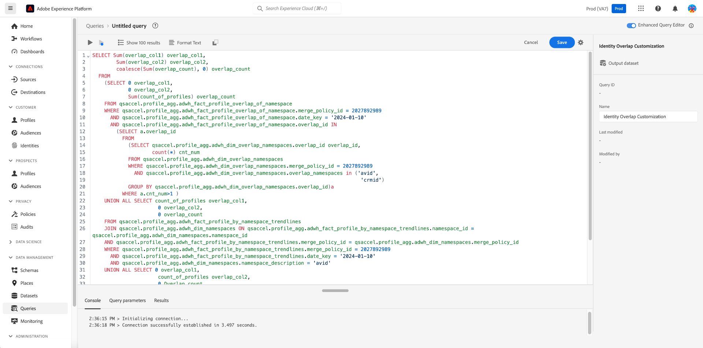

# View insight SQL

Use the [!UICONTROL View SQL] feature to view the SQL behind your Profile, Audience, Destination, and customized insights and execute the query on demand through the Query Editor. Take inspiration from the SQL of over 40 existing insights to create new queries that derive unique insights from Platform data based on your business needs.

## Navigate to the dashboard overview {#navigate-to-overview}

To open your chosen dashboard, select either **[!UICONTROL Profiles]**, **[!UICONTROL Audiences]**, or **[!UICONTROL Destinations]** from the left navigation. Next select **[!UICONTROL Overview]** from the tab options if the workspace does not automatically appear.

Alternatively, select **[!UICONTROL Dashboards]** from the left navigation followed by the name of your custom dashboard. The overview of your user-defined dashboard appears. 

![The Experience Platform UI with [!UICONTROL Profiles], [!UICONTROL Audiences], [!UICONTROL Destinations], and [!UICONTROL Dashboards] highlighted.](./images/view-sql/dashboard-navigation.png)

## View SQL toggle {#toggle}

A toggle is available from the overview of the Profile, Audience, Destination, and user-defined dashboards to enable or disable the feature. 

>[!NOTE]
>
>If you enable the [!UICONTROL View SQL] toggle, you cannot change global and widget level filters until you disable the feature.

![The [!UICONTROL View SQL] toggle highlighted.](./images/view-sql/view-sql-toggle.png)

Enable the toggle to display [!UICONTROL View SQL] text on each individual insight. 

![An insight with [!UICONTROL View SQL] highlighted.](./images/view-sql/insight-view-sql.png)

Select **[!UICONTROL View SQL]** to open a dialog that contains the widget's SQL.

## SQL dialog {#sql-dialog}

A dialog appears that contains the title of the insight and the SQL that generates it.

>[!TIP]
>
>You can copy the entire SQL statement to your clipboard by selecting the copy icon () in the top right of the dialog.

Select **[!UICONTROL Run SQL]** to open the Query Editor with the query is pre-populated. 

![An insight dialog with [!UICONTROL Run SQL] highlighted.](./images/view-sql/run-sql.png)

## Edit existing SQL {#edit-sql}

The Query Editor appears. You can now edit the statement and query your platform data in a fashion that better suits your reporting needs. Save your new query template with an appropriate name.

## Next steps

After reading this document, you now understand how to access the SQL for any insight within either the standard dashboards or a user-defined dashboard. If you have not already done so, you are recommended to read the [Real-Time Customer Data Platform Insights Data Model document](./cdp-insights-data-model.md). That document contains insights on customizing SQL templates for Real-Time CDP reports tailored to your marketing and KPI needs.
