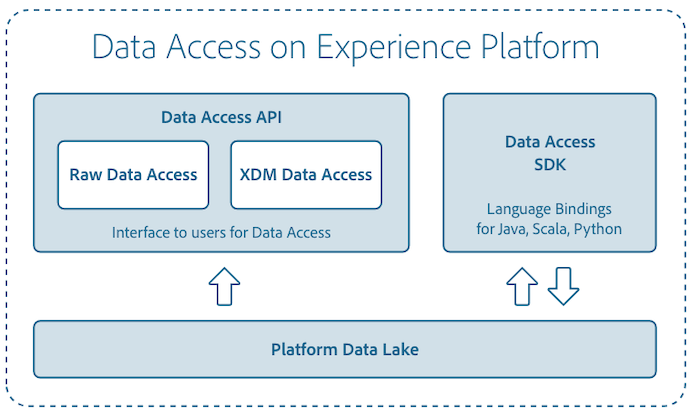

# [!DNL Data Access] overview

[!DNL Data Access] supports Adobe Experience Platform by providing users tools focused on the discoverability and accessibility of ingested datasets within [!DNL Experience Platform].

## [!DNL Data Access] API

Detailed information on using the [!DNL Data Access] API to connect with [!DNL Platform] can be found in the [Data Access developer guide](api.md).

## Accessing data in Data Science Workspace

You can read and write to datasets using [!DNL Python] and [!DNL Spark] for recipe and model development in Data Science Workspace. To learn more about accessing your data, visit the [Python data access](../data-science-workspace/authoring/python.md) or [Spark data access](../data-science-workspace/authoring/spark.md) documentation.

For more information about [!DNL Data Science Workspace], start by reading the [Data Science Workspace overview](../data-science-workspace/home.md).

## Subscribe to data ingestion events

[!DNL Platform] makes specific high-value events available for subscription through the [Adobe Developer Console](https://www.adobe.com/go/devs_console_ui). For instance, you can subscribe to data ingestion events to be notified of potential delays and failures. See the tutorial on [subscribing to data ingestion notifications](../ingestion/quality/subscribe-events.md) for more information.
