# Data governance end-to-end guide

In order to control which marketing actions can be performed on certain datasets and fields in Adobe Experience Platform, you must set up the following:

1. [Apply labels](#labels) to the schemas fields or entire datasets, whose usage you want to restrict.
1. [Configure and enable data governance policies](#policy) that determine which kinds of labeled data can be used for certain marketing actions.
1. [Apply marketing actions to your destinations](#destinations) to indicate which policies apply to data sent to those destinations.

Once you have finished configuring your labels, governance policies, and marketing actions, you can [test your policy enforcement](#test) to ensure it is working as expected.

This guide walks through the full process of configuring and enforcing a data governance policy in the Platform UI. For more detailed information on the features used in this guide, refer to the overview documentation on the following topics:

* [Adobe Experience Platform Data Governance](./home.md)
* [Data usage labels](./labels/overview.md)
* [Data usage policies](./policies/overview.md)
* [Policy enforcement](./enforcement/overview.md)

>[!NOTE]
>
>This guide focuses on how to set up and enforce policies for how data is used or activated in Experience Platform. If you are trying to restrict **access** to the data itself for certain Platform users within your organization, see the end-to-end guide on [attribute-based access control](../access-control/abac/end-to-end-guide.md) instead. Attribute-based access control also uses labels and policies, but for a different use case than data governance.

## Apply labels {#labels}

>[!IMPORTANT]
>
>Labels can no longer be applied to individual fields at the dataset level. This workflow has been deprecated in favour of applying labels at the schema level. However, you can still label an entire dataset. Any labels previously applied to individual dataset fields will still be supported through the Platform UI until 31st May 2024. To ensure that your labels are consistent across all schemas, any labels previously attached to fields at the dataset level must be migrated to the schema level by you over the coming year. See the section on [migrating previously applied labels](#migrate-labels) for instructions on how to do this.

You can [apply labels to a schema](#schema-labels) so that all datasets based on that schema inherit the same labels. This allows you to manage the labels for data governance, consent, and access control in one place. By enforcing data usage constraints at the schema level, the effect propagates downstream to all datasets that are based on that schema. Labels applied at the schema field level support Data Governance use cases and are discoverable in the Datasets workspace [!UICONTROL Data Governance] tab under the [!UICONTROL Field Name] column as read-only labels. 

If there is a specific dataset that you want to enforce data usage constraints on, you can [apply labels directly to that dataset](#dataset-labels) or specific fields within that dataset.

Alternatively, you can [apply labels to a schema](#schema-labels) so that all datasets based on that schema inherit the same labels.

>[!NOTE]
>
>For more information on the different data usage labels and their intended use, see the [data usage labels reference](./labels/reference.md). If the available core labels do not cover all of your desired use cases, you can [define your own custom labels](./labels/user-guide.md#manage-custom-labels) as well.

### Apply labels to an entire dataset {#dataset-labels}

Select **[!UICONTROL Datasets]** in the left navigation, then select the name of the dataset you want to apply labels to. You can optionally use the search field to narrow down the list of displayed datasets.

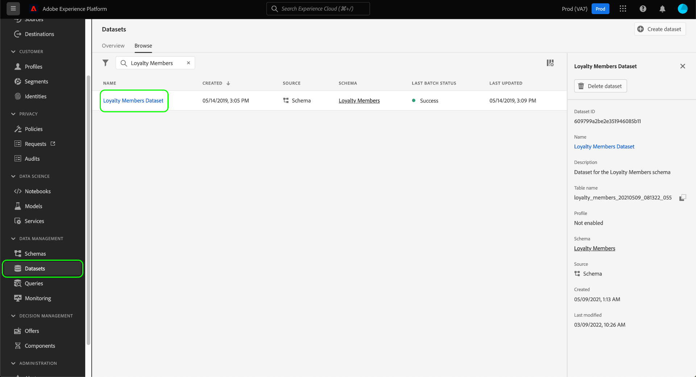

The details view for the dataset appears. Select the **[!UICONTROL Data governance]** tab to view a list of the dataset's fields and any labels that have already been applied to them. Select the pencil icon to edit the datasets labels.

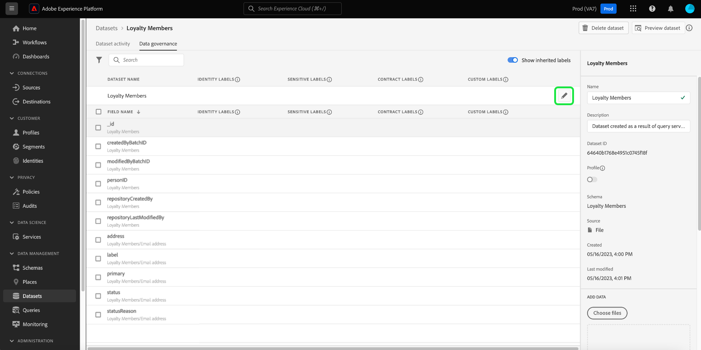

The [!UICONTROL Edit governance labels] dialog appears. Select the appropriate governance label and select **[!UICONTROL Save]**.

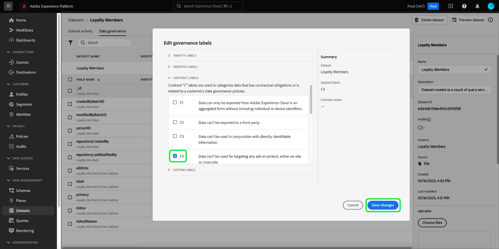

### Apply labels to a schema {#schema-labels}

Select **[!UICONTROL Schemas]** in the left navigation, then select the schema that you want to add labels to from the list.

>[!TIP]
>
>If you are not sure which schema applies to a particular dataset, select **[!UICONTROL Datasets]** in the left navigation, then select the link under the **[!UICONTROL Schema]** column for the desired dataset. Select the schema name in the popover that appears to open the schema in the Schema Editor.
>
>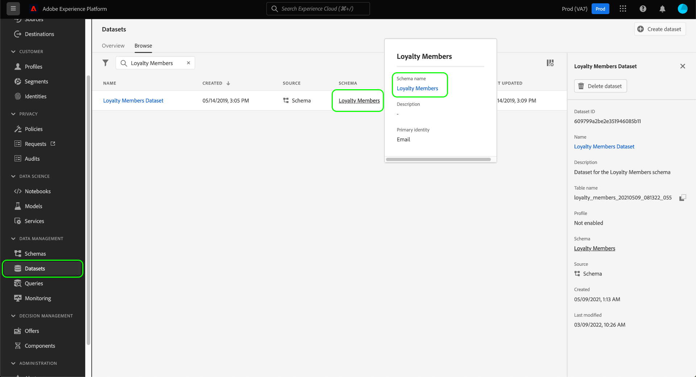

The schema's structure appears in the Schema Editor. From here, select the **[!UICONTROL Labels]** tab to show a list view of the schema's fields and the labels that have already been applied to them. Select the checkboxes next to the fields that you want to add labels to, then select **[!UICONTROL Apply access and data governance labels]** in the right rail.

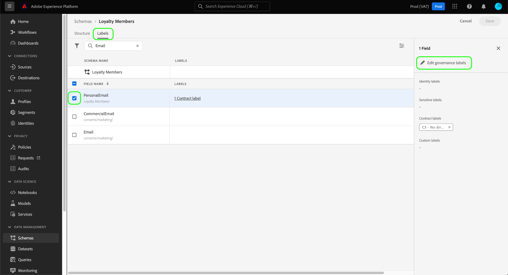

>[!NOTE]
>
>If you want to add labels to all fields in the schema, select the pencil icon on the top row.
>
>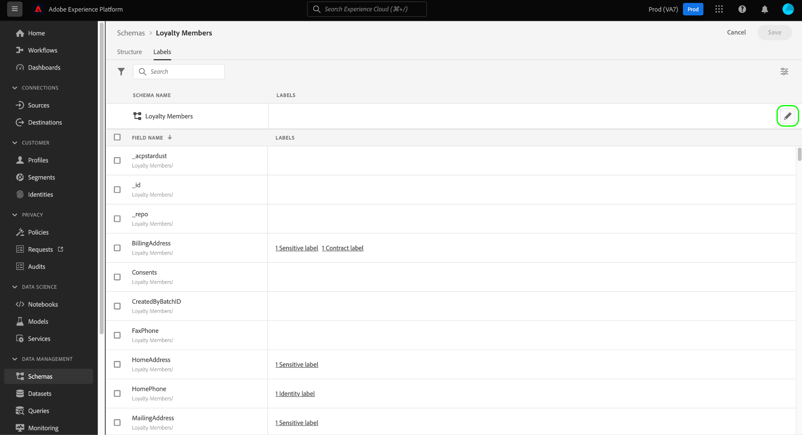

The [!UICONTROL Apply access and data governance labels] dialog appears. Select the labels that you want to apply to the chosen schema field. When finished, select **[!UICONTROL Save]**.

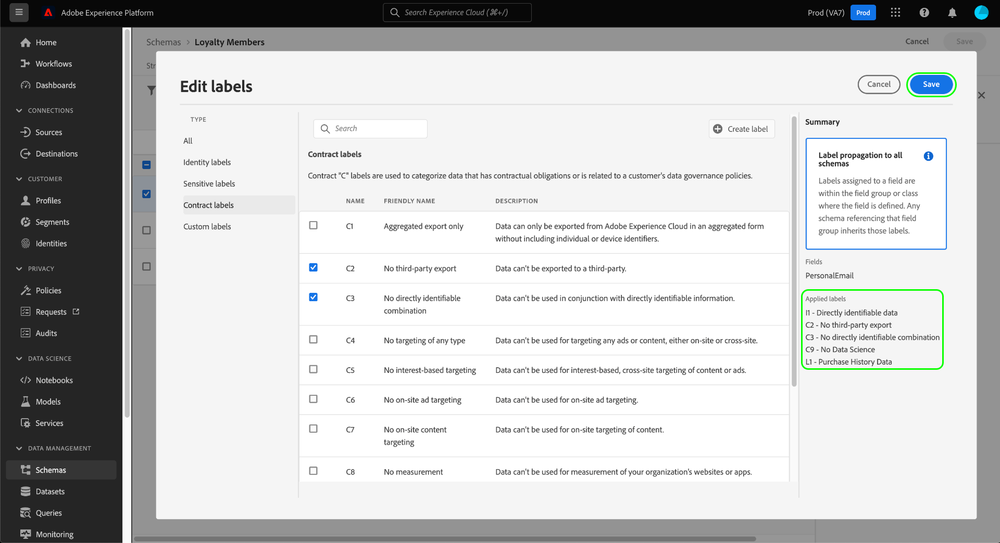

Continue following the above steps to apply labels to different fields (or different schemas) as needed. When finished, you can continue to the next step of [enabling data governance policies](#policy).

### Migrate labels previously applied at the dataset level {#migrate-labels}

Select **[!UICONTROL Dataset]** in the left navigation, then select the name of the dataset you want to migrate labels from. You can optionally use the search field to narrow down the list of displayed datasets.

The details view for the dataset appears. Select the **[!UICONTROL Data governance]** tab to view a list of the dataset's fields and any labels that have already been applied to them. Select the cancel icon next to any label that you want to remove from a field. A confirmation dialog appears, select [!UICONTROL Remove label] to confirm your choices.

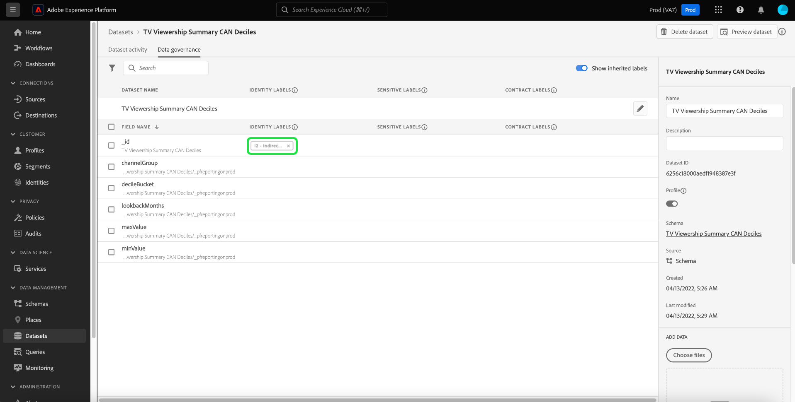

After you have removed the label from your dataset field, navigate to the Schema Editor to add the label to the schema. Instructions on how to do this, can be found in the [section on applying labels to a schema](#schema-labels).

>[!TIP]
>
>You can select the schema name in the right rail, followed by the link in the dialog that appears to navigate to the appropriate schema.
>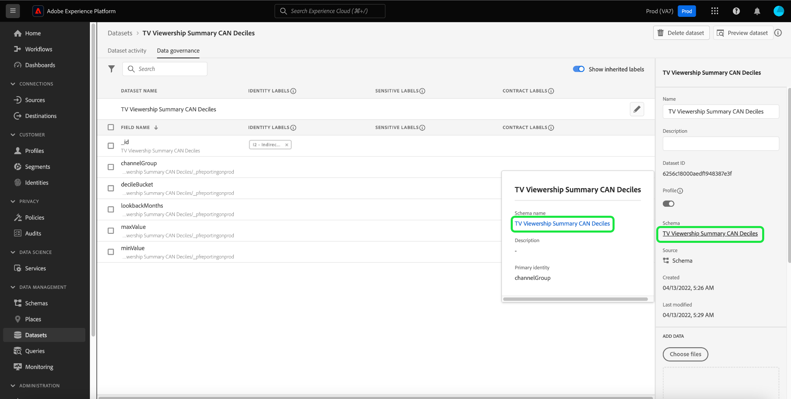

After you have migrated the necessary labels, ensure that you have the correct [data governance policies enabled](#policy).

## Enable data governance policies {#policy}

After you have applied labels to your schemas and/or datasets, you can create data governance policies that restrict the marketing actions that certain labels can be used for.

Select **[!UICONTROL Policies]** in the left navigation to view a list of core policies defined by Adobe, as well as any custom policies previously created by your organization.

Each core label has an associated core policy that, when enabled, enforces the appropriate activation constraints on any data that contains that label. To enable a core policy, select it from the list, then select the **[!UICONTROL Policy status]** toggle to **[!UICONTROL Enabled]**.

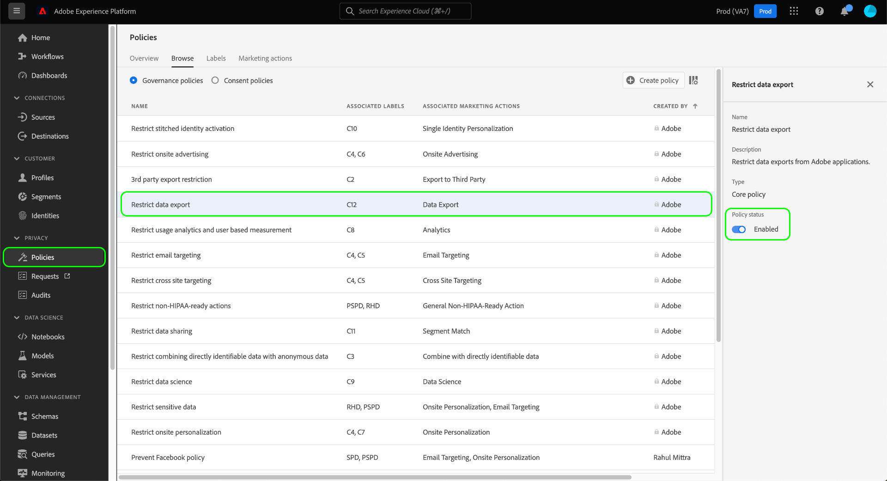

If the available core policies do not cover all of your use cases (such as when you're employing custom labels that you've defined under your organization), you can define a custom policy instead. From the **[!UICONTROL Policies]** workspace, select **[!UICONTROL Create policy]**.

![Image showing the [!UICONTROL Create policy] button being selected in the UI](./images/e2e/create-policy.png)

A popover appears, prompting you to select the type of policy you want to create. Select **[!UICONTROL Data governance policy]**, then select **[!UICONTROL Continue]**.

![Image showing the [!UICONTROL Data governance policy] option being selected](./images/e2e/governance-policy.png)

On the next screen, provide a **[!UICONTROL Name]** and optional **[!UICONTROL Description]** for the policy. In the table below, select the labels that you want this policy to check for. In other words, these are the labels that the policy will prevent from being used for the marketing action(s) you specify in the next step.

If you select multiple labels, you can use the options in the right rail to determine whether all labels must be present in order for the policy to enforce usage restrictions, or if only one of the labels needs to be present. When finished, select **[!UICONTROL Next]**.

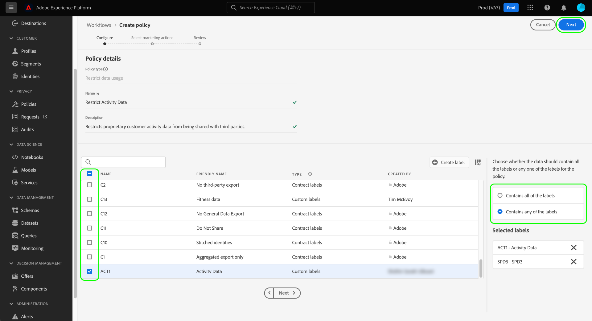

On the next screen, select the marketing actions that this policy will restrict the previously selected labels from being used for. Select **[!UICONTROL Next]** to continue.

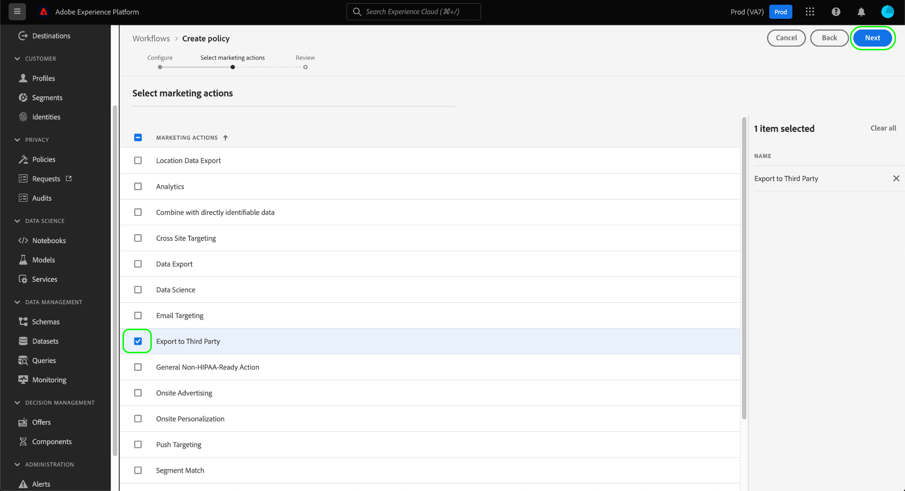

The final screen shows a summary of the policy's details and the actions it will restrict for which labels. Select **[!UICONTROL Finish]** to create the policy.

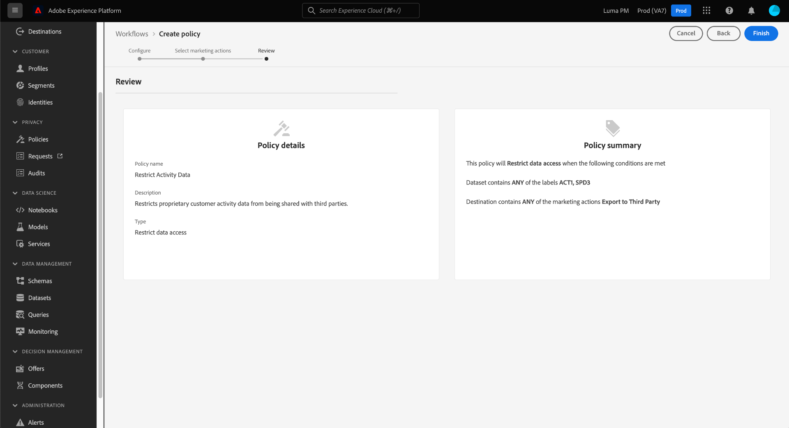

The policy is created, but is set to [!UICONTROL Disabled] by default. Select the policy from the list and set the **[!UICONTROL Policy status]** toggle to **[!UICONTROL Enabled]** to enable the policy.

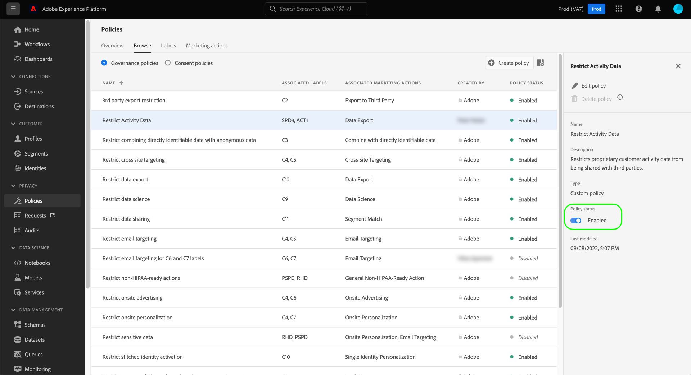

Continue following the steps above to create and enable the policies you require before moving on to the next step.

## Manage marketing actions for destinations {#destinations}

In order for your enabled policies to accurately determine what data can be activated to a destination, you must assign specific marketing actions to that destination.

For example, consider an enabled policy that prevents any data containing a `C2` label from being used for the marketing action "[!UICONTROL Export to Third Party]". When activating data to a destination, the policy checks what marketing actions are present on the destination. If "[!UICONTROL Export to Third Party]" is present, attempting to activate data with a `C2` label results in a policy violation. If "[!UICONTROL Export to Third Party]" is not present, the policy is not enforced for the destination and data with `C2` labels can be freely activated.

When [connecting a destination in the UI](../destinations/ui/connect-destination.md), the **[!UICONTROL Governance]** step in the workflow allows you to select the marketing actions that apply to this destination, which ultimately determine which data governance policies are enforced for the destination.

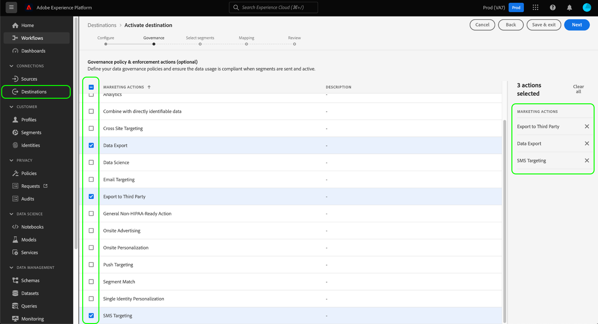

## Test policy enforcement {#test}

Once you have labeled your data, enabled data governance policies, and assigned marketing actions to your destinations, you can test whether your policies are being enforced as expected.

If you set things up correctly, when you attempt to activate data that is restricted by your policies, the activation is automatically denied and a policy violation message appears, outlining detailed data lineage information about what caused the violation.

See the document on [automatic policy enforcement](./enforcement/auto-enforcement.md) for details on how to interpret policy violation messages.

## Next steps

This guide covered the required steps for configuring and enforcing data governance policies in your activation workflows. For more detailed information on the Data Governance components involved in this guide, refer to the following documentation:

* [Data usage labels](./labels/overview.md)
* [Data usage policies](./policies/overview.md)
* [Policy enforcement](./enforcement/overview.md)
