# Automatic policy enforcement

Data usage labels and policies are available to all Adobe Experience Platform users. Define data usage policies and apply data usage labels to ensure that any sensitive, identifiable, or contractual data are handled accurately. These measures help enforce your organization's data governance rules on how data can be accessed, processed, stored, and shared. 

To help safeguard your organization from potential risks and liabilities, Platform automatically enforces usage policies should any violations occur when activating audiences to destinations. 

>[!IMPORTANT]
>
>Consent policies and automatic consent policy enforcement is only available for organizations that have purchased **Adobe Healthcare Shield** or **Adobe Privacy & Security Shield**.

This document focuses on the enforcement of data governance and consent policies. For information on access control policies, refer to the documentation on [attribute-based access control](../../access-control/abac/overview.md).

## Prerequisites

This guide requires a working understanding of the Platform services involved in automatic enforcement. Please refer to the following documentation to learn more before continuing with this guide:

* [Adobe Experience Platform Data Governance](../home.md): The framework by which Platform enforces data usage compliance through the use of labels and policies.
* [Real-Time Customer Profile](../../profile/home.md): Provides a unified, real-time consumer profile based on aggregated data from multiple sources.
* [Adobe Experience Platform Segmentation Service](../../segmentation/home.md): The segmentation engine within [!DNL Platform] used to create audiences from your customer profiles based on customer behaviors and attributes.
* [Destinations](../../destinations/home.md): Destinations are pre-built integrations with commonly used applications that allow for the seamless activation of data from Platform for cross-channel marketing campaigns, email campaigns, targeted advertising, and more.

## Enforcement flow {#flow}

The following diagram illustrates how policy enforcement is integrated into the data flow of audience activation:

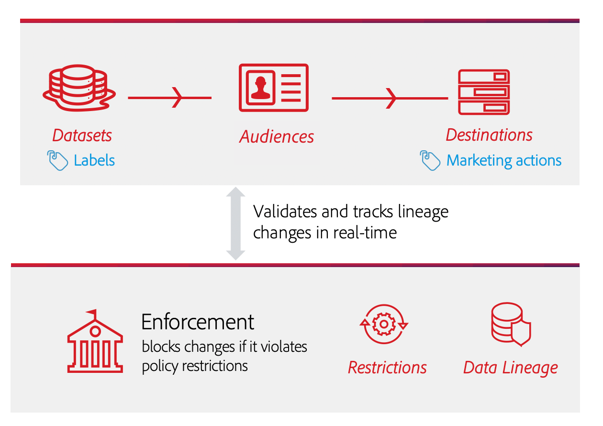

When an audience is first activated, [!DNL Policy Service] checks for applicable policies based on the following factors:

* The data usage labels applied to fields and datasets within the audience to be activated.
* The marketing purpose of the destination.
* The profiles that have consented to be included in the audience activation, based on your configured consent policies.

>[!NOTE]
>
>If there are data usage labels that have only been applied to certain fields within a dataset (rather than the entire dataset), enforcement of those field-level labels on activation only occurs under the following conditions:
>
>* The fields are used in the audience.
>* The fields are configured as projected attributes for the target destination.

## Data lineage {#lineage}

Data lineage plays a key role in how policies are enforced in Platform. In general terms, data lineage refers to the origin of a set of data, and what happens to it (or where it moves) over time.

In the context of Data Governance, lineage enables data usage labels to propagate from schemas to downstream services that consume their data, such as Real-Time Customer Profile and Destinations. This allows policies to be evaluated and enforced at several key points in the data's journey through Platform, and provides context to data consumers as to why a policy violation occurred.

In Experience Platform, policy enforcement is concerned with the following lineage:

1. Data is ingested into Platform and stored in **datasets**.
1. Customer profiles are identified and constructed from those datasets by merging data fragments according to the **merge policy**.
1. Groups of profiles are divided into **audiences** based on common attributes.
1. Audiences are activated to downstream **destinations**.

Each stage in the above timeline represents an entity that may contribute to policy enforcement, as outlined in the table below:

| Data lineage stage | Role in policy enforcement |
| --- | --- |
| Dataset | Datasets contain data usage labels (applied at the schema field level or entire dataset level) that define which use cases the entire dataset or specific fields can be used for. Policy violations will occur if a dataset or field containing certain labels is used for a purpose that a policy restricts.  Any consent attributes collected from your customers are also stored in datasets. If you have access to consent policies, any profiles that do not meet the consent attribute requirements of your policies will be excluded from audiences that are activated to a destination. |
| Merge policy | Merge policies are the rules that Platform uses to determine how data will be prioritized when merging together fragments from multiple datasets. Policy violations will occur if your merge policies are configured so that datasets with restricted labels are activated to a destination. See the [merge policies overview](../../profile/merge-policies/overview.md) for more information. |
| Audience | Segmentation rules define which attributes should be included from customer profiles. Depending on which fields a segment definition includes, the audience will inherit any applied usage labels for those fields. Policy violations will occur if you activate an audience whose inherited labels are restricted by the target destination's applicable policies, based on its marketing use case. |
| Destination | When setting up a destination, a marketing action (sometimes called a marketing use case) can be defined. This use case correlates to a marketing action as defined in a policy. In other words, the marketing action you define for a destination determines which data usage policies and consent policies are applicable to that destination.  Data usage policy violations occur if you activate an audience whose usage labels are restricted for the target destination's marketing action.  (Beta) When an audience is activated, any profiles that do not contain the required consent attributes for the marketing action (as defined by your consent policies) are excluded from the activated audience. |

>[!IMPORTANT]
>
>Some data usage policies may specify two or more labels with an AND relationship. For example, a policy could restrict a marketing action if labels `C1` AND `C2` are both present, but does not restrict the same action if only one of those labels are present.
>
>When it comes to automatic enforcement, the Data Governance framework does not consider the activation of separate audiences to a destination as a combination of data. Therefore, the example `C1 AND C2` policy is **NOT** enforced if these labels are included in separate audiences. Instead, this policy is only enforced when both labels are present in the same audience upon activation.

When policy violations occur, the resulting messages that appear in the UI provide useful tools for exploring the violation's contributing data lineage to help resolve the issue. More details are provided in the next section.

## Policy enforcement messages {#enforcement}

The sections below outline the different policy enforcement messages that appear in the Platform UI:

* [Data usage policy violation](#data-usage-violation)
* [Consent policy evaluation](#consent-policy-evaluation)

### Data usage policy violation {#data-usage-violation}

If a policy violation occurs from attempting to activate an audience (or [making edits to an already activated audience](#policy-enforcement-for-activated-audiences)) the action is prevented and a popover appears indicating that one or more policies have been violated. Once a violation has triggered, the **[!UICONTROL Save]** button is disabled for the entity you are modifying until the appropriate components are updated to comply with data usage policies.

Select a policy name to display details for that violation.

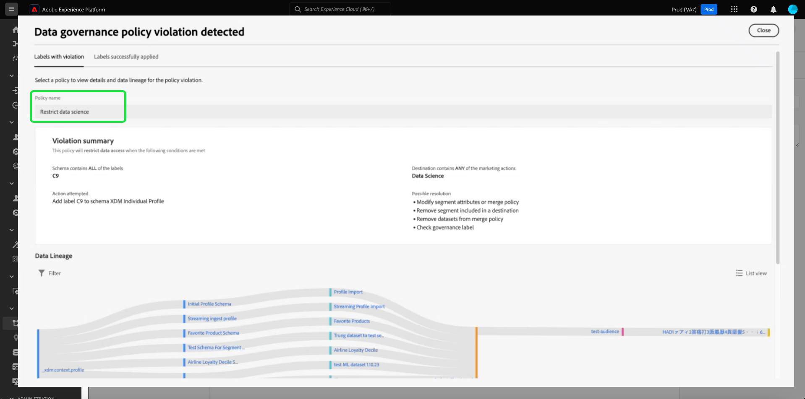

The violation message provides a summary of the policy that was violated, including the conditions the policy is configured to check for, the specific action that triggered the violation, and a list of possible resolutions for the issue.

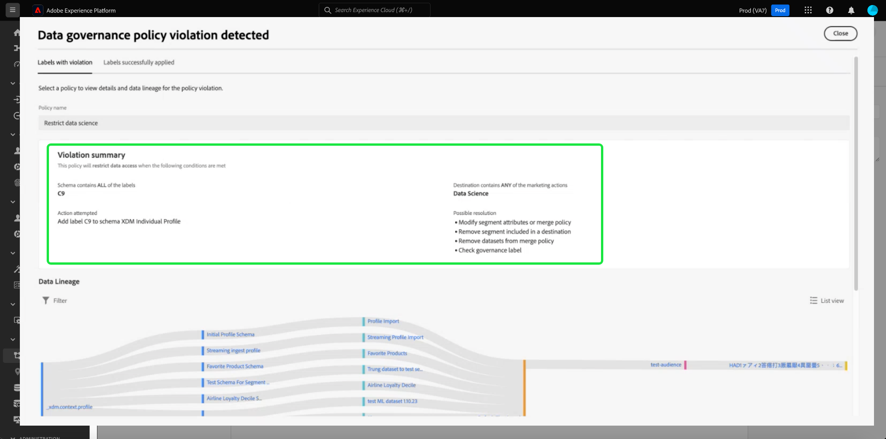

A data lineage graph is displayed below the violation summary, allowing you to visualize which datasets, merge policies, audiences, and destinations were involved in the policy violation. The entity that you are currently changing is highlighted in the graph, indicating which point in the flow is causing the violation to occur. You can select an entity name within the graph to open the details page for the entity in question.

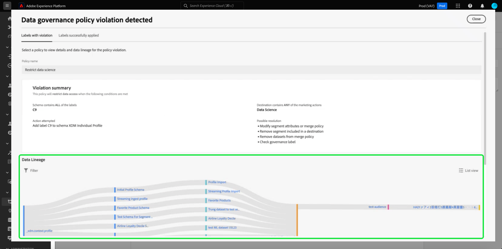

You can also use the **[!UICONTROL Filter]** icon () to filter the displayed entities by category. At least two categories must be selected in order for data to be displayed.

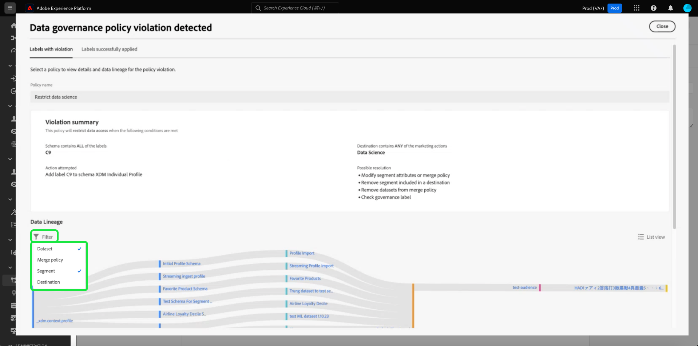

Select **[!UICONTROL List view]** to display the data lineage as a list. To switch back to the visual graph, select **[!UICONTROL Path view]**.

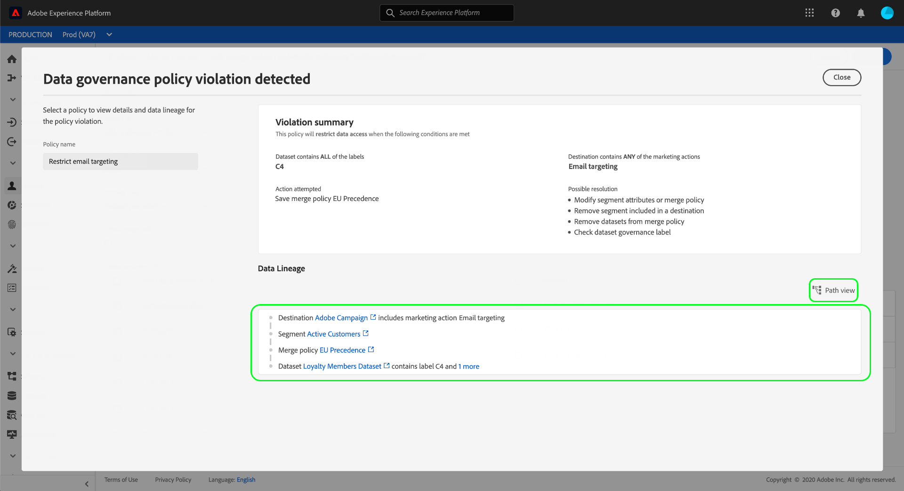

#### Labels successfully applied {#labels-successfully-applied}

If you create data usage policies before you label your schema fields, you may encounter a governance policy violation dialog as soon as you apply labels to your schema. In this case, you can successfully label part of your schema. The [!UICONTROL Labels successfully applied] tab indicates which labels were successfully applied, as there are no policy restrictions against that field.

Use the data lineage diagram to understand what other configuration changes need to be made before you can add the label to your schema field.

![A policy violation dialog with the [!UICONTROL Labels successfully applied] tab highlighted.](../images/enforcement/labels-successfully-applied.png)

### Consent policy evaluation {#consent-policy-evaluation}

When activating an audience to a destination, you can see how your [consent policies](../policies/user-guide.md#consent-policy) affect different percentages of profiles included in the activation.

>[!NOTE]
>
>Consent policies are only available for organizations that have purchased Adobe Healthcare Shield or Adobe Privacy & Security Shield.

#### Consent policy enhancement for paid media {#consent-policy-enhancement}

An enhancement to consent policy enforcement on [batch](../../destinations/destination-types.md#file-based) and [streaming](../../destinations/destination-types.md#streaming-destinations) destinations including paid media activations has been made. This enhancement is available to customers of Privacy and Security Shield or Healthcare Shield, and proactively removes profiles from batch and streaming destinations as consent status changes. It also ensures that consent changes are propagated immediately so that the right audience is always targeted.

These improvements allow for greater trust in your marketing strategy as it removes the need for marketers to manually add consent attributes to their segment expression. This ensures that no profiles are inadvertently targeted for any marketing experiences once consent has been withdrawn or no longer qualified for a consent policy. The marketing consent policies that set rules for how consent or preference data should be managed across various marketing workflows are now automatically enforced in activation workflows in downstream solutions.

>[!NOTE]
>
>There are no UI changes as a result of this enhancement.

#### Pre-activation evaluation

Once you reach at the **[!UICONTROL Review]** step when [activating a destination](../../destinations/ui/activation-overview.md), select **[!UICONTROL View applied policies]**.

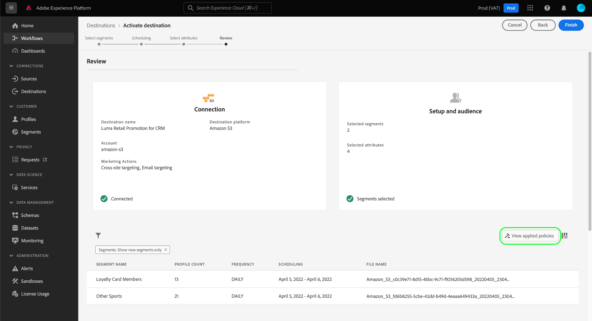

A policy check dialog appears, showing you a preview of how your consent policies affect the consented audience of the activated audiences.

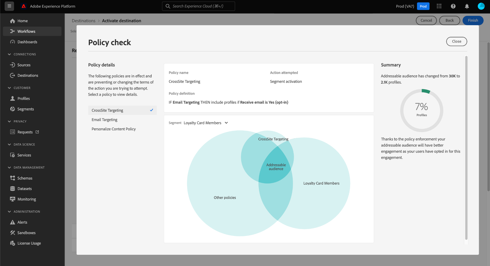

The dialog shows the consented audience for one audience at a time. To view the policy evaluation for a different audience, use the dropdown menu above the diagram to select one from the list.

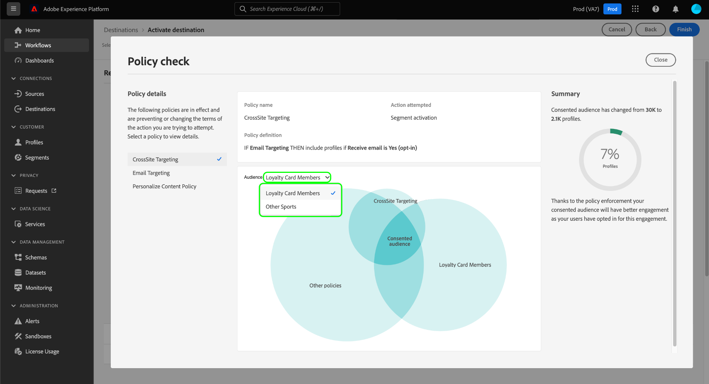

Use the left rail to switch between the applicable consent policies for the selected audience. Policies that are not selected are represented in the "[!UICONTROL Other policies]" section of the diagram.

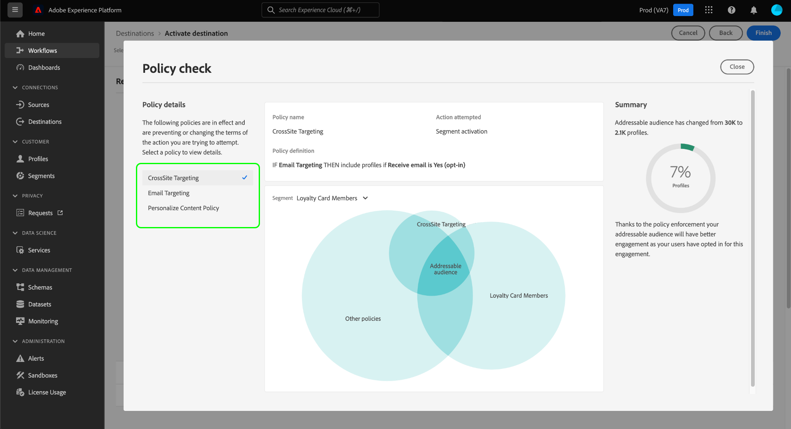

The diagram displays the overlap between three groups of profiles:

1. Profiles that qualify for the selected audience
1. Profiles that qualify for the selected consent policy
1. Profiles that qualify for the other applicable consent policies for the audience (referred to as "[!UICONTROL Other policies]" in the diagram)

The profiles that qualify for all three of the above groups represent the consented audience, summarized in the right rail.

Hover over one of the audiences in the diagram to show the number of profiles it contains.

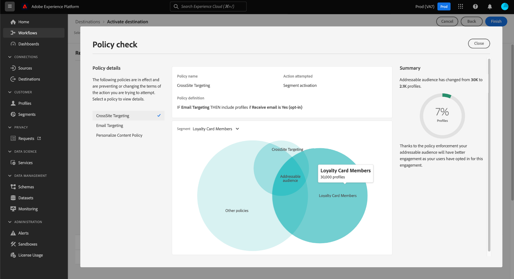

The consented audience is represented by the central overlap of the diagram, and can be highlighted like the other sections.

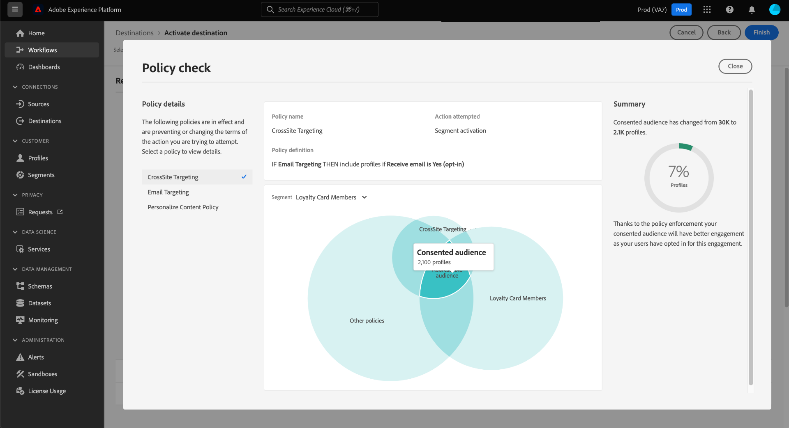

#### Flow run enforcement

When data is activated to a destination, the flow run details show the number of identities that were excluded due to active consent policies.

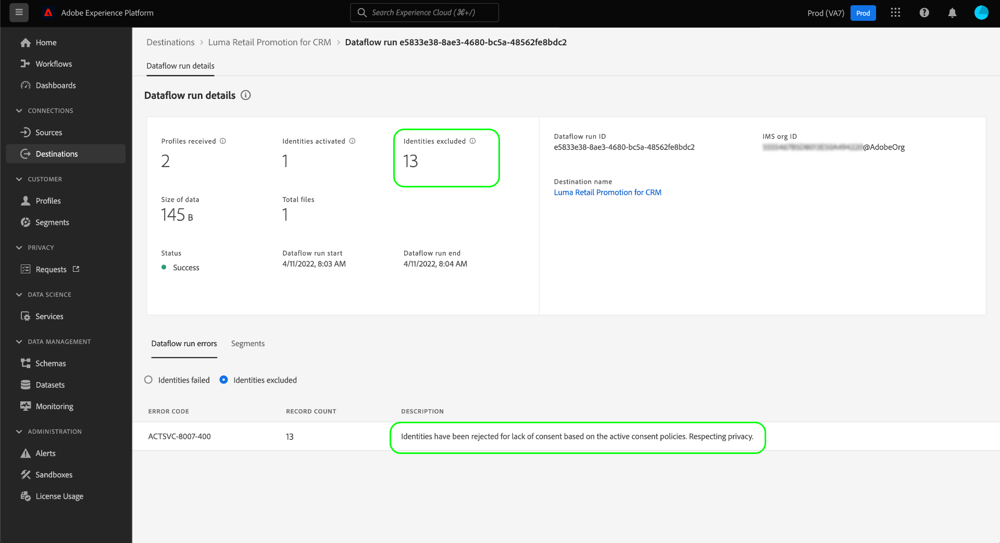

## Policy enforcement for activated audiences {#policy-enforcement-for-activated-audiences}

Policy enforcement still applies to audiences after they have been activated, restricting any changes to an audience or its destination that would result in a policy violation. Due to how [data lineage](#lineage) works in policy enforcement, any of the following actions can potentially trigger a violation:

* Updating data usage labels
* Changing datasets for an audience
* Changing audience predicates
* Changing destination configurations

If any of the above actions triggers a violation, that action is prevented from being saved and a policy violation message is displayed, ensuring that your activated audiences continue to comply with data usage policies when being modified.

## Next steps

This document covered how automatic policy enforcement works in Experience Platform. For steps on how to programmatically integrate policy enforcement into your applications using API calls, see the guide on [API-based enforcement](./api-enforcement.md).
