# Data usage labels user guide

This user guide covers steps for working with data usage labels (also known as DULE labels) within the [!DNL Experience Platform] user interface. Before using the guide, please see the [Data Governance overview](../home.md) for a more robust introduction to the DULE framework.

## Managing data usage labels at the dataset level

In order to manage data usage labels at the dataset level, you must select an existing dataset or create a new one. After logging into Adobe Experience Platform, select **[!UICONTROL Datasets]** on the left-navigation to open the _Datasets_ workspace. This page lists all created datasets belonging to your organization, along with useful details related to each dataset. 

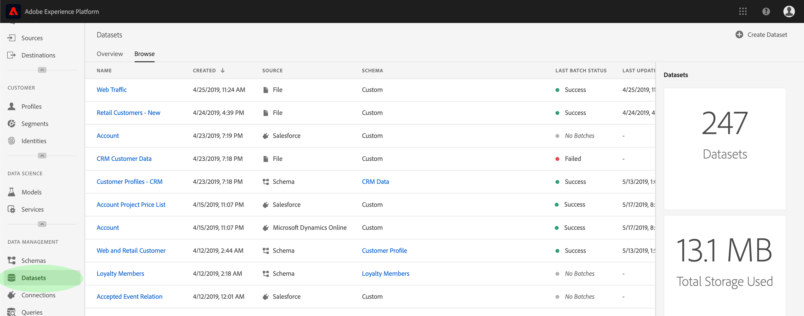

The next section provides steps for creating a new dataset to apply labels to. If you wish to edit labels for an existing dataset, select the dataset from the list and skip ahead to [adding data usage labels to the dataset](#add-labels).

### Create a new dataset

>[!NOTE]
>
>In this example, a dataset is created using a pre-configured [!DNL Experience Data Model] (XDM) schema. For more information on XDM schemas, see the [XDM System overview](../../xdm/home.md) and [basics of schema composition](../../xdm/schema/composition.md).

To create a new dataset, click **[!UICONTROL Create Dataset]** in the top-right corner of the _[!UICONTROL Datasets]_ workspace.

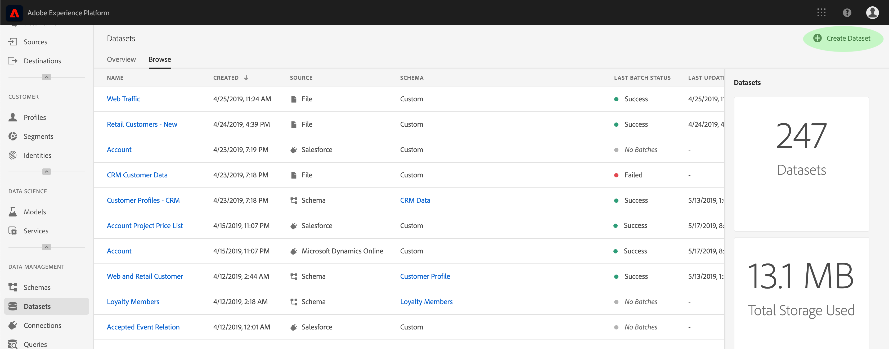

The _[!UICONTROL Create Dataset]_ screen appears. From here, click **[!UICONTROL Create Dataset from Schema]**. 

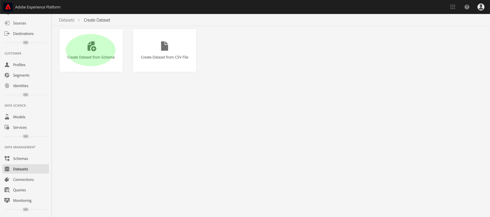

The _[!UICONTROL Select Schema]_ screen appears, which lists all available schemas that you can use for creating a dataset. Click the radio button next to a schema to select it. The _[!UICONTROL Schemas]_ section on the right-hand side displays additional details about the selected schema. Once you have selected a schema, click **[!UICONTROL Next]**.

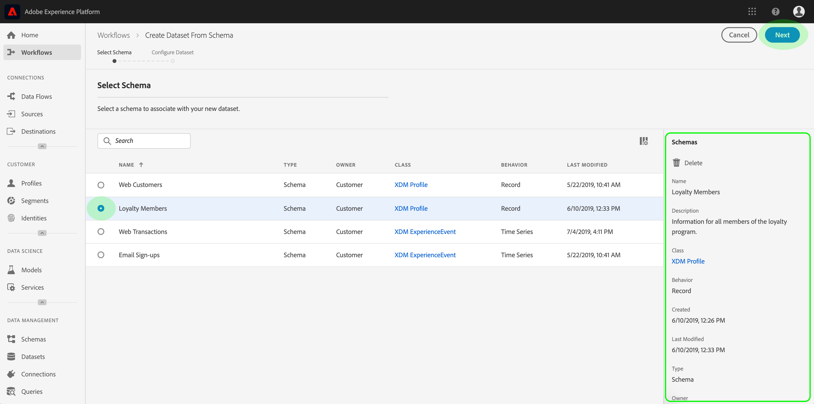

The _Configure Dataset_ screen appears. Provide a **name** (required) and **description** (optional, but recommended) for your new dataset, then click **[!UICONTROL Finish]**.

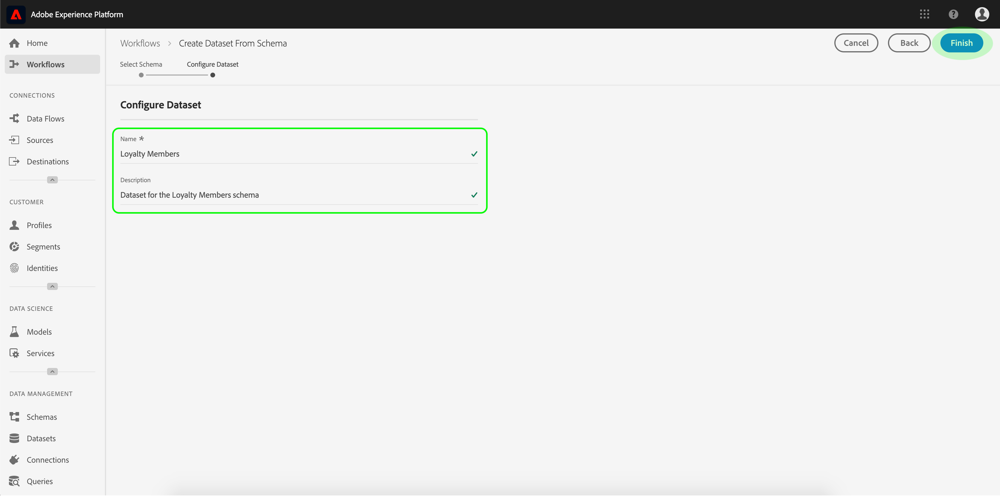

The _[!UICONTROL Dataset Activity]_ page appears, displaying information about the newly created dataset. In this example, the dataset is named "Loyalty Members", therefore the top-navigation shows _Datasets > Loyalty Members_. 

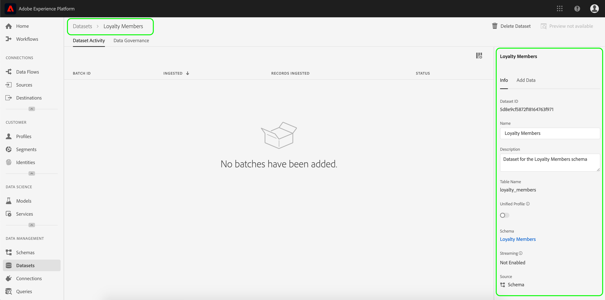

### Add data usage labels to the dataset {#add-labels}

After creating a new dataset or selecting an existing dataset from the list in the _[!UICONTROL Datasets]_ workspace, click **[!UICONTROL Data Governance]** to open the _[!UICONTROL Data Governance]_ workspace. The workspace allows you to manage data usage labels at the dataset level and field level.

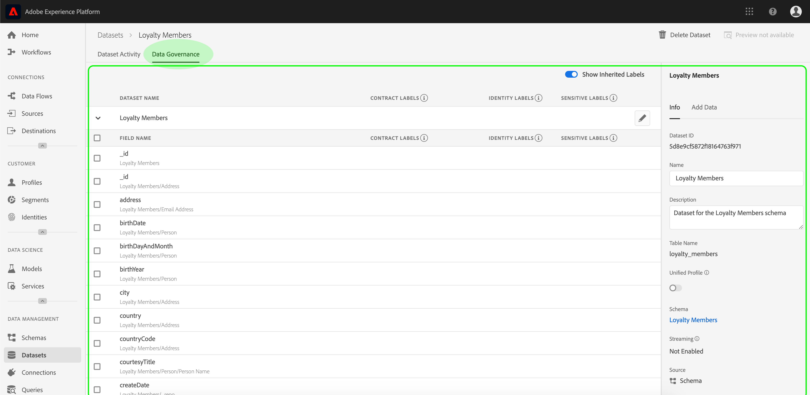

To edit data usage labels at the dataset level, start by clicking the pencil icon next to the dataset name.

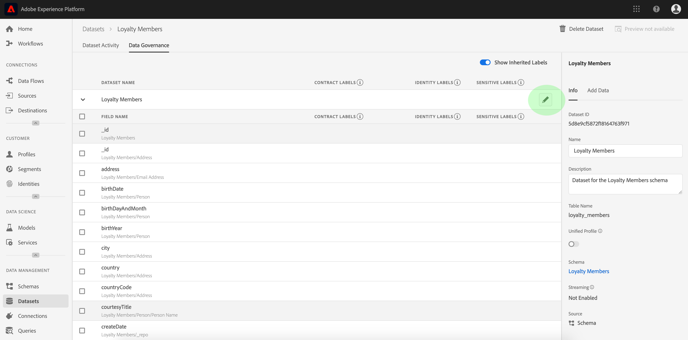

The _[!UICONTROL Edit Governance Labels]_ dialog opens. Within the dialog, check the boxes next to the labels you wish to apply to the dataset. Remember that these labels will be inherited by all fields within the dataset. The _[!UICONTROL Applied Labels]_ header updates as you check each box, showing the labels you have chosen. Once you have selected the desired labels, click **[!UICONTROL Save Changes]**.

 

The _[!UICONTROL Data Governance]_ workspace reappears, showing the labels that you have applied at the dataset level. You can also see that the labels are inherited down to each of the fields within the dataset.

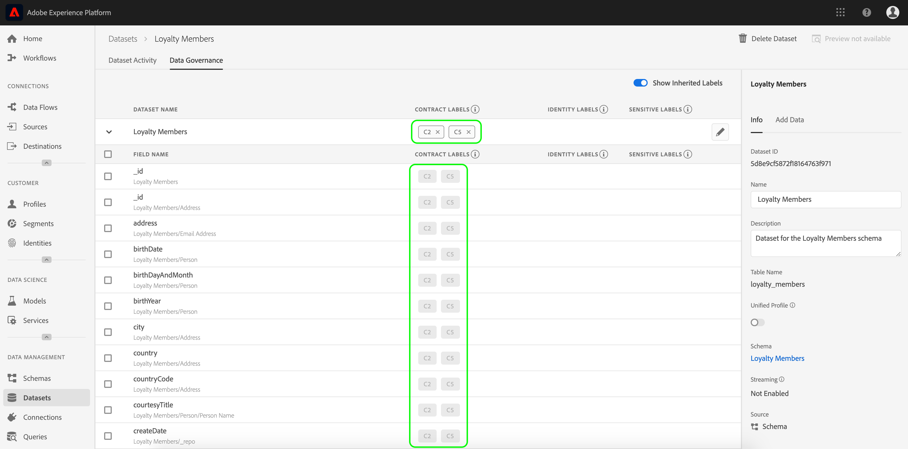

Notice that an "x" appears next to the labels at the dataset level, allowing you to remove the labels. The inherited labels beside each field do not have an "x" next to them and appear "greyed out" with no ability to remove or edit. This is because **inherited fields are read-only**, meaning they cannot be removed at the field level.

The **[!UICONTROL Show Inherited Labels]** toggle is on by default, which allows you to see any labels inherited down from the dataset to its fields. Switching the toggle off hides any inherited labels within the dataset.

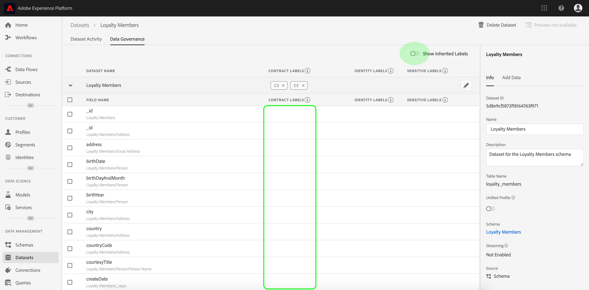

## Managing data usage labels at the dataset field level

Continuing the workflow for [adding and editing data usage labels at the dataset level](#add-labels), you can also manage field-level labels within the _[!UICONTROL Data Governance]_ workspace for that dataset. 

To apply data usage labels to an individual field, select the checkbox next to the field name, then click **[!UICONTROL Edit Governance Labels]**.  

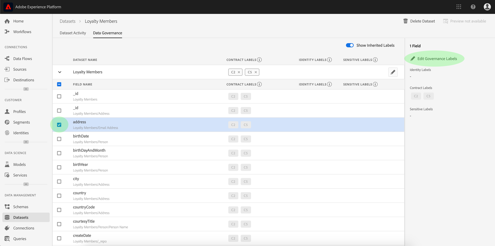

The _[!UICONTROL Edit Governance Labels]_ dialog appears. The dialog displays headers showing selected fields, applied labels, and inherited labels. Notice that the inherited labels (C2 and C5) are greyed out in the dialog. They are read-only labels inherited from the dataset level and are therefore only editable at the dataset level.  

 

Select field-level labels by clicking the checkbox next to each label you wish to use. As you select labels, the _[!UICONTROL Applied Labels]_ header updates to show labels applied to the fields shown in the _[!UICONTROL Selected Fields]_ header. Once you have finished selecting field-level labels, click **[!UICONTROL Save Changes]**.

 

The _[!UICONTROL Data Governance]_ workspace reappears, which now displays the selected field-level label(s) in the row next to the field name. Notice that the field-level label has an "x" next to it, allowing you to remove the label.  

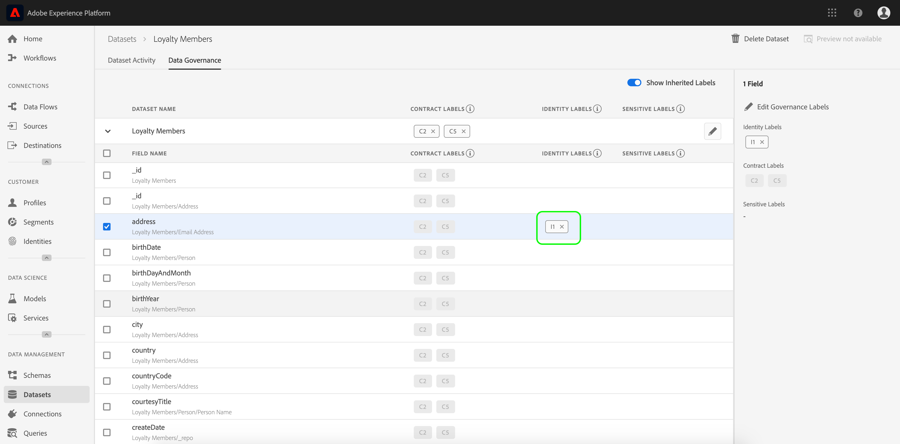

You can repeat these steps to continue adding and editing field-level labels for additional fields, including selecting multiple fields to apply field-level labels simultaneously.  

It is important to remember that inheritance moves from the top-level down only (dataset → fields), meaning that labels applied at the field level are not propagated to other fields or datasets.

## Managing custom labels

You can create your own custom usage labels within the *[!UICONTROL Policies]* workspace in the [!DNL Experience Platform] UI. Click **[!UICONTROL Policies]** in the left-navigation, then click **[!UICONTROL Labels]** to view a list of existing labels. From here, click **[!UICONTROL Create label]**.

The *[!UICONTROL Create label]* dialog appears. From here, provide the following information for the new label:

* **[!UICONTROL Identifier]**: A unique identifier for the label. This value is used for lookup purposes and should therefore be short and concise.
* **[!UICONTROL Name]**: A friendly display name for the label.
* **[!UICONTROL Description]**: (Optional) A description for the label to provide further context.

When finished, click **[!UICONTROL Create]**.

The dialog closes, and the newly created custom label appears in the list under the *[!UICONTROL Labels]* tab.

The label can now be selected under *[!UICONTROL Custom Labels]* when editing usage labels for datasets and fields, or when creating data usage policies.

 

## Next steps

Now that you have added data usage labels at the dataset and field level, you can begin to ingest data into [!DNL Experience Platform]. To learn more, start by reading the [data ingestion documentation](../../ingestion/home.md).

You can also now define data usage policies based on the labels you have applied. For more information, see the [data usage policies overview](../policies/overview.md).

## Additional resources

The following video is intended to support your understanding of [!DNL Data Governance], and outlines how to apply labels to a dataset and individual fields.

>[!VIDEO](https://video.tv.adobe.com/v/29709?quality=12&enable10seconds=on&speedcontrol=on)
