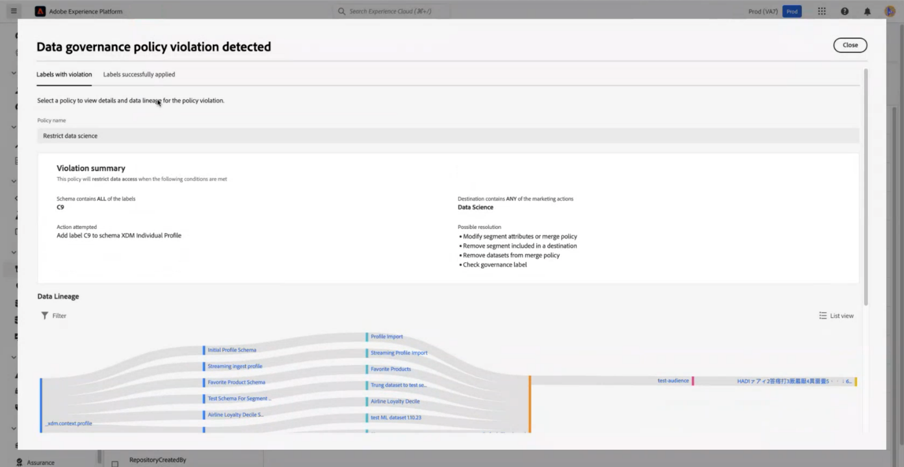
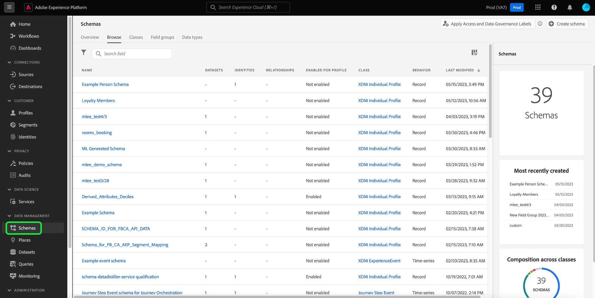
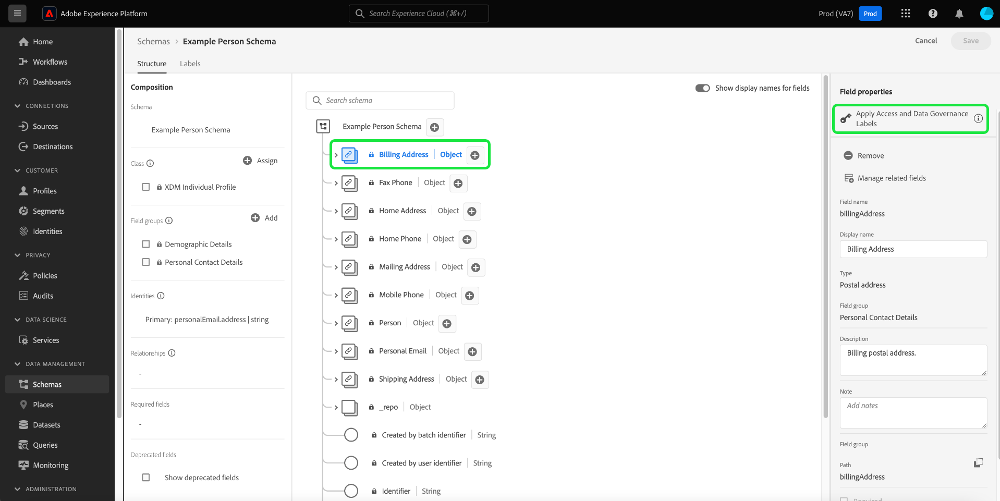
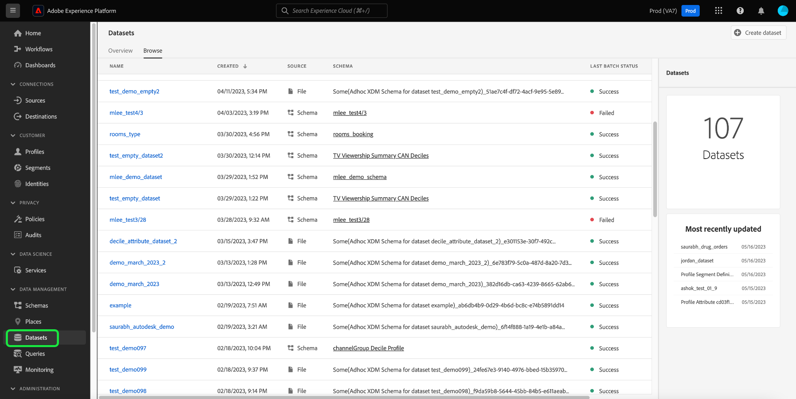
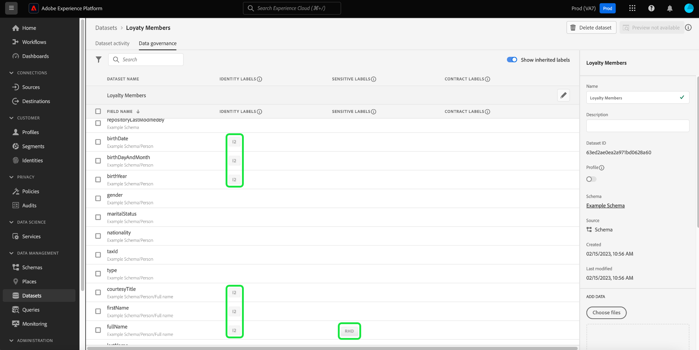
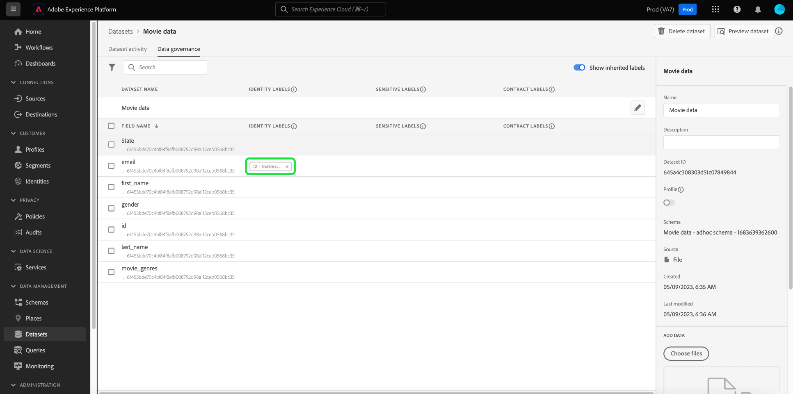
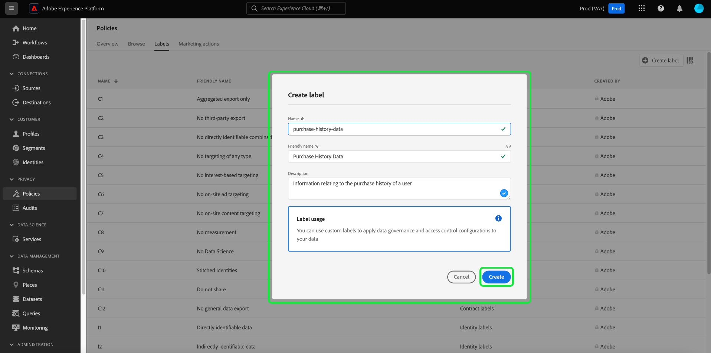

# Manage data usage labels in the UI {#user-guide}

>[!CONTEXTUALHELP]
>id="platform_privacyConsole_dataGovernance_description"
>title="Govern data usage in Platform"
>abstract="<h2>Description</h2>
The Data Governance framework in Experience Platform allows you to label attributes and schemas according to data usage restrictions and set up policies that identify and honor these restrictions for specific marketing actions.
"

This user guide covers steps for working with data usage labels within the [!DNL Experience Platform] user interface.

## Manage labels {#manage-labels}

To apply labels to your data, you need the **[!UICONTROL Manage Usage Labels]** permission for use on the default production sandbox called "prod". To create a custom label, you must also have administrative rights on the product profile. Each organization only has one list of applicable labels, and currently, deleting labels is not supported.

See the guide on how to [configure permissions](https://experienceleague.adobe.com/docs/platform-learn/getting-started-for-data-architects-and-data-engineers/configure-permissions.html) or the [access control overview](../../access-control/home.md) for more information on how to assign a permission. If you do not have access to the Admin Console for your organization, please contact your organization admin.

## Manage labels at the schema level

You can add labels directly to a schema or fields within that schema. Any fields applied at the schema level will propagate to all datasets based on that schema.

>[!NOTE]
>
>If your data usage policies were created before you labeled your field, you may encounter a governance policy violation dialog when you apply labels to your new schema. This dialog indicates that applying this label will violate an existing usage policy. Use the data lineage diagram to understand what other configuration changes need to be made before you can add the label to your schema field.
>
>
>
>See the [data usage policy violation documentation](https://experienceleague.adobe.com/en/docs/experience-platform/data-governance/enforcement/auto-enforcement#data-usage-violation) for more information on partial policy violations.

In order to manage data usage labels at the schema level, you must select an existing schema or create a new one. After logging into Adobe Experience Platform, select **[!UICONTROL Schemas]** on the left-navigation to open the **[!UICONTROL Schemas]** workspace. This page lists all created schemas belonging to your organization, along with useful details related to each schema. 

The next section provides steps for creating a new schema to apply labels to. If you wish to edit labels for an existing schema, select the schema from the list and skip ahead to [adding data usage labels to the schema](#add-labels).

### Create a new schema

To create a new schema, select **[!UICONTROL Create schema]** in the top-right corner of the **[!UICONTROL Schemas]** workspace. See the guide on [how to create a schema using the Schema Editor](../../xdm/tutorials/create-schema-ui.md#create) for complete instructions. Alternatively, you can [create a schema using the Schema Registry API](../../xdm/tutorials/create-schema-api.md) if required.  

### Add data usage labels to a schema {#add-labels-to-schema}

After creating a new schema, or selecting an existing schema from the list in the [!UICONTROL Browse] tab of the [!UICONTROL Schemas] workspace, select a field from your schema in the Schema Editor. In the [!UICONTROL Field properties] sidebar, select **[!UICONTROL Apply Access and Data Governance Labels]**. 

A dialog appears that allows you to apply and manage data usage labels at the schema level and field level. See the XDM tutorial for complete instructions on [how to add or edit data usage labels for XDM schemas](../../xdm/tutorials/labels.md#select-schema-field).

### Add data usage labels to a specific dataset {#add-labels-to-dataset}

>[!CONTEXTUALHELP]
>id="platform_privacyConsole_dataGovernance_instructions"
>title="Instructions"
>abstract="<ol><li>Select <a href="https://experienceleague.adobe.com/docs/experience-platform/data-governance/labels/user-guide.html">Datasets</a> in the left navigation, then select the dataset whose data you want to restrict.</li><li>From the dataset details view, select the <b>Data governance</b> tab.</li><li>Select the dataset fields that you want to restrict, then select <b>Edit governance labels</b> to label the data based on usage restrictions.</li><li>After labeling your data, select <a href="https://experienceleague.adobe.com/docs/experience-platform/data-governance/policies/overview.html">Policies</a> in the left navigation, then select <b>Create Policy</b>.</li><li>Choose to create a <a href="https://experienceleague.adobe.com/docs/experience-platform/data-governance/policies/user-guide.html#create-governance-policy">Data Governance policy</a>, then select the data usage labels that the policy will apply to the policy.</li><li>Select the marketing action(s) that the policy will deny for any data containing those labels. After the policy is created, select it from the list and enable it using the toggle in the right rail.</li><li>For each enabled policy, Platform prevents any data containing the specified labels from being used for the defined marketing action(s). This enforcement takes place automatically when you attempt to activate labeled data to a destination with associated marketing actions (use cases).</li></ol>"

>[!IMPORTANT]
>
>Labels can no longer be applied to fields at the dataset level. This workflow has been deprecated in favour of applying labels at the schema level. Any labels previously applied at the dataset object level will still be supported through the Platform UI until 31st May 2024. To ensure that your labels are consistent across all schemas, any labels previously attached to fields at the dataset level must be migrated to the schema level by you over the coming year. See the documentation for instructions on [how to migrate previously applied labels from the dataset to the schema level](../e2e.md#migrate-labels).

Labels can be applied to the entire dataset from the **[!UICONTROL Data Governance]** tab of the **[!UICONTROL Datasets]** workspace. The workspace allows you to manage data usage labels at the dataset level.

![The [!UICONTROL Data Governance] tab of the [!UICONTROL Datasets] workspace with Data Governance highlighted.](../images/labels/dataset-governance.png)

To edit data usage labels at the dataset level, start by selecting the pencil icon () in the row of the dataset name.

![The [!UICONTROL Data Governance] tab of the [!UICONTROL Datasets] workspace with the edit pencil icon highlighted.](../images/labels/dataset-level-edit.png)

The **[!UICONTROL Edit Governance Labels]** dialog opens. Within the dialog, check the boxes next to the labels you wish to apply to the dataset. Remember that these labels will be inherited by all fields within the dataset. The **[!UICONTROL Applied Labels]** header updates as you check each box, showing the labels you have chosen. Once you have selected the desired labels, select **[!UICONTROL Save Changes]**.

The **[!UICONTROL Data Governance]** workspace reappears, showing the labels that you have applied at the dataset level in the initial row of the table. You can also see the labels, indicated by individual cards, that are inherited down to each of the fields within the dataset.

![The [!UICONTROL Data Governance] tab of the [!UICONTROL Datasets] workspace with applied dataset level labels and inherited dataset filed labels highlighted.](../images/labels/applied-dataset-labels.png) 

### Remove labels from a dataset {#remove-labels-from-a-dataset}

Labels added at the dataset level have an "x" next to their card. This allows you to remove the labels from the entire dataset. Inherited labels beside each field do not have an "x" next to them and appear "greyed out". These **inherited labels are read-only**, meaning they cannot be removed or edited at the field level.

<!-- ## View labels at the dataset field level {#view-labels-at-dataset-field-level} -->

<!-- To view labels inherited by the dataset from the schema level, select **[!UICONTROL Datasets]** to navigate to the datasets workspace and select the relevant dataset from the list. 

Next, select the **[!UICONTROL Data Governance]** tab to show the labels that have been applied to the dataset. You can also see that the labels are inherited down to each of the fields within the dataset.

The inherited labels beside each field do not have an "x" next to them and appear "greyed out" with no ability to remove or edit. This is because **inherited fields are read-only**, meaning they cannot be removed at the field level. -->

<!--Beleive can cut above here  -->

The **[!UICONTROL Show Inherited Labels]** toggle is on by default, which allows you to see any labels inherited down from the schema to its fields. Switching the toggle off hides any inherited labels within the dataset.

<!-- Labels applied to the dataset appear in read-only form within the **[!UICONTROL Data Governance]** view for that dataset. 

 -->

>[!NOTE]
>
>Labels that were applied before the dataset labelling feature was deprecated can be removed from the dataset by finding the relevant dataset and selecting the cancel icon on the label. 
>
>See the documentation for instructions on [how to migrate previously applied labels from the dataset to the schema level](../e2e.md#migrate-labels).

## Manage custom labels {#manage-custom-labels}

>[!CONTEXTUALHELP]
>id="platform_governance_createlabels"
>title="Create labels"
>abstract="Labels allow you to categorize datasets and fields according to usage policies that apply to that data. Platform provides a standard set of labels for you to use, but you can also create custom labels that are specific to your organization."

You can create your own custom usage labels within the **[!UICONTROL Policies]** workspace in the [!DNL Experience Platform] UI. Select **[!UICONTROL Policies]** in the left-navigation, then select **[!UICONTROL Labels]** to view a list of existing labels. From here, select **[!UICONTROL Create label]**.

The **[!UICONTROL Create label]** dialog appears. From here, provide the following information for the new label:

* **[!UICONTROL Name]**: A unique identifier for the label. This value is used for lookup purposes and should therefore be short and concise.
* **[!UICONTROL Friendly name]**: A friendly display name for the label.
* **[!UICONTROL Description]**: (Optional) A description for the label to provide further context.

When finished, select **[!UICONTROL Create]**.

The dialog closes, and the newly created custom label appears in the list under the **[!UICONTROL Labels]** tab.

The label can now be selected under **[!UICONTROL Custom Labels]** when editing usage labels for datasets and fields, or when creating data usage policies.

## Next steps

Now that you have added data usage labels at the dataset and field level, you can begin to ingest data into [!DNL Experience Platform]. To learn more, start by reading the [data ingestion documentation](../../ingestion/home.md).

You can also now define data usage policies based on the labels you have applied. For more information, see the [data usage policies overview](../policies/overview.md).

<!-- The workflow of this video is now outdated. This can be enabled once the video has been updated

## Additional resources

The following video is intended to support your understanding of Data Governance, and outlines how to apply labels to a dataset and individual fields.

>[!VIDEO](https://video.tv.adobe.com/v/29709?quality=12&enable10seconds=on&speedcontrol=on) -->
