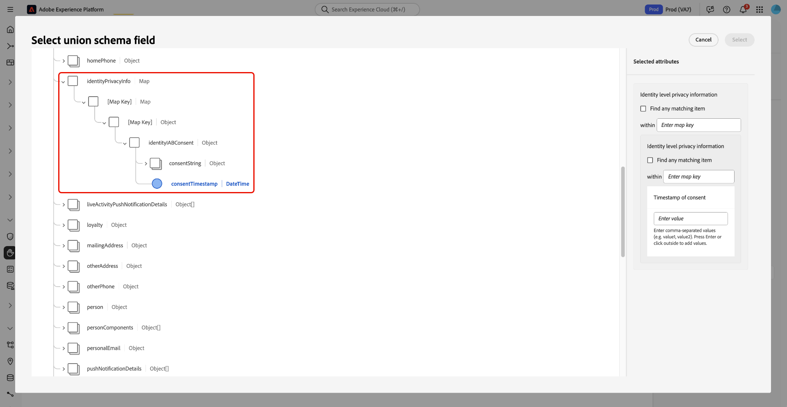
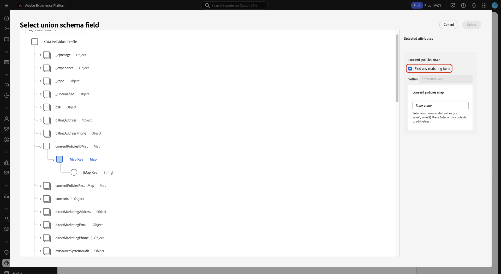

# Consent policy rule building reference

Use this reference on advanced rule logic to set precise, legally valid rules in the **[!UICONTROL Then]** clause of the Consent Policy builder in Adobe Experience Platform.

![The consent policy builder interface highlighting the [!UICONTROL Then] clause section, where users define rule conditions.](../images/policies/multiple-rules.png)

Learn how policy rules apply to your consent data's structure and types to accurately enforce customer consent preferences. 

Read this document to learn how to filter profiles based on consent by navigating into container fields in your XDM schema and selecting a primitive field. Then use the appropriate operator to define the exact value a profile must match.

## Prerequisites

Before using this reference, ensure that your consent policy setup is complete and that you understand the foundational concepts of Adobe Experience Platform's data architecture and governance framework.

Ensure that you meet the following prerequisites:

* **Policy Setup Complete**: You have created or started creating a consent policy in the Adobe Experience Platform UI. For detailed steps, see the [data usage policies user guide](user-guide.md#consent-policy).

* **Familiarity with Data Structures**: This reference requires working knowledge of the following core concepts:
  * **XDM and Union Schema**: Understand how Experience Data Model structures define data relationships and how the union schema represents unified customer profiles. See the [XDM System overview](../../xdm/home.md) to learn more.
  * **Data Governance Framework**: Know how Adobe Experience Platform enforces data usage policies and governance rules. See the [Data Governance overview](../home.md) for details.
  * **Customer Consent Processing**: Understand how consent data is collected, stored, and applied within customer experience workflows. See the [consent processing overview](../../landing/governance-privacy-security/consent/adobe/overview.md).

## Core concepts: primitive and container fields

Read this section to learn how consent policy rules use different field types in XDM schemas. Understanding the distinction between container and primitive fields helps you select the correct field and operator when defining policy conditions.

### Supported field types and rule logic

Consent policies support multiple field types, each with specific operators for building rule conditions. Field types are grouped into two categories: **container types** and **primitive types**.

### Container types (schema navigation)

Container types organize consent data but cannot be used directly in policy conditions. They serve as navigation paths to reach the primitive fields that hold actual values.

| Container type | Description |
|----------------|-------------|
| **Object** | A container with a fixed schema that holds multiple fields of different types. |
| **Array** | A container that holds multiple values of the same type. |
| **Map** | A container with dynamic keys that can hold objects or other field types. |

>[!IMPORTANT]
>
>Container fields cannot be selected directly in consent policy conditions. You must navigate into containers to select **primitive fields** (such as string, number, or boolean) for rule building. Container operators are used only for schema navigation, not for setting policy conditions.

### Primitive types (rule conditions)

Primitive fields hold the actual consent data values (for example, `true` or `"weekly"`) and are the only field types that can be used to define policy conditions.

The table below describes each supported primitive type and the available operators.

| Primitive type | Supported operators | Description |
|----------------|---------------------|-------------|
| **String** | `is equal to`, `is not equal to`, `exists`, `does not exist` | Text-based consent attributes. |
| **Number** | `is equal to`, `is not equal to`, `is greater than`, `is less than`, `exists`, `does not exist` | Numeric consent attributes. |
| **Boolean** | `is equal to`, `is not equal to` | True or false consent values. |
| **Date** | `is equal to`, `is not equal to`, `exists`, `does not exist` | Date-based consent attributes. |


## Working with complex data structures

Read this section to learn how to navigate nested containers in your consent schema to reach primitive fields. It introduces common schema patterns and explains how deeper structures enable more granular consent logic.

### Handling nested and complex schema structures

Complex consent schemas often include nested container structures that support flexible and scalable data management. Because policy rules can only reference primitive fields, you must navigate through container hierarchies to reach the fields that can be used in consent policy conditions. Deeper nesting enables more granular and specific rule targeting.

Common nested container patterns include:

* **Map of map** – Dynamic keys that contain other maps.  
* **Map of object** – Dynamic keys that contain objects with fixed schemas.  
* **Array of map** – Arrays that contain maps with dynamic keys.  
* **Array of object** – Arrays that contain objects with fixed schemas.  
* **Object with map or array properties** – Objects that include map or array fields.

### Field structure example

The following structure serves as the visual reference for rule examples throughout this guide.

```
consent.marketing (Object)
├── email (Boolean)
├── sms (Boolean)
├── preferences (Map with dynamic keys)
│   ├── "email_preferences" (Object)
│   │   ├── frequency (String)
│   │   └── channels (Array of Strings)
│   ├── "sms_preferences" (Object)
│   │   ├── frequency (String)
│   │   └── opt_in_time (Date)
│   └── "push_preferences" (Object)
│       ├── frequency (String)
│       └── categories (Array of Strings)
└── lastUpdated (Date)
```

## Advanced rule building by field type

Read this section for a detailed guidance on creating consent policy rules based on field type. You'll learn how to configure rule logic for booleans, maps, objects, and arrays to capture precise consent conditions.

### Rule building components and steps

Building effective consent policy rules requires understanding how to navigate your schema structure and apply the correct operators for each field type. Each rule follows the same basic approach: navigate to a primitive field, select the appropriate operator, and define the condition that must be met.

Follow these steps to build a rule:

1. **Select a field** – Navigate through container fields to reach a primitive field.  
2. **Choose an operator** – Select the operator supported by the field type.
   
3. **Set a value** – Define the value or condition to match.  
4. **Match map keys** – Choose whether to target a specific key or match across all keys in a map.  
5. **Add conditions** – Combine multiple rules using AND or OR logic as needed.

### Working with boolean fields (implicit consent logic)

Boolean fields store true or false consent values and represent the most common consent attributes. The `is not equal to` operator allows you to include profiles that have not explicitly opted out, supporting implicit consent scenarios.

**Boolean operators and outcomes**

| Operator | Value | Result |
|----------|-------|--------|
| `is equal to` | `true` | Includes profiles with explicit consent (`true`). |
| `is equal to` | `false` | Includes profiles with explicit opt-out (`false`). |
| `is not equal to` | `true` | Includes profiles without explicit consent (`false` or missing). |
| `is not equal to` | `false` | Includes profiles who have not explicitly opted out (`true` or missing). |

**Example: Implicit email consent**

```
Field: consent.marketing.email (boolean)
Operator: is not equal to
Value: false
Result: Includes profiles who have not explicitly opted out of email marketing (includes both true and missing/null values).
```

### Working with map fields (dynamic preferences)

Map fields store key-value pairs with dynamic keys, unlike objects that have fixed schemas. Maps are often used in preference centers where new categories can be added without schema updates. You can target specific keys or use wildcard matching across all keys.

**Specific key matching**

Use this approach to target a specific preference category.

```
Field: consent.preferences["email_preferences"].frequency (string) - navigated to from the map container
Operator: is equal to
Value: "weekly"
Result: Includes profiles who set the email frequency to weekly (for the "email_preferences" key)
```

**Any key matching**

Use the "**[!UICONTROL find any matching item]**" checkbox option to match across all dynamic keys in a map.



```
Field: consent.preferences.*.frequency (string)
Operator: is equal to
Value: "weekly"
Result: Includes profiles who set frequency to weekly in ANY preference category (for example, email_preferences, sms_preferences, or push_preferences)
```

### Working with object fields (fixed navigation)

Object fields act as containers with fixed schemas. They are used only for navigation and cannot be referenced directly in policy conditions.

**Navigation example**

```
consent.marketing (object) → consent.marketing.email (boolean)
```

**Example use case:**

```
Field: consent.marketing.email (Boolean) - navigated to from the object
Operator: is equal to
Value: true
Result: Include profiles who have explicitly consented to marketing emails
```


### Working with array fields (multiple values)

Array fields contain multiple values of the same type and require different handling depending on whether they store primitives or objects. Navigation and operator options vary by array type.

**Array of primitives example**

Use the `contains` operator to identify profiles based on specific values within an array.

```
Field: consent.communication_channels (array of strings)
Operator: contains
Value: "email"
Result: Include profiles who have consented to email communication
```

**Array of objects example**

Navigate into the array to access primitive fields within nested objects.

```
Field: consent.preferences["email_preferences"].categories[].type - navigated to from the array
Operator: is equal to
Value: "promotional"
Result: Include profiles where any email category is "promotional"
```

## Combining rules with complex logic

This section explains how to combine multiple rule conditions using AND or OR logic. You'll learn how logical operators work together to define advanced, multi-condition consent policies.

### Combining multiple conditions (AND or OR logic)

You can combine multiple rule conditions using AND or OR logic to build more sophisticated consent policies that target specific profile segments.  
**AND logic** requires all conditions to be true, producing narrower audience matches.  
**OR logic** allows any condition to be true, expanding the audience reach.

In the consent policy interface, use the logic selector that appears between rule conditions to switch between AND and OR logic.

### General complex rule example

The following example combines basic consent status with preference frequency to create a targeted segment.

```
Field: consent.marketing.email
Operator: is equal to true
AND
Field: consent.preferences.frequency
Operator: is not equal to "daily"
Result: Include profiles who consent to email marketing but not to a daily frequency
```

### Advanced logic for arrays of objects

When combining conditions within arrays of objects, behavior depends on whether you use AND or OR logic between the conditions.

**Example: Array of objects with AND conditions**

Use AND logic when all conditions must apply to the *same* array element.

```
Field: consent.preferences["email_preferences"].categories[].enabled (boolean)
Operator: is equal to
Value: true
AND
Field: consent.preferences["email_preferences"].categories[].type (string)
Operator: is equal to
Value: "promotional"
Result: Includes profiles where the same category entry has both enabled=true and type="promotional".
Note: AND conditions apply to the same array entry. Using OR logic would include profiles if any array entry matches any of the conditions.
```

>[!TIP]
>
>**Best practices for AND logic**
>
>Keep these key behaviors in mind when building AND-based array conditions:
>
>* Use AND logic when all conditions must apply to the **same array element**.  
>* Remember that AND creates restrictive targeting (fewer profiles will match).  
>* Do not expect AND logic to match across multiple array entries; it applies within each entry.  
>* Avoid using AND logic when you need flexible matching across entries.

>[!IMPORTANT]
>
>With AND logic, each array entry must satisfy all specified conditions at once. This behavior is ideal when you need to match combined attributes, such as categories that are both enabled and promotional.

>[!NOTE]
>
>AND logic applies to the same array entry **only for arrays of objects.**  
>For arrays of primitives, AND logic is evaluated at the field level across the entire array.

**Example: Array of objects with OR conditions**

Use OR logic to create inclusive audience matches by allowing any condition to be true across array entries.

```
Field: consent.preferences["email_preferences"].categories[].enabled (boolean)
Operator: is equal to
Value: true
OR
Field: consent.preferences["email_preferences"].categories[].type (string)
Operator: is equal to
Value: "newsletter"
Result: Includes profiles where any category entry has enabled=true or any entry has type="newsletter".
Note: OR logic allows matching across different array entries. One entry can meet the first condition while another meets the second.
```

### Next steps

After building and refining your consent policy rules, use the following resources to finalize configuration, validate policy enforcement, and review underlying data models.

* **Policy Creation Workflow**: Implement the rules you defined in the policy builder UI with the [Consent Policy UI Guide](user-guide.md#consent-policy.md)
* **Consent Policy Evaluation and Enforcement**: Verify how the enabled policy affects audience activation and profile data use. See the [Automatic policy enforcement guide](../enforcement/auto-enforcement.md) for details
* **XDM Consent Data Types**: Reference the specific schema structures and field definitions for consent attributes used in your policy rules. See the [XDM Consents and Preferences data type](../../xdm/data-types/consents.md) guide.
