# Manage data usage policies in the UI

This document covers how to use the **[!UICONTROL Policies]** workspace in the Adobe Experience Platform UI to create and manage data usage policies.

>[!NOTE]
>
>For information on how to manage access control policies in the UI, refer to the [attribute-based access control UI guide](../../access-control/abac/ui/policies.md) instead.

>[!IMPORTANT]
>
>All data usage policies (including core policies provided by Adobe) are disabled by default. In order for an individual policy to be considered for enforcement, you must manually enable that policy. See the section on [enabling policies](#enable) for steps on how to do this in the UI.

## Prerequisites

This guide requires a working understanding of the following [!DNL Experience Platform] concepts:

* [Data governance](../home.md)
* [Data usage policies](./overview.md)

## View existing policies {#view-policies}

In the [!DNL Experience Platform] UI, select **[!UICONTROL Policies]** to open the **[!UICONTROL Policies]** workspace. In the **[!UICONTROL Browse]** tab, you can see a list of available policies, including their associated labels, marketing actions, and status.

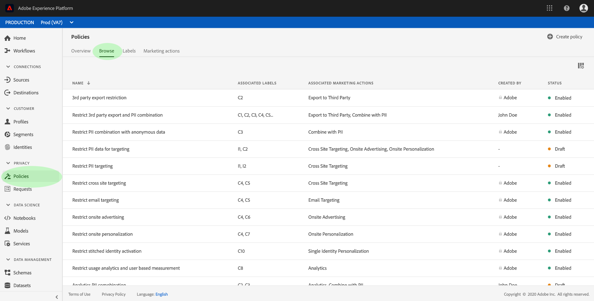

If you have access to consent policies, select the **[!UICONTROL Consent policies]** toggle to view them in the [!UICONTROL Browse] tab.

Select a listed policy to view its description and type. If a custom policy is selected, additional controls are displayed to edit, delete, or [enable/disable the policy](#enable).

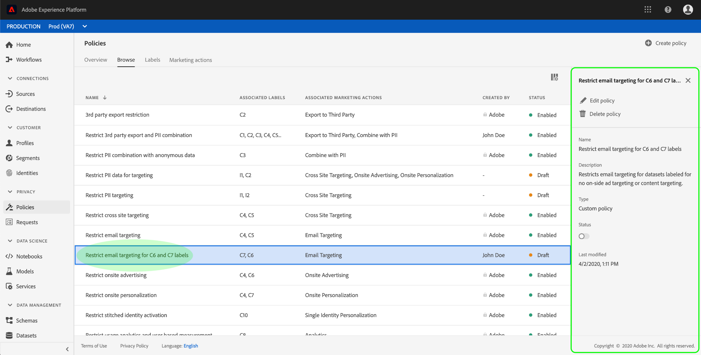

## Create a custom policy {#create-policy}

To create a new custom data usage policy, select **[!UICONTROL Create policy]** in the top-right corner of the **[!UICONTROL Browse]** tab in the **[!UICONTROL Policies]** workspace.

Depending on whether you are part of the beta for consent policies, one of the following occurs:

* If you are not part of the beta, you are immediately brought to the workflow for [creating a data governance policy](#create-governance-policy).
* If you are part of the beta, a dialog provides an extra option to [create a consent policy](#consent-policy).
  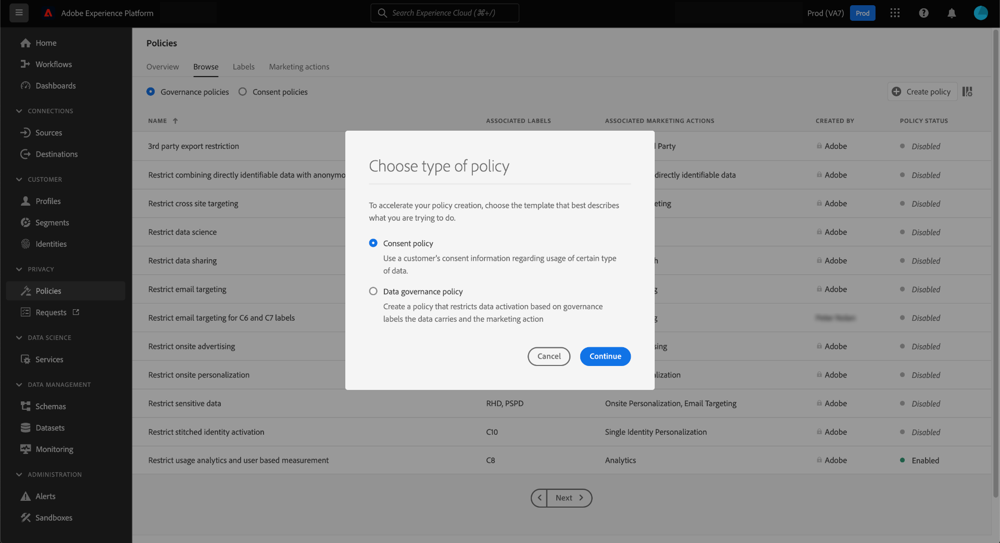

### Create a data governance policy {#create-governance-policy}

The **[!UICONTROL Create policy]** workflow appears. Start by providing a name and a description for the new policy.

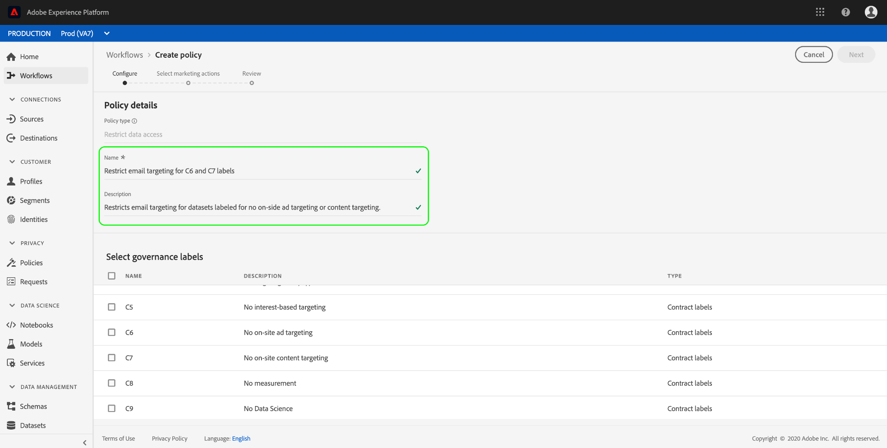

Next, select the data usage labels that the policy will be based on. When selecting multiple labels, you are given the option to choose whether the data should contain all the labels or just one of them in order for the policy to apply. Select **[!UICONTROL Next]** when finished.

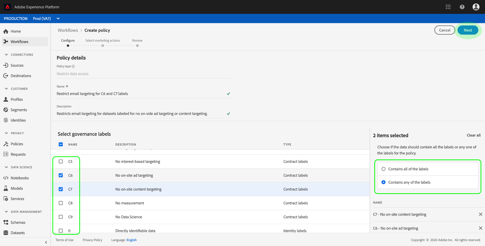

The **[!UICONTROL Select marketing actions]** step appears. Choose the appropriate marketing actions from the provided list, then select **[!UICONTROL Next]** to continue.

>[!NOTE]
>
>When selecting multiple marketing actions, the policy interprets them as an "OR" rule. In other words, the policy applies if **any** of the selected marketing actions are performed.

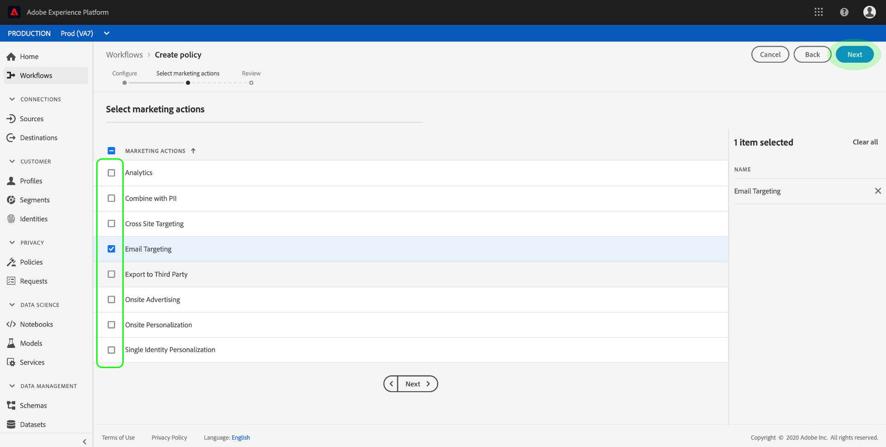

The **[!UICONTROL Review]** step appears, allowing you to review the details of the new policy before creating it. Once you are satisfied, select **[!UICONTROL Finish]** to create the policy.

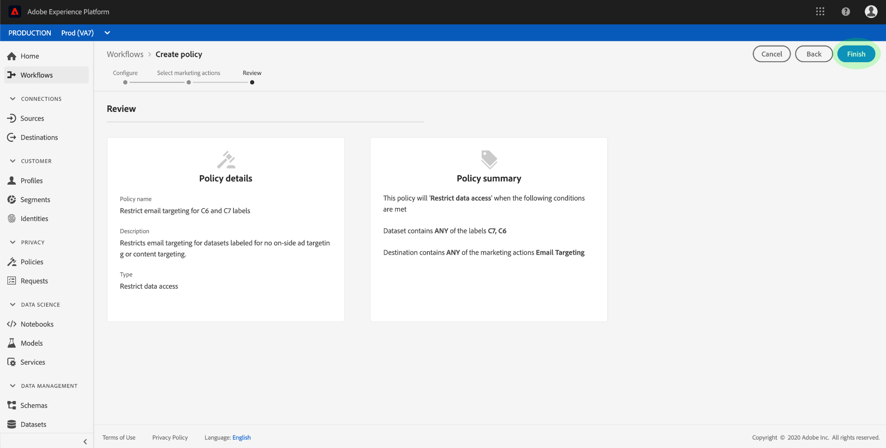

The **[!UICONTROL Browse]** tab reappears, which now lists the newly created policy in "Draft" status. To enable the policy, see the next section.

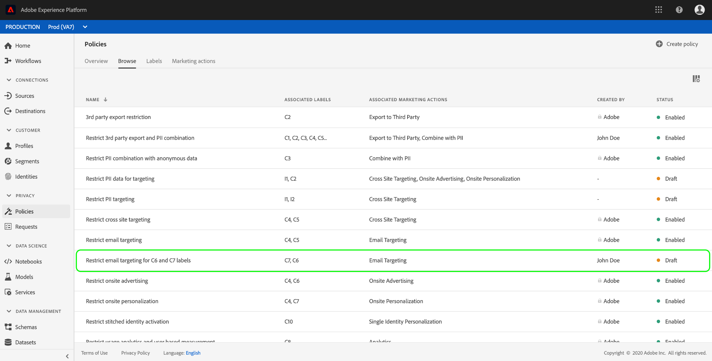

### Create a consent policy {#consent-policy}

>[!IMPORTANT]
>
>Consent policies are only available for organizations that have purchased **Adobe Healthcare Shield** or **Adobe Privacy & Security Shield**.

If you chose to create a consent policy, a new screen appears that allows you to configure the new policy.

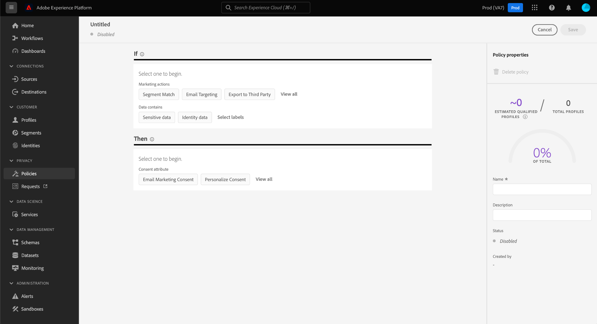

In order to make use of consent policies, you must have consent attributes present in your profile data. See the guide on [consent processing in Experience Platform](../../landing/governance-privacy-security/consent/adobe/overview.md) for detailed steps on how to include the required attributes in your union schema.

Consent policies are comprised of two logical components:

* **[!UICONTROL If]**: The condition that will trigger the policy check. This can be based on a certain marketing action being performed, the presence of certain data usage labels, or a combination of the two.
* **[!UICONTROL Then]**: The consent attributes that must be present for a profile to be included in the action that triggered the policy.

#### Configure conditions {#consent-conditions}

>[!CONTEXTUALHELP]
>id="platform_governance_policies_consentif"
>title="If condition"
>abstract="Start by defining the conditions which will trigger the policy check. Conditions can include certain marketing actions being taken, certain data governance labels being present, or a combination of both."

Under the **[!UICONTROL If]** section, select the marketing actions and/or data usage labels that should trigger this policy. Select **[!UICONTROL View all]** and **[!UICONTROL Select labels]** to view the full lists of available marketing actions and labels, respectively.

Once you have added at least one condition, you can select **[!UICONTROL Add condition]** to continue adding further conditions as necessary, choosing the appropriate condition type from the dropdown.

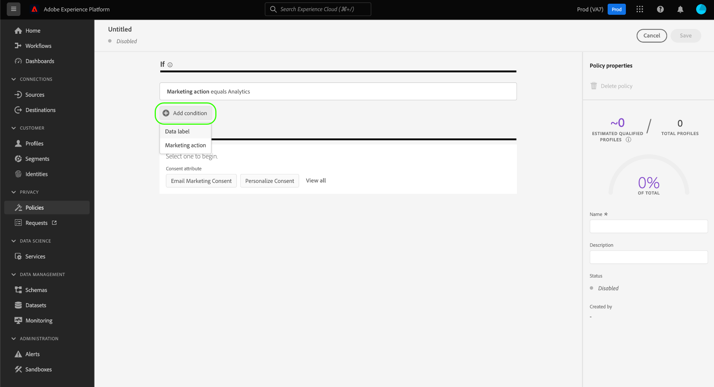

If you select more than one condition, you can use the icon that appears between them to switch the conditional relationship between "AND" and "OR".

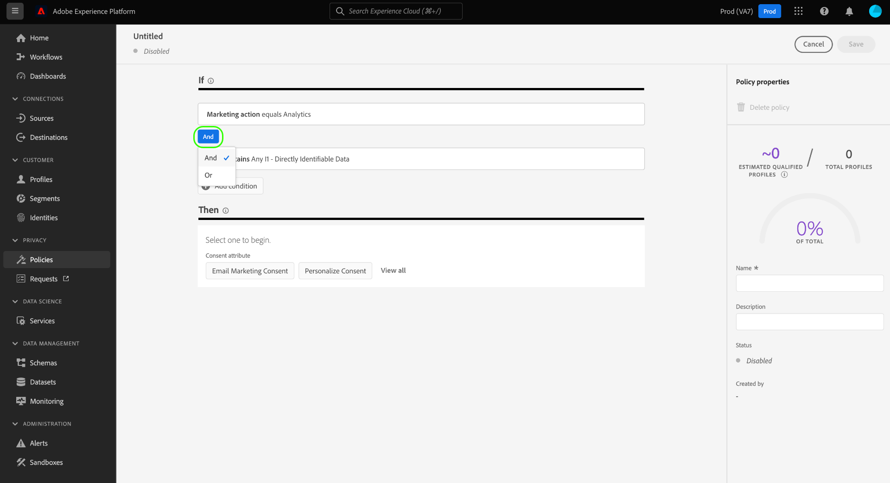

#### Select consent attributes {#consent-attributes}

>[!CONTEXTUALHELP]
>id="platform_governance_policies_consentthen"
>title="Then condition"
>abstract="Once your 'If' condition has been defined, use the 'Then' section to select at least one consent attribute from the union schema. This is the attribute that must be present in order for profiles to be included in the action governed by this policy."

Under the **[!UICONTROL Then]** section, select at least one consent attribute from the union schema. This is the attribute that must be present in order for profiles to be included in the action governed by this policy. You can choose one of the provided options from the list, or select **[!UICONTROL View all]** to choose the attribute directly from the union schema.

When selecting the consent attribute, choose the values for the attribute that you want this policy to check for. 

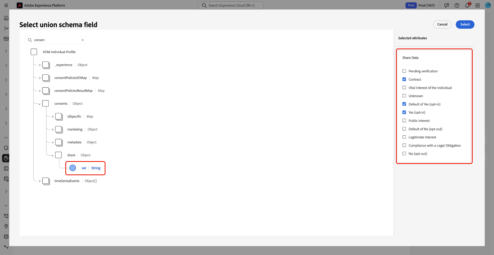

After you have selected at least one consent attribute, the **[!UICONTROL Policy properties]** panel updates to show the estimated number of profiles that would be allowed under this policy, including the percentage of the total profile store. This estimation automatically updates as you adjust the policy configuration.

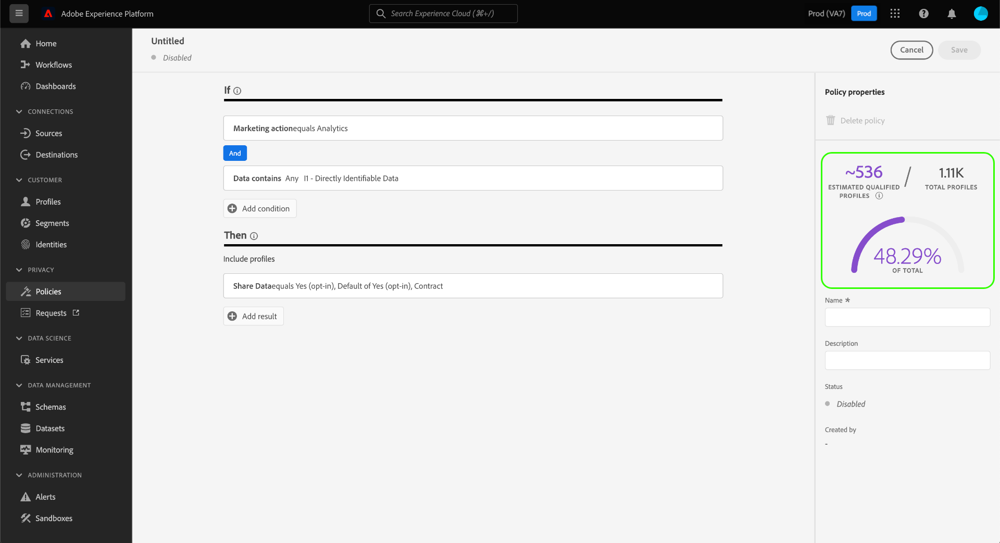

To add further consent attributes to the policy, select **[!UICONTROL Add result]**.

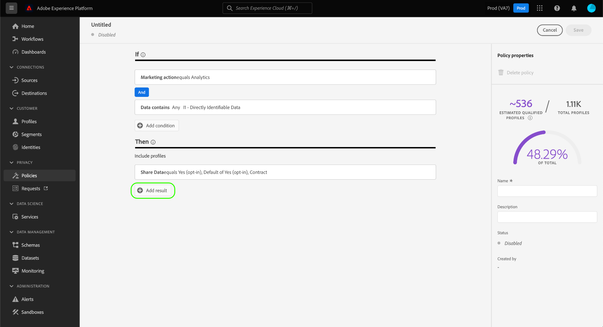

You can continue adding and adjusting conditions and consent attributes to the policy as needed. When you are satisfied with the configuration, provide a name and optional description for the policy before selecting **[!UICONTROL Save]**.

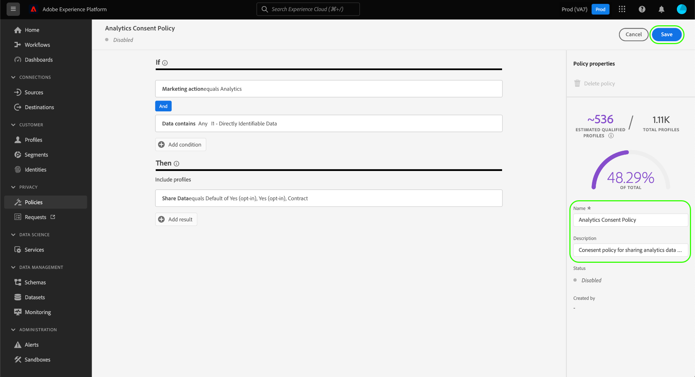

The consent policy is now created, and its status is set to [!UICONTROL Disabled] by default. To enable the policy right away, select the **[!UICONTROL Status]** toggle in the right rail.

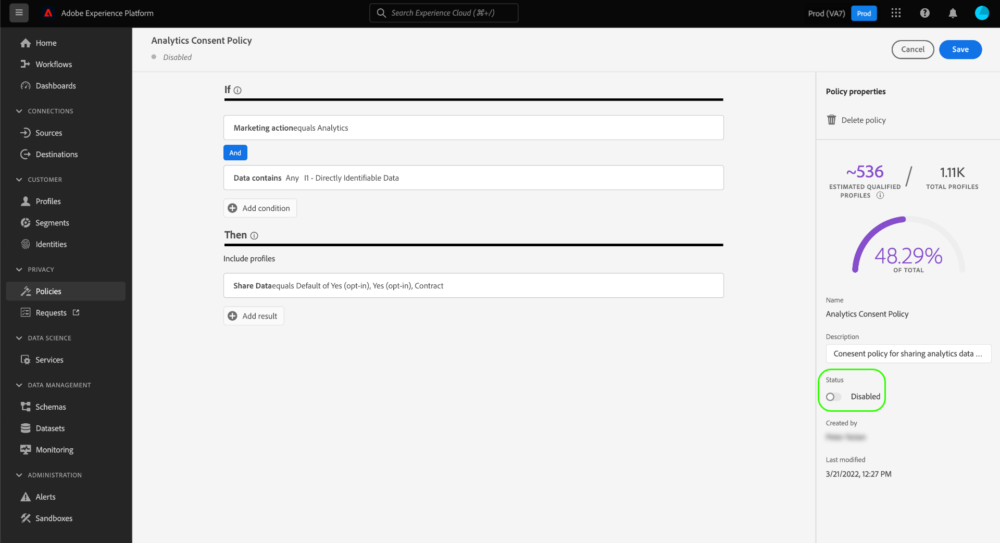

#### Verify policy enforcement

After you have created and enabled a consent policy, you can preview how it affects your consented audiences when activating segments to destinations. See the section on [consent policy evaluation](../enforcement/auto-enforcement.md#consent-policy-evaluation) for more information.

## Enable or disable a policy {#enable}

All data usage policies (including core policies provided by Adobe) are disabled by default. For an individual policy to be considered for enforcement, you must manually enable that policy through the API or UI.

You can enable or disable policies from the **[!UICONTROL Browse]** tab in the **[!UICONTROL Policies]** workspace. Select a custom policy from the list to display its details on the right. Under **[!UICONTROL Status]**, select the toggle button to enable or disable the policy.

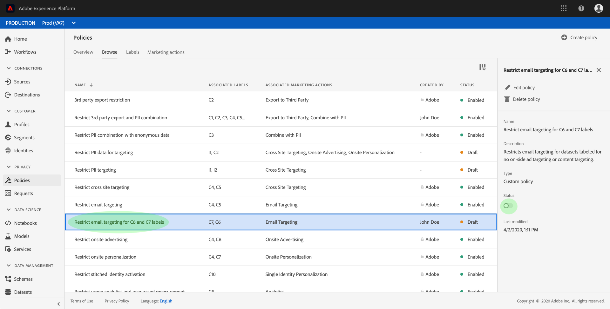

## View marketing actions {#view-marketing-actions}

In the **[!UICONTROL Policies]** workspace, select the **[!UICONTROL Marketing actions]** tab to view a list of available marketing actions defined by Adobe and your own organization.

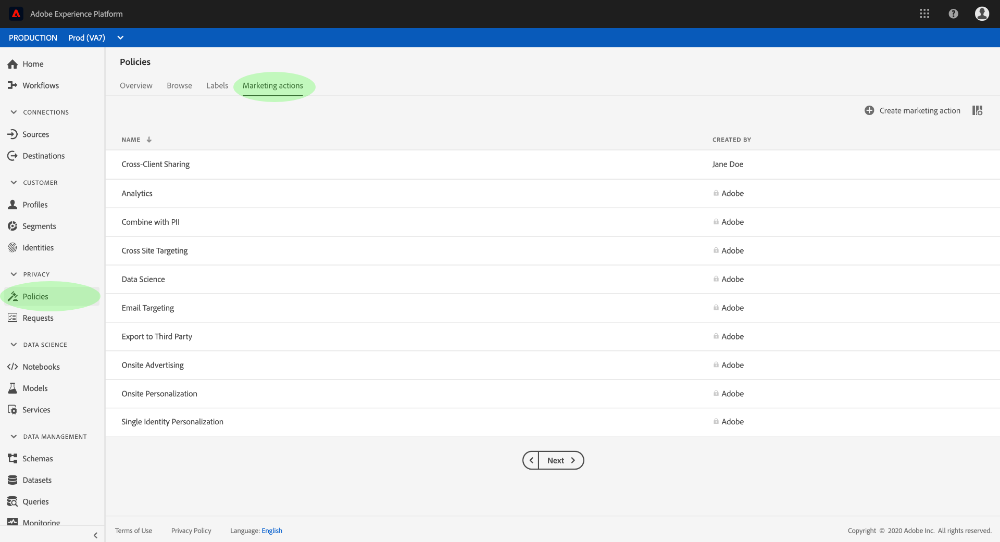

## Create a marketing action {#create-marketing-action}

To create a new custom marketing action, select **[!UICONTROL Create marketing action]** in the top-right corner of the **[!UICONTROL Marketing actions]** tab in the **[!UICONTROL Policies]** workspace.

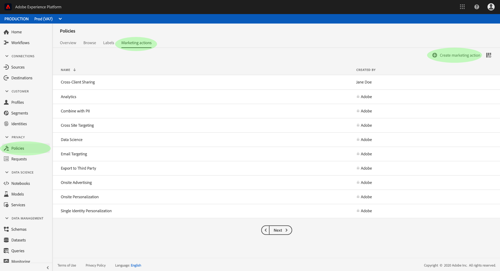

The **[!UICONTROL Create marketing action]** dialog appears. Enter a name and description for the marketing action, then select **[!UICONTROL Create]**.

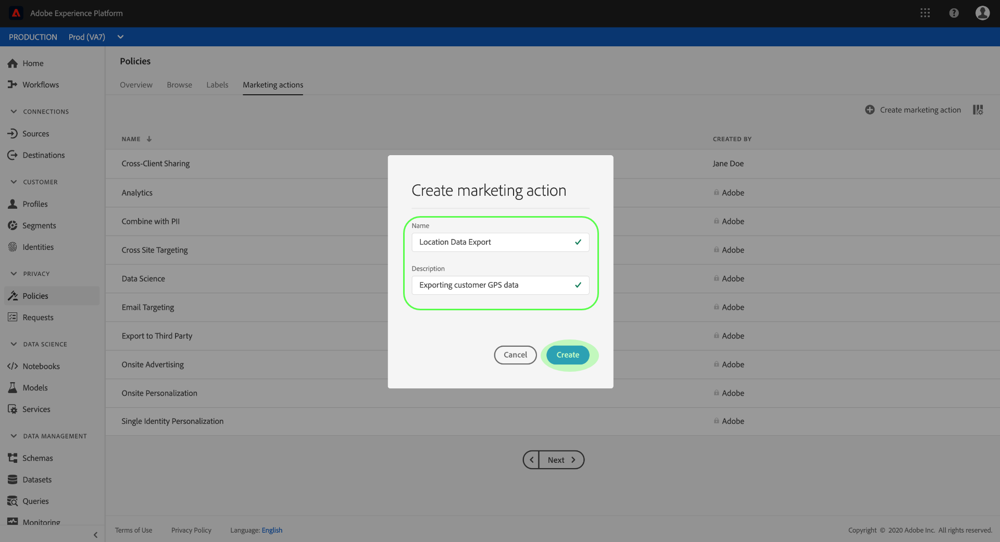

The newly created action appears in the **[!UICONTROL Marketing actions]** tab. You can now use the marketing action when [creating new data usage policies](#create-policy).

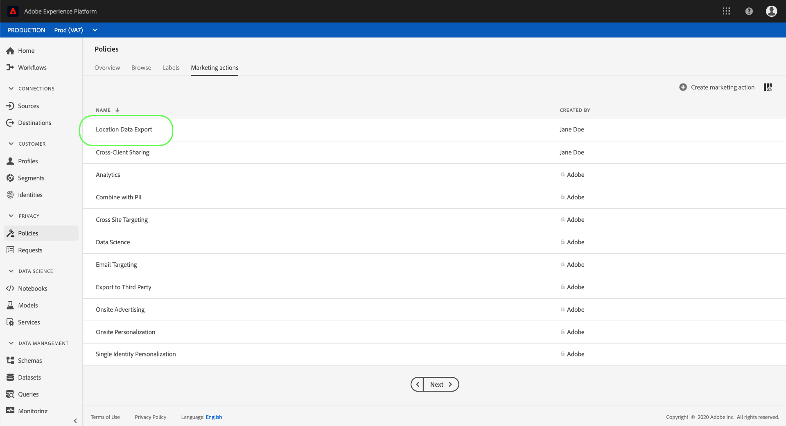

## Edit or delete a marketing action {#edit-delete-marketing-action}

>[!NOTE]
>
>Only custom marketing actions defined by your organization can be edited. Marketing actions defined by Adobe cannot be changed or deleted.

In the **[!UICONTROL Policies]** workspace, select the **[!UICONTROL Marketing actions]** tab to view a list of available marketing actions defined by Adobe and your own organization. Select a custom marketing action from the list, then used the provided fields in the right-hand section to edit the marketing action's details.

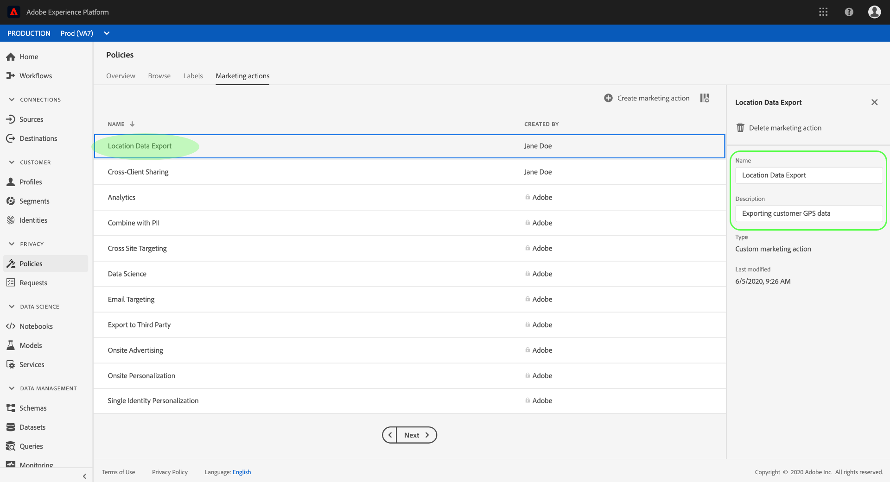

If the marketing action is not being used by any existing usage policies, you can delete it by selecting **[!UICONTROL Delete marketing action]**.

>[!NOTE]
>
>Attempting to delete a marketing action that is being used by an existing policy causes an error message to appear, indicating that the delete attempt failed.

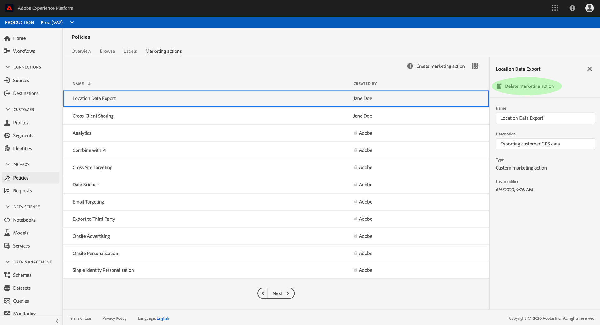

## Next steps

This document provided an overview of how to manage data usage policies in [!DNL Experience Platform] UI. For steps on how to manage policies using the [!DNL Policy Service API], see the [developer guide](../api/getting-started.md). For information on how to enforce data usage policies, see the [policy enforcement overview](../enforcement/overview.md).

The following video provides a demonstration of how to work with usage policies in the [!DNL Experience Platform] UI:

>[!VIDEO](https://video.tv.adobe.com/v/32977?quality=12&learn=on)
