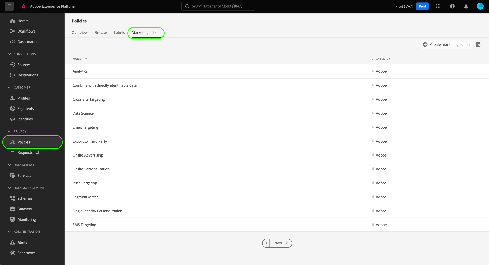
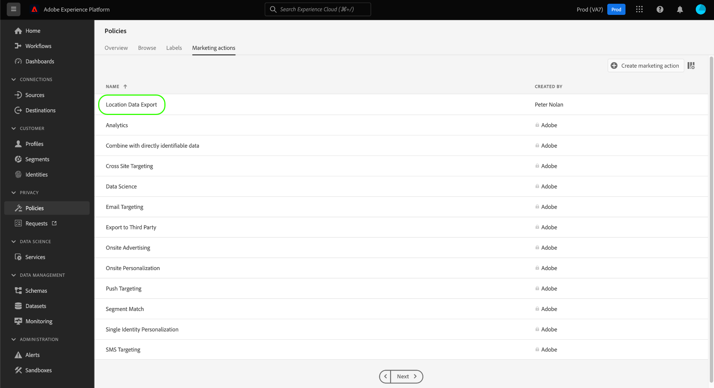

# Manage data usage policies in the UI

Adobe Experience Platform [!DNL Data Governance] provides a user interface that allows you to create and manage data usage policies. This document provides an overview of the actions you can perform in the **Policies** workspace in the [!DNL Experience Platform] user interface.

>[!IMPORTANT]
>
>All data usage policies (including core policies provided by Adobe) are disabled by default. In order for an individual policy to be considered for enforcement, you must manually enable that policy. See the section on [enabling policies](#enable) for steps on how to do this in the UI.

## Prerequisites

This guide requires a working understanding of the following [!DNL Experience Platform] concepts:

- [[!DNL Data Governance]](../home.md)
- [Data usage policies](./overview.md)

## View existing policies {#view-policies}

In the [!DNL Experience Platform] UI, select **[!UICONTROL Policies]** to open the **[!UICONTROL Policies]** workspace. In the **[!UICONTROL Browse]** tab, you can see a list of available policies, including their associated labels, marketing actions, and status.

Select a listed policy to view its description and type. If a custom policy is selected, additional controls are displayed to edit, delete, or [enable/disable the policy](#enable).

## Create a custom policy {#create-policy}

To create a new custom data usage policy, select **[!UICONTROL Create policy]** in the top-right corner of the **[!UICONTROL Browse]** tab in the **[!UICONTROL Policies]** workspace.

The **[!UICONTROL Create policy]** workflow appears. Start by providing a name and a description for the new policy.

Next, select the data usage labels that the policy will be based on. When selecting multiple labels, you are given the option to choose whether the data should contain all the labels or just one of them in order for the policy to apply. Select **[!UICONTROL Next]** when finished.

The **[!UICONTROL Select marketing actions]** step appears. Choose the appropriate marketing actions from the provided list, then select **[!UICONTROL Next]** to continue.

>[!NOTE]
>
>When selecting multiple marketing actions, the policy interprets them as an "OR" rule. In other words, the policy applies if **any** of the selected marketing actions are performed.

The **[!UICONTROL Review]** step appears, allowing you to review the details of the new policy before creating it. Once you are satisfied, select **[!UICONTROL Finish]** to create the policy.

The **[!UICONTROL Browse]** tab reappears, which now lists the newly created policy in "Draft" status. To enable the policy, see the next section.

## Enable or disable a policy {#enable}

All data usage policies (including core policies provided by Adobe) are disabled by default. In order for an individual policy to be considered for enforcement, you must manually enable that policy through the API or UI.

You can enable or disable policies from the **[!UICONTROL Browse]** tab in the **[!UICONTROL Policies]** workspace. Select a custom policy from the list to display its details on the right. Under **[!UICONTROL Status]**, select the toggle button to enable or disable the policy.

## View marketing actions {#view-marketing-actions}

In the **[!UICONTROL Policies]** workspace, select the **[!UICONTROL Marketing actions]** tab to view a list of available marketing actions defined by Adobe and your own organization.

## Create a marketing action {#create-marketing-action}

To create a new custom marketing action, select **[!UICONTROL Create marketing action]** in the top-right corner of the **[!UICONTROL Marketing actions]** tab in the **[!UICONTROL Policies]** workspace.

The **[!UICONTROL Create marketing action]** dialog appears. Enter a name and description for the marketing action, then select **[!UICONTROL Create]**.

The newly created action appears in the **[!UICONTROL Marketing actions]** tab. You can now use the marketing action when [creating new data usage policies](#create-policy).

## Edit or delete a marketing action {#edit-delete-marketing-action}

>[!NOTE]
>
>Only custom marketing actions defined by your organization can be edited. Marketing actions defined by Adobe cannot be changed or deleted.

In the **[!UICONTROL Policies]** workspace, select the **[!UICONTROL Marketing actions]** tab to view a list of available marketing actions defined by Adobe and your own organization. Select a custom marketing action from the list, then used the provided fields in the right-hand section to edit the marketing action's details.

If the marketing action is not being used by any existing usage policies, you can delete it by selecting **[!UICONTROL Delete marketing action]**.

>[!NOTE]
>
>Attempting to delete a marketing action that is being used by an existing policy will cause an error message to appear, indicating that the delete attempt failed.

## Next steps

This document provided an overview of how to manage data usage policies in [!DNL Experience Platform] UI. For steps on how to manage policies using the [!DNL Policy Service API], see the [developer guide](../api/getting-started.md). For information on how to enforce data usage policies, see the [policy enforcement overview](../enforcement/overview.md).

The following video provides a demonstration of how to work with usage policies in the [!DNL Experience Platform] UI:

>[!VIDEO](https://video.tv.adobe.com/v/32977?quality=12&learn=on)
