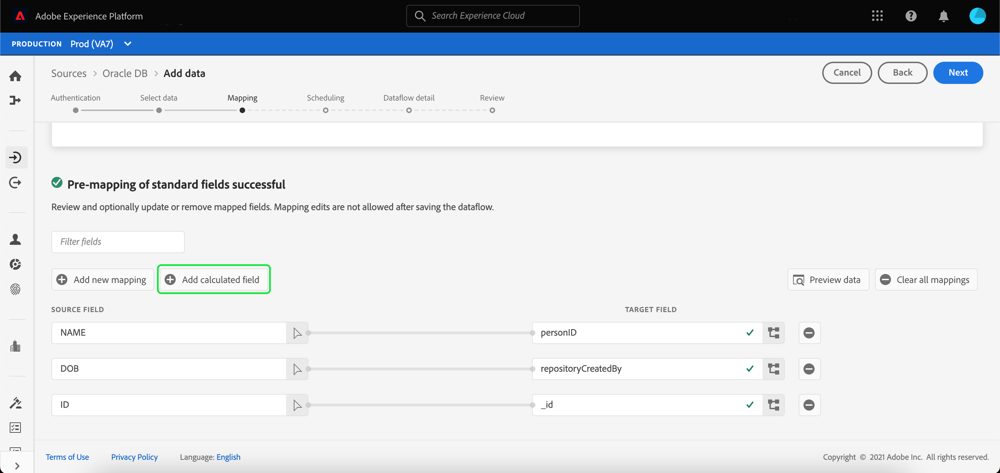
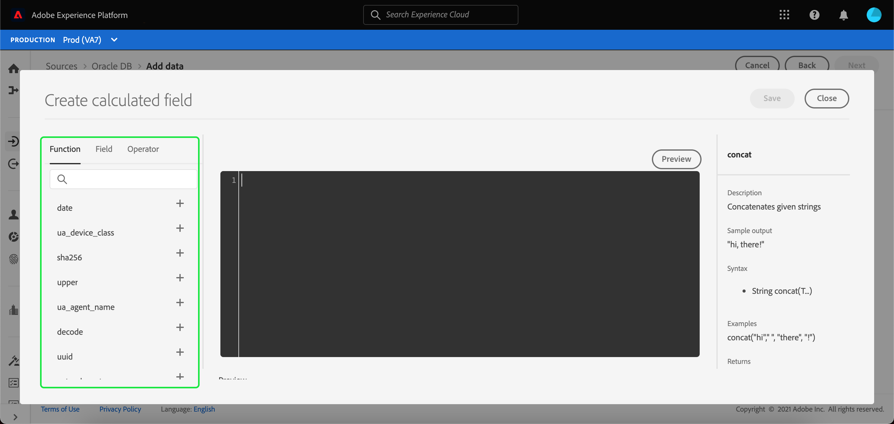
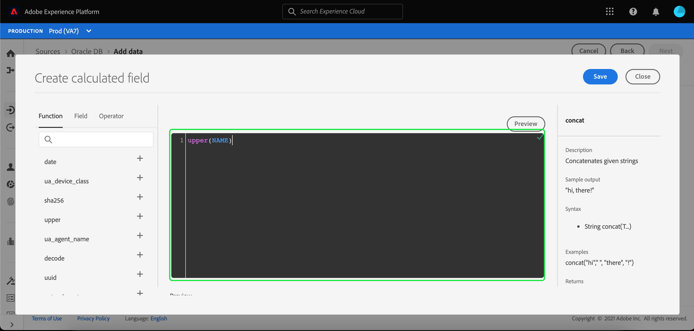
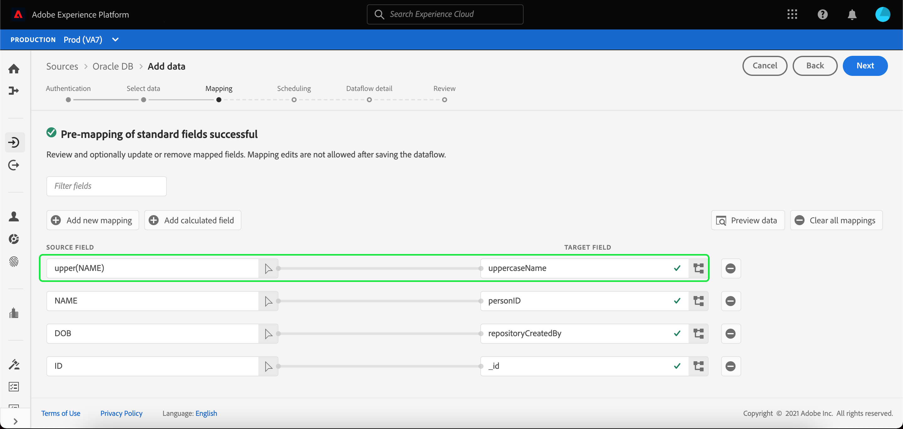

# Calculated fields

Calculated fields allow for values to be created based on the attributes in the input schema. These values can then be assigned to attributes in the target schema and be provided a name and description to allow for easier reference.

To create a calculated field, select **[!UICONTROL Add calculated field]**.

The **[!UICONTROL Create calculated field]** panel appears. The left dialog box contains the fields, functions, and operators supported in calculated fields. Select one of the tabs to start adding functions, fields, or operators to the expression editor.

| Tab | Description |
| --- | ----------- |
| Function | The functions tab lists the functions available to transform the data. To learn more about the functions you can use within calculated fields, please read the guide on [using Data Prep (Mapper) functions](./functions.md). |
| Field | The fields tab lists fields and attributes available in the source schema. |
| Operator | The operators tab lists the operators that are available to transform the data. |

You can manually add fields, functions, and operators using the expression editor at the center. Select the editor to start creating an expression.

Select **[!UICONTROL Save]** to proceed.

The mapping screen reappears with your newly created source field. Apply the appropriate corresponding target field and select **[!UICONTROL Finish]** to complete the mapping.

