# Data Prep UI Guide {#data-prep-ui-guide}

>[!CONTEXTUALHELP]
>id="platform_data_prep_import_mapping"
>title="Download Template"
>abstract="Download the csv template to perform the mapping offline."

Read this guide to learn how to use [data prep](../home.md) mapping functions in the Adobe Experience Platform user interface to map CSV files to an [Experience Data Model (XDM) schema](../../xdm/home.md).

## Get Started

This tutorial requires a working understanding of the following Experience Platform components:

* [[!DNL Experience Data Model (XDM)] System](../../xdm/home.md): The standardized framework by which Experience Platform organizes customer experience data.
  * [Basics of schema composition](../../xdm/schema/composition.md): Learn about the basic building blocks of XDM schemas, including key principles and best practices in schema composition.
  * [Schema Editor tutorial](../../xdm/tutorials/create-schema-ui.md): Learn how to create custom schemas using the Schema Editor UI.
* [Identity Service](../../identity-service/home.md): Gain a better view of individual customers and their behavior by bridging identities across devices and systems.
* [[!DNL Real-Time Customer Profile]](../../profile/home.md): Provides a unified, real-time consumer profile based on aggregated data from multiple sources.
* [Sources](../../sources/home.md): Experience Platform allows data to be ingested from various sources while providing you with the ability to structure, label, and enhance incoming data using Experience Platform services.

## Access the mapping interface in the UI

You can access the mapping interface in the UI through two different pathways.

1. In the Experience Platform UI, select **[!UICONTROL Workflows]** from the left-navigation and then select **[!UICONTROL Map CSV to XDM schema]**. Next, provide your dataflow details and select the data that you want to ingest. When finished, you are taken to the mapping interface where you can configure mapping between your source data and an XDM schema.
2. You can also access the mapping interface through the sources workspace.

## Map CSV files into an XDM schema

Use the mapping interface and the comprehensive toolset that it provides to successfully map data fields from your source schema to their appropriate target XDM fields in the target schema.

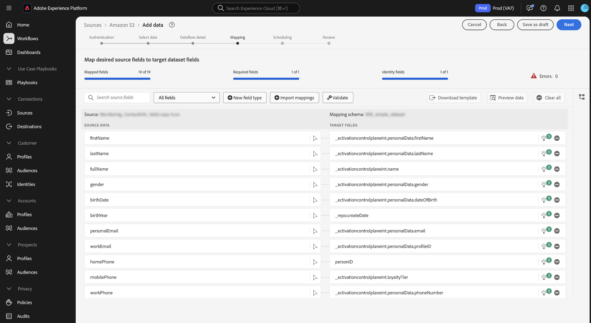

### Understanding the mapping interface {#mapping-interface}

Refer to the dashboard at the top of the interface for information on the health of your mapping fields within the context of the ingestion workflow. The dashboard displays the following details regarding your mapping fields:

| Property | Description |
| --- | --- |
| [!UICONTROL Mapped fields] | Displays the total number of source fields that have been mapped to a target XDM field, regardless of errors. |
| [!UICONTROL Required fields] | Displays the number of required mapping fields. |
| [!UICONTROL Identity fields] | Displays the total number of mapping fields defined as identity. These mapping fields are represented by a fingerprint icon. |
| [!UICONTROL Errors] | Displays the number of erroneous mapping fields. |

{style="table-layout:auto"}

Next, you can use the options listed in the header to better interact or filter through your mapping fields.

| Option | Description |
| --- | --- |
| [!UICONTROL Search source fields] | Use the search bar to navigate to a specific source field. |
| [!UICONTROL All fields] | Select **[!UICONTROL All fields]** to view a dropdown menu of options to filter your mappings by. The available filtering options include:<ul><li>**[!UICONTROL Required fields]**: Filters the interface to display only fields required to complete the workflow.</li><li> **[!UICONTROL Identity fields]**: Filters the interface to display only fields marked as identities.</li><li>**[!UICONTROL Mapped fields]**: Filters the interface to display only fields that have already been mapped.</li><li>**[!UICONTROL Unmapped fields]**: Filters the interface to display only fields that have yet to be mapped.</li><li>**[!UICONTROL Fields with errors]**: Filters the interface to display only fields that have errors.</li></ul> |
| [!UICONTROL New field type] | Select **[!UICONTROL New field type]** to either add a new field or a calculated field. For more information, read the section on [adding a new field type](#add-a-new-field-type). |
| [!UICONTROL Import mappings] | Select **[!UICONTROL Import mappings]** to import mappings from an existing file or dataflow. For more information, read the section on [importing mappings](#import-mapping). |
| [!UICONTROL Validate] | Select **[!UICONTROL Validate]** to check for errors in your mappings. |
| [!UICONTROL Download template] | Select **[!UICONTROL Download template]** to export and download a CSV file of your mappings. |
| [!UICONTROL Preview data] | Select **[!UICONTROL Preview data]** to use the preview panel and inspect the structure and contents of your source dataset. |
| [!UICONTROL Clear all] | Select **[!UICONTROL Clear all]** to delete all mappings in the interface. |

{style="table-layout:auto"}

### Add a new field type {#add-a-new-field-type}

You can add a new mapping field or a calculated field by selecting **[!UICONTROL New field type]**.

#### New mapping field

To add a new mapping field, select **[!UICONTROL New field type]** and then select **[!UICONTROL Add new field]** from the dropdown menu that appears.

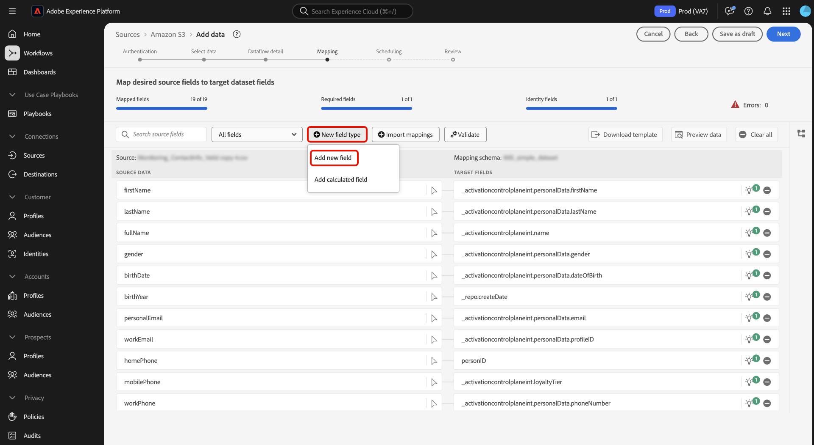

Next, select the source field you would like to add from the source schema tree that appears and then select **[!UICONTROL Select]**.

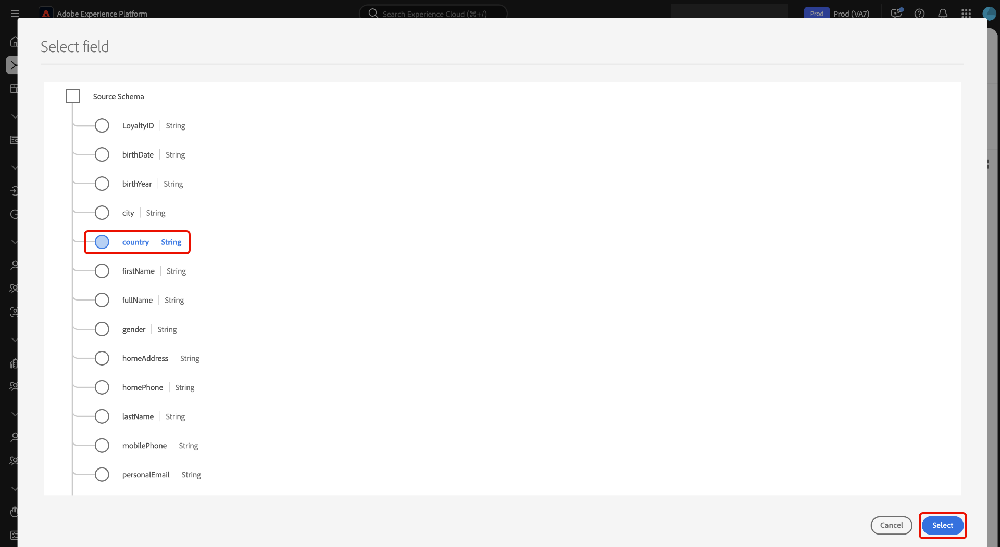

The mapping interface updates with the source field you selected and an empty target field. Select **[!UICONTROL Map target field]** to start mapping the new source field to its appropriate target XDM field.

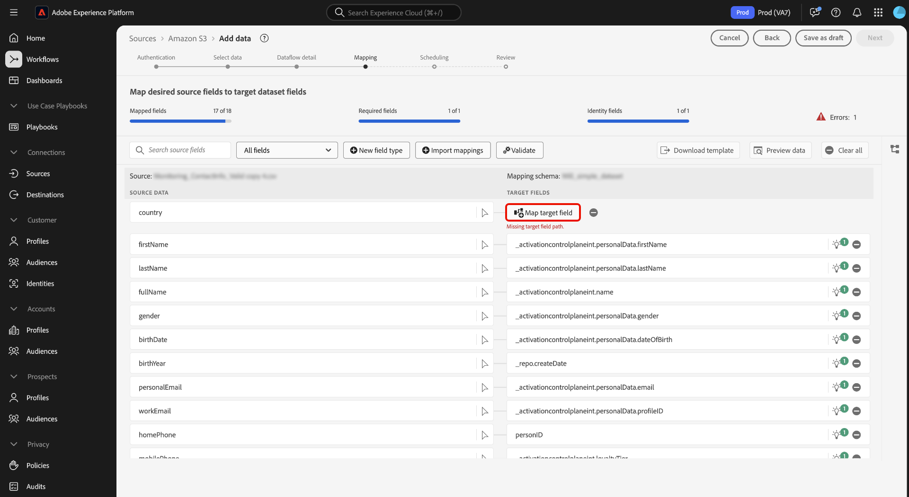

An interactive target schema tree appears, allowing you to manually traverse through the target schema and find the appropriate target XDM field for your source field.

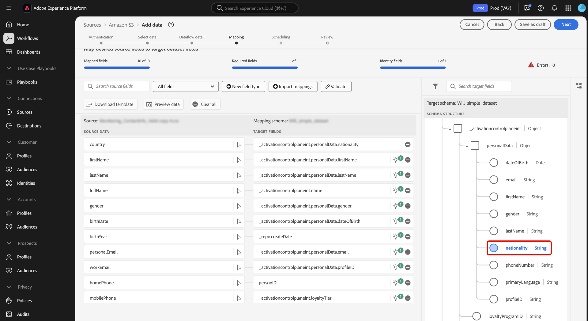

#### Calculated fields {#calculated-fields}

Calculated fields allow for values to be created based on the attributes in the input schema. These values can then be assigned to attributes in the target schema and be provided a name and description to allow for easier reference. Calculated fields have a maximum length of 4096 characters.

To create a calculated field, select **[!UICONTROL New field type]** and then select **[!UICONTROL Add calculated field]**

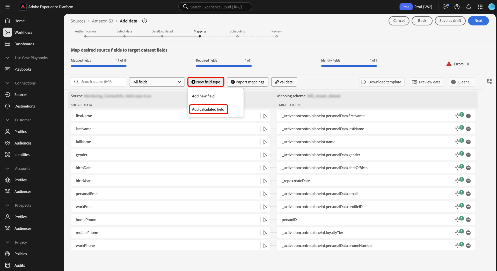

The **[!UICONTROL Create calculated field]** window appears. Use the interface to input your calculated fields and refer to the dialog box on the left for supported fields, functions, and operators. 

| Tab | Description |
| --- | ----------- |
| [!UICONTROL Function] | The functions tab lists the functions available to transform the data. To learn more about the functions you can use within calculated fields, please read the guide on [using Data Prep (Mapper) functions](../functions.md). |
| [!UICONTROL Field] | The fields tab lists fields and attributes available in the source schema. |
| [!UICONTROL Operator] | The operators tab lists the operators that are available to transform the data. |

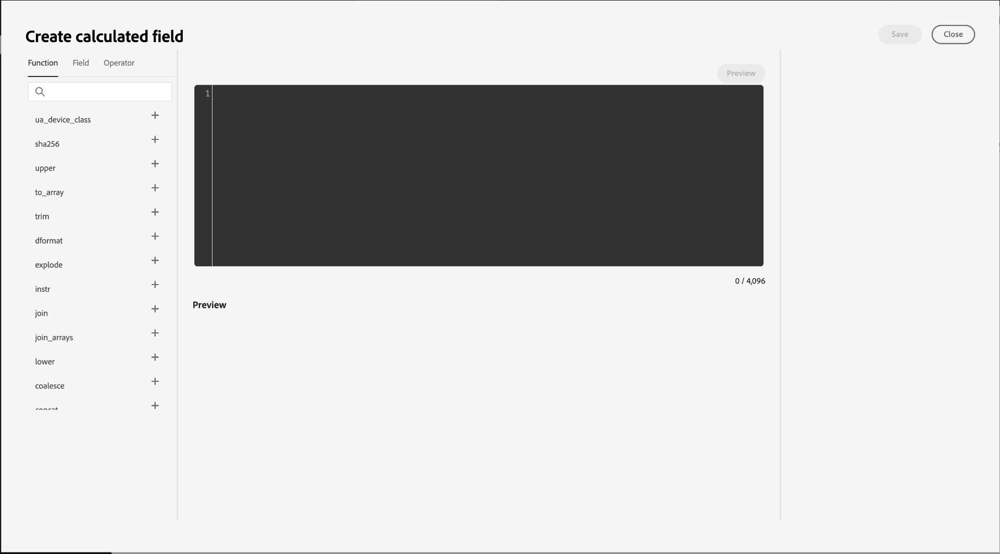

You can manually add fields, functions, and operators using the expression editor at the center. Select the editor to start creating an expression. Once you are finished, select **[!UICONTROL Save]** to proceed.

### Import mapping {#import-mapping}

You can reduce the manual configuration time of your data ingestion process and limit mistakes by using the import mapping functionality of data prep. You can import mappings from an existing flow or from an exported file.

>[!BEGINTABS]

>[!TAB Import mapping from flow]

If you have several dataflows based on similar source files and target schemas, then you can import existing mapping and reuse them for new dataflows.

To import mapping from an existing dataflow, select **[!UICONTROL Import mappings]** and then select **[!UICONTROL Import mapping from flow]**.

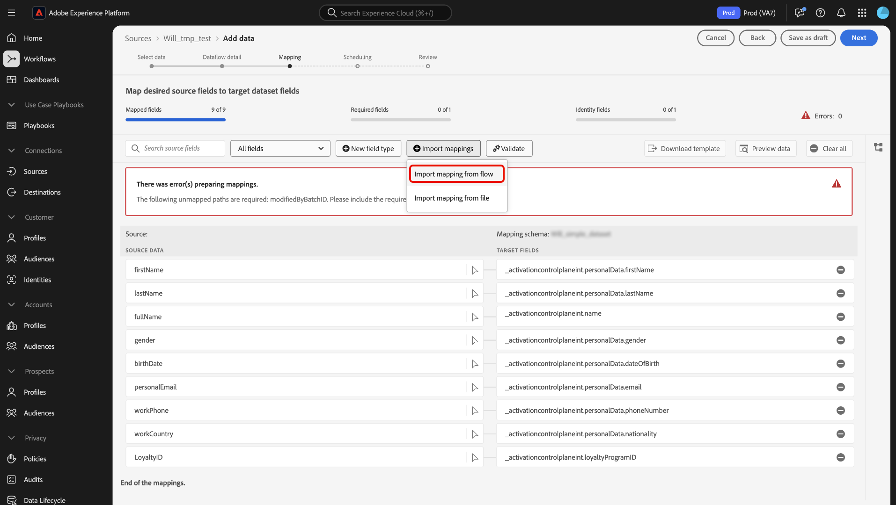

Next, use the pop-up window to locate the dataflow whose mapping you want to import. During this step, you can also use the search function to isolate a specific dataflow and retrieve it's mappings. When finished, select **[!UICONTROL Select]**.

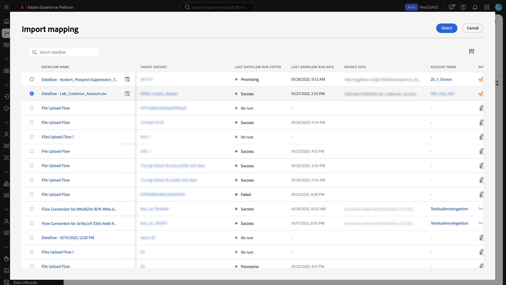

>[!TAB Import mapping from file]

In some cases, you may need to implement a large number of mappings for your data. You can do this manually with the mapping interface, but you can also export your mapping template and configure your mappings on an offline spreadsheet to save time and avoid user timeouts on Experience Platform.

To import mapping from an exported file, select **[!UICONTROL Import mappings]** and then select **[!UICONTROL Import mapping from file]**.

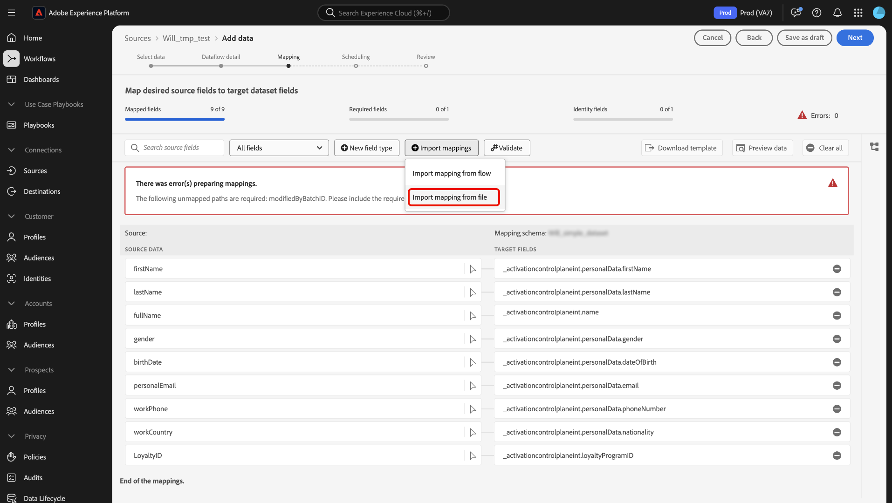

Next, use [!UICONTROL Upload template] window to download a CSV copy of your mappings. You can then configure your mappings locally on your device, using any software that support editing CSV file types. During this step, you must ensure that you are using only the fields that are provided in your source file and target schema. 

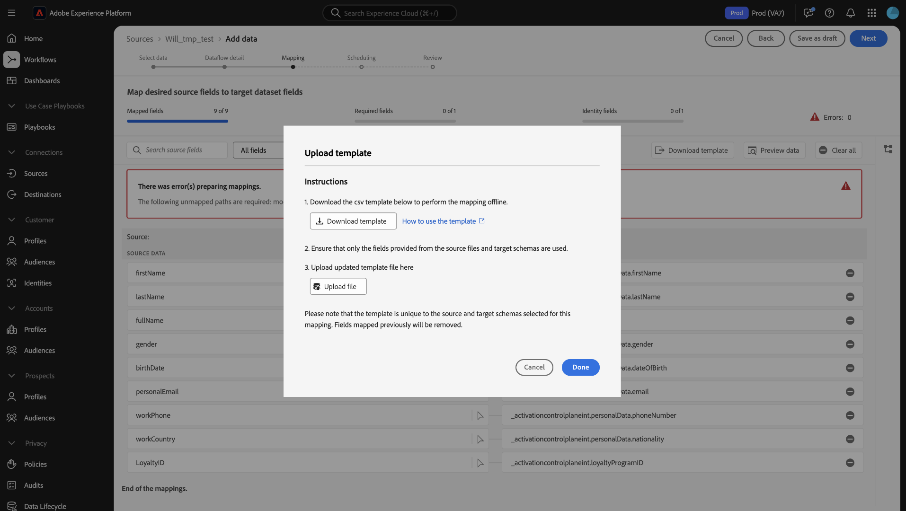

+++Select to view an example of an exported mapping file

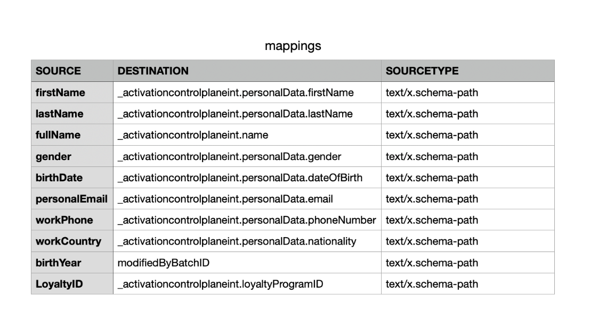

+++

When finished, select **[!UICONTROL Upload file]** and select the updated csv file of your mappings. Allow for a brief moment for the system to process, and then select **[!UICONTROL Done]**.

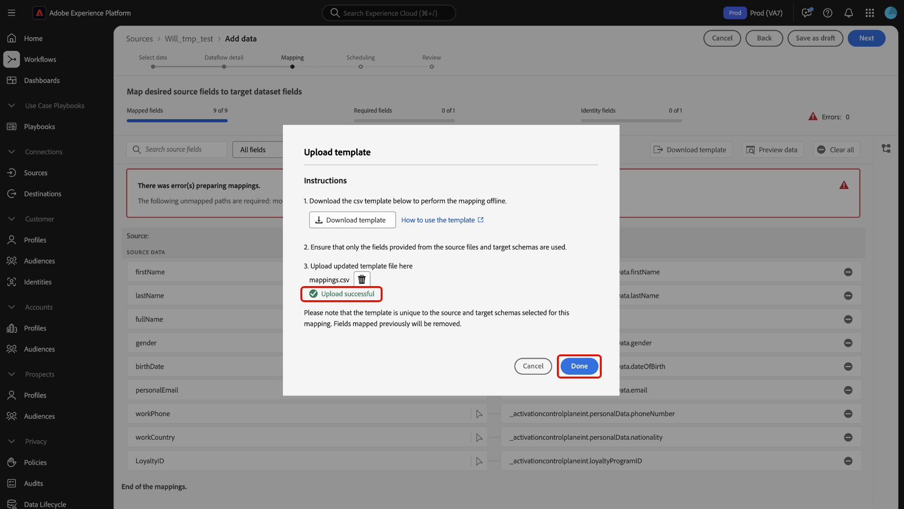

>[!ENDTABS]

With your mappings complete, you can now select **[!UICONTROL Finish]** and proceed to the next step to complete your dataflow.

>[!TIP]
>
>After you finish creating your mappings, wait up to 10 minutes before starting data ingestion. This waiting period ensures that your new mappings are fully saved and available in the system.

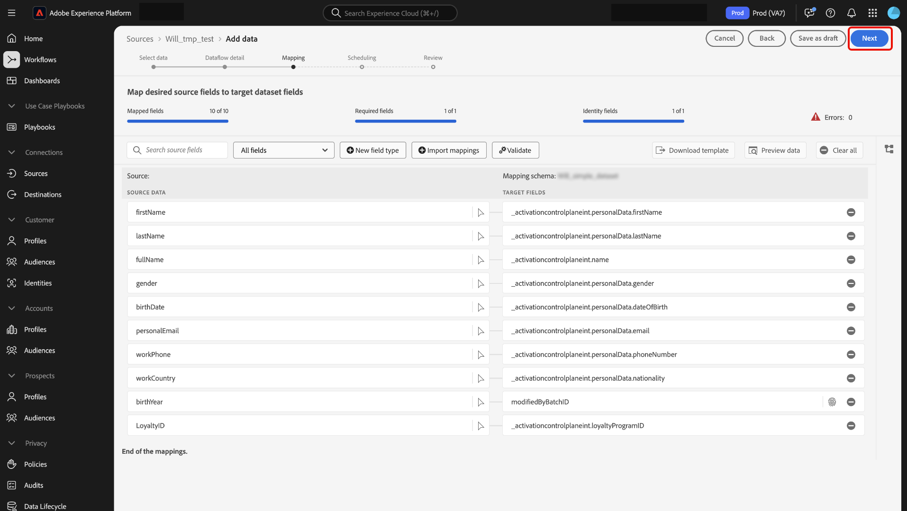

## Next steps

You now can successfully map a CSV file to a target XDM schema using the mapping interface in the Experience Platform UI. For more information, read the following documents:

* [Data Prep overview](../home.md)
* [Sources overview](../../sources/home.md)
* [Monitor sources dataflows in the UI](../../dataflows/ui/monitor-sources.md)
