# Data Prep UI Guide

This document provides steps on how to use data prep functions in the Platform UI to map CSV files to an XDM schema.

## Getting started

This tutorial requires a working understanding of the following components of Platform:

* [[!DNL Experience Data Model (XDM)] System](../../xdm/home.md): The standardized framework by which Platform organizes customer experience data.
  * [Basics of schema composition](../../xdm/schema/composition.md): Learn about the basic building blocks of XDM schemas, including key principles and best practices in schema composition.
  * [Schema Editor tutorial](../../xdm/tutorials/create-schema-ui.md): Learn how to create custom schemas using the Schema Editor UI.
* [Identity Service](../../identity-service/home.md): Gain a better view of individual customers and their behavior by bridging identities across devices and systems.
* [[!DNL Real-time Customer Profile]](../../profile/home.md): Provides a unified, real-time consumer profile based on aggregated data from multiple sources.
* [Sources](../../sources/home.md): Experience Platform allows data to be ingested from various sources while providing you with the ability to structure, label, and enhance incoming data using Platform services.

## Mapping

The **[!UICONTROL mapping]** interface provides you with a comprehensive tool to map source fields from your source schema to their appropriate target XDM fields in the target schema.

### Understanding the mapping interface

The mapping interface includes a dashboard that provides information on the health of your mapping sets within the context of the ingestion workflow. The dashboard displays the following details regarding your mapping sets:

| Property | Description |
| --- | --- |
| Mapped fields | Displays the total number of source fields that have been mapped to a target XDM field, regardless of errors. |
| Required fields | Displays the number of required mapping fields. |
| Identity fields | Displays the total number of mapping sets defined as identity. These mapping sets are represented by a fingerprint icon. |
| Errors | Displays the number of erroneous mapping sets. |

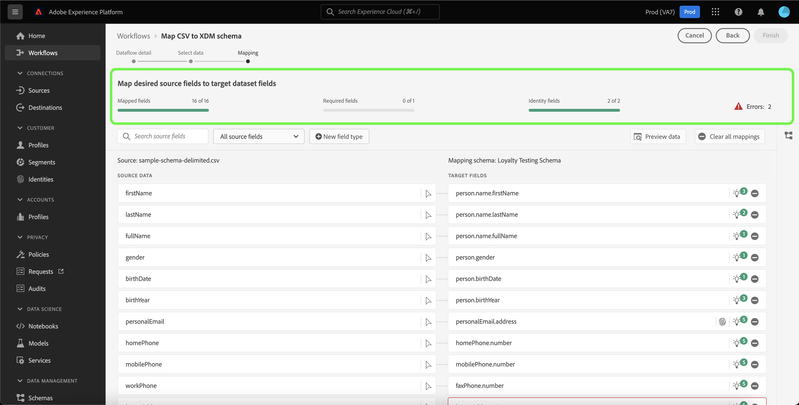

The mapping interface also provides a panel of options that you can choose from to better interact or filter through your mapping sets.

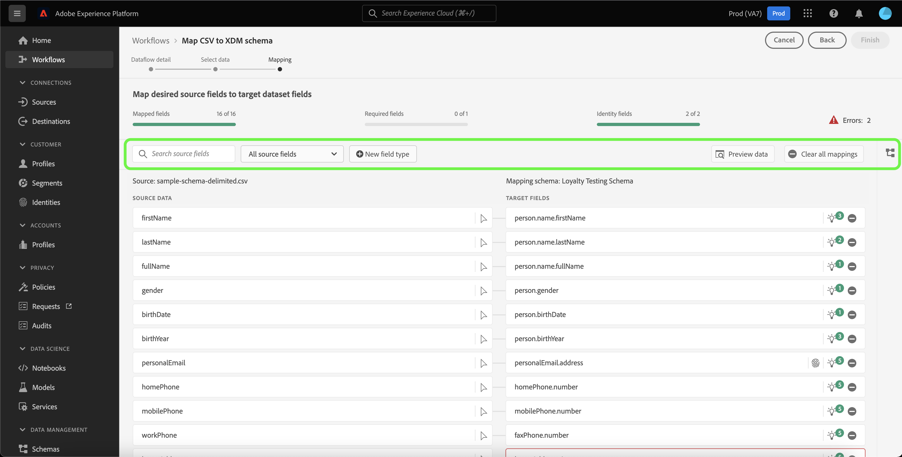

To search for a particular mapping set, select **[!UICONTROL Search source fields]** and enter the name of the source data that you want to isolate.

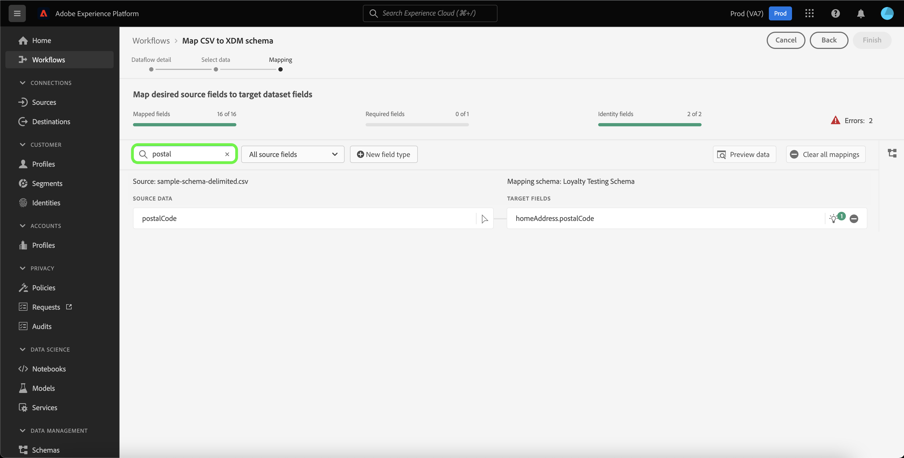

Select **[!UICONTROL All source fields]** to see a dropdown menu of filtering options to better narrow down your view of the mapping interface.

The filtering options are:

| Source fields | Description |
| --- | --- |
| [!UICONTROL All source fields] | This option displays all of the source fields of your source  schema. This option is displayed by default. |
| [!UICONTROL Required fields] | This option filters the source schema to only display the fields required to complete the mapping. |
| [!UICONTROL Identity fields] | This option filters the source schema to only display the fields marked for Identity. |
| [!UICONTROL Mapped fields] | This option filters the source schema to only display the fields that have already been mapped. |
| [!UICONTROL Unmapped fields] | This option filters the source schema to only display the fields that have yet to be mapped. |
| [!UICONTROL Fields with recommendation] | This option filters the source schema to only display the fields that contain mapping recommendations. |

Select **[!UICONTROL Fields with errors]** to see all mapping sets with errors.

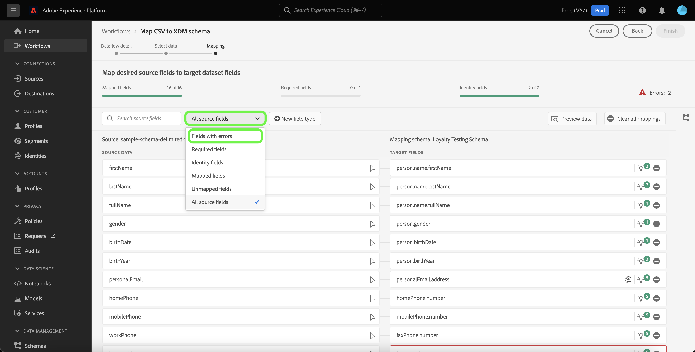

An isolated view of erroneous mapping sets appears, allowing you to address errors through intelligent mapping recommendations or through the manual mapping tree.

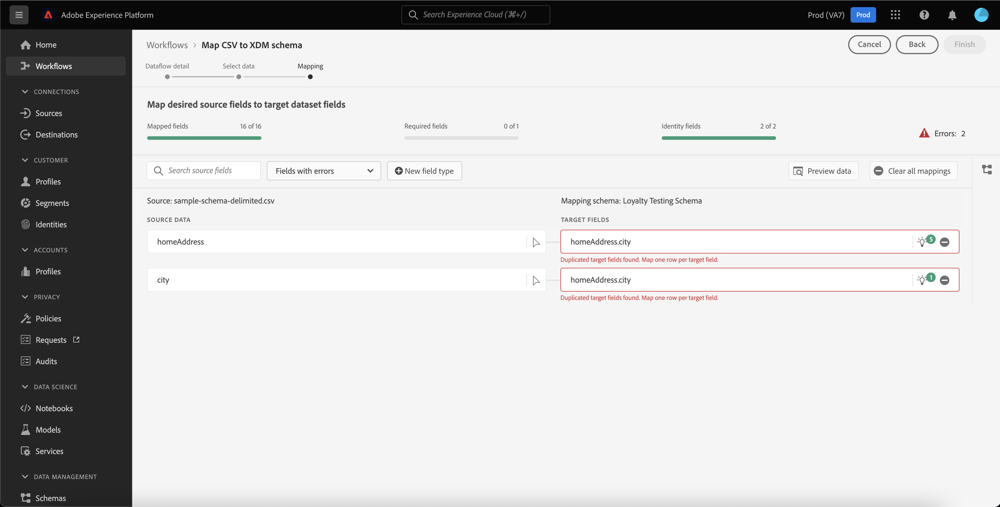

### Add a new field type

You can add a new mapping field or a calculated field by selecting **[!UICONTROL New field type]**.

#### New mapping field

To add a new mapping field, select **[!UICONTROL New field type]** and then select **[!UICONTROL Add new field]** from the dropdown menu that appears.

Next, select the source field you would like to add from the source schema tree that appears and then select **[!UICONTROL Select]**.

The mapping interface updates with the source field you selected and an empty target field. Select **[!UICONTROL Map target field]** to start mapping the new source field to its appropriate target XDM field.

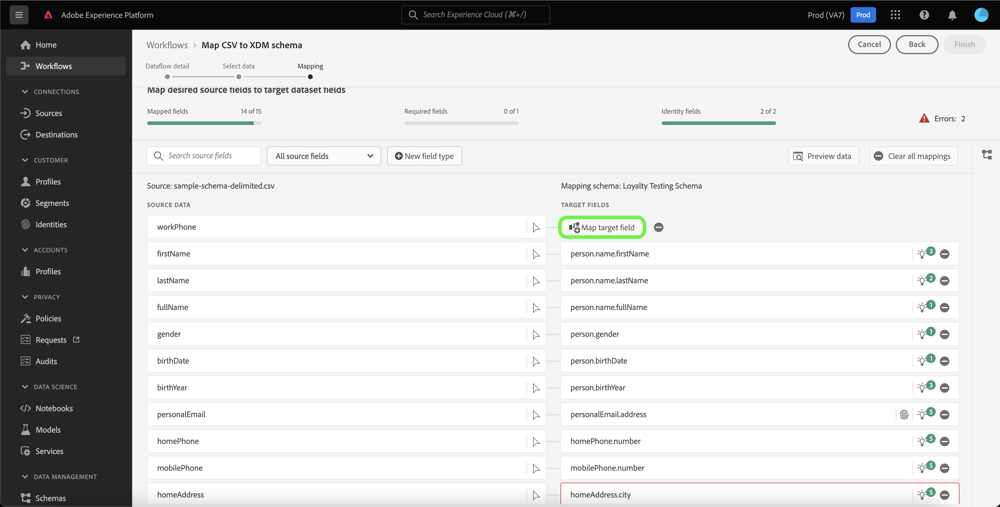

An interactive target schema tree appears, allowing you to manually traverse through the target schema and find the appropriate target XDM field for your source field.

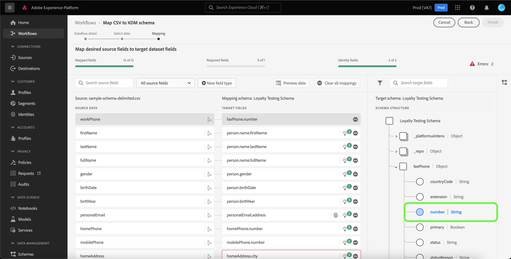

When finished, select the schema icon to close the target schema interface. 

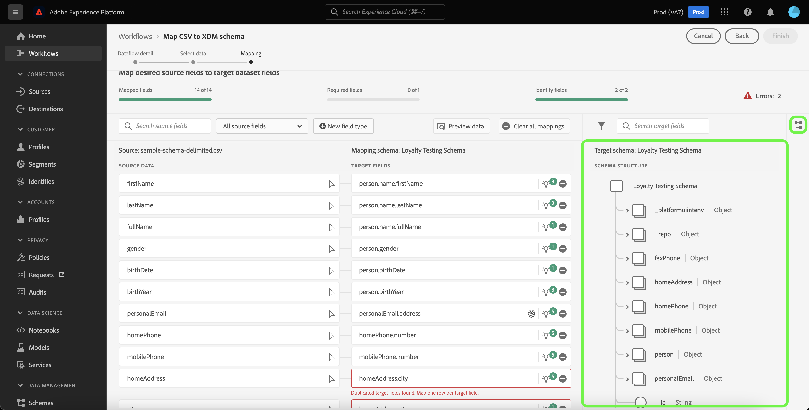

#### Calculated fields {#calculated-fields}

Calculated fields allow for values to be created based on the attributes in the input schema. These values can then be assigned to attributes in the target schema and be provided a name and description to allow for easier reference.

To create a calculated field, select **[!UICONTROL New field type]** and then select **[!UICONTROL Add calculated field]**

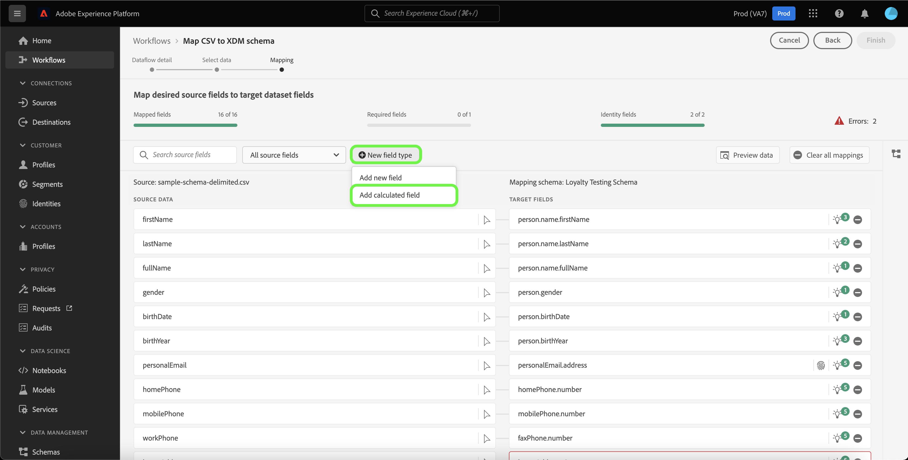

The **[!UICONTROL Create calculated field]** panel appears. The left dialog box contains the fields, functions, and operators supported in calculated fields. Select one of the tabs to start adding functions, fields, or operators to the expression editor.

| Tab | Description |
| --- | ----------- |
| Function | The functions tab lists the functions available to transform the data. To learn more about the functions you can use within calculated fields, please read the guide on [using Data Prep (Mapper) functions](../functions.md). |
| Field | The fields tab lists fields and attributes available in the source schema. |
| Operator | The operators tab lists the operators that are available to transform the data. |

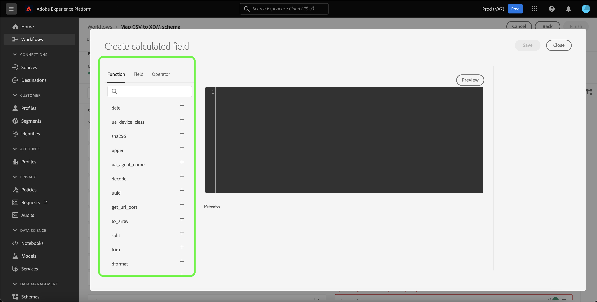

You can manually add fields, functions, and operators using the expression editor at the center. Select the editor to start creating an expression. Once you are finished, select **[!UICONTROL Save]** to proceed.

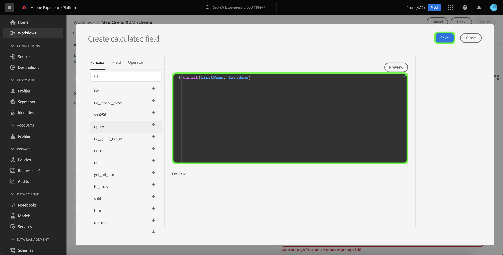

Select **[!UICONTROL Preview data]** to see mapping results of up to 100 rows of sample data from the selected dataset.

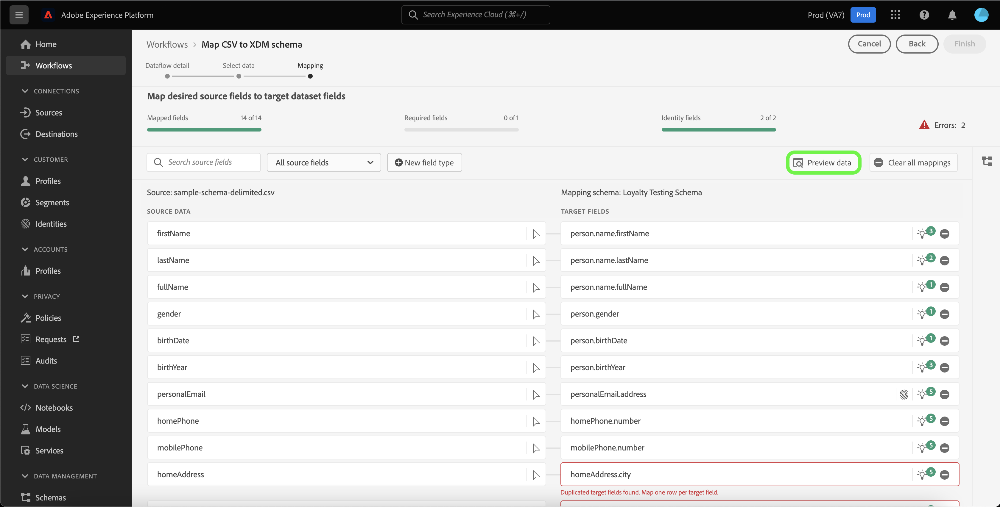

During the preview, the identity column is prioritized as the first field, as it is the key information necessary when validating mapping results. When finished, select **[!UICONTROL Close]**.

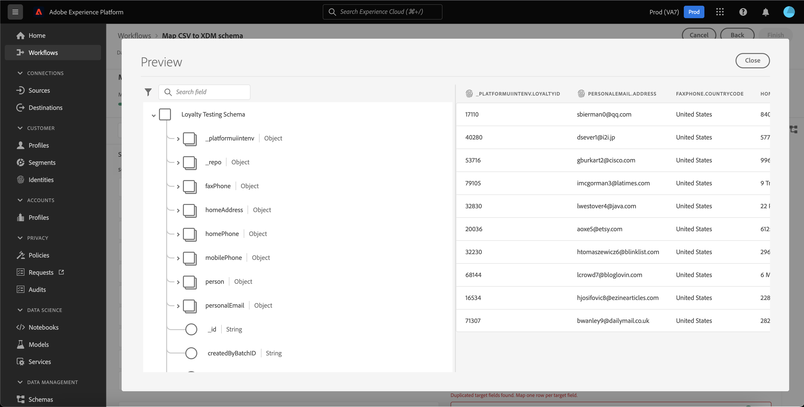

To remove all mapping sets, select **[!UICONTROL Clear all mappings]**.

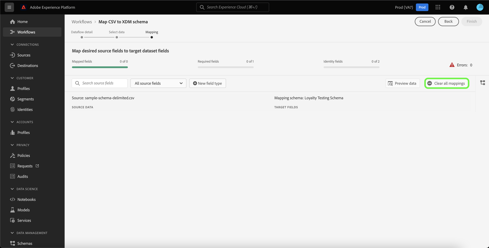

### Using the mapping interface

Platform automatically provides intelligent recommendations for auto-mapped fields based on the target schema or dataset that you selected. You can manually adjust mapping rules to suit your use cases or fix any duplicated mapping sets to clear any errors.

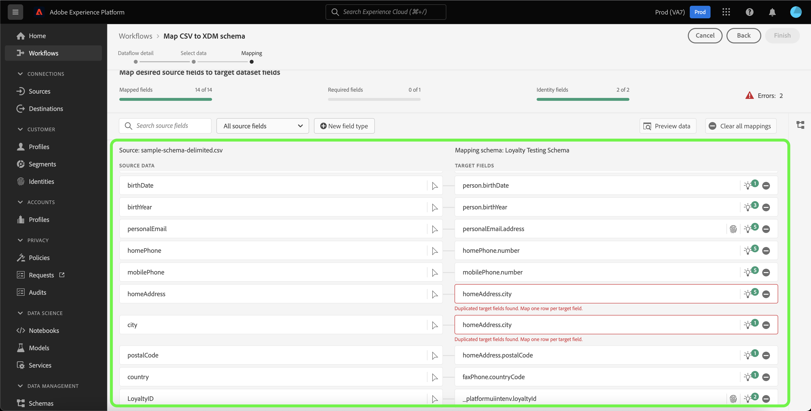

Select the lightbulb icon in the target field that you want to adjust.

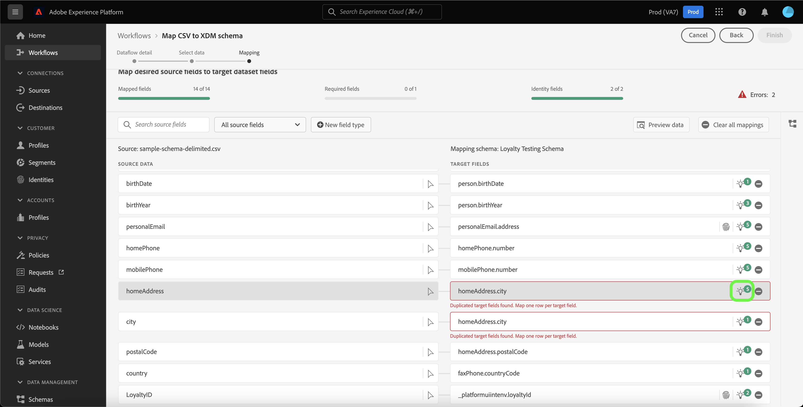

The [!UICONTROL Mapping recommendations] pop up panel appears, displaying a list of recommended target fields that can be mapped to a particular source field.

Sometimes, more than one recommendation is available for the source schema. When this happens, the mapping card displays the most prominent recommendation, followed by an icon  that contains the number of additional recommendations available. Selecting the light bulb icon will show a list of the additional recommendations. You can choose one of the alternate recommendations by selecting the checkbox next to the recommendation you want to map to instead.

From here, you can change the selected target field to fix an error or match your use case.

Alternatively, you can select **[!UICONTROL Select manually]** to manually use the interactive target schema mapping tree.

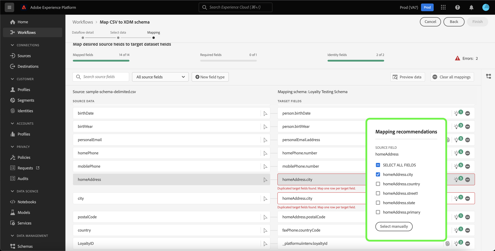

The target schema mapping interface appears in the same view as your mapping sets, allowing you to modify mapping pairs within the same screen. Select the target field that fits your use case or fixes your errors.

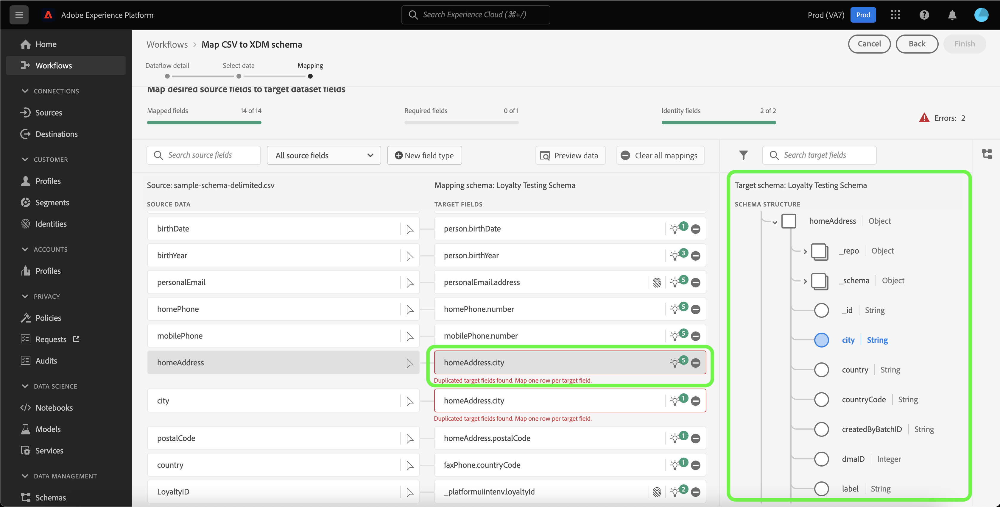

When finished, select **[!UICONTROL Finish]** to proceed.

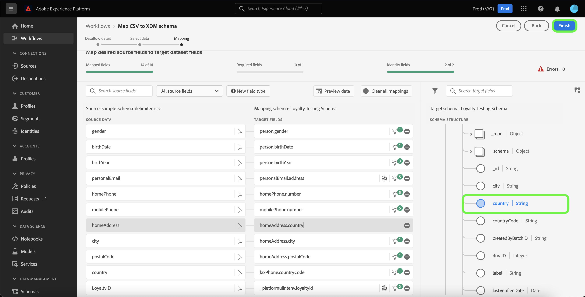

## Next steps

