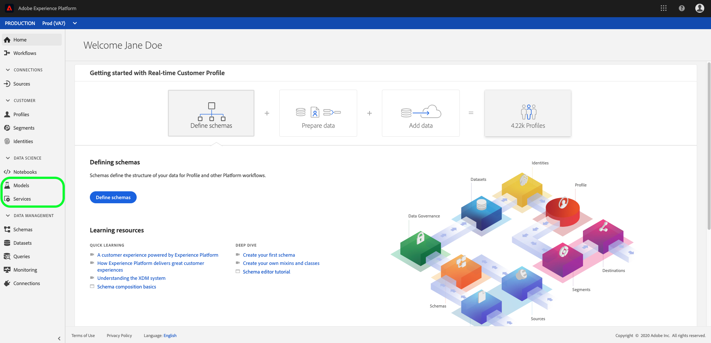

# Data Science Workspace access and features

The following document outlines Data Science Workspace permissions and access to features. 

- **Notebooks:** Provides an interactive development environment ([JupyterLab](./jupyterlab/overview.md)) to explore, analyze, and model your data on Experience Platform.
- **Models:** Provides tools used to create, publish, and store advanced machine learning recipes and models. For more information, visit the [create and publish a machine learning model](./models-recipes/create-publish-model.md) tutorial.
- **Services:** Contains both Adobe-provided services such as [AI/ML services](../intelligent-services/home.md) and any custom services you created with Data Science Workspace.

Why am I only seeing the Services tab?

- Your organization may only be entitled to Adobe Real-Time Customer Data Platform (Real-Time CDP) which includes the Customer AI AI/ML Service.

If you are unable to see any of the **Data Science** tabs and wish to utilize Data Science Workspace features, contact your company administrator to check if you have an Adobe Experience Platform Intelligence license.

## Data Science Workspace packaging

Data Science Workspace capabilities are available in the Adobe Experience Platform Intelligence package and the Advanced Intelligence Pack Add-on

The following table outlines some of the key differences for Data Science Workspace entitlements with and without the Advanced Intelligence Pack Add-on:

>[!NOTE]
>
>You can license more than one Advanced Intelligence Pack Addon and the increased capacity is added to your overall entitlement. For example, if you licensed 2 Adobe Experience Platform Advanced Intelligence Pack Addons you are entitled to a total of 20 concurrent Notebook users.

| Data Science Workspace entitlement| Adobe Experience Platform Intelligence Package only | Adobe Experience Platform Intelligence plus Advanced Intelligence Pack Add-on |
| --- | :---: | :---: |
| Number of Notebook users supported. | 5 concurrent users | First pack adds 5 concurrent users and additional purchases add 10 concurrent users per package. |
| Allows integrated Jupyter Notebooks for exploratory data analysis and model authoring. | X (Supports R, Python, and Scala libraries) | X (Adds PySpark and Spark ML libraries)  |
| Native integration with Query Service. Ability to explore and shape datasets using SQL in notebooks. | X | X |
| Access to pre-built notebook templates for predictive analytics. | X | X |
| Manually train and score models with Jupyter Notebooks. | X | X |
| Deploy and operationalize models with the ability to schedule training and inferencing jobs. | | X |
| Recipe framework to easily configure, evaluate, train, score, and publish models into production. |  | X |
| UI driven model experimentation and evaluation. | | X |
| Deep learning support for Tensorflow models (GPU Compute). | | X |
| Spark based distributed compute to train and score against large datasets (10MM + rows). | | X |

## Access control

Access control for Experience Platform is administered through the [Adobe Admin Console](https://adminconsole.adobe.com). This functionality leverages product profiles in Admin Console, which link users with permissions and sandboxes. See the [access control overview](../access-control/home.md) for more information.

In order to use Data Science Workspace, the "Manage Data Science Workspace" permission must be enabled. The following table outlines the effects of having this permission enabled or disabled:

| Permission | Enabled | Disabled |
|---|---|---|
| Manage Data Science Workspace | Provides access to all services in Data Science Workspace. | API and UI access to all services within Data Science Workspace is disabled. While disabled, selecting the **Notebooks**, **Models**, and **Services** pages is prevented. <li>Access to **Services** may still be available through Adobe Real-Time Customer Data Platform (Real-Time CDP).</li> |

## Sandbox support

Sandboxes are virtual partitions within a single instance of Experience Platform. Each Platform instance supports multiple production and non-production sandboxes, each maintaining its own library of Platform resources. Non-production sandboxes allow you to test features, run experiments, and make custom configurations without impacting your production sandboxes. For more information on sandboxes, see the [sandboxes overview](../sandboxes/home.md).

Currently, Data Science Workspace has the following sandbox limitation:

- Compute resources are shared across the production and non-production sandboxes.

## Next steps

This document outlined the different types of access and features available in Data Science Workspace.

To learn more about Data Science Workspace, such as a complete day-to-day workflow, please begin by reading the [Data Science Workspace walkthrough](./walkthrough.md) documentation. For more general information, visit the [Data Science Workspace overview](./home.md).
