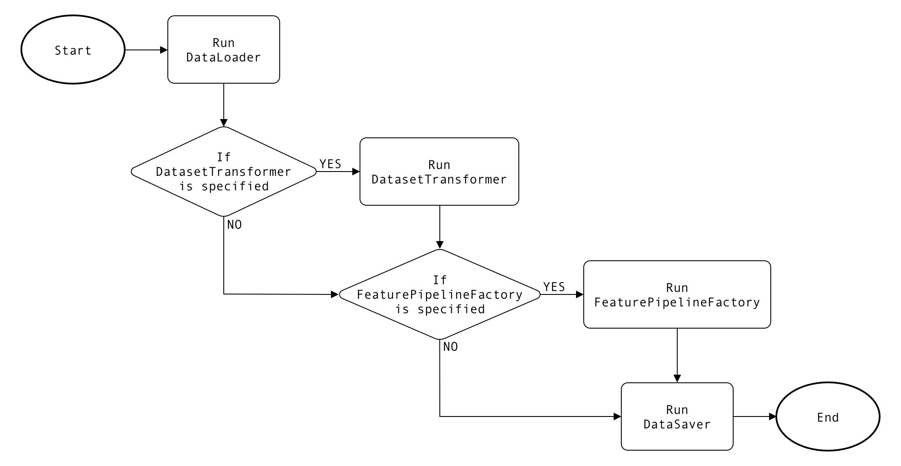

# Create a feature pipeline using the Model Authoring SDK

>[!IMPORTANT]
>
> Feature Pipelines are currently only available via API. 

Adobe Experience Platform allows you to build and create custom feature pipelines to perform feature engineering at scale through the Sensei Machine Learning Framework Runtime (hereinafter referred to as "Runtime").

This document describes the various classes found in a feature pipeline, and provides a step-by-step tutorial for creating a custom feature pipeline using the [Model Authoring SDK](./sdk.md) in PySpark.

The following workflow takes place when a feature pipeline is run:

1. The recipe loads the dataset to a pipeline.
2. Feature transformation is done on the dataset and written back to Adobe Experience Platform.
3. The transformed data is loaded for training.
4. The feature pipeline defines the stages with the Gradient Boosting Regressor as the chosen model.
5. The pipeline is used to fit the training data and the trained model is created.
6. The model is transformed with the scoring dataset.
7. Interesting columns of the output are then selected and saved back to [!DNL Experience Platform] with the associated data.

## Getting started

To run a recipe in any organization, the following is required:
-  An input dataset.
-  The Schema of the dataset.
-  A transformed schema and an empty dataset based on that  schema. 
-  An output schema and an empty dataset based on that schema.

All of the above datasets need to be uploaded to the [!DNL Platform] UI. To set this up, use the Adobe-provided [bootstrap script](https://github.com/adobe/experience-platform-dsw-reference/tree/master/bootstrap).

## Feature pipeline classes

The following table describes the main abstract classes that you must extend in order to build a feature pipeline:

| Abstract Class | Description |
| -------------- | ----------- |
| DataLoader | A DataLoader class provides implementation for the retrieval of input data. |
| DatasetTransformer | A DatasetTransformer class provides implementations to transform the input dataset. You can choose not to provide a DatasetTransformer class and implement your feature engineering logic within the FeaturePipelineFactory class instead. |
| FeaturePipelineFactory | A FeaturePipelineFactory class builds a Spark Pipeline consisting of a series of Spark Transformers to perform feature engineering. You can choose not to provide a FeaturePipelineFactory class and implement your feature engineering logic within the DatasetTransformer class instead. |
| DataSaver | A DataSaver class provides the logic for the storage of a feature dataset. |

When a Feature Pipeline job is initiated, the Runtime first executes the DataLoader to load input data as a DataFrame and then modifies the DataFrame by executing either the DatasetTransformer, FeaturePipelineFactory, or both. Lastly, the resulting feature dataset is stored through the DataSaver.

The following flowchart shows the Runtime's order of execution:




## Implement your Feature Pipeline classes {#implement-your-feature-pipeline-classes}

The following sections provide details and examples on implementing the required classes for a Feature Pipeline.

### Define variables in the configuration JSON file {#define-variables-in-the-configuration-json-file}

The configuration JSON file consists of key-value pairs and is intended for you to specify any variables to be later defined during runtime. These key-value pairs can define properties such as input dataset location, output dataset ID, tenant ID, column headers, and so on.

The following example demonstrates key-value pairs found within a configuration file:

**Configuration JSON example**

```json
[
    {
        "name": "fp",
        "parameters": [
            {
                "key": "dataset_id",
                "value": "000"
            },
            {
                "key": "featureDatasetId",
                "value": "111"
            },
            {
                "key": "tenantId",
                "value": "_tenantid"
            }
        ]
    }
]
```

You can access the configuration JSON through any class method that defines `config_properties` as a parameter. For example:

**PySpark**

```python
dataset_id = str(config_properties.get(dataset_id))
```

See the [pipeline.json](https://github.com/adobe/experience-platform-dsw-reference/blob/master/recipes/feature_pipeline_recipes/pyspark/pipeline.json) file provided by Data Science Workspace for a more in-depth configuration example.

### Prepare the input data with DataLoader {#prepare-the-input-data-with-dataloader}

The DataLoader is responsible for the retrieval and filtering of input data. Your implementation of DataLoader must extend the abstract class `DataLoader` and override the abstract method `load`.

The following example retrieves a [!DNL Platform] dataset by ID and returns it as a DataFrame, where the dataset ID (`dataset_id`) is a defined property in the configuration file.

**PySpark example**

```python
# PySpark

from pyspark.sql.types import StringType, TimestampType
from pyspark.sql.functions import col, lit, struct
import logging

class MyDataLoader(DataLoader):
    def load_dataset(config_properties, spark, tenant_id, dataset_id):
    PLATFORM_SDK_PQS_PACKAGE = "com.adobe.platform.query"
    PLATFORM_SDK_PQS_INTERACTIVE = "interactive"

    service_token = str(spark.sparkContext.getConf().get("ML_FRAMEWORK_IMS_ML_TOKEN"))
    user_token = str(spark.sparkContext.getConf().get("ML_FRAMEWORK_IMS_TOKEN"))
    org_id = str(spark.sparkContext.getConf().get("ML_FRAMEWORK_IMS_ORG_ID"))
    api_key = str(spark.sparkContext.getConf().get("ML_FRAMEWORK_IMS_CLIENT_ID"))

    dataset_id = str(config_properties.get(dataset_id))

    for arg in ['service_token', 'user_token', 'org_id', 'dataset_id', 'api_key']:
        if eval(arg) == 'None':
            raise ValueError("%s is empty" % arg)

    query_options = get_query_options(spark.sparkContext)

    pd = spark.read.format(PLATFORM_SDK_PQS_PACKAGE) \
        .option(query_options.userToken(), user_token) \
        .option(query_options.serviceToken(), service_token) \
        .option(query_options.imsOrg(), org_id) \
        .option(query_options.apiKey(), api_key) \
        .option(query_options.mode(), PLATFORM_SDK_PQS_INTERACTIVE) \
        .option(query_options.datasetId(), dataset_id) \
        .load()
    pd.show()

    # Get the distinct values of the dataframe
    pd = pd.distinct()

    # Flatten the data
    if tenant_id in pd.columns:
        pd = pd.select(col(tenant_id + ".*"))

    return pd
```

### Transform a dataset with DatasetTransformer {#transform-a-dataset-with-datasettransformer}

A DatasetTransformer provides the logic for transforming an input DataFrame and returns a new derived DataFrame. This class can be implemented to either work cooporatively with a FeaturePipelineFactory, work as the sole feature engineering component, or you can choose to not implement this class. 

The following example extends the DatasetTransformer class:

**PySpark example**

```python
# PySpark

from sdk.dataset_transformer import DatasetTransformer
from pyspark.ml.feature import StringIndexer
from pyspark.sql.types import IntegerType
from pyspark.sql.functions import unix_timestamp, from_unixtime, to_date, lit, lag, udf, date_format, lower, col, split, explode
from pyspark.sql import Window
from .helper import setupLogger

class MyDatasetTransformer(DatasetTransformer):
    logger = setupLogger(__name__)

    def transform(self, config_properties, dataset):
        tenant_id = str(config_properties.get("tenantId"))

        # Flatten the data
        if tenant_id in dataset.columns:
            self.logger.info("Flatten the data before transformation")
            dataset = dataset.select(col(tenant_id + ".*"))
            dataset.show()

        # Convert isHoliday boolean value to Int
        # Rename the column to holiday and drop isHoliday
        pd = dataset.withColumn("holiday", col("isHoliday").cast(IntegerType())).drop("isHoliday")
        pd.show()

        # Get the week and year from date
        pd = pd.withColumn("week", date_format(to_date("date", "MM/dd/yy"), "w").cast(IntegerType()))
        pd = pd.withColumn("year", date_format(to_date("date", "MM/dd/yy"), "Y").cast(IntegerType()))

        # Convert the date to TimestampType
        pd = pd.withColumn("date", to_date(unix_timestamp(pd["date"], "MM/dd/yy").cast("timestamp")))

        # Convert categorical data
        indexer = StringIndexer(inputCol="storeType", outputCol="storeTypeIndex")
        pd = indexer.fit(pd).transform(pd)

        # Get the WeeklySalesAhead and WeeklySalesLag column values
        window = Window.orderBy("date").partitionBy("store")
        pd = pd.withColumn("weeklySalesLag", lag("weeklySales", 1).over(window)).na.drop(subset=["weeklySalesLag"])
        pd = pd.withColumn("weeklySalesAhead", lag("weeklySales", -1).over(window)).na.drop(subset=["weeklySalesAhead"])
        pd = pd.withColumn("weeklySalesScaled", lag("weeklySalesAhead", -1).over(window)).na.drop(subset=["weeklySalesScaled"])
        pd = pd.withColumn("weeklySalesDiff", (pd['weeklySales'] - pd['weeklySalesLag'])/pd['weeklySalesLag'])

        pd = pd.na.drop()
        self.logger.debug("Transformed dataset count is %s " % pd.count())

        # return transformed dataframe
        return pd
```

### Engineer data features with FeaturePipelineFactory {#engineer-data-features-with-featurepipelinefactory}

A FeaturePipelineFactory allows you to implement your feature engineering logic by defining and chaining together a series of Spark Transformers through a Spark Pipeline. This class can be implemented to either work cooperatively with a DatasetTransformer, work as the sole feature engineering component, or you can choose to not implement this class.

The following example extends the FeaturePipelineFactory class:

**PySpark example**

```python
# PySpark

from pyspark.ml import Pipeline
from pyspark.ml.regression import GBTRegressor
from pyspark.ml.feature import VectorAssembler

import numpy as np

from sdk.pipeline_factory import PipelineFactory

class MyFeaturePipelineFactory(FeaturePipelineFactory):

    def apply(self, config_properties):
        if config_properties is None:
            raise ValueError("config_properties parameter is null")

        tenant_id = str(config_properties.get("tenantId"))
        input_features = str(config_properties.get("ACP_DSW_INPUT_FEATURES"))

        if input_features is None:
            raise ValueError("input_features parameter is null")
        if input_features.startswith(tenant_id):
            input_features = input_features.replace(tenant_id + ".", "")

        learning_rate = float(config_properties.get("learning_rate"))
        n_estimators = int(config_properties.get("n_estimators"))
        max_depth = int(config_properties.get("max_depth"))

        feature_list = list(input_features.split(","))
        feature_list.remove("date")
        feature_list.remove("storeType")

        cols = np.array(feature_list)

        # Gradient-boosted tree estimator
        gbt = GBTRegressor(featuresCol='features', labelCol='weeklySalesAhead', predictionCol='prediction',
                       maxDepth=max_depth, maxBins=n_estimators, stepSize=learning_rate)

        # Assemble the fields to a vector
        assembler = VectorAssembler(inputCols=cols, outputCol="features")

        # Construct the pipeline
        pipeline = Pipeline(stages=[assembler, gbt])

        return pipeline

    def train(self, config_properties, dataframe):
        pass

    def score(self, config_properties, dataframe, model):
        pass

    def getParamMap(self, config_properties, sparkSession):
        return None

```

### Store your feature dataset with DataSaver {#store-your-feature-dataset-with-datasaver}

The DataSaver is responsible for storing your resulting feature datasets into a storage location. Your implementation of DataSaver must extend the abstract class `DataSaver` and override the abstract method `save`.

The following example extends the DataSaver class which stores data to a [!DNL Platform] dataset by ID, where the dataset ID (`featureDatasetId`) and tenant ID (`tenantId`) are defined properties in the configuration.

**PySpark example**

```python
# PySpark

from sdk.data_saver import DataSaver
from pyspark.sql.types import StringType, TimestampType
from pyspark.sql.functions import col, lit, struct


class MyDataSaver(DataSaver):
    def save(self, configProperties, data_feature):

        # Spark context
        sparkContext = data_features._sc

        # preliminary checks
        if configProperties is None:
            raise ValueError("configProperties parameter is null")
        if data_features is None:
            raise ValueError("data_features parameter is null")
        if sparkContext is None:
            raise ValueError("sparkContext parameter is null")

        # prepare variables
        timestamp = "2019-01-01 00:00:00"
        output_dataset_id = str(
            configProperties.get("featureDatasetId"))
        tenant_id = str(
            configProperties.get("tenantId"))
        service_token = str(
            sparkContext.getConf().get("ML_FRAMEWORK_IMS_ML_TOKEN"))
        user_token = str(
            sparkContext.getConf().get("ML_FRAMEWORK_IMS_TOKEN"))
        org_id = str(
            sparkContext.getConf().get("ML_FRAMEWORK_IMS_ORG_ID"))
        api_key = str(
            sparkContext.getConf().get("ML_FRAMEWORK_IMS_CLIENT_ID"))

        # validate variables
        for arg in ['output_dataset_id', 'tenant_id', 'service_token', 'user_token', 'org_id', 'api_key']:
            if eval(arg) == 'None':
                raise ValueError("%s is empty" % arg)

        # create and prepare DataFrame with valid columns
        output_df = data_features.withColumn("date", col("date").cast(StringType()))
        output_df = output_df.withColumn(tenant_id, struct(col("date"), col("store"), col("features")))
        output_df = output_df.withColumn("timestamp", lit(timestamp).cast(TimestampType()))
        output_df = output_df.withColumn("_id", lit("empty"))
        output_df = output_df.withColumn("eventType", lit("empty"))

        # store data into dataset
        output_df.select(tenant_id, "_id", "eventType", "timestamp") \
            .write.format("com.adobe.platform.dataset") \
            .option('orgId', org_id) \
            .option('serviceToken', service_token) \
            .option('userToken', user_token) \
            .option('serviceApiKey', api_key) \
            .save(output_dataset_id)
```


### Specify your implemented class names in the application file {#specify-your-implemented-class-names-in-the-application-file}

Now that your feature pipeline classes are defined and implemented, you must specify the names of your classes in the application YAML file.

The following examples specifies implemented class names:

**PySpark example**

```yaml
#Name of the class which contains implementation to get the input data.
feature.dataLoader: InputDataLoaderForFeaturePipeline

#Name of the class which contains implementation to get the transformed data.
feature.dataset.transformer: MyDatasetTransformer

#Name of the class which contains implementation to save the transformed data.
feature.dataSaver: DatasetSaverForTransformedData

#Name of the class which contains implementation to get the training data
training.dataLoader: TrainingDataLoader

#Name of the class which contains pipeline. It should implement PipelineFactory.scala
pipeline.class: TrainPipeline

#Name of the class which contains implementation for evaluation metrics.
evaluator: Evaluator
evaluateModel: True

#Name of the class which contains implementation to get the scoring data.
scoring.dataLoader: ScoringDataLoader

#Name of the class which contains implementation to save the scoring data.
scoring.dataSaver: MyDatasetSaver
```

## Create your feature pipeline Engine using the API {#create-feature-pipeline-engine-api}

Now that you have authored your feature pipeline, you need to create a Docker image to make a call to the feature pipeline endpoints in the [!DNL Sensei Machine Learning] API. You need a Docker image URL in order to make a call to the feature pipeline endpoints.

>[!TIP]
>
>If you do not have a Docker URL, visit the [Package source files into a recipe](../models-recipes/package-source-files-recipe.md) tutorial for a step-by-step walkthrough on creating a Docker host URL.

Optionally, you can also use the following Postman collection to assist in completing the feature pipeline API workflow:

https://www.postman.com/collections/c5fc0d1d5805a5ddd41a

### Create a feature pipeline engine {#create-engine-api}

Once you have your Docker image location, you can [create a feature pipeline engine](../api/engines.md#feature-pipeline-docker) using the [!DNL Sensei Machine Learning] API by performing a POST to `/engines`. Successfully creating a feature pipeline engine provides you with an Engine unique identifier (`id`). Make sure to save this value before continuing.

### Create an MLInstance {#create-mlinstance}

Using your newly created `engineID`, you need to [create an MLIstance](../api/mlinstances.md#create-an-mlinstance) by making make a POST request to the `/mlInstance` endpoint. A successful response returns a payload containing the details of the newly created MLInstance including its unique identifier (`id`) used in the next API call.

### Create an Experiment {#create-experiment}

Next, you need to [create an Experiment](../api/experiments.md#create-an-experiment). To create an Experiment you need to have your MLIstance unique identifier (`id`) and make a POST request to the `/experiment` endpoint. A successful response returns a payload containing the details of the newly created Experiment including its unique identifier (`id`) used in the next API call.

### Specify the Experiment run feature pipeline task {#specify-feature-pipeline-task}

After creating an Experiment, you have to change the Experiment's mode to `featurePipeline`. To change the mode, make an additional POST to [`experiments/{EXPERIMENT_ID}/runs`](../api/experiments.md#experiment-training-scoring) with your `EXPERIMENT_ID` and in the body send `{ "mode":"featurePipeline"}` to specify a feature pipeline Experiment run.

Once complete, make a GET request to `/experiments/{EXPERIMENT_ID}` to [retrieve the experiment status](../api/experiments.md#retrieve-specific) and wait for the Experiment status to update to complete.

### Specify the Experiment run training task {#training}

Next, you need to [specify the training run task](../api/experiments.md#experiment-training-scoring). Make a POST to `experiments/{EXPERIMENT_ID}/runs` and in the body set the mode to `train` and send an array of tasks that contain your training parameters. A successful response returns a payload containing the details of the requested Experiment.

Once complete, make a GET request to `/experiments/{EXPERIMENT_ID}` to [retrieve the experiment status](../api/experiments.md#retrieve-specific) and wait for the Experiment status to update to complete.

### Specify the Experiment run scoring task {#scoring}

>[!NOTE]
>
> To complete this step you need to have at least one successful training run associated with your Experiment.

After a successful training run, you need to [specify the scoring run task](../api/experiments.md#experiment-training-scoring). Make a POST to `experiments/{EXPERIMENT_ID}/runs` and in the body set the `mode` attribute to "score". This starts your scoring Experiment run.

Once complete, make a GET request to `/experiments/{EXPERIMENT_ID}` to [retrieve the experiment status](../api/experiments.md#retrieve-specific) and wait for the Experiment status to update to complete.

Once the scoring has completed, your feature pipeline should be operational.

## Next steps {#next-steps}

[//]: # (Next steps section should refer to tutorials on how to score data using the feature pipeline Engine. Update this document once those tutorials are available)

By reading this document, you have authored a feature pipeline using the Model Authoring SDK, created a Docker image, and used the Docker image URL to create a feature pipeline Model by using the [!DNL Sensei Machine Learning] API. You are now ready to continue transforming datasets and extracting data features at scale using the [[!DNL Sensei Machine Learning API]](../api/getting-started.md).
