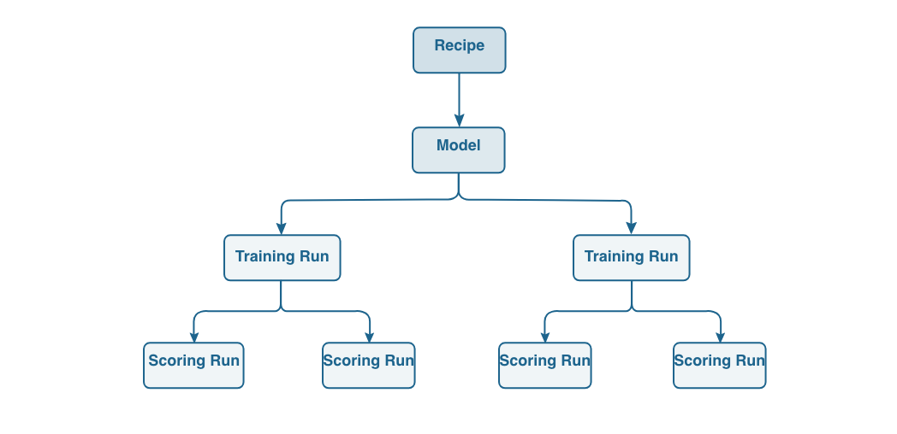
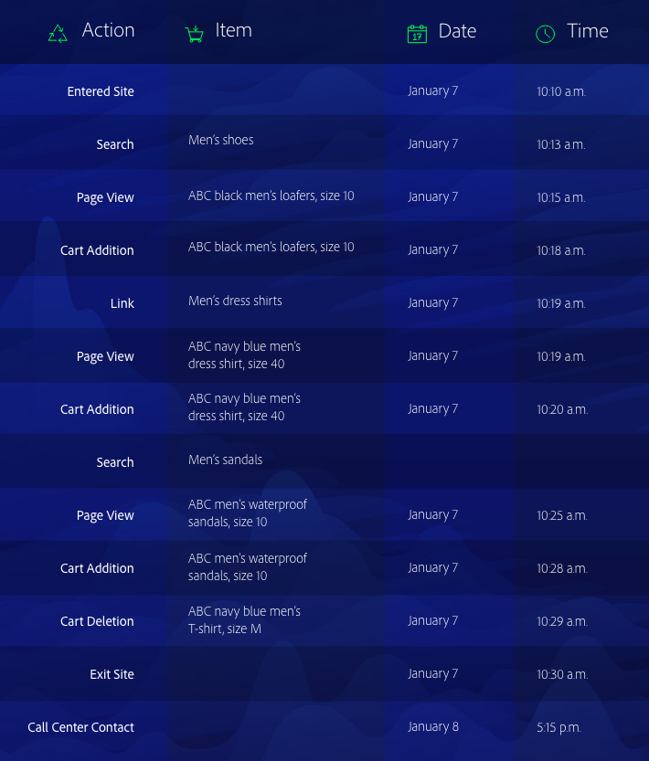
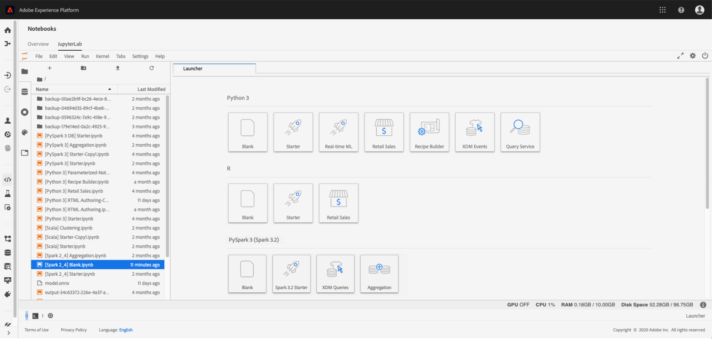
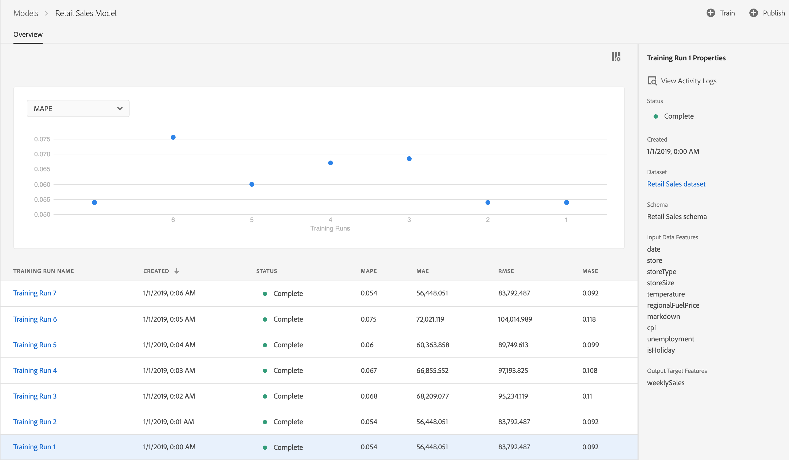

# Data Science Workspace overview

Adobe Experience Platform [!DNL Data Science Workspace] uses machine learning and artificial intelligence to unleash insights from your data. Integrated into Adobe Experience Platform, [!DNL Data Science Workspace] helps you make predictions using your content and data assets across Adobe solutions.  

Data scientists of all skill levels will find sophisticated, easy-to-use tools that support rapid development, training, and tuning of machine learning recipes - all the benefits of AI technology, without the complexity.  

With [!DNL Data Science Workspace], data scientists can easily create intelligent services APIs - powered by machine learning. These services work with other Adobe services, including Adobe Target and Adobe Analytics Cloud, to help you automate personalized, targeted digital experiences in web, desktop, and mobile apps.

This guide provides an overview of the key concepts related to [!DNL Data Science Workspace].

## Introduction

Today's enterprise puts a high priority on mining big data for predictions and insights that will help them personalize customer experiences and deliver more value to customers - and to the business. 
As important as it is, getting from data to insights can come at a high cost. It typically requires skilled data scientists who conduct intensive and time-consuming data research to develop machine-learning models, or recipes, which power intelligent services. The process is lengthy, the technology is complex, and skilled data scientists can be hard to find.  

With [!DNL Data Science Workspace], Adobe Experience Platform allows you to bring experience-focused AI across the enterprise, streamlining and accelerating data-to-insights-to-code with:
- A machine learning framework and runtime
- Integrated access to your data stored in Adobe Experience Platform
- A unified data schema built on [!DNL Experience Data Model] (XDM)
- The computing power essential for machine learning/AI and managing big datasets
- Prebuilt machine learning recipes to accelerate the leap into AI-driven experiences
- Simplified authoring, reuse, and modification of recipes for data scientists of varied skill levels
- Intelligent service publishing and sharing in just a few clicks - without a developer - and monitoring and retraining for continuous optimization of personalized customer experiences

Data scientists of all skill levels will achieve insights faster and more effective digital experiences sooner. 

## Getting started

Before diving into the details of [!DNL Data Science Workspace], here is a brief summary of the key terms:

| Term | Definition |
|---------------------|------------------------------------------------------------------------------------------------------------------------------------------------------------------------------------------------------------------------------------------------------------------------------------------------------------------------------------------------------------------------------------------------------------------------------------------------------------------|
| [!DNL Data Science Workspace] | [!DNL Data Science Workspace] within [!DNL Experience Platform] enables customers to create machine learning models utilizing data across [!DNL Experience Platform] and Adobe Solutions to generate intelligent insights and predictions to weave delightful end-user digital experiences. |
| Artificial Intelligence | Artificial intelligence is a theory and development of computer systems that are able to perform tasks that normally require human intelligence, such as visual perception, speech recognition, decision-making, and translation between languages.|
| Machine Learning | Machine learning is the field of study that enables computers the ability to learn without being explicitly programmed. |
| [!DNL Sensei] ML Framework | [!DNL Sensei] ML Framework is a unified machine learning framework across Adobe that leverages data on [!DNL Experience Platform] to empower data scientists in the development of machine learning driven intelligence services in a faster, scalable and reusable manner. |
| [!DNL Experience Data Model] | [!DNL Experience Data Model] (XDM) is the standardization effort lead by Adobe to define standard schemas such as [!DNL Profile] and [!DNL ExperienceEvent], for Customer Experience Management. |
| [!DNL JupyterLab] | [!DNL JupyterLab] is an open-source web-based interface for Project Jupyter and is tightly integrated into [!DNL Experience Platform]. |
| Recipes | A recipe is Adobe's term for a model specification and is a top-level container representing a specific machine learning, AI algorithm or ensemble of algorithms, processing logic, and configuration required to build and execute a trained model and hence help solve specific business problems. |
| Model | A model is an instance of a machine learning recipe that is trained using historical data and configurations to solve for a business use case. |
| Training | Training is the process of learning patterns and insights from labeled data. |
| Trained Model | A trained model represents the executable output of a model training process, in which a set of training data was applied to the model instance. A trained model will maintain a reference to any intelligent web service that is created from it. The trained model is suitable for scoring and creating an intelligent web service. Modifications to a trained model can be tracked as a new version. |
| Scoring | Scoring is the process of generating insights from data using a trained model. |
| Service | A deployed service exposes functionality of an artificial intelligence, machine learning model or advanced algorithm through an API so that it can be consumed by other services or applications to create intelligent apps. |

The following chart outlines the hierarchical relationship between Recipes, Models, Training Runs, and Scoring Runs. 

## Understanding [!DNL Data Science Workspace]

With [!DNL Data Science Workspace], your data scientists can streamline the cumbersome process of uncovering insights in large datasets. Built on a common machine learning framework and runtime, [!DNL Data Science Workspace] delivers advanced workflow management, model management, and scalability. Intelligent services support re-use of machine learning recipes to power a variety of applications created using Adobe products and solutions. 

### One-stop data access

Data is the cornerstone of AI and machine learning.  

[!DNL Data Science Workspace] is fully integrated with Adobe Experience Platform, including the Data Lake, [!DNL Real-time Customer Profile], and [!DNL Unified Edge]. Explore all your organizational data stored in Adobe Experience Platform at once, along with common big data and deep learning libraries, such as [!DNL Spark] ML and [!DNL TensorFlow]. If you don't find what you need, ingest your own datasets using the XDM standardized schema.  

### Prebuilt machine learning recipes

[!DNL Data Science Workspace] includes prebuilt machine learning recipes for common business needs, like retail sales prediction and anomaly detection, so data scientists and developers don't have to start from scratch. Currently three recipes are offered, [product purchase prediction](./pre-built-recipes/product-purchase-prediction.md), [product recommendations](./pre-built-recipes/product-recommendations.md), and [retail sales](./pre-built-recipes/retail-sales.md).

[//]: # (The built-in recipe gallery offers recommendations for prebuilt recipes based on your business needs.)

If you prefer, you can adapt a prebuilt recipe to your needs, import a recipe, or start from scratch to build a custom recipe. However you begin, once you train and hyper-tune a recipe, creating a custom intelligent service doesn't require a developer - just a few clicks and you're ready to build a targeted, personalized digital experience. 

### Workflow focused on the data scientist

Whatever your level of data science expertise, [!DNL Data Science Workspace] helps simplify and accelerate the process of finding insights in data and applying them to digital experiences.
 
### Data exploration

Finding the right data and preparing it is the most labor-intensive part of building an effective recipe. [!DNL Data Science Workspace] and Adobe Experience Platform will help you get from data to insights more quickly.

On Adobe Experience Platform, your cross-channel data is centralized and stored in the XDM standardized schema, so data is easier to find, understand, and clean. A single store of data based on a common schema can save you countless hours of data exploration and preparation. 

As you browse, use R, [!DNL Python], or Scala with the integrated, hosted [!DNL Jupyter Notebook] to browse the catalog of data on [!DNL Platform]. Using one of these languages, you can also take advantage of [!DNL Spark] ML and TensorFlow. Start from scratch, or use one of the notebook templates provided for specific business problems. 

As part of the data exploration workflow, you can also ingest new data or use existing features to help with data preparation.  

### Authoring

With [!DNL Data Science Workspace], you decide how you want to author recipes. 

- Save time by browsing for a prebuilt recipe that addresses your business needs, which you can use as is or configure to meet your specific requirements. 
- Create a recipe from scratch, using the authoring runtime in Jupyter Notebook to develop and register the recipe.
- Upload a recipe authored outside Adobe Experience Platform into [!DNL Data Science Workspace] or import recipe code from a repository, such as [!DNL Git], using the authentication and integration available between [!DNL Git] and [!DNL Data Science Workspace].

### Experimentation

Data Science Workspace brings tremendous flexibility to the experimentation process. Start with your recipe. Then create a separate instance, using the same core algorithm paired with unique characteristics, such as hyper-tuning parameters. You can create as many instances as you need, training and scoring each instance as many times as you want. As you train them, [!DNL Data Science Workspace] tracks recipes, recipe instances, and trained instances, along with evaluation metrics, so you don't have to.

### Operationalization

When you're happy with your recipe, it's just a few clicks to create an intelligent service. No coding required - you can do it yourself, without enlisting a developer or engineer. Finally, publish the intelligent service to Adobe IO and it's ready for your digital experience team to consume.

<!--You can also publish your intelligent service to the Service Gallery, where it's available to specific people, specific organizations, or everyone who develops data solutions on Adobe Experience Platform. You can even share it with your external partners, and they can share their intelligent service with you. And the next time you're starting a new recipe, you can check the Service Gallery to see if there's a similar intelligent service you can use to get started. -->

### Continuous improvement

[!DNL Data Science Workspace] tracks where intelligent services are invoked and how they're performing. As data rolls in, you can evaluate intelligent service accuracy to close the loop, and retrain the recipes as needed to improve performance. The result is continuous refinement in the precision of customer personalization.

### Access to new features and datasets

Data scientists can take advantage of new technologies and datasets as soon as they are available through Adobe services. Through frequent updates, we do the work of integrating datasets and technologies into the platform, so you don't have to.

### Security and peace of mind

Securing your data is a top priority for Adobe. Adobe protects your data with security processes and controls developed to help comply with industry-accepted standards, regulations, and certifications.

Security is built into software and services as part of the Adobe Secure Product Lifecycle.
To learn about Adobe data and software security, compliance, and more, visit the security page at https://www.adobe.com/security.html.

## [!DNL Data Science Workspace] in action 

Predictions and insights provide the information you need to deliver a highly personalized experience to each customer who visits your web site, contacts your call center, or engages in other digital experiences. Here's how your day-to-day work happens with [!DNL Data Science Workspace].

### Define the problem

It all starts with a business problem. For example, an online call center needs context to help them turn a negative customer sentiment positive.

There's plenty of data about the customer. They've browsed the site, put items in their cart, and even placed orders. They might have received emails, used coupons, or contacted the call center previously. The recipe, then, needs to use the data available about the customer and their activities to determine propensity to buy and recommend an offer that the customer is likely to appreciate and use.

 
At the time of the call center contact, the customer still has two pairs of shoes in the cart, but removed a shirt. With this information, the intelligent service might recommend that the call center agent offer a coupon for 20% off on shoes during the call. If the customer uses the coupon, that information is added to the dataset and the predictions become even better the next time the customer calls.

### Explore and prepare the data

Based on the business problem defined, you know the recipe should look at all the customer's web transactions, including site visits, searches, page views, links clicked, cart actions, offers received, emails received, call center interactions, and so on. 

A data scientist typically spends up to 75% of the time required to create a recipe exploring and transforming the data. Data often comes from multiple repositories and is saved in different schemas - it must be combined and mapped before it can be used to create a recipe. 

[//]: # (Your first step is to check the recipe gallery to see if an existing recipe meets your needs, or comes close. An alternative is to import a recipe you created outside of Adobe Experience Platform. Starting with an existing recipe often streamlines the data exploration phase and makes it easier for a data scientist.)

If you're starting from scratch or configuring an existing recipe, you begin your data search in a centralized and standardized data catalog for your organization, which simplifies the hunt considerably. You might even find that another data scientist in your organization has already identified a similar dataset, and choose to fine-tune that dataset rather than start from scratch.
All the data in Adobe Experience Platform complies with a standardized XDM schema, eliminating the need to create a complex model for joining data or obtain help from a data engineer.

If you don't immediately find the data you need, but it exists outside Adobe Experience Platform, it's a relatively simple task to ingest additional datasets, which will also transform into the standardized XDM schema.  
You can use [!DNL Jupyter Notebook] to simplify data pre-processing - possibly starting with a notebook template or a notebook you've used previously for propensity to buy.  

### Author the recipe

If you already found a recipe that meets all your needs, you can move on to experimentation. Or, you can modify the recipe a bit or create one from scratch - taking advantage of the [!DNL Data Science Workspace] authoring runtime in [!DNL Jupyter Notebook]. Using the authoring runtime ensures that you can both use the [!DNL Data Science Workspace] training and scoring workflow and convert the recipe later so it can be stored and reused by others in your organization.

You can also import a recipe in to [!DNL Data Science Workspace] and take advantage of the experimentation workflows as you create your intelligent service.

### Experiment with the recipe 

With a recipe that incorporates your core machine learning algorithms, many recipe instances can be created with a single recipe. These recipe instances are referred to as models. A model requires training and evaluation to optimize its operating efficiency and efficacy, a process typically consisting of trial and error.

As you train your models, training runs and evaluations are generated. [!DNL Data Science Workspace] keeps track of evaluation metrics for each unique model and their training runs. Evaluation metrics generated through experimentation will allow you to determine the training run that performs best. 

Visit either the [API](./models-recipes/train-evaluate-model-api.md) or [UI](./models-recipes/train-evaluate-model-ui.md) tutorial on how to train and evaluate models in [!DNL Data Science Workspace].

### Operationalize the model

When you've selected the best trained recipe to address your business needs, you can create an intelligent service in [!DNL Data Science Workspace] without developer assistance. It's just a couple of clicks - no coding required. A published intelligent service is accessible to other members of your organization without the need to recreate the model.

A published intelligent service is configurable to automatically train itself from time to time using new data as they become available. This ensures your service maintains its efficiency and efficacy as time continues.

## Next steps

[!DNL Data Science Workspace] helps streamline and simplify the data science workflow, from data gathering to algorithms to intelligent services for data scientists of all skill levels. With the sophisticated tools [!DNL Data Science Workspace] provides, you can significantly shorten the time from data to insights.

More importantly, [!DNL Data Science Workspace] puts the data science and algorithmic optimization capabilities of Adobe's leading marketing platform in the hands of enterprise data scientists. For the first time, enterprises can bring proprietary algorithms to the platform, taking advantage of Adobe's powerful machine learning and AI capabilities to deliver highly personalized customer experiences at massive scale.  

With the marriage of brand expertise and Adobe's machine learning and AI prowess, enterprises have the power to drive more business value and brand loyalty by giving customers what they want, before they ask for it.

For additional information, such as a complete day-to-day workflow, please begin by reading the [Data Science Workspace walk-through](./walkthrough.md) documentation.

## Additional resources

The following video is designed to support your understanding of [!DNL Data Science Workspace].

>[!VIDEO](https://video.tv.adobe.com/v/30567?quality=12&amp;enable10seconds=on&amp;speedcontrol=on)