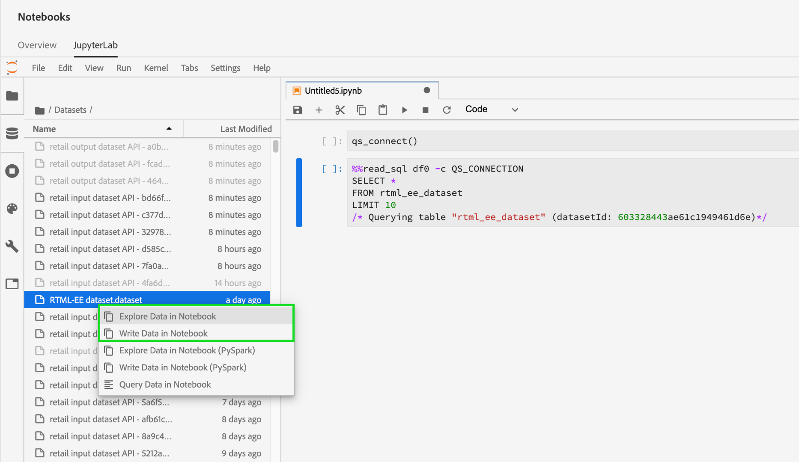
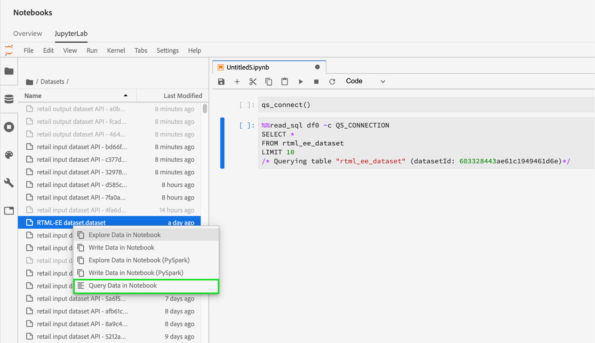
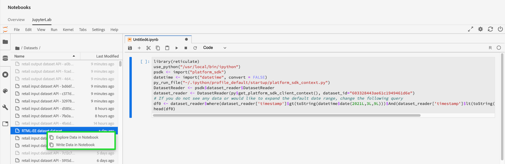
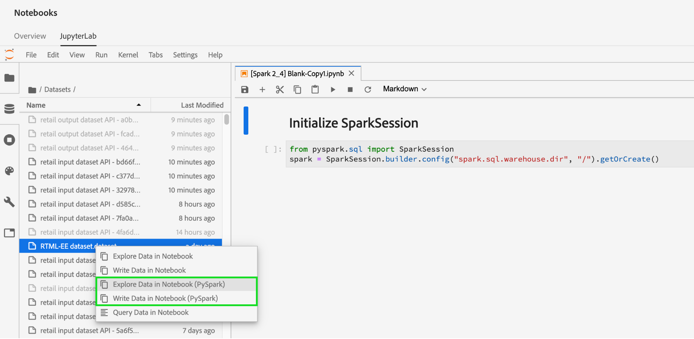
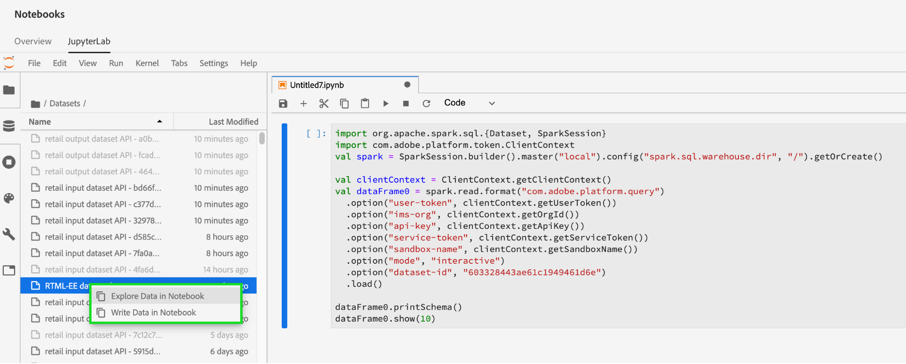

# Data access in [!DNL Jupyterlab] notebooks

Each supported kernel provides built-in functionalities that allow you to read Platform data from a dataset within a notebook. Currently JupyterLab in Adobe Experience Platform Data Science Workspace supports notebooks for [!DNL Python], R, PySpark, and Scala. However, support for paginating data is limited to [!DNL Python] and R notebooks. This guide focuses on how to use JupyterLab notebooks to access your data.

## Getting started

Before reading this guide, please review the [[!DNL JupyterLab] user guide](./overview.md) for a high-level introduction to [!DNL JupyterLab] and its role within Data Science Workspace.

## Notebook data limits {#notebook-data-limits}

>[!IMPORTANT]
>
>For PySpark and Scala notebooks if you are receiving an error with the reason "Remote RPC client disassociated." This typically means the driver or an executor is running out of memory. Try switching to ["batch" mode](#mode) to resolve this error.

The following information defines the max amount of data that can be read, what type of data was used, and the estimated timeframe reading the data takes. 

For [!DNL Python] and R, a notebook server configured at 40GB RAM was used for the benchmarks. For PySpark and Scala, a databricks cluster configured at 64GB RAM, 8 cores, 2 DBU with a maximum of 4 workers was used for the benchmarks outlined below.

The ExperienceEvent schema data used varied in size starting from one thousand (1K) rows ranging up-to one billion (1B) rows. Note that for the PySpark and [!DNL Spark] metrics, a date span of 10 days was used for the XDM data.

The ad-hoc schema data was pre-processed using [!DNL Query Service] Create Table as Select (CTAS). This data also varied in size starting from one thousand (1K) rows ranging up-to one billion (1B) rows.

### When to use batch mode vs interactive mode {#mode}

When reading datasets with PySpark and Scala notebooks, you have the option to use interactive mode or batch mode to read the dataset. Interactive is made for fast results whereas batch mode is for large datasets.

- For PySpark and Scala notebooks, batch mode should be used when 5 million rows of data or more is being read. For more information on the efficiency of each mode, see the [PySpark](#pyspark-data-limits) or [Scala](#scala-data-limits) data limit tables below.

### [!DNL Python] notebook data limits

**XDM ExperienceEvent schema:** You should be able to read a maximum of 2 million rows (~6.1 GB data on disk) of XDM data in less than 22 minutes. Adding additional rows may result in errors.

| Number of Rows          | 1K     | 10K    | 100K  | 1M    | 2M    |
| ----------------------- | ------ | ------ | ----- | ----- | ----- |
| Size on disk (MB)       | 18.73  | 187.5  | 308   | 3000  | 6050  |
| SDK (in seconds)        | 20.3   | 86.8   | 63    | 659   | 1315  | 

**ad-hoc schema:** You should be able to read a maximum of 5 million rows (~5.6 GB data on disk) of non-XDM (ad-hoc) data in less than 14 minutes. Adding additional rows may result in errors.

| Number of rows          | 1K      | 10K     | 100K  | 1M    | 2M    | 3M    | 5M     |
| ----------------------- | ------- | ------- | ----- | ----- | ----- | ----- | ------ |
| Size on disk (in MB)    | 1.21    | 11.72   | 115   | 1120  | 2250  | 3380  | 5630   |
| SDK (in seconds)        | 7.27    | 9.04    | 27.3  | 180   | 346   | 487   | 819    |

### R notebook data limits

**XDM ExperienceEvent schema:** You should be able to read a maximum of 1 million rows of XDM data (3GB data on disk) in under 13 minutes.

| Number of rows          | 1K     | 10K    | 100K  | 1M    |
| ----------------------- | ------ | ------ | ----- | ----- |
| Size on disk (MB)       | 18.73  | 187.5  | 308   | 3000  |
| R Kernel  (in seconds)  | 14.03  | 69.6   | 86.8  | 775   |

**ad-hoc schema:** You should be able to read a maximum of 3 million rows of ad-hoc data (293MB data on disk) in around 10 minutes.

| Number of rows          | 1K      | 10K     | 100K  | 1M    | 2M    | 3M    |
| ----------------------- | ------- | ------- | ----- | ----- | ----- | ----- |
| Size on disk (in MB)    | 0.082   | 0.612   | 9.0   | 91    | 188   | 293   |
| R SDK (in sec)          | 7.7     | 4.58    | 35.9  | 233   | 470.5 | 603   |

### PySpark ([!DNL Python] kernel) notebook data limits: {#pyspark-data-limits}

**XDM ExperienceEvent schema:** On interactive mode you should be able to read a maximum of 5 million rows (~13.42GB data on disk) of XDM data in around 20 minutes. Interactive mode only supports up to 5 million rows. If you wish to read larger datasets, it's suggested you switch to batch mode. On batch mode you should be able to read a maximum of 500 million rows (~1.31TB data on disk) of XDM data in around 14 hours.

| Number of rows          | 1K     | 10K    | 100K  | 1M    | 2M    | 3M    | 5M      | 10M     | 50M      | 100M   | 500M   |
|-------------------------|--------|--------|-------|-------|-------|-------|---------|---------|----------|--------|--------|
| Size on disk            | 2.93MB | 4.38MB | 29.02 | 2.69GB| 5.39GB| 8.09GB| 13.42GB | 26.82GB | 134.24GB |268.39GB| 1.31TB |
| SDK (Interactive mode)  | 33s    | 32.4s  | 55.1s | 253.5s| 489.2s| 729.6s| 1206.8s |    -    |    -     |   -    |  -     |
| SDK (Batch mode)        | 815.8s | 492.8s |379.1s |637.4s |624.5s | 869.2s| 1104.1s | 1786s   | 5387.2s  |10624.6s| 50547s |

**ad-hoc schema:** On Interactive mode you should be able to read a maximum of 5 million rows (~5.36GB data on disk) of non-XDM data in less than 3 minutes. On Batch mode you should be able to read a maximum of 1 billion rows (~1.05TB data on disk) of non-XDM data in around 18 minutes.

| Number of rows| 1K     | 10K     | 100K    | 1M    | 2M    | 3M    | 5M     | 10M    | 50M     | 100M   | 500M    | 1B    |
|--------------|--------|---------|---------|-------|-------|-------|--------|--------|---------|--------|---------|-------|
| Size On Disk | 1.12MB | 11.24MB | 109.48MB| 2.69GB| 2.14GB| 3.21GB| 5.36GB | 10.71GB| 53.58GB |107.52GB| 535.88GB| 1.05TB|
| SDK Interactive mode (in seconds) | 28.2s  | 18.6s   |20.8s    |20.9s  |23.8s  |21.7s  |24.7s   |  -  |  -  |  -   |  -  |  -  |
| SDK Batch mode (in seconds) | 428.8s | 578.8s  |641.4s  |538.5s |630.9s |467.3s |411s    | 675s    |702s     |719.2s  |1022.1s  |1122.3s|

### [!DNL Spark] (Scala kernel) notebook data limits: {#scala-data-limits}

**XDM ExperienceEvent schema:** On interactive mode you should be able to read a maximum of 5 million rows (~13.42GB data on disk) of XDM data in around 18 minutes. Interactive mode only supports up to 5 million rows. If you wish to read larger datasets, it's suggested you switch to batch mode. On batch mode you should be able to read a maximum of 500 million rows (~1.31TB data on disk) of XDM data in around 14 hours.

| Number of rows | 1K     | 10K    | 100K  | 1M    | 2M    | 3M    | 5M      | 10M     | 50M      | 100M   | 500M   |
|---------------|--------|--------|-------|-------|-------|-------|---------|---------|----------|--------|--------|
| Size On Disk  | 2.93MB | 4.38MB | 29.02 | 2.69GB| 5.39GB| 8.09GB| 13.42GB | 26.82GB | 134.24GB |268.39GB| 1.31TB |
| SDK Interactive mode (in seconds) | 37.9s  | 22.7s  | 45.6s | 231.7s| 444.7s| 660.6s | 1100s  |     -   |    -     |   -    |  -     |
| SDK Batch mode (in seconds) | 374.4s | 398.5s |527s   |487.9s |588.9s |829s   |939.1s   | 1441s    |5473.2s  |10118.8 |49207.6 |

**ad-hoc schema:** On interactive mode you should be able to read a maximum of 5 million rows (~5.36GB data on disk) of non-XDM data in less than 3 minutes. On batch mode you should be able to read a maximum of 1 billion rows (~1.05TB data on disk) of non-XDM data in around 16 minutes.

| Number of rows | 1K     | 10K     | 100K    | 1M    | 2M    | 3M    | 5M      | 10M     | 50M     | 100M   | 500M    | 1B    |
|--------------|--------|---------|---------|-------|-------|-------|---------|---------|---------|--------|---------|-------|
| Size On Disk | 1.12MB | 11.24MB | 109.48MB| 2.69GB| 2.14GB| 3.21GB| 5.36GB  | 10.71GB | 53.58GB |107.52GB| 535.88GB| 1.05TB|
| SDK Interactive mode (in seconds)   | 35.7s  | 31s     |19.5s    |25.3s  |23s    |33.2s  |25.5s    |  -  |  -  |  -  |  -  |  -  |
| SDK Batch mode (in seconds)   | 448.8s | 459.7s  |519s    |475.8s |599.9s |347.6s |407.8s   | 397s    |518.8s   |487.9s  |760.2s   |975.4s |

## Python notebooks {#python-notebook}

[!DNL Python] notebooks allow you to paginate data when accessing datasets. Sample code to read data with and without pagination is demonstrated below. For more information on the available starter Python notebooks, visit the [[!DNL JupyterLab] Launcher](./overview.md#launcher) section within the JupyterLab user guide.

The Python documentation below outlines the following concepts:

- [Read from a dataset](#python-read-dataset)
- [Write to a dataset](#write-python)
- [Query data](#query-data-python)
- [Filter ExperienceEvent data](#python-filter)

### Read from a dataset in Python {#python-read-dataset}

**Without pagination:**

Executing the following code will read the entire dataset. If the execution is successful, then data will be saved as a Pandas dataframe referenced by the variable `df`.

```python
# Python

from platform_sdk.dataset_reader import DatasetReader
dataset_reader = DatasetReader(get_platform_sdk_client_context(), dataset_id="{DATASET_ID}")
df = dataset_reader.read()
df.head()
```

**With pagination:**

Executing the following code will read data from the specified dataset. Pagination is achieved by limiting and offsetting data through the functions `limit()` and `offset()` respectively. Limiting data refers to the maximum number of data points to be read, while offsetting refers to the number of data points to skip prior to reading data. If the read operation executes successfully, then data will be saved as a Pandas dataframe referenced by the variable `df`.

```python
# Python

from platform_sdk.dataset_reader import DatasetReader

dataset_reader = DatasetReader(get_platform_sdk_client_context(), dataset_id="{DATASET_ID}")
df = dataset_reader.limit(100).offset(10).read()
```

### Write to a dataset in Python {#write-python}

In order to write to a dataset in your JupyterLab notebook, select the Data icon tab (highlighted below) in the left-navigation of JupyterLab. The **[!UICONTROL Datasets]** and **[!UICONTROL Schemas]** directories appear. Select **[!UICONTROL Datasets]** and right-click, then select the **[!UICONTROL Write Data in Notebook]** option from the dropdown menu on the dataset you wish to use. An executable code entry appears at the bottom of your notebook. 



- Use **[!UICONTROL Write Data in Notebook]** to generate a write cell with your selected dataset.
- Use **[!UICONTROL Explore Data in Notebook]** to generate a read cell with your selected dataset.
- Use **[!UICONTROL Query Data in Notebook]** to generate a basic query cell with your selected dataset.

Alternatively ,you can copy and paste the following code cell. Replace both the `{DATASET_ID}` and `{PANDA_DATAFRAME}`.

```python
from platform_sdk.models import Dataset
from platform_sdk.dataset_writer import DatasetWriter

dataset = Dataset(get_platform_sdk_client_context()).get_by_id(dataset_id="{DATASET_ID}")
dataset_writer = DatasetWriter(get_platform_sdk_client_context(), dataset)
write_tracker = dataset_writer.write({PANDA_DATAFRAME}, file_format='json')
```

### Query data using [!DNL Query Service] in [!DNL Python] {#query-data-python}

[!DNL JupyterLab] on [!DNL Platform] allows you to use SQL in a [!DNL Python] notebook to access data through [Adobe Experience Platform Query Service](https://www.adobe.com/go/query-service-home-en). Accessing data through [!DNL Query Service] can be useful for dealing with large datasets due to its superior running times. Be advised that querying data using [!DNL Query Service] has a processing time limit of ten minutes.

Before you use [!DNL Query Service] in [!DNL JupyterLab], ensure you have a working understanding of the [[!DNL Query Service] SQL syntax](https://www.adobe.com/go/query-service-sql-syntax-en).

Querying data using [!DNL Query Service] requires you to provide the name of the target dataset. You can generate the necessary code cells by finding the desired dataset using the **[!UICONTROL Data explorer]**. Right click on the dataset listing and click **[!UICONTROL Query Data in Notebook]** to generate two code cells in your notebook. These two cells are outlined in more detail below.



In order to utilize [!DNL Query Service] in [!DNL JupyterLab], you must first create a connection between your working [!DNL Python] notebook and [!DNL Query Service]. This can be achieved by executing the first generated cell.

```python
qs_connect()
```

In the second generated cell, the first line must be defined before the SQL query. By default, the generated cell defines an optional variable (`df0`) which saves the query results as a Pandas dataframe. <br>The `-c QS_CONNECTION` argument is mandatory and tells the kernel to execute the SQL query against [!DNL Query Service]. See the [appendix](#optional-sql-flags-for-query-service) for a list of additional arguments.

```python
%%read_sql df0 -c QS_CONNECTION
SELECT *
FROM name_of_the_dataset
LIMIT 10
/* Querying table "name_of_the_dataset" (datasetId: {DATASET_ID})*/
```

Python variables can be directly referenced within a SQL query by using string-formatted syntax and wrapping the variables in curly brackets (`{}`), as shown in the following example:

```python
table_name = 'name_of_the_dataset'
table_columns = ','.join(['col_1','col_2','col_3'])
```

```python
%%read_sql demo -c QS_CONNECTION
SELECT {table_columns}
FROM {table_name}
```

### Filter [!DNL ExperienceEvent] data {#python-filter}

In order to access and filter an [!DNL ExperienceEvent] dataset in a [!DNL Python] notebook, you must provide the ID of the dataset (`{DATASET_ID}`) along with the filter rules that define a specific time range using logical operators. When a time range is defined, any specified pagination is ignored and the entire dataset is considered. 

A list of filtering operators are described below: 

- `eq()`: Equal to
- `gt()`: Greater than
- `ge()`: Greater than or equal to
- `lt()`: Less than
- `le()`: Less than or equal to
- `And()`: Logical AND operator
- `Or()`: Logical OR operator

The following cell filters an [!DNL ExperienceEvent] dataset to data existing exclusively between January 1, 2019 and the end of December 31, 2019.

```python
# Python

from platform_sdk.dataset_reader import DatasetReader

dataset_reader = DatasetReader(get_platform_sdk_client_context(), dataset_id="{DATASET_ID}")
df = dataset_reader.\
    where(dataset_reader["timestamp"].gt("2019-01-01 00:00:00").\
    And(dataset_reader["timestamp"].lt("2019-12-31 23:59:59"))\
).read()
```

## R notebooks {#r-notebooks}

R notebooks allow you to paginate data when accessing datasets. Sample code to read data with and without pagination is demonstrated below. For more information on the available starter R notebooks, visit the [[!DNL JupyterLab] Launcher](./overview.md#launcher) section within the JupyterLab user guide.

The R documentation below outlines the following concepts:

- [Read from a dataset](#r-read-dataset)
- [Write to a dataset](#write-r)
- [Filter ExperienceEvent data](#r-filter)

### Read from a dataset in R {#r-read-dataset}

**Without pagination:**

Executing the following code will read the entire dataset. If the execution is successful, then data will be saved as a Pandas dataframe referenced by the variable `df0`.

```R
# R

library(reticulate)
use_python("/usr/local/bin/ipython")
psdk <- import("platform_sdk")
datetime <- import("datetime", convert = FALSE)
py_run_file("~/.ipython/profile_default/startup/platform_sdk_context.py")
DatasetReader <- psdk$dataset_reader$DatasetReader
dataset_reader <- DatasetReader(py$get_platform_sdk_client_context(), dataset_id="{DATASET_ID}")
df0 <- dataset_reader$read()
head(df0)
```

**With pagination:**

Executing the following code will read data from the specified dataset. Pagination is achieved by limiting and offsetting data through the functions `limit()` and `offset()` respectively. Limiting data refers to the maximum number of data points to be read, while offsetting refers to the number of data points to skip prior to reading data. If the read operation executes successfully, then data will be saved as a Pandas dataframe referenced by the variable `df0`.

```R
# R

library(reticulate)
use_python("/usr/local/bin/ipython")
psdk <- import("platform_sdk")
datetime <- import("datetime", convert = FALSE)
py_run_file("~/.ipython/profile_default/startup/platform_sdk_context.py")

DatasetReader <- psdk$dataset_reader$DatasetReader
dataset_reader <- DatasetReader(py$get_platform_sdk_client_context(), dataset_id="{DATASET_ID}") 
df0 <- dataset_reader$limit(100L)$offset(10L)$read()
```

### Write to a dataset in R {#write-r}

In order to write to a dataset in your JupyterLab notebook, select the Data icon tab (highlighted below) in the left-navigation of JupyterLab. The **[!UICONTROL Datasets]** and **[!UICONTROL Schemas]** directories appear. Select **[!UICONTROL Datasets]** and right-click, then select the **[!UICONTROL Write Data in Notebook]** option from the dropdown menu on the dataset you wish to use. An executable code entry appears at the bottom of your notebook. 



- Use **[!UICONTROL Write Data in Notebook]** to generate a write cell with your selected dataset.
- Use **[!UICONTROL Explore Data in Notebook]** to generate a read cell with your selected dataset.

Alternatively ,you can copy and paste the following code cell:

```R
psdk <- import("platform_sdk")
dataset <- psdk$models$Dataset(py$get_platform_sdk_client_context())$get_by_id(dataset_id="{DATASET_ID}")
dataset_writer <- psdk$dataset_writer$DatasetWriter(py$get_platform_sdk_client_context(), dataset)
write_tracker <- dataset_writer$write(df, file_format='json')
```

### Filter [!DNL ExperienceEvent] data {#r-filter}

In order to access and filter an [!DNL ExperienceEvent] dataset in a R notebook, you must provide the ID of the dataset (`{DATASET_ID}`) along with the filter rules that define a specific time range using logical operators. When a time range is defined, any specified pagination is ignored and the entire dataset is considered. 

A list of filtering operators are described below: 

- `eq()`: Equal to
- `gt()`: Greater than
- `ge()`: Greater than or equal to
- `lt()`: Less than
- `le()`: Less than or equal to
- `And()`: Logical AND operator
- `Or()`: Logical OR operator

The following cell filters an [!DNL ExperienceEvent] dataset to data existing exclusively between January 1, 2019 and the end of December 31, 2019.

```R
# R

library(reticulate)
use_python("/usr/local/bin/ipython")
psdk <- import("platform_sdk")
datetime <- import("datetime", convert = FALSE)
py_run_file("~/.ipython/profile_default/startup/platform_sdk_context.py")

client_context <- py$PLATFORM_SDK_CLIENT_CONTEXT
DatasetReader <- psdk$dataset_reader$DatasetReader
dataset_reader <- DatasetReader(py$get_platform_sdk_client_context(), dataset_id="{DATASET_ID}") 

df0 <- dataset_reader$
    where(dataset_reader["timestamp"]$gt("2019-01-01 00:00:00")$
    And(dataset_reader["timestamp"]$lt("2019-12-31 23:59:59"))
)$read()
```

## PySpark 3 notebooks {#pyspark-notebook}

The PySpark documentation below outlines the following concepts:

- [Initialize sparkSession](#spark-initialize)
- [Read and write data](#magic)
- [Create a local dataframe](#pyspark-create-dataframe)
- [Filter ExperienceEvent data](#pyspark-filter-experienceevent)

### Initializing sparkSession {#spark-initialize}

All [!DNL Spark] 2.4 notebooks require that you initialize the session with the following boilerplate code.

```scala
from pyspark.sql import SparkSession
spark = SparkSession.builder.getOrCreate()
```

### Using %dataset to read and write with a PySpark 3 notebook {#magic}

With the introduction of [!DNL Spark] 2.4, `%dataset` custom magic is supplied for use in PySpark 3 ([!DNL Spark] 2.4) notebooks. For more details on magic commands available in the IPython kernel, visit the [IPython magic documentation](https://ipython.readthedocs.io/en/stable/interactive/magics.html).


**Usage**

```scala
%dataset {action} --datasetId {id} --dataFrame {df} --mode batch
```

**Description**

A custom [!DNL Data Science Workspace] magic command for reading or writing a dataset from a [!DNL PySpark] notebook ([!DNL Python] 3 kernel).

| Name | Description | Required |
| --- | --- | --- |
| `{action}` | The type of action to perform on the dataset. Two actions are available "read" or "write". | Yes |
| `--datasetId {id}` | Used to supply the ID of the dataset to read or write. | Yes |
| `--dataFrame {df}` | The pandas dataframe. <ul><li> When the action is "read", {df} is the variable where results of the dataset read operation are available (such as a dataframe). </li><li> When the action is "write", this dataframe {df} is written to the dataset. </li></ul> | Yes |
| `--mode` | An additional parameter that changes how data is read. Allowed parameters are "batch", and "interactive". By default the mode is set to "batch".<br> It is recommended you "interactive" mode for increased query performance on smaller datasets.   | Yes |

>[!TIP]
>
>Review the PySpark tables within the [notebook data limits](#notebook-data-limits) section to determine if `mode` should be set to `interactive` or `batch`.

**Examples**

- **Read example**: `%dataset read --datasetId 5e68141134492718af974841 --dataFrame pd0 --mode batch`
- **Write example**: `%dataset write --datasetId 5e68141134492718af974842 --dataFrame pd0 --mode batch`

>[!IMPORTANT]
>
> Caching data using `df.cache()` before writing data can greatly improve notebook performance. This can help if you are receiving any of the following errors: 
> 
> - Job aborted due to stage failure ... Can only zip RDDs with same number of elements in each partition.
> - Remote RPC client disassociated and other memory errors.
> - Poor performance when reading and writing datasets.
> 
> See the [troubleshooting guide](../troubleshooting-guide.md) for more information.

You can auto generate the above examples in JupyterLab buy using the following method:

Select the Data icon tab (highlighted below) in the left-navigation of JupyterLab. The **[!UICONTROL Datasets]** and **[!UICONTROL Schemas]** directories appear. Select **[!UICONTROL Datasets]** and right-click, then select the **[!UICONTROL Write Data in Notebook]** option from the dropdown menu on the dataset you wish to use. An executable code entry appears at the bottom of your notebook. 

- Use **[!UICONTROL Explore Data in Notebook]** to generate a read cell.
- Use **[!UICONTROL Write Data in Notebook]** to generate a write cell.



### Create a local dataframe {#pyspark-create-dataframe}

To create a local dataframe using PySpark 3 use SQL queries. For example:

```scala
date_aggregation.createOrReplaceTempView("temp_df")

df = spark.sql('''
  SELECT *
  FROM sparkdf
''')

local_df
```

```scala
df = spark.sql('''
  SELECT *
  FROM sparkdf
  LIMIT limit
''')
```

```scala
sample_df = df.sample(fraction)
```

>[!TIP]
>
>You can also specify an optional seed sample such as a boolean withReplacement, double fraction, or a long seed.

### Filter [!DNL ExperienceEvent] data {#pyspark-filter-experienceevent}

Accessing and filtering an [!DNL ExperienceEvent] dataset in a PySpark notebook requires you to provide the dataset identity (`{DATASET_ID}`), your organization's IMS identity, and the filter rules defining a specific time range. A filtering time range is defined by using the function `spark.sql()`, where the function parameter is a SQL query string.

The following cells filter an [!DNL ExperienceEvent] dataset to data existing exclusively between January 1, 2019 and the end of December 31, 2019.

```python
# PySpark 3 (Spark 2.4)

from pyspark.sql import SparkSession
spark = SparkSession.builder.getOrCreate()

%dataset read --datasetId {DATASET_ID} --dataFrame df --mode batch

df.createOrReplaceTempView("event")
timepd = spark.sql("""
    SELECT *
    FROM event
    WHERE timestamp > CAST('2019-01-01 00:00:00.0' AS TIMESTAMP)
    AND timestamp < CAST('2019-12-31 23:59:59.9' AS TIMESTAMP)
""")
timepd.show()
```

## Scala notebooks {#scala-notebook}

The documentation below contains examples for the following concepts:

- [Initialize sparkSession](#scala-initialize)
- [Read a dataset](#read-scala-dataset)
- [Write to a dataset](#scala-write-dataset)
- [Create a local dataframe](#scala-create-dataframe)
- [Filter ExperienceEvent data](#scala-experienceevent)

### Initializing SparkSession {#scala-initialize}

All Scala notebooks require that you initialize the session with the following boilerplate code:

```scala
import org.apache.spark.sql.{ SparkSession }
val spark = SparkSession
  .builder()
  .master("local")
  .getOrCreate()
```

### Read a dataset {#read-scala-dataset}

In Scala, you can import `clientContext` to get and return Platform values, this eliminates the need to define variables such as `var userToken`. In the Scala example below, `clientContext` is used to get and return all the required values needed for reading a dataset.

>[!IMPORTANT]
>
> Caching data using `df.cache()` before writing data can greatly improve notebook performance. This can help if you are receiving any of the following errors: 
> 
> - Job aborted due to stage failure ... Can only zip RDDs with same number of elements in each partition.
> - Remote RPC client disassociated and other memory errors.
> - Poor performance when reading and writing datasets.
> 
> See the [troubleshooting guide](../troubleshooting-guide.md) for more information.

```scala
import org.apache.spark.sql.{Dataset, SparkSession}
import com.adobe.platform.token.ClientContext
val spark = SparkSession.builder().master("local").config("spark.sql.warehouse.dir", "/").getOrCreate()

val clientContext = ClientContext.getClientContext()
val df1 = spark.read.format("com.adobe.platform.query")
  .option("user-token", clientContext.getUserToken())
  .option("ims-org", clientContext.getOrgId())
  .option("api-key", clientContext.getApiKey())
  .option("service-token", clientContext.getServiceToken())
  .option("sandbox-name", clientContext.getSandboxName())
  .option("mode", "batch")
  .option("dataset-id", "5e68141134492718af974844")
  .load()

df1.printSchema()
df1.show(10)
```

| Element | Description |
| ------- | ----------- |
| df1 | A variable that represents the Pandas dataframe used to read and write data. |
| user-token | Your user token that is automatically fetched using `clientContext.getUserToken()`.  |
| service-token | Your service token that is automatically fetched using `clientContext.getServiceToken()`. |
| ims-org | Your organization ID that is automatically fetched using `clientContext.getOrgId()`. |
| api-key | Your API key that is automatically fetched using `clientContext.getApiKey()`. |

>[!TIP]
>
>Review the Scala tables within the [notebook data limits](#notebook-data-limits) section to determine if `mode` should be set to `interactive` or `batch`.

You can auto generate the above example in JupyterLab buy using the following method:

Select the Data icon tab (highlighted below) in the left-navigation of JupyterLab. The **[!UICONTROL Datasets]** and **[!UICONTROL Schemas]** directories appear. Select **[!UICONTROL Datasets]** and right-click, then select the **[!UICONTROL Explore Data in Notebook]** option from the dropdown menu on the dataset you wish to use. An executable code entry appears at the bottom of your notebook. 
And 
- Use **[!UICONTROL Explore Data in Notebook]** to generate a read cell.
- Use **[!UICONTROL Write Data in Notebook]** to generate a write cell.



### Write to a dataset {#scala-write-dataset}

In Scala, you can import `clientContext` to get and return Platform values, this eliminates the need to define variables such as `var userToken`. In the Scala example below, `clientContext` is used to define and return all the required values needed for writing to a dataset.

>[!IMPORTANT]
>
> Caching data using `df.cache()` before writing data can greatly improve notebook performance. This can help if you are receiving any of the following errors: 
> 
> - Job aborted due to stage failure ... Can only zip RDDs with same number of elements in each partition.
> - Remote RPC client disassociated and other memory errors.
> - Poor performance when reading and writing datasets.
> 
> See the [troubleshooting guide](../troubleshooting-guide.md) for more information.

```scala
import org.apache.spark.sql.{Dataset, SparkSession}
import com.adobe.platform.token.ClientContext
val spark = SparkSession.builder().master("local").config("spark.sql.warehouse.dir", "/").getOrCreate()

val clientContext = ClientContext.getClientContext()
df1.write.format("com.adobe.platform.query")
  .option("user-token", clientContext.getUserToken())
  .option("service-token", clientContext.getServiceToken())
  .option("ims-org", clientContext.getOrgId())
  .option("api-key", clientContext.getApiKey())
  .option("sandbox-name", clientContext.getSandboxName())
  .option("mode", "batch")
  .option("dataset-id", "5e68141134492718af974844")
  .save()
```

| element | description |
| ------- | ----------- |
| df1 | A variable that represents the Pandas dataframe used to read and write data. |
| user-token | Your user token that is automatically fetched using `clientContext.getUserToken()`.  |
| service-token | Your service token that is automatically fetched using `clientContext.getServiceToken()`. |
| ims-org | Your organization ID that is automatically fetched using `clientContext.getOrgId()`. |
| api-key | Your API key that is automatically fetched using `clientContext.getApiKey()`. |

>[!TIP]
>
>Review the Scala tables within the [notebook data limits](#notebook-data-limits) section to determine if `mode` should be set to `interactive` or `batch`.

### create a local dataframe {#scala-create-dataframe}

To create a local dataframe using Scala, SQL queries are required. For example:

```scala
sparkdf.createOrReplaceTempView("sparkdf")

val localdf = spark.sql("SELECT * FROM sparkdf LIMIT 1)
```

### Filter [!DNL ExperienceEvent] data {#scala-experienceevent}

Accessing and filtering an [!DNL ExperienceEvent] dataset in a Scala notebook requires you to provide the dataset identity (`{DATASET_ID}`), your organization's IMS identity, and the filter rules defining a specific time range. A Filtering time range is defined by using the function `spark.sql()`, where the function parameter is a SQL query string.

The following cells filter an [!DNL ExperienceEvent] dataset to data existing exclusively between January 1, 2019 and the end of December 31, 2019.

```scala
// Spark (Spark 2.4)

// Turn off extra logging
import org.apache.log4j.{Level, Logger}
Logger.getLogger("org").setLevel(Level.OFF)
Logger.getLogger("com").setLevel(Level.OFF)

import org.apache.spark.sql.{Dataset, SparkSession}
val spark = org.apache.spark.sql.SparkSession.builder().appName("Notebook")
  .master("local")
  .getOrCreate()

// Stage Exploratory
val dataSetId: String = "{DATASET_ID}"
val orgId: String = sys.env("IMS_ORG_ID")
val clientId: String = sys.env("PYDASDK_IMS_CLIENT_ID")
val userToken: String = sys.env("PYDASDK_IMS_USER_TOKEN")
val serviceToken: String = sys.env("PYDASDK_IMS_SERVICE_TOKEN")
val mode: String = "batch"

var df = spark.read.format("com.adobe.platform.query")
  .option("user-token", userToken)
  .option("ims-org", orgId)
  .option("api-key", clientId)
  .option("mode", mode)
  .option("dataset-id", dataSetId)
  .option("service-token", serviceToken)
  .load()
df.createOrReplaceTempView("event")
val timedf = spark.sql("""
    SELECT * 
    FROM event 
    WHERE timestamp > CAST('2019-01-01 00:00:00.0' AS TIMESTAMP)
    AND timestamp < CAST('2019-12-31 23:59:59.9' AS TIMESTAMP)
""")
timedf.show()
```

## Next steps

This document covered the general guidelines for accessing datasets using JupyterLab notebooks. For more in depth examples on querying datasets, visit the [Query Service in JupyterLab notebooks](./query-service.md) documentation. For more information on how to explore and visualize your datasets, visit the document on [analyzing your data using notebooks](./analyze-your-data.md).

## Optional SQL flags for [!DNL Query Service] {#optional-sql-flags-for-query-service}

This table outlines the optional SQL flags that can be used for [!DNL Query Service].

| **Flag** | **Description** |
| --- | --- |
| `-h`, `--help` | Show the help message and exit. |
| `-n`, `--notify` | Toggle option for notifying query results. |
| `-a`, `--async` | Using this flag executes the query asynchonously and can free up the kernel while the query is executing. Be cautious when assigning query results to variables as it may be undefined if the query is not complete. |
| `-d`, `--display` | Using this flag prevents results from being displayed. |
