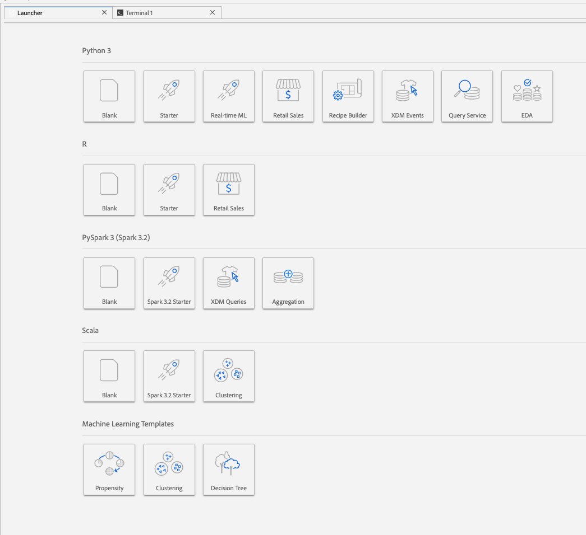
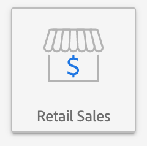
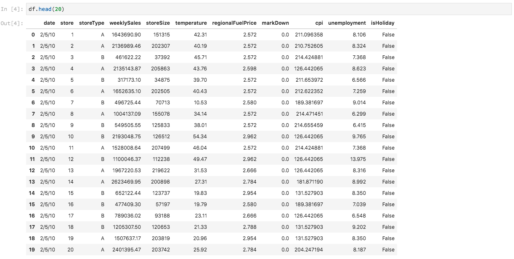
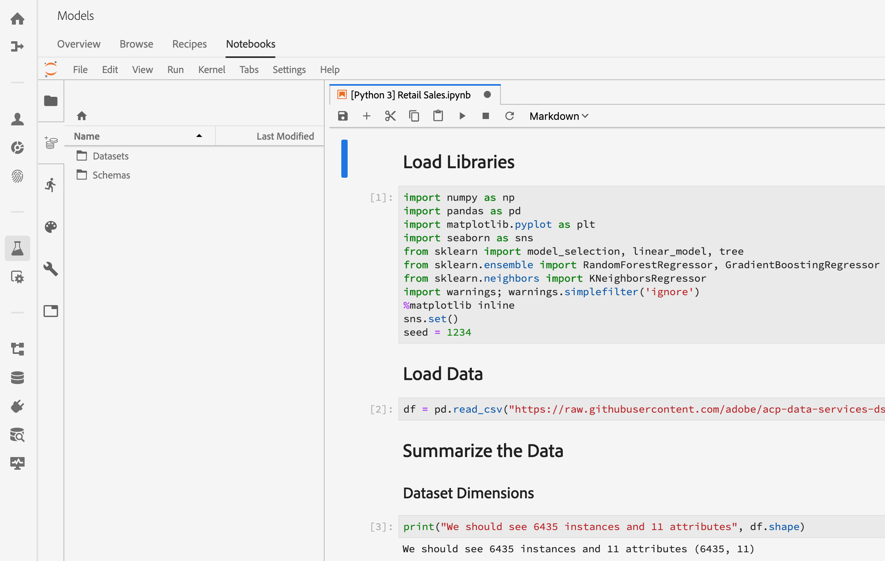
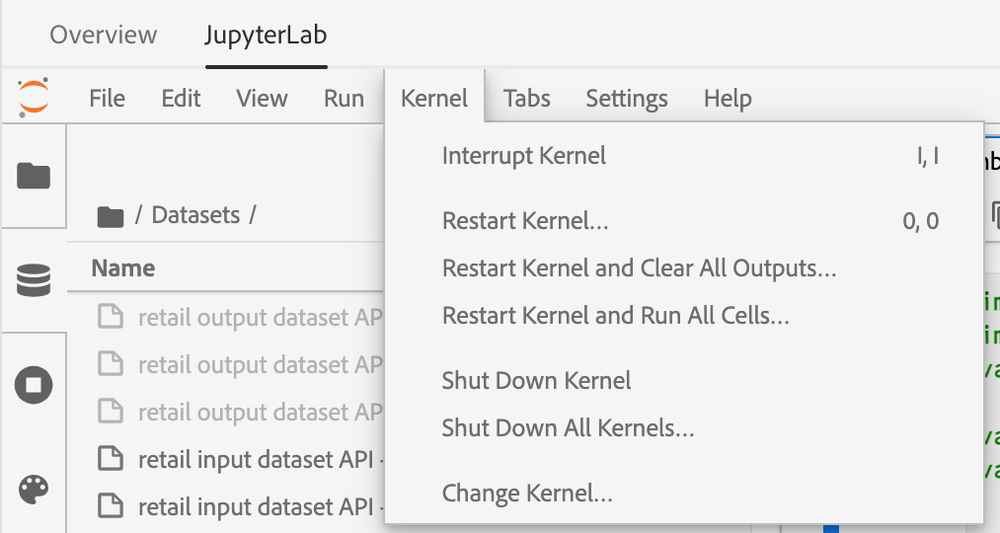
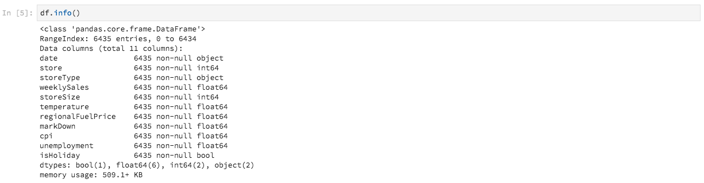
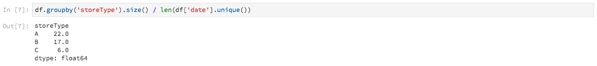
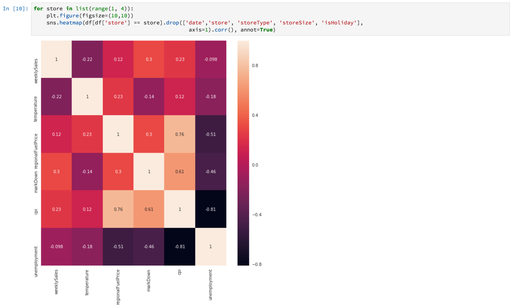

# Analyze your data using notebooks

This tutorial focuses on how to use Jupyter Notebooks, built within Data Science Workspace, to access, explore, and visualize your data. By the end of this tutorial, you should have a understanding of some of the features Jupyter Notebooks offer to better understand your data.

The following concepts are introduced:

- **[!DNL JupyterLab]:** [[!DNL JupyterLab]](https://blog.jupyter.org/jupyterlab-is-ready-for-users-5a6f039b8906) is the next-generation web-based interface for Project Jupyter, and is tightly integrated into [!DNL Adobe Experience Platform].
- **Batches:** Datasets are made up of batches. A batch is a set of data collected over a period of time and processed together as a single unit. New batches are created when data is added to a dataset.
- **Data Access SDK (deprecated):** The Data Access SDK is now deprecated. Please use the [[!DNL Platform SDK]](../authoring/platform-sdk.md) guide.

## Explore notebooks in Data Science Workspace

In this section, data is explored that was previously ingested into the retail sales schema.

Data Science Workspace allows users to create [!DNL Jupyter Notebooks] through the [!DNL JupyterLab] platform where they can create and edit machine learning workflows. [!DNL JupyterLab] is a server-client collaboration tool that allows users to edit notebook documents via a web browser. These notebooks can contain both executable code and rich text elements. For our purposes, we will use Markdown for analysis description and executable [!DNL Python] code to perform data exploration and analysis.

### Choose your workspace

When launching [!DNL JupyterLab], we are presented with a web-based interface for Jupyter Notebooks. Depending on which type of notebook we pick, a corresponding kernel will be launched.

When comparing which environment to use we must consider each service's limitations. For example, if we are using the [pandas](https://pandas.pydata.org/) library with [!DNL Python], as a regular user the RAM limit is 2 GB. Even as a power user, we would be limited to 20 GB of RAM. If dealing with larger computations, it would make sense to use [!DNL Spark] which offers 1.5 TB that is shared with all notebook instances. 

By default, Tensorflow recipe work in a GPU cluster and Python runs within a CPU cluster.

### Create a new notebook

In the [!DNL Adobe Experience Platform] UI, select [!UICONTROL Data Science] in the top menu to take you to the Data Science Workspace. From this page, select [!DNL JupyterLab] to open the [!DNL JupyterLab] launcher. You should see a page similar to this.



In our tutorial, we will be using [!DNL Python] 3 in the Jupyter Notebook to show how to access and explore the data. In the Launcher page, there are sample notebooks provided. We will be using the Retail Sales recipe for [!DNL Python] 3.



The Retail Sales recipe is a standalone example which uses the same Retail Sales dataset to show how data can be explored and visualized in Jupyter Notebook. Additionally, the notebook goes further in depth with training and verification. More information about this specific notebook can be found in this [walkthrough](../walkthrough.md).

### Access data

>[!NOTE]
>
>The `data_access_sdk_python` is deprecated and no longer recommended. Please refer to the [converting data access SDK to Platform SDK](../authoring/platform-sdk.md) tutorial to convert your code. The same steps below still apply for this tutorial.

We will go over accessing data internally from [!DNL Adobe Experience Platform] and data externally. We will be using the `data_access_sdk_python` library to access internal data such as datasets and XDM schemas. For external data, we will use the pandas [!DNL Python] library.

#### External data

With the Retail Sales notebook opened, find the "Load Data" header. The following [!DNL Python] code uses pandas' `DataFrame` data structure and the [read_csv()](https://pandas.pydata.org/pandas-docs/stable/generated/pandas.read_csv.html#pandas.read_csv) function to read the CSV hosted on [!DNL Github] into the DataFrame:


Pandas' DataFrame data structure is a 2-dimensional labeled data structure. To quickly see the dimensions of our data, we can use the `df.shape`. This returns a tuple that represents the dimensionality of the DataFrame:


Finally, we can take a peek at what our data looks like. We can use `df.head(n)` to view the first `n` rows of the DataFrame:



#### [!DNL Experience Platform] data

Now, we will go over accessing [!DNL Experience Platform] data.

##### By Dataset ID

For this section, we are using the Retail Sales dataset which is the same dataset used in the Retail Sales sample notebook.

In Jupyter Notebook, you can access your data from the **Data** tab  on the left. Upon selecting the tab, two folders are provided. Select the **[!UICONTROL Datasets]** folder.



Now in the Datasets directory, you can see all the ingested datasets. Note that it may take a minute to load all the entries if your directory is heavily populated with datasets.

Since the dataset is the same, we want to replace the load data from the previous section which uses external data. Select the code block under **Load Data** and press the **'d'** key on your keyboard twice. Make sure the focus is on the block and not in the text. You can press **'esc'** to escape the text focus before pressing **'d'** twice.

Now, we can right click on the `Retail-Training-<your-alias>` dataset and select the "Explore Data in Notebook" option in the dropdown. An executable code entry will appear in your notebook.

>[!TIP]
>
>Refer to the [[!DNL Platform SDK]](../authoring/platform-sdk.md) guide to convert your code.

```PYTHON
from data_access_sdk_python.reader import DataSetReader
from datetime import date
reader = DataSetReader()
df = reader.load(data_set_id="xxxxxxxx", ims_org="xxxxxxxx@AdobeOrg")
df.head()
```

If you are working on other kernels other than [!DNL Python], please refer to [this page](https://github.com/adobe/acp-data-services-dsw-reference/wiki/Accessing-Data-on-the-Platform) to access data on the [!DNL Adobe Experience Platform].

Selecting the executable cell then pressing the play button in the toolbar will run the executable code. The output for `head()` will be be a table with your dataset's keys as columns and the first n rows in the dataset. `head()` accepts an integer argument to specify how many lines to output. By default this is 5.


If you restart your kernel and run all the cells again, you should get the same outputs as before.




### Explore your data

Now that we can access your data, let's focus on the data itself by using statistics and visualization. The dataset that we are using is a retail dataset which gives miscellaneous information about 45 different stores on a given day. Some characteristics for a given `date` and `store` include the following:
- `storeType`
- `weeklySales`
- `storeSize`
- `temperature`
- `regionalFuelPrice`
- `markDown`
- `cpi`
- `unemployment`
- `isHoliday`

#### Statistical summary

We can leverage [!DNL Python's] pandas library to get the data type of each attribute. The output of the following call will give us information about the number of entries and the data type for each of the columns:

```PYTHON
df.info()
```



This information is useful since knowing the data type for each column will enable us to know how to treat the data.

Now let's look at the statistical summary. Only the numeric data types will be shown, so `date`, `storeType`, and `isHoliday` will not be outputted:

```PYTHON
df.describe()
```


With this, we can see there are 6435 instances for each characteristic. Also, statistical information such as mean, standard deviation (std), min, max, and interquartiles are given. This gives us information about the deviation for the data. In the next section, we will go over visualization which works together with this information to give us a good understanding of our data. 

Looking at the minimum and maximum values for `store`, we can see that there are 45 unique stores the data represents. There are also `storeTypes` which differentiate what a store is. We can see the distribution of `storeTypes` by doing the following:



This means 22 stores are of `storeType` `A`, 17 are `storeType` `B`, and 6 are `storeType` `C`.

#### Data visualization

Now that we know our data frame values, we want to supplement this with visualizations to make things clearer and easier to identify patterns. Graphs are also useful when conveying results to an audience. Some [!DNL Python] libraries which are useful for visualization include:
- [Matplotlib](https://matplotlib.org/)
- [pandas](https://pandas.pydata.org/)
- [seaborn](https://seaborn.pydata.org/)
- [ggplot](https://ggplot2.tidyverse.org/)

In this section, we will quickly go over some advantages for using each library.

[Matplotlib](https://matplotlib.org/) is the oldest [!DNL Python] visualization package. Their goal is to make "easy things easy and hard things possible". This tends to be true as the package is extremely powerful but also comes with complexity. It is not always easy to get a reasonable looking graph without taking a considerable amount of time and effort.

[Pandas](https://pandas.pydata.org/) is mainly used for its DataFrame object which allows for data manipulation with integrated indexing. However, pandas also includes a built-in plotting functionality which is based off of matplotlib. 

[seaborn](https://seaborn.pydata.org/) is a package build on top of matplotlib. Its main goal is to make default graphs more visually appealing and to simplify creating complicated graphs.

[ggplot](https://ggplot2.tidyverse.org/) is a package also built on top of matplotlib. However the main difference is that the tool is a port of ggplot2 for R. Similar to seaborn, the goal is to improve upon matplotlib. Users that are familiar with ggplot2 for R should consider this library.


##### Univariate graphs 

Univariate graphs are plots of an individual variable. A common univariate graph is used to visualize your data is the box and whisker plot.

Using our retail dataset from before, we can generate the box and whisker plot for each of the 45 stores and their weekly sales. The plot is generated using the `seaborn.boxplot` function.


A box and whisker plot is used to show the distribution of data. The outer lines of the plot show the upper and lower quartiles, while the box spans the interquartile range. The line in the box marks the median. Any points of data more than 1.5 times the upper or lower quartile are marked as a circle. These points are considered outliers.

##### Multivariate graphs

Multivariate plots are used to see the interaction between variables. With the visualization, data scientists can see if there are any correlations or patterns between the variables. A common multivariate graph used is a correlation matrix. With a correlation matrix, dependencies between multiple variables are quantified with the correlation coefficient. 

Using the same retail dataset, we can generate the correlation matrix.



Notice the diagonal of 1's down the center. This shows that when comparing a variable to itself, it has complete positive correlation. Strong positive correlation will have a magnitude closer to 1 while weak correlations will be closer to 0. Negative correlation is shown with a negative coefficient showing an inverse trend.


## Next steps

This tutorial went over how to create a new Jupyter Notebook in the Data Science Workspace and how to access data externally as well as from [!DNL Adobe Experience Platform]. Specifically, we went over the following steps:
- Create a new Jupyter Notebook
- Access datasets and schemas
- Explore datasets 

Now you are ready to go on to the [next section](../models-recipes/package-source-files-recipe.md) to package a recipe and to import into Data Science Workspace.
