# Create a model using JupyterLab Notebooks

This tutorial walks you through the required steps to create a model using the JupyterLab notebooks recipe builder template.

## Concepts introduced:

- **Recipes:** A recipe is Adobe's term for a model specification and is a top-level container representing a specific machine learning, AI algorithm or ensemble of algorithms, processing logic, and configuration required to build and execute a trained model.
- **Model:** A model is an instance of a machine learning recipe that is trained using historical data and configurations to solve for a business use case.
- **Training:** Training is the process of learning patterns and insights from labeled data.
- **Scoring:** Scoring is the process of generating insights from data using a trained model.

## Download the required assets {#assets}

Before you proceed with this tutorial, you must create the required schemas and datasets. Visit the tutorial for [creating the Luma propensity model schemas and datasets](../models-recipes/create-luma-data.md) to download the required assets and set up the pre-requisites.

## Get started with the [!DNL JupyterLab] notebook environment

Creating a recipe from scratch can be done within [!DNL Data Science Workspace]. To start, navigate to [Adobe Experience Platform](https://platform.adobe.com) and select the **[!UICONTROL Notebooks]** tab on the left. To create a new notebook, select the Recipe Builder template from the [!DNL JupyterLab Launcher].

The [!UICONTROL Recipe Builder] notebook allows you to run training and scoring runs inside the notebook. This gives you the flexibility to make changes to their `train()` and `score()` methods in between running experiments on the training and scoring data. Once you are happy with the outputs of the training and scoring, you the can create a recipe and furthermore publish it as a model using the recipe to model functionality.

>[!NOTE]
>
>The [!UICONTROL Recipe Builder] notebook supports working with all file formats but currently the create recipe functionality only supports [!DNL Python].

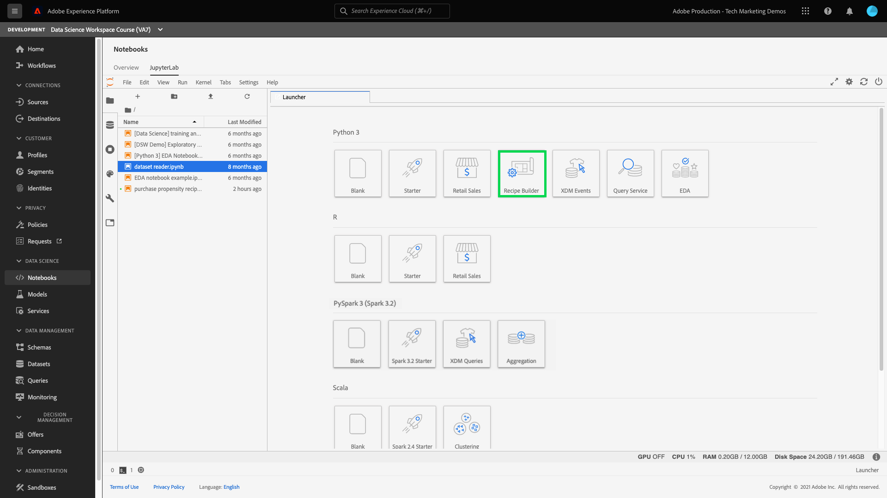

When you select the [!UICONTROL Recipe Builder] notebook from the launcher, the notebook is opened in a new tab. 

In the new notebook tab at the top, a toolbar loads containing three additional actions – **[!UICONTROL Train]**, **[!UICONTROL Score]**, and **[!UICONTROL Create Recipe]**. These icons only appear in the [!UICONTROL Recipe Builder] notebook. More information about these actions are provided [in the training and scoring section](#training-and-scoring) after building your Recipe in the notebook.

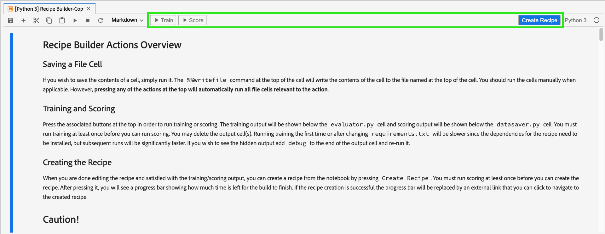

## Get started with the [!UICONTROL Recipe Builder] notebook

In the provided assets folder is a Luma propensity model `propensity_model.ipynb`. Using the upload notebook option in JupyterLab, upload the provided model and open the notebook.

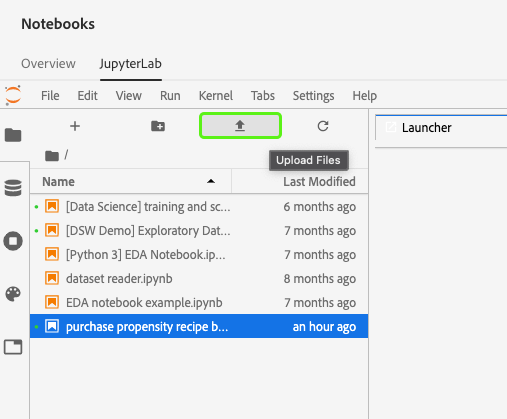

The remainder of this tutorial covers the following files that are pre-defined in the propensity model notebook:

- [Requirements file](#requirements-file)
- [Configuration files](#configuration-files)
- [Training data loader](#training-data-loader)
- [Scoring data loader](#scoring-data-loader)
- [Pipeline file](#pipeline-file)
- [Evaluator file](#evaluator-file)
- [Data Saver file](#data-saver-file)

The following video tutorial explains the Luma propensity model notebook:

>[!VIDEO](https://video.tv.adobe.com/v/333570)

### Requirements file {#requirements-file}

The requirements file is used to declare additional libraries you wish to use in the model. You can specify the version number if there is a dependency. To look for additional libraries, visit [anaconda.org](https://anaconda.org). To learn how to format the requirements file, visit [Conda](https://docs.conda.io/projects/conda/en/latest/user-guide/tasks/manage-environments.html#creating-an-environment-file-manually). The list of main libraries already in use include:

```JSON
python=3.6.7
scikit-learn
pandas
numpy
data_access_sdk_python
```

>[!NOTE]
>
>Libraries or specific versions you add may be incompatible with the above libraries. Additionally, if you choose to create an environment file manually, the `name` field is not allowed to be overridden.

For the Luma propensity model notebook, the requirements do not need to be updated.

### Configuration files {#configuration-files}

The configuration files, `training.conf` and `scoring.conf`, are used to specify the datasets you wish to use for training and scoring as well as adding hyperparameters. There are separate configurations for training and scoring. 

In order for a model to run training, you must provide the `trainingDataSetId`, `ACP_DSW_TRAINING_XDM_SCHEMA`, and `tenantId`. Additionally for scoring, you must provide the `scoringDataSetId`, `tenantId`, and `scoringResultsDataSetId `.

To find the dataset and schema IDs, go to the data tab  within notebooks on the left navigation bar (under the folder icon). Three different dataset ID's need to be provided. The `scoringResultsDataSetId` is used to store the model scoring results and should be an empty dataset. These datasets were made previously in the [Required assets](#assets) step.

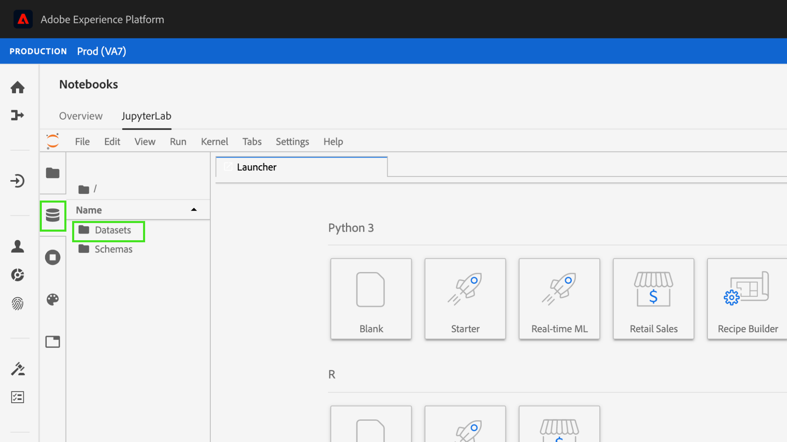

The same information can be found on [Adobe Experience Platform](https://platform.adobe.com/) under the **[Schema](https://platform.adobe.com/schema)** and **[Datasets](https://platform.adobe.com/dataset/overview)** tabs.

Once compete, your training and scoring configuration should look similar to the following screenshot:

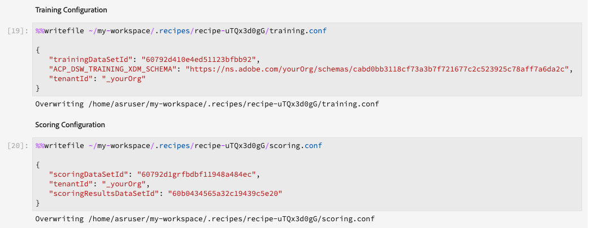

By default, the following configuration parameters are set for you when you train and score data:

- `ML_FRAMEWORK_IMS_USER_CLIENT_ID` 
- `ML_FRAMEWORK_IMS_TOKEN` 
- `ML_FRAMEWORK_IMS_ML_TOKEN` 
- `ML_FRAMEWORK_IMS_TENANT_ID` 

## Understanding the Training Data Loader {#training-data-loader}

The purpose of the Training Data Loader is to instantiate data used for creating the machine learning model. Typically, there are two tasks that the training data loader accomplishes:

- Loading data from [!DNL Platform]
- Data preparation and feature engineering

The following two sections will go over loading data and data preparation. 

### Loading data {#loading-data}

This step uses the [pandas dataframe](https://pandas.pydata.org/pandas-docs/stable/generated/pandas.DataFrame.html). Data can be loaded from files in [!DNL Adobe Experience Platform] using either the [!DNL Platform] SDK (`platform_sdk`), or from external sources using pandas' `read_csv()` or `read_json()` functions.

- [[!DNL Platform SDK]](#platform-sdk)
- [External sources](#external-sources)

>[!NOTE]
>
>In the Recipe Builder notebook, data is loaded via the `platform_sdk` data loader.

### [!DNL Platform] SDK {#platform-sdk}

For an in-depth tutorial on using the `platform_sdk` data loader, please visit the [Platform SDK guide](../authoring/platform-sdk.md). This tutorial provides information on build authentication, basic reading of data, and basic writing of data.

### External sources {#external-sources}

This section shows you how to import a JSON or CSV file to a pandas object. Official documentation from the pandas library can be found here:
- [read_csv](https://pandas.pydata.org/pandas-docs/stable/generated/pandas.read_csv.html)
- [read_json](https://pandas.pydata.org/pandas-docs/stable/generated/pandas.read_json.html)

First, here is an example of importing a CSV file. The `data` argument is the path to the CSV file. This variable was imported from the `configProperties` in the [previous section](#configuration-files).

```PYTHON
df = pd.read_csv(data)
```

You can also import from a JSON file. The `data` argument is the path to the CSV file. This variable was imported from the `configProperties` in the [previous section](#configuration-files).

```PYTHON
df = pd.read_json(data)
```

Now your data is in the dataframe object and can be analyzed and manipulated in the [next section](#data-preparation-and-feature-engineering).

## Training Data Loader File

In this example, data is loaded using the Platform SDK. The library can be imported at the top of the page by including the line:

`from platform_sdk.dataset_reader import DatasetReader`

You can then use the `load()` method to grab the training dataset from the `trainingDataSetId` as set in the configuration (`recipe.conf`) file.

```PYTHON
def load(config_properties):
    print("Training Data Load Start")

    #########################################
    # Load Data
    #########################################    
    client_context = get_client_context(config_properties)
    dataset_reader = DatasetReader(client_context, dataset_id=config_properties['trainingDataSetId'])
```

>[!NOTE]
>
>As mentioned in the [Configuration File section](#configuration-files), the following configuration parameters are set for you when you access data from Experience Platform using `client_context = get_client_context(config_properties)`:
> - `ML_FRAMEWORK_IMS_USER_CLIENT_ID` 
> - `ML_FRAMEWORK_IMS_TOKEN` 
> - `ML_FRAMEWORK_IMS_ML_TOKEN` 
> - `ML_FRAMEWORK_IMS_TENANT_ID` 

Now that you have your data, you can begin with data preparation and feature engineering.

### Data preparation and feature engineering {#data-preparation-and-feature-engineering}

After the data is loaded, the data needs to be cleaned and undergo data preparation. In this example, the goal of the model is to predict whether a customer is going to order a product or not. Because the model is not looking at specific products, you do not need `productListItems` and therefore the column is dropped. Next, additional columns are dropped that only contain a single value or two values in a single column. When training a model, it's important to only keep useful data that will assist in predicting your goal.

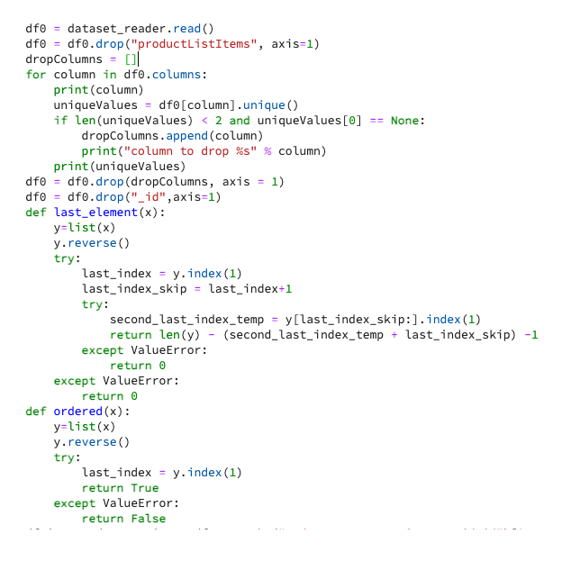

Once you have dropped any unnecessary data, you can begin feature engineering. The demo data used for this example does not contain any session information. Normally, you would want to have data on the current and past sessions for a particular customer. Due to the lack of session information, this example instead mimics current and past sessions via journey demarcation.

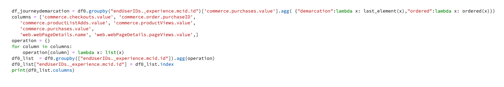

After the demarcation is complete, the data is labeled and a journey is created.

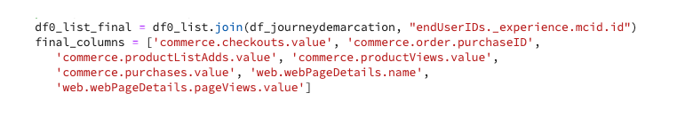

Next, the features are created and divided into past and present. Then, any columns that are unnecessary are dropped, leaving you with both the past and current journeys for Luma customers. These journeys contain information such as whether a customer purchased an item and the journey they took leading up to the purchase.

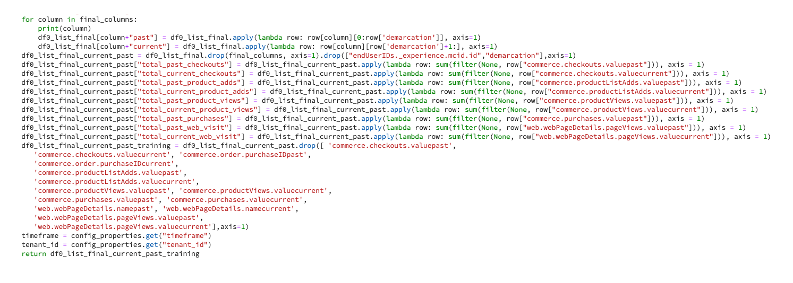

## Scoring data loader {#scoring-data-loader}

The procedure to load data for scoring is similar to loading training data. Looking closely at the code, you can see that everything is the same except for the `scoringDataSetId` in the `dataset_reader`. This is because the same Luma data source is used for both training and scoring.

In the event that you wanted to use different data files for training and scoring, the training and scoring data loader are separate. This allows you to perform additional pre-processing such as mapping your training data to your scoring data if necessary.

## Pipeline file {#pipeline-file}

The `pipeline.py` file includes logic for training and scoring. 

The purpose of training is to create a model using features and labels in your training dataset. After choosing your training model, you must fit your x and y training dataset to the model and the function returns the trained model.

>[!NOTE]
> 
>Features refer to the input variable used by the machine learning model to predict the labels.

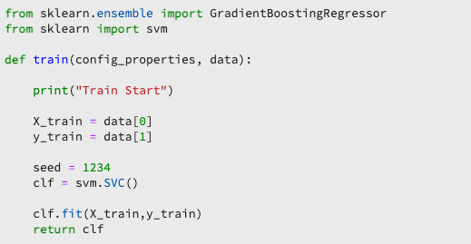

The `score()` function should contain the scoring algorithm and return a measurement to indicate how successful the model performs. The `score()` function uses the scoring dataset labels and the trained model to generate a set of predicted features. These predicted values are then compared with the actual features in the scoring dataset. In this example, the `score()` function uses the trained model to predict features using the labels from the scoring dataset. The predicted features are returned.

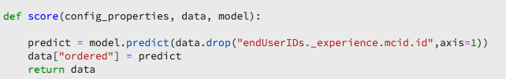

## Evaluator file {#evaluator-file}

The `evaluator.py` file contains logic for how you wish to evaluate your trained recipe as well as how your training data should be split.

### Split the dataset {#split-the-dataset}

The data preparation phase for training requires splitting the dataset to be used for training and testing. This `val` data is used implicitly to evaluate the model after it is trained. This process is separate from scoring. 

This section shows the `split()` function which loads data into the notebook, then cleans up the data by removing unrelated columns in the dataset. From there, you can perform feature engineering which is the process to create additional relevant features from existing raw features in the data.

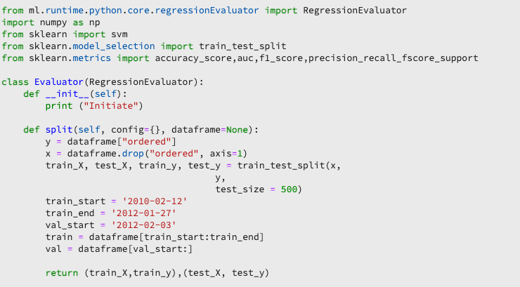

### Evaluate the trained model {#evaluate-the-trained-model}

The `evaluate()` function is performed after the model is trained and returns a metric to indicate how successful the model performs. The `evaluate()` function uses the testing dataset labels and the trained model to predict a set of features. These predicted values are then compared with actual features in the testing dataset. In this example the metrics used are `precision`, `recall`, `f1`, and `accuracy`. Notice that the function returns a `metric` object containing an array of evaluation metrics. These metrics are used to evaluate how well the trained model performs.

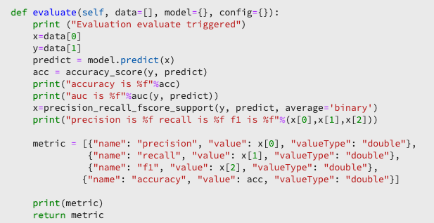

Adding `print(metric)` allows you to view the metric results.

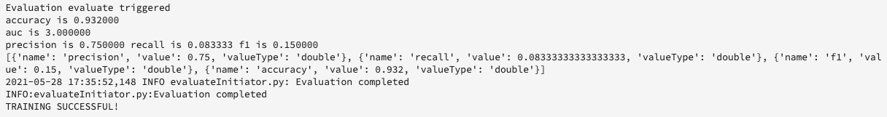

## Data Saver file {#data-saver-file}

The `datasaver.py` file contains the `save()` function and is used to save your prediction while testing scoring. The `save()` function takes your prediction and using [!DNL Experience Platform Catalog] APIs, writes the data to the `scoringResultsDataSetId` you specified in your `scoring.conf` file. You may 

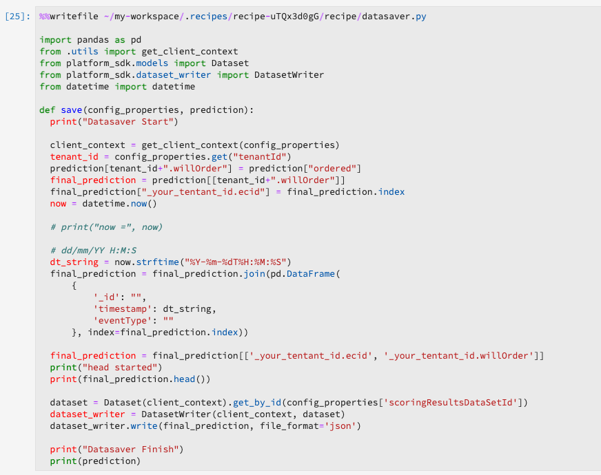

## Training and scoring {#training-and-scoring}

When you are done making changes to your notebook and want to train your recipe, you can select the associated buttons at the top of the bar to creating a training run in the cell. Upon selecting the button, a log of commands and outputs from the training script appears in the notebook (under the `evaluator.py` cell). Conda first installs all the dependencies, then the training is initiated.

Note that you must run training at least once before you can run scoring. Selecting the **[!UICONTROL Run Scoring]** button will score on the trained model that was generated during training. The scoring script appears under `datasaver.py`.

For debugging purposes, if you wish to see the hidden output, add `debug` to the end of the output cell and re-run it.


## Create a recipe {#create-recipe}

When you are done editing the recipe and satisfied with the training/scoring output, you can create a recipe from the notebook by selecting **[!UICONTROL Create Recipe]** in the top-right. 

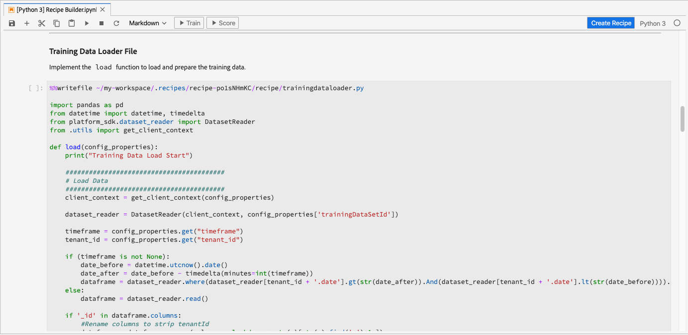

After selecting **[!UICONTROL Create Recipe]**, you are prompted to enter a recipe name. This name represents the actual recipe created on [!DNL Platform].


Once you select **[!UICONTROL Ok]**, the recipe creation process begins. This can take some time and a progress bar is displayed in place of the create recipe button. Once complete, you can select the **[!UICONTROL View Recipes]** button to take you to the **[!UICONTROL Recipes]** tab under **[!UICONTROL ML Models]**

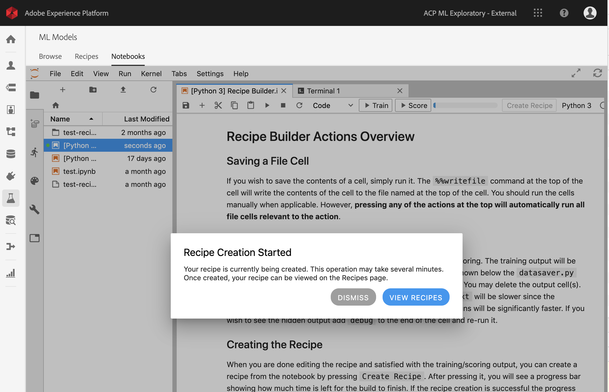

>[!CAUTION]
>
> - Do not delete any of the file cells
> - Do not edit the `%%writefile` line at the top of the file cells
> - Do not create recipes in different notebooks at the same time

## Next steps {#next-steps}

By completing this tutorial, you have learned how to create a machine learning model in the [!UICONTROL Recipe Builder] notebook. You have also learned how to exercise the notebook to recipe workflow.

To continue learning how to work with resources within [!DNL Data Science Workspace], please visit the [!DNL Data Science Workspace] recipes and models dropdown.