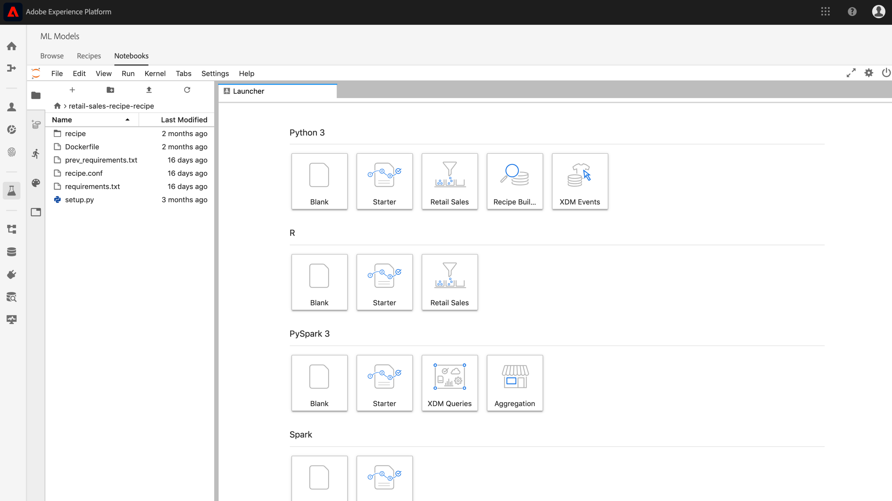
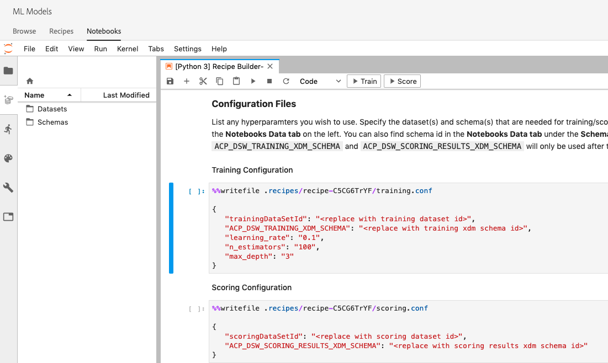
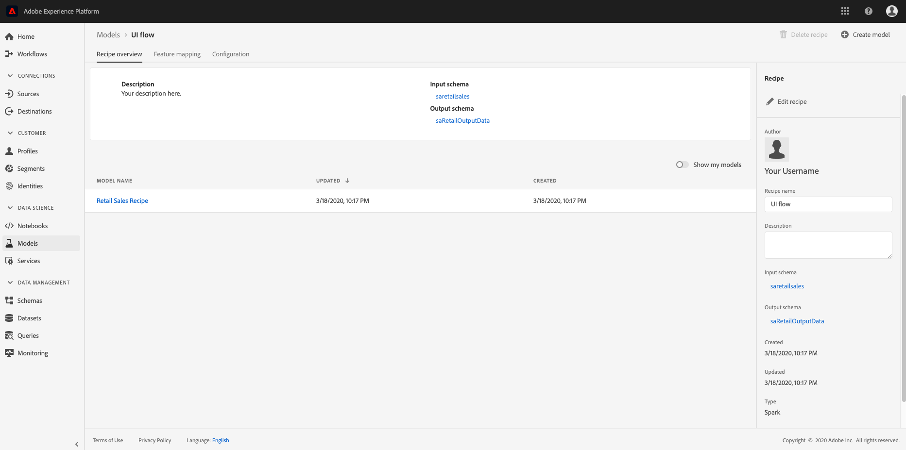

# Create a recipe using Jupyter notebooks

This tutorial will go over two main sections. First, you will create a machine learning model using a template within JupyterLab Notebook. Next, you will exercise the notebook to recipe workflow within JupyterLab to create a recipe within Data Science Workspace. 
- [Get started with the JupyterLab notebook environment](#get-started-with-the-jupyterlab-notebook-environment)
- [Make edits to recipe files](#make-edits-to-recipe-files)
- [Get started with the Recipe Builder notebook](#get-started-with-the-recipe-builder-notebook)
    - [Requirements file](#requirements-file)
    - [Configuration files](#configuration-files)
    - [Training data loader](#training-data-loader)
    - [Scoring data loader](#scoring-data-loader)
    - [Pipeline file](#pipeline-file)
    - [Evaluator file](#evaluator-file)
    - [Data Saver file](#data-saver-file)
- [Training and scoring](#training-and-scoring)
- [Create a recipe](#create-recipe)

## Concepts introduced:

- **Recipes:** A recipe is Adobe's term for a model specification and is a top-level container representing a specific machine learning, AI algorithm or ensemble of algorithms, processing logic, and configuration required to build and execute a trained model and hence help solve specific business problems.
- **Model:** A model is an instance of a machine learning recipe that is trained using historical data and configurations to solve for a business use case.
- **Training:** Training is the process of learning patterns and insights from labeled data.
- **Scoring:** Scoring is the process of generating insights from data using a trained model.

## Get started with the JupyterLab notebook environment

Creating a recipe from scratch can be done within Data Science Workspace. To start, navigate to [Adobe Experience Platform](https://platform.adobe.com) and click on the **ML Models** tab on the left to get to the Data Science Workspace. From here, click on the **Notebooks** sub-tab and on the Jupyterlab launcher screen, create a new notebook by select the Recipe Builder template.

The Recipe Builder notebook allows you to run training and scoring runs inside the notebook. This gives you the flexibility to make changes to their `train()` and `score()` methods in between running experiments on the training and scoring data. Once you are happy with the outputs of the training and scoring, you can create a recipe to be used in Data Science Workspace using the notebook to recipe functionality built in to the Recipe Builder notebook.

>[!NOTE] The Recipe Builder notebook supports working with all file formats but currently the Create Recipe functionality only supports Python.



When you click on the Recipe Builder notebook from the launcher, the notebook will be opened in the tab. The template used in the notebook is the Python Retail Sales Forecasting Recipe which can also be found in [this public repository](https://github.com/adobe/experience-platform-dsw-reference/tree/master/recipes/python/retail/)

You will notice that in the toolbar there are three additional actions namely – **Train**, **Score** and **Create Recipe**. These icons will only appear in the Recipe Builder notebook. More information about these actions will be talked about [in the training and scoring section](#training-and-scoring) after building your Recipe in the notebook.


## Make edits to recipe files

<!-- Databricks update to recipe needed -->
To make edits to the recipe files, navigate to the cell in Jupyter corresponding to the file path. For example, if you want to make changes to `evaluator.py`, look for `%%writefile demo-recipe/evaluator.py`. 

Start making necessary changes to the cell and when finished, simply run the cell. The `%%writefile filename.py` command will write the contents of the cell to the `filename.py`. You will have to manually run the cell for each file with changes.

>[!NOTE] You should run the cells manually when applicable. 

## Get started with the Recipe Builder notebook

Now that you know the basics for the JupyterLab notebook environment, you can begin looking at the files that make up a machine learning model recipe. The files we will talk about are shown here:

- [Requirements file](#requirements-file)
- [Configuration files](#configuration-files)
- [Training data loader](#training-data-loader)
- [Scoring data loader](#scoring-data-loader)
- [Pipeline file](#pipeline-file)
- [Evaluator file](#evaluator-file)
- [Data Saver file](#data-saver-file)


### Requirements file

The requirements file is used to declare additional libraries you wish to use in the recipe. You can specify the version number if there is a dependency. To look for additional libraries, visit https://anaconda.org. The list of main libraries already in use include:

```JSON
python=3.5.2
scikit-learn
pandas
numpy
data_access_sdk_python
```

>[!NOTE] Libraries or specific versions you add may be incompatible with the above libraries.


### Configuration files

The configuration files, `training.conf` and `scoring.conf`, are used to specify the datasets you wish to use for training and scoring as well as adding hyperparameters. There are separate configurations for training and scoring. 

Users must fill in the following variables before running training and scoring:
- `trainingDataSetId`
- `ACP_DSW_TRAINING_XDM_SCHEMA`
- `scoringDataSetId`
- `ACP_DSW_SCORING_RESULTS_XDM_SCHEMA`
- `scoringResultsDataSetId`

To find the dataset and schema IDs, go to the Data Tab within notebooks on the left navigation bar (under the folder icon).



The same information can be found on [Adobe Experience Platform](https://platform.adobe.com/) under the **[Schema](https://platform.adobe.com/schema)** and **[Datasets](https://platform.adobe.com/dataset/overview)** tabs.

By default, the following configuration parameters are set for you when you access data:

- `ML_FRAMEWORK_IMS_USER_CLIENT_ID` 
- `ML_FRAMEWORK_IMS_TOKEN` 
- `ML_FRAMEWORK_IMS_ML_TOKEN` 
- `ML_FRAMEWORK_IMS_TENANT_ID` 


## Training data loader

The purpose of the Training Data Loader is to instantiate data used for creating the machine learning model. Typically, there are two tasks that the training data loader will accomplish:
- Load data from Platform
- Data preparation and feature engineering

The following two sections will go over loading data and data preparation. 

### Loading data 

This step uses the [pandas dataframe](https://pandas.pydata.org/pandas-docs/stable/generated/pandas.DataFrame.html). Data can be loaded from files in Adobe Experience Platform using either the Platform SDK (`platform_sdk`), or from external sources using pandas' `read_csv()` or `read_json()` functions.

- [Platform SDK](#platform-sdk)
- [External sources](#external-sources)

>[!NOTE] In the Recipe Builder notebook, data is loaded via the `platform_sdk` data loader.

### Platform SDK

For an in-depth tutorial on using the `platform_sdk` data loader, please visit the [Platform SDK guide](../authoring/platform-sdk.md). This tutorial provides information on build authentication, basic reading of data, and basic writing of data.

### External sources 

This section shows you how to import a JSON or CSV file to a pandas object. Official documentation from the pandas library can be found here:
- [read_csv](https://pandas.pydata.org/pandas-docs/stable/generated/pandas.read_csv.html)
- [read_json](https://pandas.pydata.org/pandas-docs/stable/generated/pandas.read_json.html)

First, here is an example of importing a CSV file. The `data` argument is the path to the CSV file. This variable was imported from the `configProperties` in the [previous section](#configuration-files).

```PYTHON
df = pd.read_csv(data)
```

You can also import from a JSON file. The `data` argument is the path to the CSV file. This variable was imported from the `configProperties` in the [previous section](#configuration-files).

```PYTHON
df = pd.read_json(data)
```

Now your data is in the dataframe object and can be analyzed and manipulated in the [next section](#data-preparation-and-feature-engineering).


### From Data Access SDK (Deprecated)

>[!CAUTION]  `data_access_sdk_python` is no longer recommended, please see [Convert Data Access code to Platform SDK](../authoring/platform-sdk.md) for a guide on using the `platform_sdk` data loader.

Users can load data using the Data Access SDK. The library can be imported at the top of the page by including the line:

`from data_access_sdk_python.reader import DataSetReader`

We then use the `load()` method to grab the training dataset from the `trainingDataSetId` as set in our configuration (`recipe.conf`) file.

```PYTHON
prodreader = DataSetReader(client_id=configProperties['ML_FRAMEWORK_IMS_USER_CLIENT_ID'],
                           user_token=configProperties['ML_FRAMEWORK_IMS_TOKEN'],
                           service_token=configProperties['ML_FRAMEWORK_IMS_ML_TOKEN'])

df = prodreader.load(data_set_id=configProperties['trainingDataSetId'],
                     ims_org=configProperties['ML_FRAMEWORK_IMS_TENANT_ID'])
```

>[!NOTE] As mentioned in the [Configuration File section](#configuration-files), the following configuration parameters are set for you when you access data from Experience Platform:
> - `ML_FRAMEWORK_IMS_USER_CLIENT_ID` 
> - `ML_FRAMEWORK_IMS_TOKEN` 
> - `ML_FRAMEWORK_IMS_ML_TOKEN` 
> - `ML_FRAMEWORK_IMS_TENANT_ID` 

Now that you have your data, you can begin with data preparation and feature engineering.

### Data preparation and feature engineering

After the data is loaded, the data undergoes preparation and is then split to the `train` and `val` datasets. Sample code is seen below:

```PYTHON
#########################################
# Data Preparation/Feature Engineering
#########################################
dataframe.date = pd.to_datetime(dataframe.date)
dataframe['week'] = dataframe.date.dt.week
dataframe['year'] = dataframe.date.dt.year

dataframe = pd.concat([dataframe, pd.get_dummies(dataframe['storeType'])], axis=1)
dataframe.drop('storeType', axis=1, inplace=True)
dataframe['isHoliday'] = dataframe['isHoliday'].astype(int)

dataframe['weeklySalesAhead'] = dataframe.shift(-45)['weeklySales']
dataframe['weeklySalesLag'] = dataframe.shift(45)['weeklySales']
dataframe['weeklySalesDiff'] = (dataframe['weeklySales'] - dataframe['weeklySalesLag']) / dataframe['weeklySalesLag']
dataframe.dropna(0, inplace=True)

dataframe = dataframe.set_index(dataframe.date)
dataframe.drop('date', axis=1, inplace=True) 
```

In this example, there are five things being done to the original dataset:
- add `week` and `year` columns
- convert `storeType` to an indicator variable
- convert `isHoliday` to a numeric variable
- offset `weeklySales` to get future and past sales value
- split data, by date, to `train` and `val` dataset

First, `week` and `year` columns are created and the original `date` column converted to Python [datetime](https://pandas.pydata.org/pandas-docs/stable/generated/pandas.to_datetime.html). Week and year values are extracted from the datetime object.

Next, `storeType` is converted to three columns representing the three different store types, (`A`, `B`, and `C`). Each will contain a boolean value to state which `storeType` is true. The `storeType` column will be dropped.

Similarly, `weeklySales` changes the `isHoliday` boolean to a numerical representation, one or zero.

This data is split between `train` and `val` dataset.

The `load()` function should complete with the `train` and `val` dataset as the output.

### Scoring data loader

The procedure to load data for scoring is similar to the loading training data in the `split()` function. We use the Data Access SDK to load data from the `scoringDataSetId` found in our `recipe.conf` file. 

```PYTHON
def load(configProperties):

    print("Scoring Data Load Start")

    #########################################
    # Load Data
    #########################################
    prodreader = DataSetReader(client_id=configProperties['ML_FRAMEWORK_IMS_USER_CLIENT_ID'],
                               user_token=configProperties['ML_FRAMEWORK_IMS_TOKEN'],
                               service_token=configProperties['ML_FRAMEWORK_IMS_ML_TOKEN'])

    df = prodreader.load(data_set_id=configProperties['scoringDataSetId'],
                         ims_org=configProperties['ML_FRAMEWORK_IMS_TENANT_ID'])
```

After loading the data, data preparation and feature engineering is done. 

```PYTHON
#########################################
# Data Preparation/Feature Engineering
#########################################
df.date = pd.to_datetime(df.date)
df['week'] = df.date.dt.week
df['year'] = df.date.dt.year

df = pd.concat([df, pd.get_dummies(df['storeType'])], axis=1)
df.drop('storeType', axis=1, inplace=True)
df['isHoliday'] = df['isHoliday'].astype(int)

df['weeklySalesAhead'] = df.shift(-45)['weeklySales']
df['weeklySalesLag'] = df.shift(45)['weeklySales']
df['weeklySalesDiff'] = (df['weeklySales'] - df['weeklySalesLag']) / df['weeklySalesLag']
df.dropna(0, inplace=True)

df = df.set_index(df.date)
df.drop('date', axis=1, inplace=True)

print("Scoring Data Load Finish")

return df
```

Since the purpose of our model is to predict future weekly sales, you will need to create a scoring dataset used to evaluate how well the model's prediction performs.

This Recipe Builder notebook does this by offsetting our weeklySales 7 days forwards. Notice that there are measurements for 45 stores every week so you can shift the `weeklySales` values 45 datasets forwards into a new column called `weeklySalesAhead`.

```PYTHON
df['weeklySalesAhead'] = df.shift(-45)['weeklySales']
```

Similarly, you can create a column `weeklySalesLag` by shifted 45 back. Using this you can also calculate the difference in weekly sales and store them in column `weeklySalesDiff`.

```PYTHON
df['weeklySalesLag'] = df.shift(45)['weeklySales']
df['weeklySalesDiff'] = (df['weeklySales'] - df['weeklySalesLag']) / df['weeklySalesLag']
```

Since you are offsetting the `weeklySales` datapoints 45 datasets forwards and 45 datasets backwards to create new columns, the first and last 45 data points will have NaN values. You can remove these points from our dataset by using the `df.dropna()` function which removes all rows that have NaN values.

```PYTHON
df.dropna(0, inplace=True)
```

The `load()` function in your scoring data loader should complete with the scoring dataset as the output.


### Pipeline file

The `pipeline.py` file includes logic for training and scoring. We will go over both in the next two sections.

### Training 

The purpose of training is to create a model using features and labels in your training dataset. 

>[!NOTE]  _Features_ refer to the input variable used by the machine learning model to predict the _labels_.

The `train()` function should include the training model and return the trained model. Some examples of different models can be found in the [scikit-learn user guide documentation](https://scikit-learn.org/stable/user_guide.html). 

After choosing your training model, you will fit your x and y training dataset to the model and the function will return the trained model. An example that shows this is as follows:

```PYTHON
def train(configProperties, data):

    print("Train Start")

    #########################################
    # Extract fields from configProperties
    #########################################
    learning_rate = float(configProperties['learning_rate'])
    n_estimators = int(configProperties['n_estimators'])
    max_depth = int(configProperties['max_depth'])


    #########################################
    # Fit model
    #########################################
    X_train = data.drop('weeklySalesAhead', axis=1).values
    y_train = data['weeklySalesAhead'].values

    seed = 1234
    model = GradientBoostingRegressor(learning_rate=learning_rate,
                                      n_estimators=n_estimators,
                                      max_depth=max_depth,
                                      random_state=seed)

    model.fit(X_train, y_train)

    print("Train Complete")

    return model
```

Notice that depending on your application, you will have arguments in your `GradientBoostingRegressor()` function. `xTrainingDataset` should contain your features used for training while `yTrainingDataset` should contain your labels.


### Scoring 

The `score()` function should contain the scoring algorithm and return a measurement to indicate how successful the model performs. The `score()` function uses the scoring dataset labels and the trained model to generate a set of predicted features. These predicted values are then compared with the actual features in the scoring dataset. In this example, the `score()` function uses the trained model to predict features using the labels from the scoring dataset. The predicted features are returned.

```PYTHON
def score(configProperties, data, model):

    print("Score Start")

    X_test = data.drop('weeklySalesAhead', axis=1).values
    y_test = data['weeklySalesAhead'].values
    y_pred = model.predict(X_test)

    data['prediction'] = y_pred
    data = data[['store', 'prediction']].reset_index()
    data['date'] = data['date'].astype(str)

    print("Score Complete")

    return data
```

### Evaluator file

The `evaluator.py` file contains logic for how you wish to evaluate your trained recipe as well as how your training data should be split. In the retail sales example, the logic for loading and preparing the training data will be included. We will go over the two sections below.

### Split the dataset 

The data preparation phase for training requires splitting the dataset to be used for training and testing. This `val` data will be used implicitly to evaluate the model after it is trained. This process is separate from scoring. 

This section will show the `split()` function which will first load data into the notebook, then clean up the data by removing unrelated columns in the dataset. From there, you will be able to perform feature engineering which is the process to create additional relevant features from existing raw features in the data. An example of this process can be seen below along with an explanation.

The `split()` function is shown below. The dataframe provided in the argument will be split to the `train` and `val` variables to be returned.

```PYTHON
def split(self, configProperties={}, dataframe=None):
    train_start = '2010-02-12'
    train_end = '2012-01-27'
    val_start = '2012-02-03'
    train = dataframe[train_start:train_end]
    val = dataframe[val_start:]

    return train, val
```

### Evaluate the trained model

The `evaluate()` function is performed after the model is trained and will return a metric to indicate how successful the model performs. The `evaluate()` function uses the testing dataset labels and the Trained model to predict a set of features. These predicted values are then compared with actual features in the testing dataset. Common scoring algorithms include:
- [Mean absolute percentage error (MAPE)](https://en.wikipedia.org/wiki/Mean_absolute_percentage_error)
- [Mean absolute error (MAE)](https://en.wikipedia.org/wiki/Mean_absolute_error)
- [Root-mean-square error (RMSE)](https://en.wikipedia.org/wiki/Root-mean-square_deviation)


The `evaluate()` function in the retail sales sample is shown below:

```PYTHON
def evaluate(self, data=[], model={}, configProperties={}):
    print ("Evaluation evaluate triggered")
    val = data.drop('weeklySalesAhead', axis=1)
    y_pred = model.predict(val)
    y_actual = data['weeklySalesAhead'].values
    mape = np.mean(np.abs((y_actual - y_pred) / y_actual))
    mae = np.mean(np.abs(y_actual - y_pred))
    rmse = np.sqrt(np.mean((y_actual - y_pred) ** 2))

    metric = [{"name": "MAPE", "value": mape, "valueType": "double"},
                {"name": "MAE", "value": mae, "valueType": "double"},
                {"name": "RMSE", "value": rmse, "valueType": "double"}]

    return metric
```

Notice that the function returns a `metric` object containing an array of evaluation metrics. These metrics will be used to evaluate how well the trained model performs.

### Data Saver file

The `datasaver.py` file contains the `save()` function to save your prediction while testing scoring. The `save()` function will take your prediction and using Experience Platform Catalog APIs, write the data to the `scoringResultsDataSetId` you specified in your `scoring.conf` file.

The example used in the retail sales sample recipe is seen here. Note the use of `DataSetWriter` library to write data to Platform:

```PYTHON
from data_access_sdk_python.writer import DataSetWriter

def save(configProperties, prediction):
    print("Datasaver Start")
    print("Setting up Writer")

    catalog_url = "https://platform.adobe.io/data/foundation/catalog"
    ingestion_url = "https://platform.adobe.io/data/foundation/import"

    writer = DataSetWriter(catalog_url=catalog_url,
                           ingestion_url=ingestion_url,
                           client_id=configProperties['ML_FRAMEWORK_IMS_USER_CLIENT_ID'],
                           user_token=configProperties['ML_FRAMEWORK_IMS_TOKEN'],
                           service_token=configProperties['ML_FRAMEWORK_IMS_ML_TOKEN'])

    print("Writer Configured")

    writer.write(data_set_id=configProperties['scoringResultsDataSetId'],
                 dataframe=prediction,
                 ims_org=configProperties['ML_FRAMEWORK_IMS_TENANT_ID'])

    print("Write Done")
    print("Datasaver Finish")
    print(prediction)
```


## Training and scoring

When you are done making changes to your notebook and want to train your recipe, you can click on the associated buttons at the top of the bar to creating a training run in the cell. Upon clicking the button, a log of commands and outputs from the training script will appear in the notebook (under the `evaluator.py` cell). Conda first installs all the dependencies, then the training is initiated.

Note that you must run training at least once before you can run scoring. Clicking on the **Run Scoring** button will score on the trained model that was generated during training. The scoring script will appear under `datasaver.py`.

For debugging purposes, if you wish to see the hidden output, add `debug` to the end of the output cell and re-run it.

## Create recipe

When you are done editing the recipe and satisfied with the training/scoring output, you can create a recipe from the notebook by pressing **Create Recipe**. After pressing the button, you will be prompted to enter a recipe name. This name will represent the actual recipe created on Platform.


Once you press **Ok** you will be able to navigate to the new recipe on [Adobe Experience Platform](https://platform.adobe.com/). You can click on the **View Recipes** button to take you to the **Recipes** tab under **ML Models**


Once the process is complete, the recipe will look something like this:



>[!CAUTION]
> - Do not delete any of the file cells
> - Do not edit the `%%writefile` line at the top of the file cells
> - Do not create recipes in different notebooks at the same time

## Next steps

By completing this tutorial, you have learned how to create a machine learning model in the Recipe Builder notebook. You have also learned how to exercise the notebook to recipe workflow within the notebook to create a recipe within Data Science Workspace.

To continue learning how to work with resources within Data Science Workspace, please visit the Data Science Workspace recipes and models dropdown.

## Additional resources

The following video is designed to support your understanding of building and deploying models.

>[!VIDEO](https://docs.adobe.com/content/help/en/platform-learn/tutorials/data-science-workspace/build-and-deploy-a-model.html)


