# Exploring web-based data for predictive models using the exploratory data analysis (EDA) notebook

The exploratory data analysis (EDA) notebook is designed to assist you with discovering patterns in data, checking data sanity, and summarizing the relevant data for predictive models.

The EDA notebook example was optimized with web-based data in mind and consists of two parts. Part one starts with using Query Service to view trends and data snapshots. Next, with a goal in mind for exploratory data analysis, the data is aggregated at the profile and visitor level. 

Part two starts by performing descriptive analysis on aggregated data using Python libraries. This notebook showcases visualizations such as histograms, scatter plots, box plots, and a correlation matrix to derive actionable insights used to determine which features are most likely to be helpful in predicting a goal.

## Getting started

Before reading this guide, please review the [[!DNL JupyterLab] user guide](./overview.md) for a high-level introduction to [!DNL JupyterLab] and its role within Data Science Workspace. Additionally, if you are using your own data, please review the documentation for [data access in [!DNL Jupyterlab] notebooks](./access-notebook-data.md). This guide contains important information on notebook data limits.

This notebook uses a midvalues dataset in the form of Adobe Analytics Experience Events data found in the Analytics Analysis Workspace. In order to use the EDA notebook, you are required to define your data table with the following values `target_table` and `target_table_id`. Any midvalues dataset can be used. 

To find these values, follow the steps outlined in the [write to a dataset in python](./access-notebook-data.md#write-python) section of the JupyterLab data access guide. The dataset name (`target_table`) is located in the dataset directory. Once you right click the dataset to explore or write data in a notebook, a dataset ID (`target_table_id`) is provided in the executable code entry. 

## Data discovery

This section contains configuration steps and example queries used to view trends such as the "top ten cities by user activity" or "top ten viewed products".

### Configuration of libraries

JupyterLab supports multiple libraries. The following code can be pasted and run in a code cell to collect and install all the required packages used in this example. You can use additional or alternative packages outside of this example for your own data analysis. For a list of the supported packages, copy and paste `!pip list --format=columns` in a new cell.

```python
!pip install colorama
import chart_studio.plotly as py
import plotly.graph_objs as go
from plotly.offline import iplot
from scipy import stats
import numpy as np
import warnings
warnings.filterwarnings('ignore')
from scipy.stats import pearsonr
import matplotlib.pyplot as plt
from scipy.stats import pearsonr
import pandas as pd
import math
import re
import seaborn as sns
from datetime import datetime
import colorama
from colorama import Fore, Style
pd.set_option('display.max_columns', None)
pd.set_option('display.max_rows', None)
pd.set_option('display.width', 1000)
pd.set_option('display.expand_frame_repr', False)
pd.set_option('display.max_colwidth', -1)
```

### Connect to Adobe Experience Platform [!DNL Query Service]

[!DNL JupyterLab] on Platform allows you to use SQL in a [!DNL Python] notebook to access data through [Query Service](https://www.adobe.com/go/query-service-home-en). Accessing data through [!DNL Query Service] can be useful for dealing with large datasets due to its superior running times. Be advised that querying data using [!DNL Query Service] has a processing time limit of ten minutes.

Before you use [!DNL Query Service] in [!DNL JupyterLab], ensure you have a working understanding of the [[!DNL Query Service] SQL syntax](https://www.adobe.com/go/query-service-sql-syntax-en).

In order to utilize Query Service in JupyterLab, you must first create a connection between your working Python notebook and Query Service. This can be achieved by executing the following cell.

```python
qs_connect()
```

### Define the midvalues dataset for exploration

In order to begin querying and exploring data, a midvalues dataset table must be supplied. Copy and replace the `table_name` and `table_id` values with your own data table values.

```python
target_table = "table_name"
target_table_id = "table_id"
```

Once complete, this cell should look similar to the following example:

```python
target_table = "cross_industry_demo_midvalues"
target_table_id = "5f7c40ef488de5194ba0157a"
```

### Explore the dataset for available dates

Using the cell provided below, you are able to view the date range covered in the table. The purpose of exploring the number of days, first date, and last date, is to assist with selecting a date range for further analysis.

```python
%%read_sql -c QS_CONNECTION
SELECT distinct Year(timestamp) as Year, Month(timestamp) as Month, count(distinct DAY(timestamp)) as Count_days, min(DAY(timestamp)) as First_date, max(DAY(timestamp)) as Last_date, count(timestamp) as Count_hits
from {target_table}
group by Month(timestamp), Year(timestamp)
order by Year, Month;
```

Running the cell produces the following output:


### Configure dates for dataset discovery

After determining the available dates for dataset discovery, the parameters below need to be updated. The dates configured in this cell are only used for data discovery in the form of queries. The dates are updated again to suitable ranges for exploratory data analysis later in this guide.

```python
target_year = "2020" ## The target year
target_month = "02" ## The target month
target_day = "(01,02,03)" ## The target days
```

### Dataset discovery

Once you have configured all your parameters, started [!DNL Query Service], and have a date range, you are ready to begin reading rows of data. You should limit the number of rows you read.

```python
from platform_sdk.dataset_reader import DatasetReader
from datetime import date
dataset_reader = DatasetReader(PLATFORM_SDK_CLIENT_CONTEXT, dataset_id=target_table_id)
# If you do not see any data or would like to expand the default date range, change the following query
Table = dataset_reader.limit(5).read()
```

To view the number of columns available in the dataset, use the following cell:

```python
print("\nNumber of columns:",len(Table.columns))
```

To view the rows of the dataset, use the following cell. In this example, the number of rows are limited to five.

```python
Table.head(5)
```

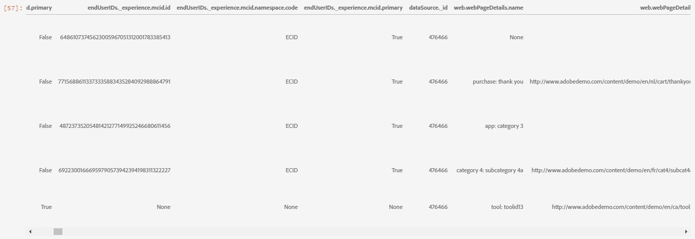

Once you have an idea of what data is contained in the dataset, it can be valuable to further break down the dataset. In this example, the column names and data types for each of the columns are listed, while the output is used to check if the data type is correct or not.

```python
ColumnNames_Types = pd.DataFrame(Table.dtypes)
ColumnNames_Types = ColumnNames_Types.reset_index()
ColumnNames_Types.columns = ["Column_Name", "Data_Type"]
ColumnNames_Types
```

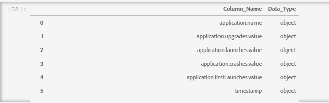

### Dataset trend exploration

The following section contains four example queries used to explore trends and patterns in data. The examples provided below are not exhaustive but cover some of the more commonly looked at features.

**Hourly activity count for a given day**

This query analyzes the number of actions and clicks throughout the day. The output is represented in the form of a table containing metrics on the activity count for each hour of the day.

```sql
%%read_sql query_2_df -c QS_CONNECTION

SELECT Substring(timestamp, 12, 2)                        AS Hour, 
       Count(enduserids._experience.aaid.id) AS Count 
FROM   {target_table}
WHERE  Year(timestamp) = {target_year} 
       AND Month(timestamp) = {target_month}  
       AND Day(timestamp) in {target_day}
GROUP  BY Hour
ORDER  BY Hour;
```

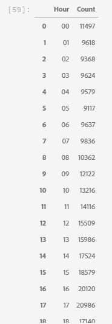

After confirming the query works, the data can be presented in a univariate plot histogram for visual clarity.

```python
trace = go.Bar(
    x = query_2_df['Hour'],
    y = query_2_df['Count'],
    name = "Activity Count"
)

layout = go.Layout(
    title = 'Activity Count by Hour of Day',
    width = 1200,
    height = 600,
    xaxis = dict(title = 'Hour of Day'),
    yaxis = dict(title = 'Count')
)

fig = go.Figure(data = [trace], layout = layout)
iplot(fig)
```

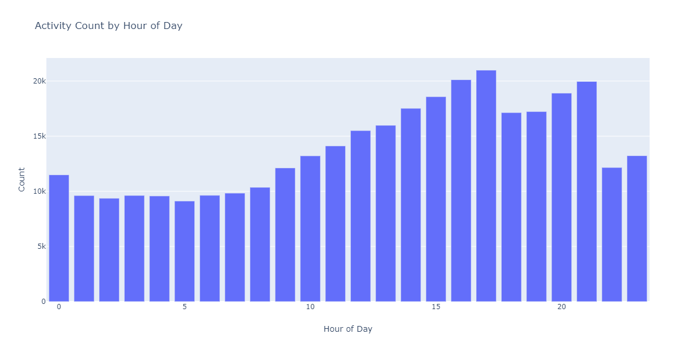

**Top 10 viewed pages for a given day**

This query analyzes which pages are the most viewed for a given day. The output is represented in the form of a table containing metrics on the page name and page view count.

```sql
%%read_sql query_4_df -c QS_CONNECTION

SELECT web.webpagedetails.name                 AS Page_Name, 
       Sum(web.webpagedetails.pageviews.value) AS Page_Views 
FROM   {target_table}
WHERE  Year(timestamp) = {target_year}
       AND Month(timestamp) = {target_month}
       AND Day(timestamp) in {target_day}
GROUP  BY web.webpagedetails.name 
ORDER  BY page_views DESC 
LIMIT  10;
```

After confirming the query works, the data can be presented in a univariate plot histogram for visual clarity.

```python
trace = go.Bar(
    x = query_4_df['Page_Name'],
    y = query_4_df['Page_Views'],
    name = "Page Views"
)

layout = go.Layout(
    title = 'Top Ten Viewed Pages For a Given Day',
    width = 1000,
    height = 600,
    xaxis = dict(title = 'Page_Name'),
    yaxis = dict(title = 'Page_Views')
)

fig = go.Figure(data = [trace], layout = layout)
iplot(fig)
```

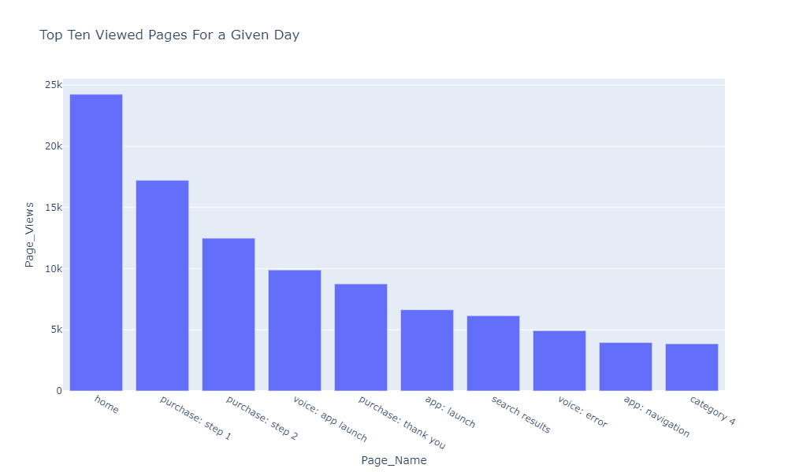

**Top ten cities grouped by user activity**

This query analyzes which cities the data is originating from.

```sql
%%read_sql query_6_df -c QS_CONNECTION

SELECT concat(placeContext.geo.stateProvince, ' - ', placeContext.geo.city) AS state_city, 
       Count(timestamp)                                                     AS Count
FROM   {target_table}
WHERE  Year(timestamp) = {target_year}
       AND Month(timestamp) = {target_month}
       AND Day(timestamp) in {target_day}
GROUP  BY state_city
ORDER  BY Count DESC
LIMIT  10;
```

After confirming the query works, the data can be presented in a univariate plot histogram for visual clarity.

```python
trace = go.Bar(
    x = query_6_df['state_city'],
    y = query_6_df['Count'],
    name = "Activity by City"
)

layout = go.Layout(
    title = 'Top Ten Cities by User Activity',
    width = 1200,
    height = 600,
    xaxis = dict(title = 'City'),
    yaxis = dict(title = 'Count')
)

fig = go.Figure(data = [trace], layout = layout)
iplot(fig)
```

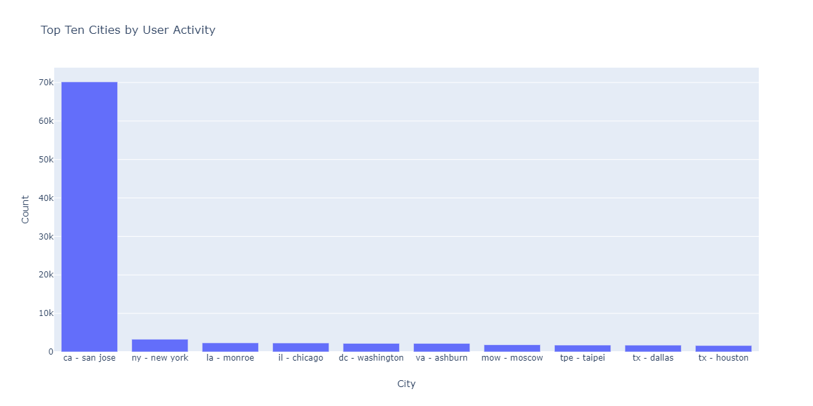

**Top ten viewed products**

This query provides a list of the top ten viewed products. In the example below, the `Explode()` function is used to return each product in the `productlistitems` object to its own row. This allows you to do a nested query to aggregate product views for different SKU's.

```sql
%%read_sql query_7_df -c QS_CONNECTION

SELECT Product_List_Items.sku AS Product_SKU,
       Sum(Product_Views) AS Total_Product_Views
FROM  (SELECT Explode(productlistitems) AS Product_List_Items, 
              commerce.productviews.value   AS Product_Views 
       FROM   {target_table}
       WHERE  Year(timestamp) = {target_year}
              AND Month(timestamp) = {target_month}
              AND Day(timestamp) in {target_day}
              AND commerce.productviews.value IS NOT NULL) 
GROUP BY Product_SKU 
ORDER BY Total_Product_Views DESC
LIMIT  10;
```

After confirming the query works, the data can be presented in a univariate plot histogram for visual clarity.

```python
trace = go.Bar(
    x = "SKU-" + query_7_df['Product_SKU'],
    y = query_7_df['Total_Product_Views'],
    name = "Product View"
)

layout = go.Layout(
    title = 'Top Ten Viewed Products',
    width = 1200,
    height = 600,
    xaxis = dict(title = 'SKU'),
    yaxis = dict(title = 'Product View Count')
)

fig = go.Figure(data = [trace], layout = layout)
iplot(fig)
```

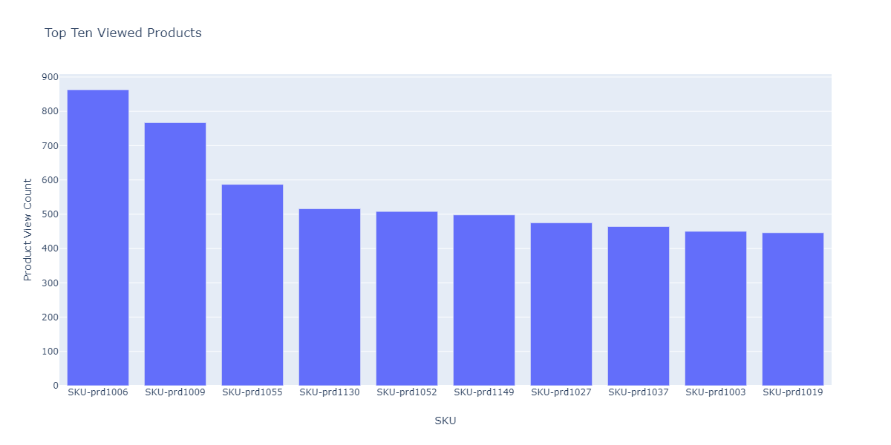

After exploring the trends and patterns of the data, you should have a good idea as to what features you want to build for a prediction of a goal. Skimming through tables can quickly highlight the form of each data attribute, obvious misrepresentations, and large outliers in the values and start to suggest candidate relationships to explore between attributes.

## Exploratory data analysis

Exploratory data analysis is used to refine your understanding of the data and build an intuition for compelling questions that can be used as the basis for your modeling. 

After finishing the data discovery step, you will have explored at the event level data with some aggregations at the event, city, or user ID level to see trends for a day. Although this data is important, it does not give a full picture. You still do not understand what drives a purchase on your website. 

To understand this, you need to aggregate data at a profile/visitor level, define a purchase goal, and apply statistical concepts such as correlation, box plots, and scatter plots. These methods are used to compare patterns of activities for buyers vs non-buyers in the prediction window you define.

The following features are created and explored in this section:

- `COUNT_UNIQUE_PRODUCTS_PURCHASED`: The number of unique products purchased.
- `COUNT_CHECK_OUTS`: The number of check outs.
- `COUNT_PURCHASES`: The number of purchases.
- `COUNT_INSTANCE_PRODUCTADDS`: The number of product add instances.
- `NUMBER_VISITS`: The number of visits.
- `COUNT_PAID_SEARCHES`: The number of paid searches.
- `DAYS_SINCE_VISIT`: The number of days since the last visit.
- `TOTAL_ORDER_REVENUE`: The total order revenue.
- `DAYS_SINCE_PURCHASE`: The number of days since the previous purchase.
- `AVG_GAP_BETWEEN_ORDERS_DAYS`: The average gap between purchases in days.
- `STATE_CITY`: Contains the state and city.

Before you continue with your data aggregation, you need to define the parameters for the prediction variable used in exploratory data analysis. In other words, what do you want from your data science model? Common parameters include a goal, prediction period, and analysis period.

If you are using the EDA notebook, you are required to replace the values below before continuing.

```python
goal = "commerce.`order`.purchaseID" #### prediction variable
goal_column_type = "numerical" #### choose either "categorical" or "numerical"
prediction_window_day_start = "2020-01-01" #### YYYY-MM-DD
prediction_window_day_end = "2020-01-31" #### YYYY-MM-DD
analysis_period_day_start = "2020-02-01" #### YYYY-MM-DD
analysis_period_day_end = "2020-02-28" #### YYYY-MM-DD

### If the goal is a categorical goal then select threshold for the defining category and creating bins. 0 is no order placed, and 1 is at least one order placed:
threshold = 1
```

### Data aggregation for feature and goal creation

To begin exploratory analysis, you need to create a goal at the profile level, followed by aggregating your dataset. In this example, two queries are provided. The first query contains the creation of a goal. The second query needs to be updated to include any variables other than the ones in the first query. You may want to update the `limit` for your query. After performing the following queries, aggregated data is now available for exploration.

```sql
%%read_sql target_df -d -c QS_CONNECTION

SELECT DISTINCT endUserIDs._experience.aaid.id                  AS ID,
       Count({goal})                                            AS TARGET
FROM   {target_table}
WHERE DATE(TIMESTAMP) BETWEEN '{prediction_window_day_start}' AND '{prediction_window_day_end}'
GROUP BY endUserIDs._experience.aaid.id;
```

```sql
%%read_sql agg_data -d -c QS_CONNECTION

SELECT z.*, z1.state_city as STATE_CITY
from
((SELECT y.*,a2.AVG_GAP_BETWEEN_ORDERS_DAYS as AVG_GAP_BETWEEN_ORDERS_DAYS
from
(select a1.*, f.DAYS_SINCE_PURCHASE as DAYS_SINCE_PURCHASE
from
(SELECT DISTINCT a.ID  AS ID,
COUNT(DISTINCT Product_Items.SKU) as COUNT_UNIQUE_PRODUCTS_PURCHASED,
COUNT(a.check_out) as COUNT_CHECK_OUTS,
COUNT(a.purchases) as COUNT_PURCHASES, 
COUNT(a.product_list_adds) as COUNT_INSTANCE_PRODUCTADDS,
sum(CASE WHEN a.search_paid = 'TRUE' THEN 1 ELSE 0 END) as COUNT_PAID_SEARCHES,
DATEDIFF('{analysis_period_day_end}', MAX(a.date_a)) as DAYS_SINCE_VISIT,
ROUND(SUM(Product_Items.priceTotal * Product_Items.quantity), 2) AS TOTAL_ORDER_REVENUE
from 
(SELECT endUserIDs._experience.aaid.id as ID,
commerce.`checkouts`.value as check_out,
commerce.`order`.purchaseID as purchases, 
commerce.`productListAdds`.value as product_list_adds,
search.isPaid as search_paid,
DATE(TIMESTAMP) as date_a,
Explode(productlistitems) AS Product_Items
from {target_table}
Where DATE(TIMESTAMP) BETWEEN '{analysis_period_day_start}' AND '{analysis_period_day_end}') as a
group by a.ID) as a1
left join 
(SELECT DISTINCT endUserIDs._experience.aaid.id as ID,
DATEDIFF('{analysis_period_day_end}', max(DATE(TIMESTAMP))) as DAYS_SINCE_PURCHASE
from {target_table}
where DATE(TIMESTAMP) BETWEEN '{analysis_period_day_start}' AND '{analysis_period_day_end}'
and commerce.`order`.purchaseid is not null
GROUP BY endUserIDs._experience.aaid.id) as f
on f.ID = a1.ID
where a1.COUNT_PURCHASES>0) as y
left join
(select ab.ID, avg(DATEDIFF(ab.ORDER_DATES, ab.PriorDate)) as AVG_GAP_BETWEEN_ORDERS_DAYS
from
(SELECT distinct endUserIDs._experience.aaid.id as ID, TO_DATE(DATE(TIMESTAMP)) as ORDER_DATES, 
TO_DATE(LAG(DATE(TIMESTAMP),1) OVER (PARTITION BY endUserIDs._experience.aaid.id ORDER BY DATE(TIMESTAMP))) as PriorDate
FROM {target_table}
where DATE(TIMESTAMP) BETWEEN '{analysis_period_day_start}' AND '{analysis_period_day_end}'
AND commerce.`order`.purchaseid is not null) AS ab
where ab.PriorDate is not null
GROUP BY ab.ID) as a2
on a2.ID = y.ID) z    
left join
(select t.ID, t.state_city from
(
SELECT DISTINCT endUserIDs._experience.aaid.id as ID,
concat(placeContext.geo.stateProvince, ' - ', placeContext.geo.city) as state_city, 
ROW_NUMBER() OVER(PARTITION BY endUserIDs._experience.aaid.id ORDER BY DATE(TIMESTAMP) DESC) AS ROWNUMBER
FROM   {target_table}
WHERE  DATE(TIMESTAMP) BETWEEN '{analysis_period_day_start}' AND '{analysis_period_day_end}') as t
where t.ROWNUMBER = 1) z1
on z.ID = z1.ID)
limit 500000;
```

### Merge the features in the aggregated dataset with a goal

The following cell is used to merge the features in the aggregated dataset outlined in the previous example with your prediction goal.

```python
Data = pd.merge(agg_data,target_df, on='ID',how='left')
Data['TARGET'].fillna(0, inplace=True)
```

The next three example cells are used to make sure the merge was successful.

`Data.shape` returns the number of columns followed by the number of rows for example: (11913, 12).

```python
Data.shape
```

`Data.head(5)` returns a table with 5 rows of data. The returned table contains all 12 columns of aggregated data mapped to a profile ID.

```python
Data.head(5)
```

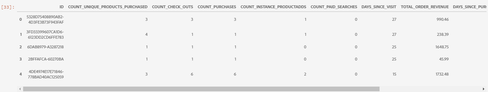

This cell prints the number of unique profiles.

```python
print("Count of unique profiles:", (len(Data)))
```

### Detect missing values and outliers

Once you have completed your data aggregation and merged it with your goal, you need to review the data sometimes referred to as a data health check.

This process involves identifying missing values and outliers. When issues are identified, the next task is to come up with specific strategies for handling them.

>[!NOTE]
>
>During this step, you may spot corruption in the values that can signal a fault in the data logging process.

```python
Missing = pd.DataFrame(round(Data.isnull().sum()*100/len(Data),2))
Missing.columns =['Percentage_missing_values'] 
Missing['Features'] = Missing.index
```

The following cell is used to visualize the missing values.

```python
trace = go.Bar(
    x = Missing['Features'],
    y = Missing['Percentage_missing_values'],
    name = "Percentage_missing_values")

layout = go.Layout(
    title = 'Missing values',
    width = 1200,
    height = 600,
    xaxis = dict(title = 'Features'),
    yaxis = dict(title = 'Percentage of missing values')
)

fig = go.Figure(data = [trace], layout = layout)
iplot(fig)
```

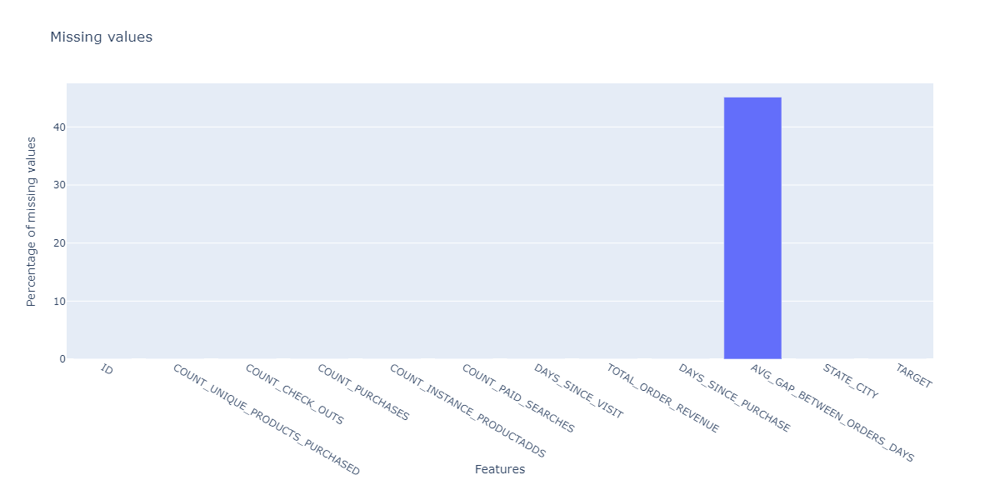

After detecting missing values, it is critical to identify outliers. Parametric statistics like the mean, standard deviation, and correlation are highly sensitive to outliers. Additionally, the assumptions of common statistical procedures such as linear regressions are also based on these statistics. This means outliers can really mess up an analysis.

To identify outliers, this example uses inter-quartile range. Inter-quartile range (IQR) is the range between the first and third quartiles (25th and 75th percentiles). This example gathers all the data points that fall under either 1.5 times the IQR below the 25th percentile, or 1.5 times the IQR above the 75th percentile. Values that fall under either of these are defined as an outlier in the following cell.

>[!TIP]
>
>Correcting outliers requires you to have an understanding of the business and industry you're working in. Sometimes, you can't drop an observation just because it is an outlier. Outliers can be legitimate observations and are often the most interesting ones. To learn more about dropping outliers, visit the [optional data cleaning step](#optional-data-clean).

```python
TARGET = Data.TARGET

Data_numerical = Data.select_dtypes(include=['float64', 'int64'])
Data_numerical.drop(['TARGET'],axis = 1,inplace = True)
Data_numerical1 = Data_numerical

for i in range(0,len(Data_numerical1.columns)):
    Q1 = Data_numerical1.iloc[:,i].quantile(0.25)
    Q3 = Data_numerical1.iloc[:,i].quantile(0.75)
    IQR = Q3 - Q1
    Data_numerical1.iloc[:,i] = np.where(Data_numerical1.iloc[:,i]<(Q1 - 1.5 * IQR),np.nan, np.where(Data_numerical1.iloc[:,i]>(Q3 + 1.5 * IQR),
                                                                                                    np.nan,Data_numerical1.iloc[:,i]))
    
Outlier = pd.DataFrame(round(Data_numerical1.isnull().sum()*100/len(Data),2))
Outlier.columns =['Percentage_outliers'] 
Outlier['Features'] = Outlier.index   
```

As always, it is important to visualize the results.

```python
trace = go.Bar(
    x = Outlier['Features'],
    y = Outlier['Percentage_outliers'],
    name = "Percentage_outlier")

layout = go.Layout(
    title = 'Outliers',
    width = 1200,
    height = 600,
    xaxis = dict(title = 'Features'),
    yaxis = dict(title = 'Percentage of outliers')
)

fig = go.Figure(data = [trace], layout = layout)
iplot(fig)
```

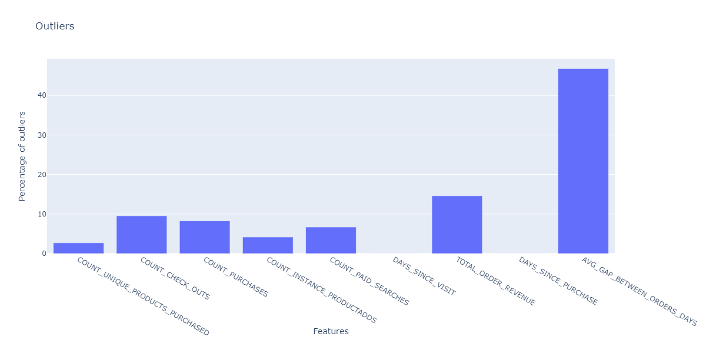

### Univariate analysis

Once your data has been corrected for missing values and outliers, you are able to start your analysis. There are three types of analysis: univariate, bivariate, and multivariate analysis. Univariate analysis takes data, summarizes, and finds patterns in the data using single variable relationships. Bivariate analysis looks at more than one variable at a time, while multivariate analysis looks at three or more variables at a time.

The following example produces a table to visualize the distribution of the features.

```python
Data_numerical = Data.select_dtypes(include=['float64', 'int64'])
distribution = pd.DataFrame([Data_numerical.count(),Data_numerical.mean(),Data_numerical.quantile(0), Data_numerical.quantile(0.01),
                             Data_numerical.quantile(0.05),Data_numerical.quantile(0.25), Data_numerical.quantile(0.5),
                        Data_numerical.quantile(0.75),  Data_numerical.quantile(0.95),Data_numerical.quantile(0.99), Data_numerical.max()])
distribution = distribution.T
distribution.columns = ['Count', 'Mean', 'Min', '1st_perc','5th_perc','25th_perc', '50th_perc','75th_perc','95th_perc','99th_perc','Max']
distribution
```

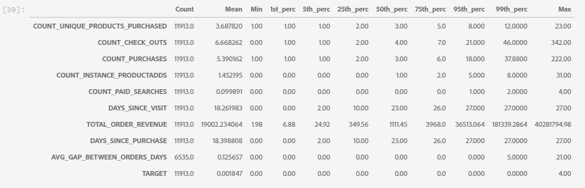

Once you have a distribution of the features, you can create visualized data charts using an array. The following cells are used to visualize the above table with numerical data.

```python
A = sns.palplot(sns.color_palette("Blues"))
```

```python
for column in Data_numerical.columns[0:]:
    plt.figure(figsize=(5, 4))
    plt.ticklabel_format(style='plain', axis='y')
    sns.distplot(Data_numerical[column], color = A, kde=False, bins=6, hist_kws={'alpha': 0.4});
```

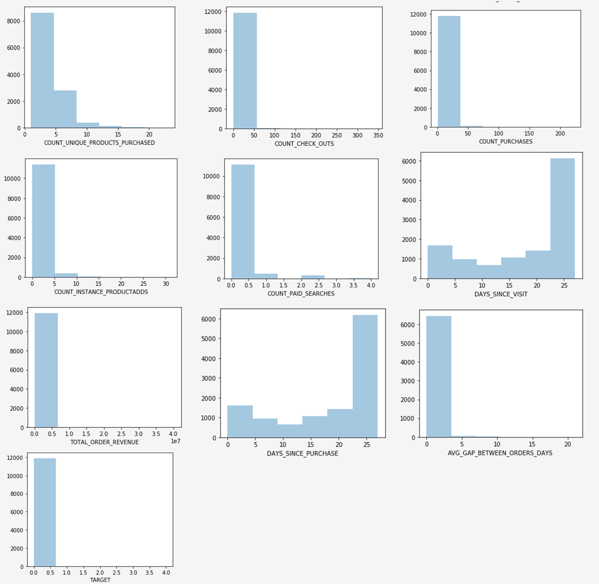

### Categorical data

Grouping categorical data is used to understand the values contained in each of the columns of aggregated data and their distributions. This example uses the top 10 categories to assist with plotting the distributions. It is important to note that there can be thousands of unique values contained in a column. You do not want to render a cluttered plot making it illegible. With your business goal in mind, grouping data yields more meaningful results.

```python
Data_categorical = Data.select_dtypes(include='object')
Data_categorical.drop(['ID'], axis = 1, inplace = True, errors = 'ignore')
```

```python
for column in Data_categorical.columns[0:]:
    if (len(Data_categorical[column].value_counts())>10):
        plt.figure(figsize=(12, 8))
        sns.countplot(x=column, data = Data_categorical, order = Data_categorical[column].value_counts().iloc[:10].index, palette="Set2");
    else:
        plt.figure(figsize=(12, 8))
        sns.countplot(x=column, data = Data_categorical, palette="Set2");
```

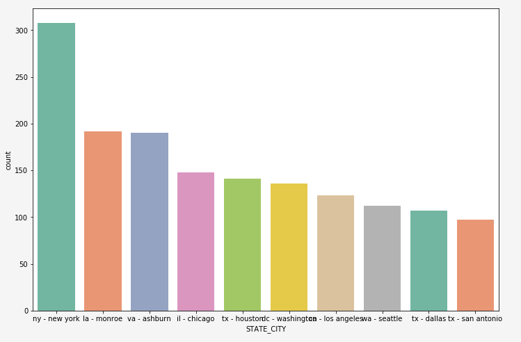

### Remove columns with only a single distinct value

Columns that have only value one do not add any information to the analysis, and can be removed.

```python
for col in Data.columns:
    if len(Data[col].unique()) == 1:
        if col == 'TARGET':
            print(Fore.RED + '\033[1m' + 'WARNING: TARGET HAS A SINGLE UNIQUE VALUE, ANY BIVARIATE ANALYSIS (NEXT STEP IN THIS NOTEBOOK) OR PREDICTION WILL BE MEANINGLESS' + Fore.RESET + '\x1b[21m')
        elif col == 'ID':
            print(Fore.RED + '\033[1m' + 'WARNING: THERE IS ONLY ONE PROFILE IN THE DATA, ANY BIVARIATE ANALYSIS (NEXT STEP IN THIS NOTEBOOK) OR PREDICTION WILL BE MEANINGLESS' + Fore.RESET + '\x1b[21m')
        else:
            print('Dropped column:',col)
            Data.drop(col,inplace=True,axis=1)
```

Once you have removed single value columns, check the remaining columns for any errors using the `Data.columns` command in a new cell.

### Correct for missing values

The following section contains some sample approaches on correcting for missing values. Event though in the above data only one column had a missing value, the example cells below correct values for all data types. These include:

- Numerical data types: input 0 or max where applicable
- Categorical data types: input modal value

```python
#### Select only numerical data
Data_numerical = Data.select_dtypes(include=['float64', 'int64'])

#### For columns that contain days we impute max days of history for null values, for rest all we impute 0

# Imputing days with max days of history
Days_cols = [col for col in Data_numerical.columns if 'DAYS_' in col]
d1 = datetime.strptime(analysis_period_day_start, "%Y-%m-%d")
d2 = datetime.strptime(analysis_period_day_end, "%Y-%m-%d")
A = abs((d2 - d1).days)

for column in Days_cols:
    Data[column].fillna(A, inplace=True)

# Imputing 0
Data_numerical = Data.select_dtypes(include=['float64', 'int64'])
Missing_numerical = Data_numerical.columns[Data_numerical.isnull().any()].tolist()

for column in Missing_numerical:
    Data[column].fillna(0, inplace=True)
```

```python
#### Correct for missing values in categorical columns (Replace with mode)
Data_categorical = Data.select_dtypes(include='object')
Missing_cat = Data_categorical.columns[Data_categorical.isnull().any()].tolist() 
for column in Missing_cat:
    Data[column].fillna(Data[column].mode()[0], inplace=True)
```

Once complete, the clean data is ready for bivariate analysis.

### Bivariate analysis

Bivariate analysis is used to help understand the relationship between two sets of values, such as your features and a target variable. Since different plots cater to categorical and numerical data types, this analysis should be done separately for each data type. The following charts are recommended for bivariate analysis:

- **Correlation**: A correlation coefficient is the measure of the strength of a relationship between two features. Correlation has values between -1 and 1, where: 1 indicates a strong positive relationship, -1 indicates a strong negative relationship, and a result of zero indicates no relationship at all.
- **Pair plot**: Pair plots are a simple way to visualize relationships between each variable. It produces a matrix of relationships between each variable in the data.
- **Heatmap**: Heatmaps are the correlation coefficient for all variables in the dataset.
- **Box plots**: Box plots are a standardized way of displaying data distribution based on a five number summary (minimum, first quartile (Q1), median, third quartile (Q3), and maximum).
- **Count plot**: A count plot is like a histogram or a bar graph for some categorical features. It shows the number of occurrences of an item based on a certain type of category.

To understand relationship between the 'goal' variable and the predictors/features, charts are used based on datatypes. For numerical features, you should use a box plot if the 'goal' variable is categorical, as well as, a pairplot and heatmap if the 'goal' variable is numerical. 

For categorical features, you should use a countplot if the 'goal' variable is categorical, as well as, a box plot if the 'goal' variable is numerical. Using these methods helps with understanding relationships. These relationships can be in the form of features, or predictors and a goal.

**Numerical predictors**

```python
if len(Data) == 1:
    print(Fore.RED + '\033[1m' + 'THERE IS ONLY ONE PROFILE IN THE DATA, BIVARIATE ANALYSIS IS NOT APPLICABLE, PLEASE INCLUDE AT LEAST ONE MORE PROFILE TO DO BIVARIATE ANALYSIS')
elif len(Data['TARGET'].unique()) == 1:
    print(Fore.RED + '\033[1m' + 'TARGET HAS A SINGLE UNIQUE VALUE, BIVARIATE ANALYSIS IS NOT APPLICABLE, PLEASE INCLUDE PROFILES WITH ATLEAST ONE DIFFERENT VALUE OF TARGET TO DO BIVARIATE ANALYSIS')
else:
    if (goal_column_type == "categorical"):
        TARGET_categorical = pd.DataFrame(np.where(TARGET>=threshold,"1","0"))
        TARGET_categorical.rename(columns={TARGET_categorical.columns[0]: "TARGET_categorical" }, inplace = True)
        Data_numerical = Data.select_dtypes(include=['float64', 'int64'])
        Data_numerical.drop(['TARGET'],inplace=True,axis=1)
        Data_numerical = pd.concat([Data_numerical, TARGET_categorical.astype(int)], axis = 1)
        ncols_for_charts = len(Data_numerical.columns)-1
        nrows_for_charts = math.ceil(ncols_for_charts/4)
        fig, axes = plt.subplots(nrows=nrows_for_charts, ncols=4, figsize=(18, 15))
        for idx, feat in enumerate(Data_numerical.columns[:-1]):
            ax = axes[int(idx // 4), idx % 4]
            sns.boxplot(x='TARGET_categorical', y=feat, data=Data_numerical, ax=ax)
            ax.set_xlabel('')
            ax.set_ylabel(feat)
            fig.tight_layout();
    else:
        Data_numerical = Data.select_dtypes(include=['float64', 'int64'])
        TARGET = pd.DataFrame(Data_numerical.TARGET)
        Data_numerical = Data.select_dtypes(include=['float64', 'int64'])
        Data_numerical.drop(['TARGET'],inplace=True,axis=1)
        Data_numerical = pd.concat([Data_numerical, TARGET.astype(int)], axis = 1)
        for i in Data_numerical.columns[:-1]:
            sns.pairplot(x_vars=i, y_vars=['TARGET'], data=Data_numerical, height = 4)
        f, ax = plt.subplots(figsize = (10,8))
        corr = Data_numerical.corr()
```

Running the cell produces the following outputs:

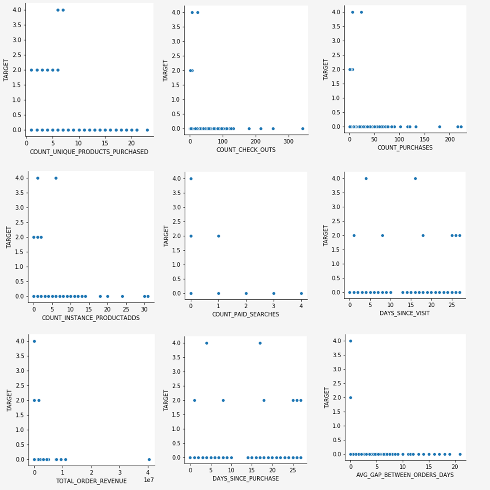

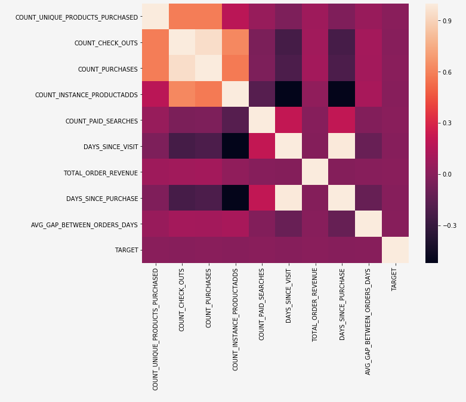

**Categorical predictors**

The following example is used to plot and view the frequency plots for the top 10 categories of each categorical variable.

```python
if len(Data) == 1:
    print(Fore.RED + '\033[1m' + 'THERE IS ONLY ONE PROFILE IN THE DATA, BIVARIATE ANALYSIS IS NOT APPLICABLE, PLEASE INCLUDE AT LEAST ONE MORE PROFILE TO DO BIVARIATE ANALYSIS')
elif len(Data['TARGET'].unique()) == 1:
    print(Fore.RED + '\033[1m' + 'TARGET HAS A SINGLE UNIQUE VALUE, BIVARIATE ANALYSIS IS NOT APPLICABLE, PLEASE INCLUDE PROFILES WITH ATLEAST ONE DIFFERENT VALUE OF TARGET TO DO BIVARIATE ANALYSIS')
else:
    if (goal_column_type == "categorical"):
        TARGET_categorical = pd.DataFrame(np.where(TARGET>=threshold,"1","0"))
        TARGET_categorical.rename(columns={TARGET_categorical.columns[0]: "TARGET_categorical" }, inplace = True)
        Data_categorical = Data.select_dtypes(include='object')
        Data_categorical.drop(["ID"], axis =1, inplace = True)
        Cat_columns = Data_categorical
        Data_categorical = pd.concat([TARGET_categorical,Data_categorical], axis =1)
        for column in Cat_columns.columns:
            A = Data_categorical[column].value_counts().iloc[:10].index
            Data_categorical1 = Data_categorical[Data_categorical[column].isin(A)]
            plt.figure(figsize=(12, 8))
            sns.countplot(x="TARGET_categorical",hue=column, data = Data_categorical1, palette = 'Blues')
            plt.xlabel("GOAL")
            plt.ylabel("COUNT")
            plt.show();
    else:
        Data_categorical = Data.select_dtypes(include='object')
        Data_categorical.drop(["ID"], axis =1, inplace = True)
        Target = Data.TARGET
        Data_categorical = pd.concat([Data_categorical,Target], axis =1)
        for column in Data_categorical.columns[:-1]:
            A = Data_categorical[column].value_counts().iloc[:10].index
            Data_categorical1 = Data_categorical[Data_categorical[column].isin(A)]
            sns.catplot(x=column, y="TARGET", kind = "boxen", data =Data_categorical1, height=5, aspect=13/5);
```

Running the cell produces the following output:


### Important numerical features

Using correlation analysis, you can create a list of the top ten important numerical features. These features can all be used to predict the 'goal' feature. This list can be used as the feature list for when you start building your model.

```python
if len(Data) == 1:
    print(Fore.RED + '\033[1m' + 'THERE IS ONLY ONE PROFILE IN THE DATA, BIVARIATE ANALYSIS IS NOT APPLICABLE, PLEASE INCLUDE AT LEAST ONE MORE PROFILE TO FIND IMPORTANT VARIABLES')
elif len(Data['TARGET'].unique()) == 1:
    print(Fore.RED + '\033[1m' + 'TARGET HAS A SINGLE UNIQUE VALUE, BIVARIATE ANALYSIS IS NOT APPLICABLE, PLEASE INCLUDE PROFILES WITH ATLEAST ONE DIFFERENT VALUE OF TARGET TO FIND IMPORTANT VARIABLES')
else:
    Data_numerical = Data.select_dtypes(include=['float64', 'int64'])
    Correlation = pd.DataFrame(Data_numerical.drop("TARGET", axis=1).apply(lambda x: x.corr(Data_numerical.TARGET)))
    Correlation['Corr_abs'] = abs(Correlation)
    Correlation = Correlation.sort_values(by = 'Corr_abs', ascending = False)
    Imp_features = pd.DataFrame(Correlation.index[0:10])
    Imp_features.rename(columns={0:'Important Feature'}, inplace=True)
    print(Imp_features)
```

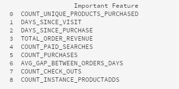

### Example insight

While you are in the process of analyzing your data, it is not uncommon to uncover insights. The following example is an insight that maps the recency and monetary value for a target event.

```python
# Proxy for monetary value is TOTAL_ORDER_REVENUE and proxy for frequency is NUMBER_VISITS
if len(Data) == 1:
    print(Fore.RED + '\033[1m' + 'THERE IS ONLY ONE PROFILE IN THE DATA, INSIGHTS ANALYSIS IS NOT APPLICABLE, PLEASE INCLUDE AT LEAST ONE MORE PROFILE TO FIND IMPORTANT VARIABLES')
elif len(Data['TARGET'].unique()) == 1:
    print(Fore.RED + '\033[1m' + 'TARGET HAS A SINGLE UNIQUE VALUE, INSIGHTS ANALYSIS IS NOT APPLICABLE, PLEASE INCLUDE PROFILES WITH ATLEAST ONE DIFFERENT VALUE OF TARGET TO FIND IMPORTANT VARIABLES')
else:
    sns.lmplot("DAYS_SINCE_VISIT", "TOTAL_ORDER_REVENUE", Data, hue="TARGET", fit_reg=False);
```

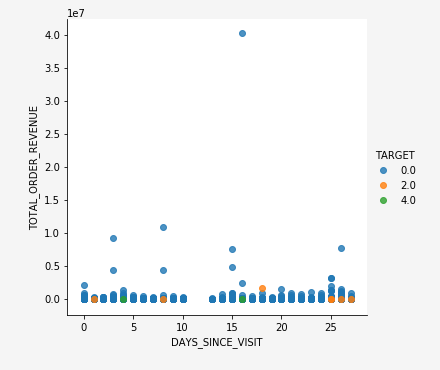

## Optional data cleaning step {#optional-data-clean}

Correcting outliers requires you to have an understanding of the business and industry you're working in. Sometimes, you can't drop an observation just because it is an outlier. Outliers can be legitimate observations and are often the most interesting ones.

For more information on outliers and whether to drop them or not, read this entry from the [analysis factor](https://www.theanalysisfactor.com/outliers-to-drop-or-not-to-drop/).

The following example cell caps and floors data points that are outliers using [interquartile range](https://www.thoughtco.com/what-is-the-interquartile-range-rule-3126244).

```python
TARGET = Data.TARGET

Data_numerical = Data.select_dtypes(include=['float64', 'int64'])
Data_numerical.drop(['TARGET'],axis = 1,inplace = True)

for i in range(0,len(Data_numerical.columns)):
    Q1 = Data_numerical.iloc[:,i].quantile(0.25)
    Q3 = Data_numerical.iloc[:,i].quantile(0.75)
    IQR = Q3 - Q1
    Data_numerical.iloc[:,i] = np.where(Data_numerical.iloc[:,i]<(Q1 - 1.5 * IQR), (Q1 - 1.5 * IQR), np.where(Data_numerical.iloc[:,i]>(Q3 + 1.5 * IQR),
                                                                                                     (Q3 + 1.5 * IQR),Data_numerical.iloc[:,i]))
Data_categorical = Data.select_dtypes(include='object')
Data = pd.concat([Data_categorical, Data_numerical, TARGET], axis = 1)
```

## Next steps

After you have finished your exploratory data analysis, you are ready to begin creating a model. Alternatively, you can use the data and insights you derived to create a dashboard with tools such as Power BI.

Adobe Experience Platform separates the model creation process into two distinct stages, Recipes (a model instance) and Models. To begin the recipe creation process, visit the documentation for [creating a recipe in JupyerLab Notebooks](./create-a-model.md). This document contains information and examples for creating, training, and scoring, a recipe within [!DNL JupyterLab] Notebooks.
