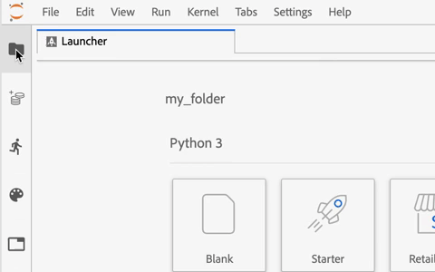
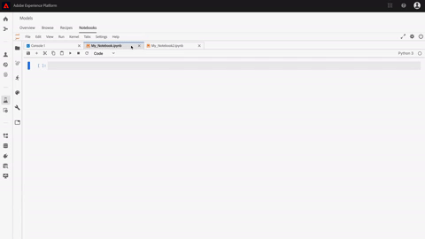
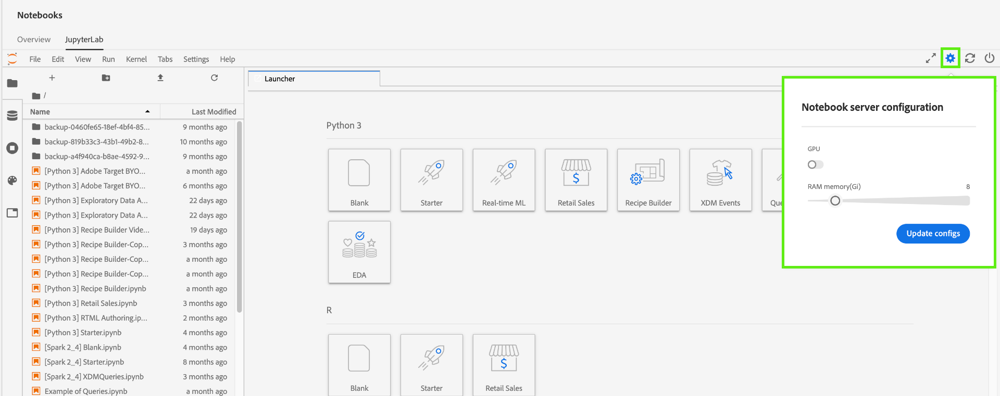
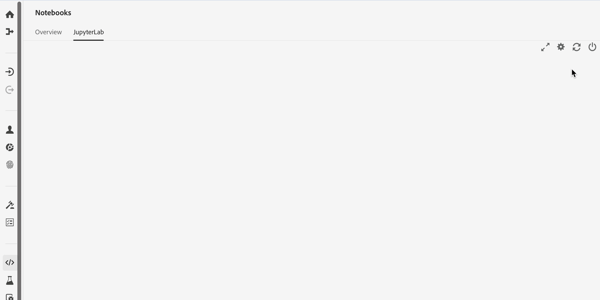
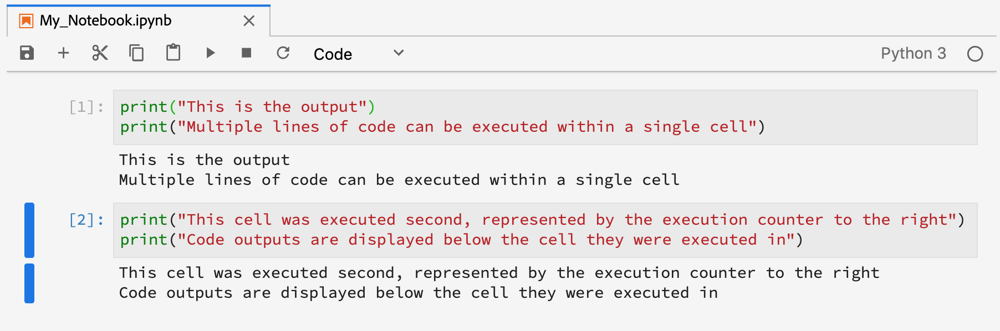
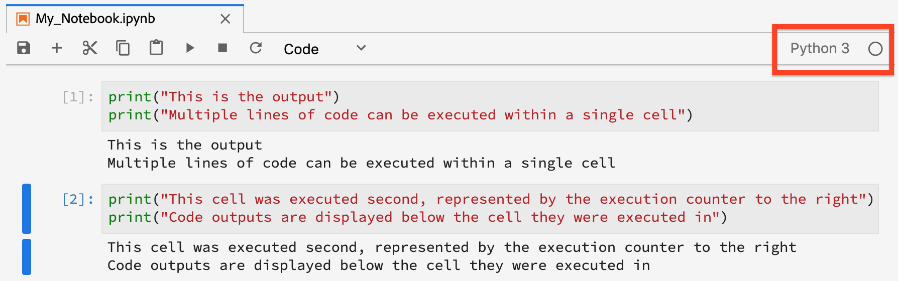
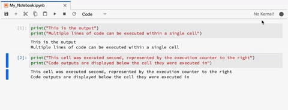
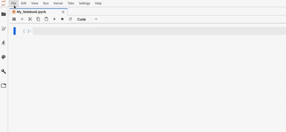
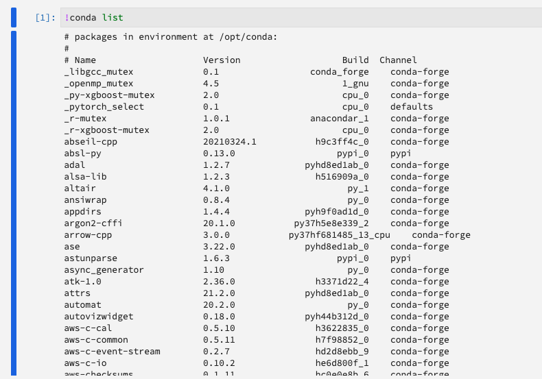

# [!DNL JupyterLab] UI overview

[!DNL JupyterLab] is a web-based user interface for [Project Jupyter](https://jupyter.org/) and is tightly integrated into Adobe Experience Platform. It provides an interactive development environment for data scientists to work with Jupyter Notebooks, code, and data.

This document provides an overview of [!DNL JupyterLab] and its features as well as instructions to perform common actions.

## [!DNL JupyterLab] on [!DNL Experience Platform]

Experience Platform's JupyterLab integration is accompanied with architectural changes, design considerations, customized notebook extensions, pre-installed libraries, and an Adobe-themed interface.

The following list outlines some of the features that are unique to JupyterLab on Platform:

| Feature | Description |
| --- | --- |
| **Kernels** | Kernels provide notebook and other [!DNL JupyterLab] front-ends the ability to execute and introspect code in different programming languages. [!DNL Experience Platform] provides additional kernels to support development in [!DNL Python], R, PySpark, and [!DNL Spark]. See the [kernels](#kernels) section for more details. |
| **Data access** | Access existing datasets directly from within [!DNL JupyterLab] with full support for read and write capabilities. |
| **[!DNL Platform] service integration** | Built-in integrations allows you to utilize other [!DNL Platform] services directly from within [!DNL JupyterLab]. A complete list of supported integrations is provided in the section on [Integration with other Platform services](#service-integration). |
| **Authentication** | In addition to <a href="https://jupyter-notebook.readthedocs.io/en/stable/security.html" target="_blank">JupyterLab's built-in security model</a>, every interaction between your application and Experience Platform, including Platform service-to-service communication is encrypted and authenticated through the <a href="https://www.adobe.io/authentication/auth-methods.html" target="_blank">[!DNL Adobe Identity Management System] (IMS)</a>. |
| **Development libraries** | In [!DNL Experience Platform], [!DNL JupyterLab] provides pre-installed libraries for [!DNL Python], R, and PySpark. See the [appendix](#supported-libraries) for a complete list of supported libraries. |
| **Library controller** | When the pre-installed libraries are lacking for your needs, additional libraries can be installed for Python and R, and are temporarily stored in isolated containers to maintain the integrity of [!DNL Platform] and keep your data safe. See the [kernels](#kernels) section for more details. |

>[!NOTE]
>
>Additional libraries are only available for the session in which they were installed. You must reinstall any additional libraries you require when starting new sessions.

## Integration with other [!DNL Platform] services {#service-integration}

Standardization and interoperability are key concepts behind [!DNL Experience Platform]. The integration of [!DNL JupyterLab] on [!DNL Platform] as an embedded IDE allows it to interact with other [!DNL Platform] services, enabling you to utilize [!DNL Platform] to its full potential. The following [!DNL Platform] services are available in [!DNL JupyterLab]:

*   **[!DNL Catalog Service]:** Access and explore datasets with read and write functionalities.
*   **[!DNL Query Service]:** Access and explore datasets using SQL, providing lower data access overheads when dealing with large amounts of data.
*   **[!DNL Sensei ML Framework]:** Model development with the ability to train and score data, as well as recipe creation with a single click.
*   **[!DNL Experience Data Model (XDM)]:** Standardization and interoperability are key concepts behind Adobe Experience Platform. [Experience Data Model (XDM)](https://www.adobe.com/go/xdm-home-en), driven by Adobe, is an effort to standardize customer experience data and define schemas for customer experience management.

>[!NOTE]
>
>Some [!DNL Platform] service integrations on [!DNL JupyterLab] are limited to specific kernels. Refer to the section on [kernels](#kernels) for more details.

## Key features and common operations

Information regarding key features of [!DNL JupyterLab] and instructions on performing common operations are provided in the sections below:

*  [Access JupyterLab](#access-jupyterlab)
*  [JupyterLab interface](#jupyterlab-interface)
*  [Code cells](#code-cells)
*  [Kernels](#kernels)
*  [Kernel sessions](#kernel-sessions)
*  [Launcher](#launcher)

### Access [!DNL JupyterLab] {#access-jupyterlab}

In [Adobe Experience Platform](https://platform.adobe.com), select **[!UICONTROL Notebooks]** from the left navigation column. Allow some time for [!DNL JupyterLab] to fully initialize.

### [!DNL JupyterLab] interface {#jupyterlab-interface}

The [!DNL JupyterLab] interface consists of a menu bar, a collapsible left sidebar, and the main work area containing tabs of documents and activities.

**Menu bar**

The menu bar at the top of the interface has top-level menus that expose actions available in [!DNL JupyterLab] with their keyboard shortcuts:

*   **File:** Actions related to files and directories
*   **Edit:** Actions related to editing documents and other activities
*   **View:** Actions that alter the appearance of [!DNL JupyterLab]
*   **Run:** Actions for running code in different activities such as notebooks and code consoles
*   **Kernel:** Actions for managing kernels
*   **Tabs:** A list of open documents and activities
*   **Settings:** Common settings and an advanced settings editor
*   **Help:** A list of [!DNL JupyterLab] and kernel help links

**Left sidebar**

The left sidebar contains clickable tabs that provide access to the following features:

*   **File browser:** A list of saved notebook documents and directories
*   **Data explorer:** Browse, access, and explore datasets and schemas
*   **Running kernels and terminals:** A list of active kernel and terminal sessions with the ability to terminate
*   **Commands:** A list of useful commands
*   **Cell inspector:** A cell editor that provides access to tools and metadata useful for setting up a notebook for presentation purposes
*   **tabs:** A list of open tabs

Select a tab to expose its features, or select on an expanded tab to collapse the left sidebar as demonstrated below:

**Main work area**

The main work area in [!DNL JupyterLab] enables you to arrange documents and other activities into panels of tabs that can be resized or subdivided. Drag a tab to the center of a tab panel to migrate the tab. Divide a panel by dragging a tab to the left, right, top, or bottom of the panel:

### GPU and memory server configuration in [!DNL Python]/R

In [!DNL JupyterLab] select the gear icon in the top-right corner to open *Notebook server configuration*. You can toggle GPU on and allocate the amount of memory you need by using the slider. The amount of memory you can allocate depends on how much your organization has provisioned. Select **[!UICONTROL Update configs]** to save.

>[!NOTE]
>
>Only one GPU is provisioned per organization for Notebooks. If the GPU is in use, you need to wait for the user that has currently reserved the GPU to release it. This can be done by logging out or leaving the GPU in an idle state for four or more hours.

### Terminate & restart [!DNL JupyterLab]

In [!DNL JupyterLab], you can terminate your session to prevent further resources from being used. Start by selecting the **power icon** , then select **[!UICONTROL Shut Down]** from the popover that appears to terminate your session. Notebook sessions auto-terminate after 12 hours of no activity.

To restart [!DNL JupyterLab], select the **restart icon**  located directly to the left of the power icon, then select **[!UICONTROL Restart]** from the popover that appears.

### Code cells {#code-cells}

Code cells are the primary content of notebooks. They contain source code in the language of the notebook's associated kernel and the output as a result of executing the code cell. An execution count is displayed to the right of every code cell which represents its order of execution.

Common cell actions are described below:

*   **Add a cell:** Click the plus symbol (**+**) from the notebook menu to add an empty cell. New cells are placed under the cell that is currently being interacted with, or at the end of the notebook if no particular cell is in focus.

*   **Move a cell:** Place your cursor to the right of the cell you wish to move, then click and drag the cell to a new location. Additionally, moving a cell from one notebook to another replicates the cell along with its contents.

*   **Execute a cell:** Click on the body of the cell you wish to execute and then click the **play** icon (**▶**) from the notebook menu. An asterisk (**\***) is displayed in the cell's execution counter when the kernel is processing the execution, and is replaced with an integer upon completion.

*   **Delete a cell:** Click on the body of the cell you wish to delete and then click the **scissor** icon.

### Kernels {#kernels}

Notebook kernels are the language-specific computing engines for processing notebook cells. In addition to [!DNL Python], [!DNL JupyterLab] provides additional language support in R, PySpark, and [!DNL Spark] (Scala). When you open a notebook document, the associated kernel is launched. When a notebook cell is executed, the kernel performs the computation and produces results which may consume significant CPU and memory resources. Note that allocated memory is not freed until the kernel is shut down.

Certain features and functionalities are limited to particular kernels as described in the table below:

| Kernel | Library installation support | [!DNL Platform] integrations |
| :----: | :--------------------------: | :-------------------- |
| **[!DNL Python]** | Yes | <ul><li>[!DNL Sensei ML Framework]</li><li>[!DNL Catalog Service]</li><li>[!DNL Query Service]</li></ul> |
| **R** | Yes | <ul><li>[!DNL Sensei ML Framework]</li><li>[!DNL Catalog Service]</li></ul> |
| **Scala** | No | <ul><li>[!DNL Sensei ML Framework]</li><li>[!DNL Catalog Service]</li></ul> |

### Kernel sessions {#kernel-sessions}

Each active notebook or activity on [!DNL JupyterLab] utilizes a kernel session. All active sessions can be found by expanding the **Running terminals and kernels** tab from the left sidebar. The type and state of the kernel for a notebook can be identified by observing the top right of the notebook interface. In the diagram below, the notebook's associated kernel is **[!DNL Python] 3** and the its current state is represented by a grey circle to the right. A hollow circle implies an idling kernel and a solid circle implies a busy kernel.

If the kernel is shut down or inactive for a prolonged period, then **No Kernel!** with a solid circle is shown. Activate a kernel by clicking the kernel status and selecting the appropriate kernel type as demonstrated below:

### Launcher {#launcher}

[//]: # (Talk about the different Notebooks, introduce that certain starter notebooks are limited to particular kernels)

The customized *Launcher* provides you with useful notebook templates for their supported kernels to help you kickstart your task, including:

| Template | Description |
| --- | --- |
| Blank | An empty notebook file. |
| Starter | A pre-filled notebook demonstrating data exploration using sample data. |
| Retail Sales | A pre-filled notebook featuring the [retail sales recipe](../pre-built-recipes/retail-sales.md) using sample data. |
| Recipe Builder | A notebook template for creating a recipe in [!DNL JupyterLab]. It is pre-filled with code and commentary that demonstrates and describes the recipe creation process. Refer to the [notebook to recipe tutorial](https://www.adobe.com/go/data-science-create-recipe-notebook-tutorial-en) for a detailed walkthrough. |
| [!DNL Query Service] | A pre-filled notebook demonstrating the usage of [!DNL Query Service] directly in [!DNL JupyterLab] with provided sample workflows that analyzes data at scale. |
| XDM Events | A pre-filled notebook demonstrating data exploration on postvalue Experience Event data, focusing on features common across the data structure. |
| XDM Queries | A pre-filled notebook demonstrating sample business queries on Experience Event data. |
| Aggregation | A pre-filled notebook demonstrating sample workflows to aggregate large amounts of data into smaller, manageable chunks. |
| Clustering | A pre-filled notebook demonstrating the end-to-end machine learning modeling process using clustering algorithms. |

Some notebook templates are limited to certain kernels. Template availability for each kernel is mapped in the following table:

<table>
    <tr>
        <td></td>
        <th><strong>Blank</strong></th>
        <th><strong>Starter</strong></th>
        <th><strong>Retail Sales</strong></th>
        <th><strong>Recipe Builder</strong></th>
        <th><strong>[!DNL Query Service]</strong></th>
        <th><strong>XDM Events</strong></th>
        <th><strong>XDM Queries</strong></th>
        <th><strong>Aggregation</strong></th>
        <th><strong>Clustering</strong></th>
    </tr>
    <tr>
        <th><strong>[!DNL Python]</strong></th>
        <td >yes</td>
        <td >yes</td>
        <td >yes</td>
        <td >yes</td>
        <td >yes</td>
        <td >yes</td>
        <td >no</td>
        <td >no</td>
        <td >no</td>
    </tr>
    <tr>
        <th ><strong>R</strong></th>
        <td >yes</td>
        <td >yes</td>
        <td >yes</td>
        <td >no</td>
        <td >no</td>
        <td >no</td>
        <td >no</td>
        <td >no</td>
        <td >no</td>
    </tr>
      <tr>
        <th  ><strong>PySpark 3 ([!DNL Spark] 2.4)</strong></th>
        <td >no</td>
        <td >yes</td>
        <td >no</td>
        <td >no</td>
        <td >no</td>
        <td >no</td>
        <td >yes</td>
        <td >yes</td>
        <td >no</td>
    </tr>
    <tr>
        <th ><strong>Scala</strong></th>
        <td >yes</td>
        <td >yes</td>
        <td >no</td>
        <td >no</td>
        <td >no</td>
        <td >no</td>
        <td >no</td>
        <td >no</td>
        <td >yes</td>
    </tr>
</table>

To open a new *Launcher*, click **File > New Launcher**. Alternatively, expand the **File browser** from the left sidebar and click the plus symbol (**+**):

## Next steps

To learn more about each of the supported notebooks and how to use them, visit the [Jupyterlab notebooks data access](./access-notebook-data.md) developer guide. This guide focuses on how to use JupyterLab notebooks to access your data including reading, writing, and querying data. The data access guide also contains information on the maximum amount of data that can be read by each supported notebook.

## Supported libraries {#supported-libraries}

For a list of supported packages in Python, R, and PySpark, copy and paste `!conda list` in a new cell, then run the cell. A list of supported packages populates in alphabetical order.

In addition, the following dependencies are used but not listed:
* CUDA 11.2
* CUDNN 8.1

