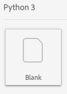
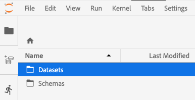
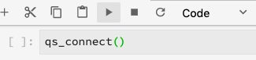
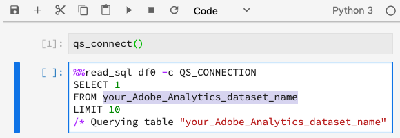
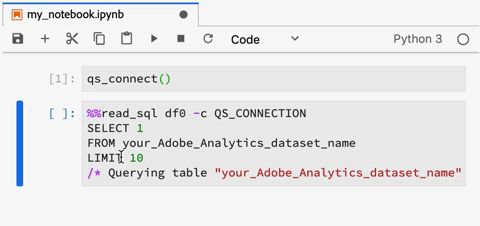

# Query Service in Jupyter Notebook

[!DNL Adobe Experience Platform] allows you to use Structured Query Language (SQL) in [!DNL Data Science Workspace] by integrating [!DNL Query Service] into [!DNL JupyterLab] as a standard feature. 

This tutorial demonstrates sample SQL queries for common use cases to explore, transform, and analyze [!DNL Adobe Analytics] data.

## Getting started

Before starting this tutorial, you must have the following prerequisites:

-   Access to [!DNL Adobe Experience Platform]. If you do not have access to an organization in [!DNL Experience Platform], please speak to your system administrator before proceeding

-   An [!DNL Adobe Analytics] dataset

-   A working understanding of the following key concepts used in this tutorial:
    -   [[!DNL Experience Data Model (XDM) and XDM System]](../../xdm/home.md)
    -   [[!DNL Query Service]](../../query-service/home.md)
    -   [[!DNL Query Service SQL Syntax]](../../query-service/sql/overview.md)
    -   Adobe Analytics

## Access [!DNL JupyterLab] and [!DNL Query Service] {#access-jupyterlab-and-query-service}

1.  In [[!DNL Experience Platform]](https://platform.adobe.com), navigate to **[!UICONTROL Notebooks]** from the left navigation column. Allow a moment for JupyterLab to load.

    

    >[!NOTE]
    >
    >If a new Launcher tab did not automatically appear, open a new Launcher tab by clicking **[!UICONTROL File]** then select **[!UICONTROL New Launcher]**.

2.  In the Launcher tab, click the **[!UICONTROL Blank]** icon in a Python 3 environment to open an empty notebook.

    

    >[!NOTE]
    >
    >Python 3 is currently the only supported environment for Query Service in notebooks.

3.  On the left selection rail, click the **[!UICONTROL Data]** icon and double click the **[!UICONTROL Datasets]** directory to list all datasets.

    

4.  Find an [!DNL Adobe Analytics] dataset to explore and right-click on the listing, click **[!UICONTROL Query Data in Notebook]** to generate SQL queries in the empty notebook. 

5.  Click the first generated cell containing the function `qs_connect()` and execute it by clicking the play button. This function creates a connection between your notebook instance and the [!DNL Query Service].

    

6.  Copy down the [!DNL Adobe Analytics] dataset name from the second generated SQL query, it will be the value after `FROM`.

    

7.  Insert a new notebook cell by clicking the **+** button.

    

8.  Copy, paste, and execute the following import statements in a new cell. These statements will be used to visualize your data:

    ```python
    import plotly.plotly as py
    import plotly.graph_objs as go
    from plotly.offline import iplot
    ```

9.  Next, copy and paste the following variables in a new cell. Modify their values as needed, then execute them.

    ```python
    target_table = "your Adobe Analytics dataset name"
    target_year = "2019"
    target_month = "04"
    target_day = "01"
    ```

    -   `target_table`: Name of your [!DNL Adobe Analytics] dataset.
    -   `target_year`: Specific year for which the target data is from.
    -   `target_month`: Specific month for which the target is from.
    -   `target_day`: Specific day for which the target data is from.

    >[!NOTE]
    >
    >You can change these values at any time. When doing so, be sure to execute the variables cell for the changes to be applied.

## Query your data {#query-your-data}

Enter the following SQL queries in individual notebook cells. Execute a query by selecting on its cell followed by selecting the **[!UICONTROL play]** button. Successful query results or error logs are displayed below the executed cell.

When a notebook is inactive for an extended period of time, the connection between the notebook and [!DNL Query Service] may break. In such cases, restart [!DNL JupyterLab] by selecting the **Restart** button  located in the top-right corner next to the power button. 

The notebook kernel resets but the cells will remain, re-run all the cells to continue where you had left off.

### Hourly visitor count {#hourly-visitor-count}

The following query returns the hourly visitor count for a specified date:

#### Query

```sql
%%read_sql hourly_visitor -c QS_CONNECTION
SELECT Substring(timestamp, 1, 10)                               AS Day,
       Substring(timestamp, 12, 2)                               AS Hour, 
       Count(DISTINCT concat(enduserids._experience.aaid.id, 
                             _experience.analytics.session.num)) AS Visit_Count 
FROM   {target_table}
WHERE TIMESTAMP = to_timestamp('{target_year}-{target_month}-{target_day}')
GROUP  BY Day, Hour
ORDER  BY Hour;
```

In the above query, the timestamp in the `WHERE` clause is set to be the value of `target_year`. Include variables in SQL queries by containing them in curly brackets (`{}`).

The first line of the query contains the optional variable `hourly_visitor`. Query results will be stored in this variable as a Pandas dataframe. Storing results in a dataframe allows you to later visualize the query results using a desired [!DNL Python] package. Execute the following [!DNL Python] code in a new cell to generate a bar graph:

```python
trace = go.Bar(
    x = hourly_visitor['Hour'],
    y = hourly_visitor['Visit_Count'],
    name = "Visitor Count"
)
layout = go.Layout(
    title = 'Visit Count by Hour of Day',
    width = 1200,
    height = 600,
    xaxis = dict(title = 'Hour of Day'),
    yaxis = dict(title = 'Count')
)
fig = go.Figure(data = [trace], layout = layout)
iplot(fig)
```

### Hourly activity count {#hourly-activity-count}

The following query returns the hourly actions count for a specified date:

#### Query <!-- omit in toc -->

```sql
%%read_sql hourly_actions -d -c QS_CONNECTION
SELECT Substring(timestamp, 1, 10)                        AS Day,
       Substring(timestamp, 12, 2)                        AS Hour, 
       Count(concat(enduserids._experience.aaid.id, 
                    _experience.analytics.session.num,
                    _experience.analytics.session.depth)) AS Count 
FROM   {target_table}
WHERE TIMESTAMP = to_timestamp('{target_year}-{target_month}-{target_day}')
GROUP  BY Day, Hour
ORDER  BY Hour;
```

Executing the above query will store the results in `hourly_actions` as a dataframe. Execute the following function in a new cell to preview the results:

```python
hourly_actions.head()
```

The above query can be modified to return the hourly actions count for a specified date range using logical operators in the **WHERE** clause:

#### Query <!-- omit in toc -->

```sql
%%read_sql hourly_actions_date_range -d -c QS_CONNECTION
SELECT Substring(timestamp, 1, 10)                        AS Day,
       Substring(timestamp, 12, 2)                        AS Hour, 
       Count(concat(enduserids._experience.aaid.id, 
                    _experience.analytics.session.num,
                    _experience.analytics.session.depth)) AS Count 
FROM   {target_table}
WHERE  timestamp >= TO_TIMESTAMP('2019-06-01 00', 'YYYY-MM-DD HH')
       AND timestamp <= TO_TIMESTAMP('2019-06-02 23', 'YYYY-MM-DD HH')
GROUP  BY Day, Hour
ORDER  BY Hour;
```

Executing the modified query stores the results in `hourly_actions_date_range` as a dataframe. Execute the following function in a new cell to preview the results:

```python
hourly_actions_date_rage.head()
```

### Number of events per visitor session {#number-of-events-per-visitor-session}

The following query returns the number of events per visitor session for a specified date:

#### Query <!-- omit in toc -->

```sql
%%read_sql events_per_session -c QS_CONNECTION
SELECT concat(enduserids._experience.aaid.id, 
              '-#', 
              _experience.analytics.session.num) AS aaid_sess_key, 
       Count(timestamp)                          AS Count 
FROM   {target_table}
WHERE TIMESTAMP = to_timestamp('{target_year}-{target_month}-{target_day}')
GROUP BY aaid_sess_key
ORDER BY Count DESC;
```

Execute the following [!DNL Python] code to generate a histogram for the number of events per visit session:

```python
data = [go.Histogram(x = events_per_session['Count'])]

layout = go.Layout(
    title = 'Histogram of Number of Events per Visit Session',
    xaxis = dict(title = 'Number of Events'),
    yaxis = dict(title = 'Count')
)

fig = go.Figure(data = data, layout = layout)
iplot(fig)
```

### Popular pages for a given day {#popular-pages-for-a-given-day}

The following query returns the ten most popular pages for a specified date:

#### Query <!-- omit in toc -->

```sql
%%read_sql popular_pages -c QS_CONNECTION
SELECT web.webpagedetails.name                 AS Page_Name, 
       Sum(web.webpagedetails.pageviews.value) AS Page_Views 
FROM   {target_table}
WHERE TIMESTAMP = to_timestamp('{target_year}-{target_month}-{target_day}')
GROUP  BY web.webpagedetails.name 
ORDER  BY page_views DESC 
LIMIT  10;
```

### Active users for a given day {#active-users-for-a-given-day}

The following query returns the ten most active users for a specified date:

#### Query <!-- omit in toc -->

```sql
%%read_sql active_users -c QS_CONNECTION
SELECT enduserids._experience.aaid.id AS aaid, 
       Count(timestamp)               AS Count
FROM   {target_table}
WHERE TIMESTAMP = to_timestamp('{target_year}-{target_month}-{target_day}')
GROUP  BY aaid
ORDER  BY Count DESC
LIMIT  10;
```

### Active cities by user activity {#active-cities-by-user-activity}

The following query returns the ten cities that are generating a majority of user activities for a specified date:

#### Query <!-- omit in toc -->

```sql
%%read_sql active_cities -c QS_CONNECTION
SELECT concat(placeContext.geo.stateProvince, ' - ', placeContext.geo.city) AS state_city, 
       Count(timestamp)                                                     AS Count
FROM   {target_table}
WHERE TIMESTAMP = to_timestamp('{target_year}-{target_month}-{target_day}')
GROUP  BY state_city
ORDER  BY Count DESC
LIMIT  10;
```

## Next steps

This tutorial demonstrated some sample uses cases for utilizing [!DNL Query Service] in [!DNL Jupyter] notebooks. Follow the [Analyze your data using Jupyter Notebooks](./analyze-your-data.md) tutorial to see how similar operations are performed using the Data Access SDK.
