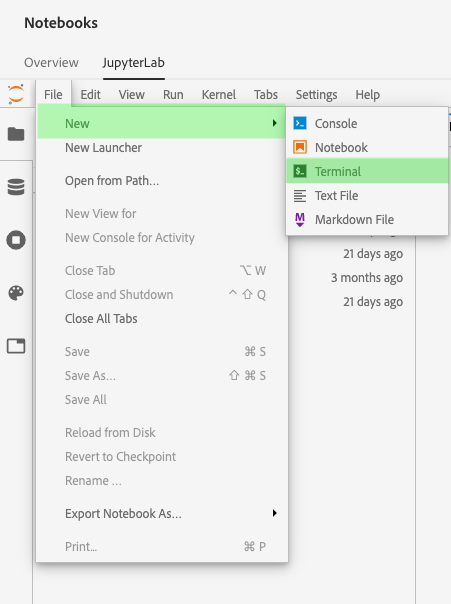
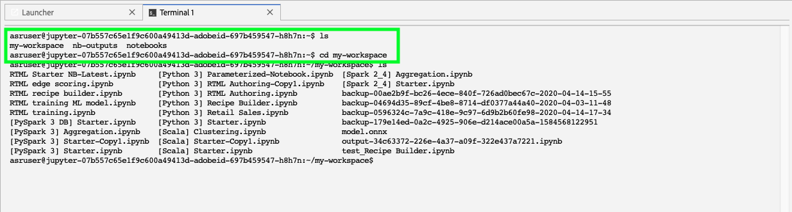
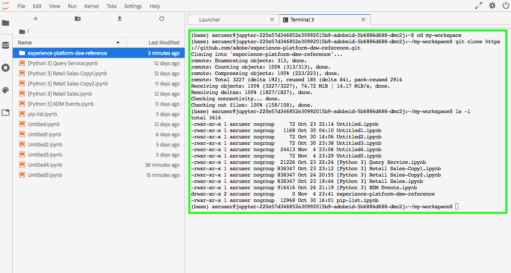

# Collaborate in [!DNL JupyterLab] using [!DNL Git]

[!DNL Git] is a distributed version-control system for tracking changes in source code during software development. Git is pre-installed within the [!DNL Data Science Workspace JupyterLab] environment.

## Prerequisites

>[!NOTE]
>
> The Git server you intend to use needs to be accessible via the internet.

The [!DNL Data Science Workspace JupyterLab] environment is a hosted environment and not deployed within your corporate firewall, and therefore the Git server you connect to must be accessible from the public internet. This could be a public or private repository on [GitHub](https://github.com/) or another instance of a [!DNL Git] server that you have decided to host yourself.

## Connect [!DNL Git] to the [!DNL Data Science Workspace JupyterLab Notebooks] environment

Start by launching [!DNL Adobe Experience Platform] and navigating to the [[!DNL JupyterLabs Notebooks]](https://platform.adobe.com/notebooks/jupyterLab) environment.

Within [!DNL JupyterLab], select **[!UICONTROL File]** then hover over **[!UICONTROL New]**. From the dropdown that appears, select **[!UICONTROL Terminal]**.

Next, within *Terminal* navigate to your workspace by using the following command: `cd my-workspace`. 

>[!TIP]
>
> To see a list of available git commands, issue the command: `git -help` within your Terminal.

Next, clone the repository you wish to use using the `git clone` command. Clone your project using an `https://` URL rather than `ssh://`.

**Example**:

`git clone https://github.com/adobe/experience-platform-dsw-reference.git`

>[!NOTE]
>
> In order to perform any write operations (`git push` for example) the following configuration commands need to be run for every new session. Also note that any push command prompts for a username and password.
>
>`git config --global user.email "you@example.com"`
>
>`git config --global user.name "Your Name"`

## Next steps

After you have finished cloning your repository, you can use Git as you normally would on your local machine to collaborate with others on notebooks. For more information on what you can do within [!DNL JupyterLab], see the [[!DNL JupyterLab user guide]](./overview.md).
