# Create and publish a machine learning model walkthrough

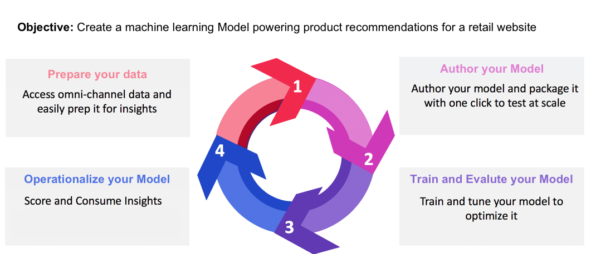

Pretend you own an online retail website. When your customers shop at your retail website, you want to present them with personalized product recommendations to expose a variety of other products your business offers. Over the span of your website's existence, you have continuously gathered customer data and want to somehow use this data towards generating personalized product recommendations. 

[!DNL Adobe Experience Platform] [!DNL Data Science Workspace] provides the means to achieve your goal using the prebuilt [Product Recommendations Recipe](../pre-built-recipes/product-recommendations.md). Follow this tutorial to see how you can access and understand your retail data, create and optimise a machine learning Model, and generate insights in [!DNL Data Science Workspace].

This tutorial reflects the workflow of [!DNL Data Science Workspace], and covers the following steps for creating a machine learning Model:

1.  [Prepare your data](#prepare-your-data)
2.  [Author your Model](#author-your-model)
3.  [Train and evaluate your Model](#train-and-evaluate-your-model)
4.  [Operationalize your Model](#operationalize-your-model)

## Getting started

Before starting this tutorial, you must have the following prerequisites:

*   Access to [!DNL Adobe Experience Platform]. If you do not have access to an IMS Organization in [!DNL Experience Platform], please speak to your system administrator before proceeding.

*   Enablement assets. Please reach out to your account representative to have the following items provisioned for you.
    *   Recommendations Recipe
    *   Recommendations Input Dataset
    *   Recommendations Input Schema
    *   Recommendations Output Dataset
    *   Recommendations Output Schema
    *   Golden Data Set postValues
    *   Golden Data Set Schema

*   Download the three required [!DNL Jupyter Notebook] files from the [Adobe public [!DNL Git] repository](https://github.com/adobe/experience-platform-dsw-reference/tree/master/Summit/2019/resources/Notebooks-Thurs), these will be used to demonstrate the [!DNL JupyterLab] workflow in [!DNL Data Science Workspace].

*   A working understanding of the following key concepts used in this tutorial:
    *   [[!DNL Experience Data Model]](../../xdm/home.md): The standardization effort led by Adobe to define standard schemas such as [!DNL Profile] and ExperienceEvent, for Customer Experience Management. 
    *   Datasets: A storage and management construct for actual data. A physical instantiated instance of an [XDM Schema](../../xdm/schema/field-dictionary.md).
    *   Batches: Datasets are made up of batches. A batch is a set of data collected over a period of time and processed together as a single unit.
    *   [!DNL JupyterLab]: [[!DNL JupyterLab]](https://blog.jupyter.org/jupyterlab-is-ready-for-users-5a6f039b8906) is an open-source web-based interface for Project [!DNL Jupyter] and is tightly integrated into [!DNL Experience Platform].

## Prepare your data {#prepare-your-data}

To create a machine learning Model that makes personalized product recommendations to your customers, previous customer purchases on your website must be analyzed. This section explores how this data is ingested into [!DNL Platform] through [!DNL Adobe Analytics], and how that data is transformed into a Feature dataset to be used by your machine learning Model.

### Explore the data and understand the schemas

1.  Log in to [Adobe Experience Platform](https://platform.adobe.com/) and click **[!UICONTROL Datasets]** to list all existing datasets and select the dataset that you would like to explore. In this case, the [!DNL Analytics] dataset **Golden Data Set postValues**.
    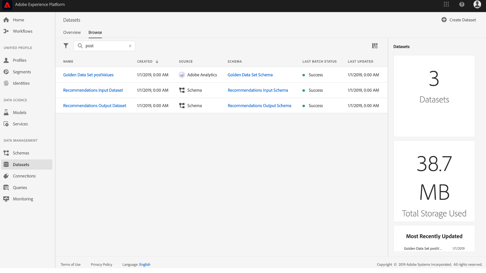
2.  Select **[!UICONTROL Preview Dataset]** near the top right to examine sample records, then click **[!UICONTROL Close]**.
    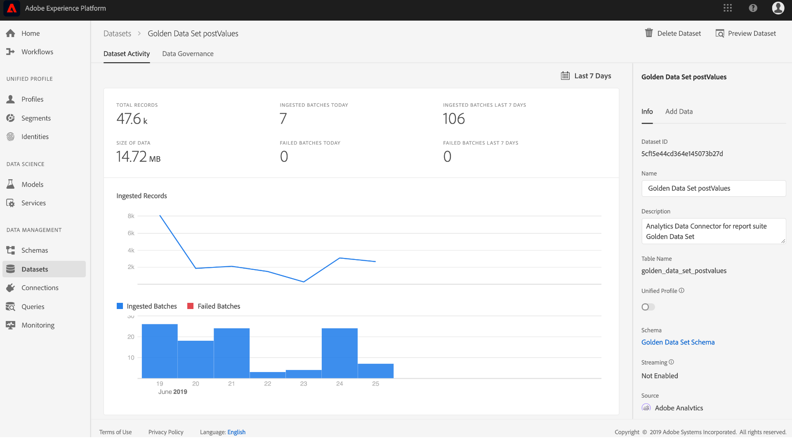
3.  Select the link under Schema in the right rail to view the schema for the dataset, then go back to the dataset details page."
    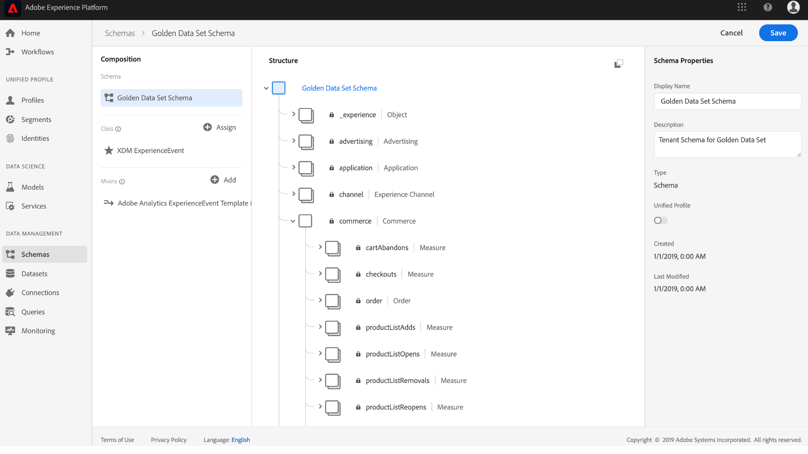

The other datasets have been pre-populated with batches for previewing purposes. You can view these datasets by repeating the above steps.

| Dataset name | Schema | Description |
| ----- | ----- | ----- |
| Golden Data Set postValues | Golden Data Set schema | [!DNL Analytics] source data from your website |
| Recommendations Input Dataset | Recommendations Input Schema | The [!DNL Analytics] data is transformed into a training dataset using a feature pipeline. This data is used to train the Product Recommendations machine learning Model. `itemid` and `userid` correspond to a product purchased by that customer. |
| Recommendations Output Dataset | Recommendations Output Schema | The dataset for which scoring results are stored, it will contain the list of recommended products for each customer. |

## Author your Model {#author-your-model}

The second component of the [!DNL Data Science Workspace] lifecycle involves authoring Recipes and Models. The Product Recommendations Recipe is designed to generate product recommendations at scale by utilizing past purchase data and machine learning. 

Recipes are the basis for a Model as they contain machine learning algorithms and logic designed to solve specific problems. More importantly, Recipes empower you to democratize machine learning across your organization, enabling other users to access a Model for disparate use cases without writing any code.

### Explore the Product Recommendations Recipe

1.  In [!DNL Adobe Experience Platform], navigate to **[!UICONTROL Models]** from the left navigation column, then click **[!UICONTROL Recipes]** at the top to view a list of available Recipes for your organization.
    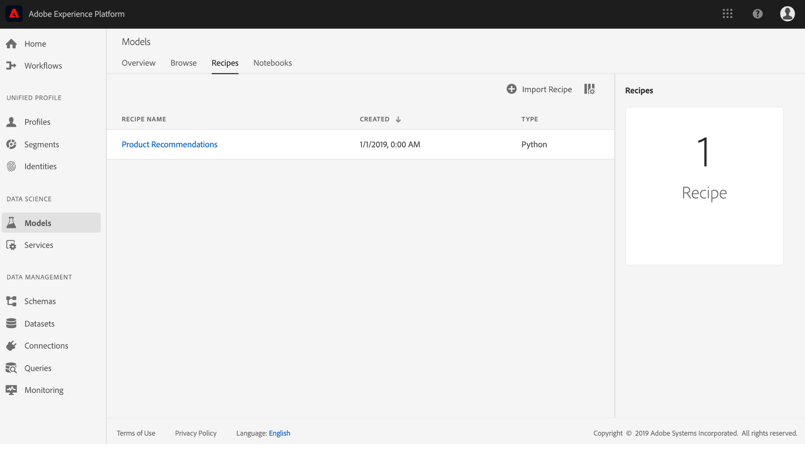
2.  Locate and open the provided **[!UICONTROL Recommendations Recipe]** by clicking its name.
    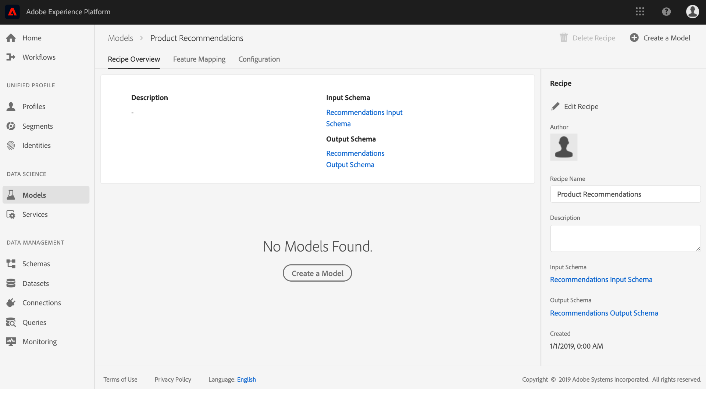
3.  In the right-hand rail, click **[!UICONTROL Recommendations Input Schema]** to view the schema powering the recipe. The schema fields [!UICONTROL itemId] and [!UICONTROL userId] correspond to a product purchased ([!UICONTROL interactionType]) by that customer at a specific time ([!UICONTROL timestamp]). Follow the same steps to review the fields for the **[!UICONTROL Recommendations Output Schema]**.
    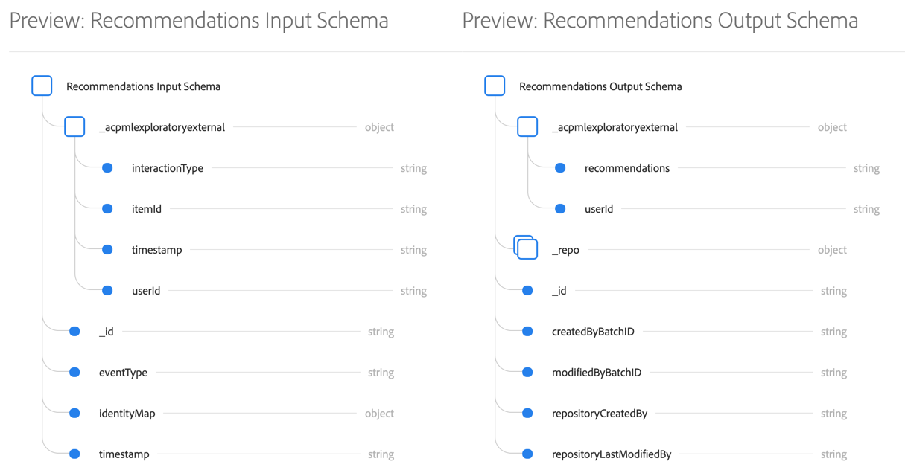

You have now reviewed the input and output schemas required by the Product Recommendations Recipe. You can now continue to the next section to find out how to create, train, and evaluate a Product Recommendations Model.

## Train and evaluate your Model {#train-and-evaluate-your-model}

Now that your data is prepared and the Recipe is ready to be used, you can create, train, and evaluate your machine learning Model.

### Create a Model

A Model is an instance of a Recipe, enabling you to train and score with data at scale.

1.  In [!DNL Adobe Experience Platform], navigate to **[!UICONTROL Models]** from the left navigation column, then click **[!UICONTROL Recipes]** at the top of the page to display a list of all available Recipes for your organization..
    
2.  Locate and open the provided **[!UICONTROL Recommendations Recipe]** by clicking its name, entering the Recipe's overview page. Click **[!UICONTROL Create a Model]** either from the center (if there are no existing Models) or from the top right of the Recipe Overview page.
    
3.  A list of available input datasets for training is shown, select **[!UICONTROL Recommendations Input Dataset]** and click **[!UICONTROL Next]**.
    
4.  Provide a name for the Model, for example "Product Recommendations Model". Available configurations for the model are listed, containing settings for the Model's default training and scoring behaviors. No changes are needed as these configurations are specific to your organization. Review the configurations and click **[!UICONTROL Finish]**.
    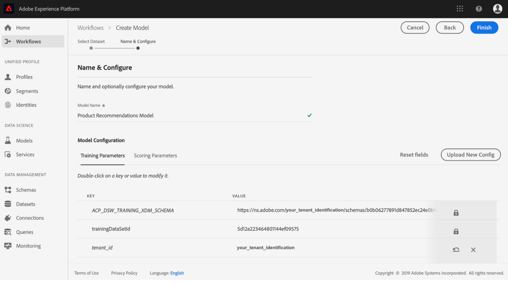
5.  The Model has now been created and the Model's *Overview* page appears within a newly generated training run. A training run is generated by default when a Model is created.
    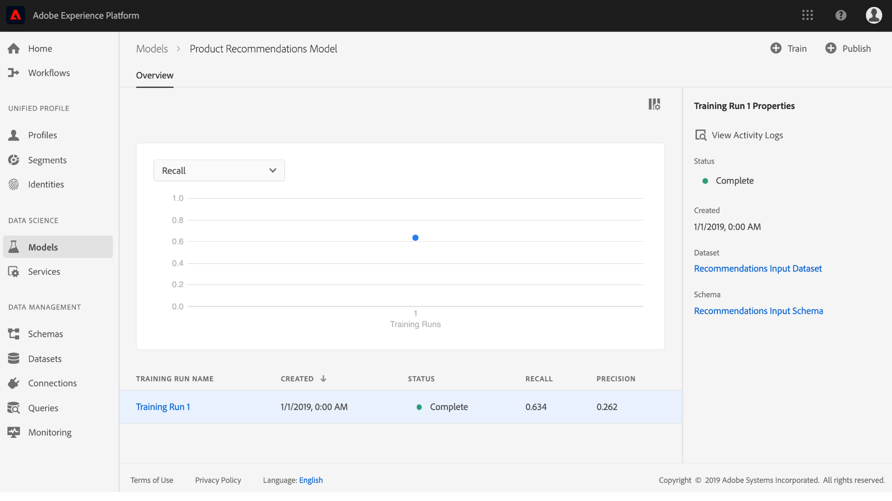

You can choose to wait for the training run to finish, or continue to create a new training run in the following section.

### Train the Model using custom Hyperparameters

1.  On the **Model Overview** page, click **[!UICONTROL Train]** near the top right to create a new training run. Select the same input dataset you used when creating the Model and click **[!UICONTROL Next]**.
    
2.  The **Configuration** page appears. Here you can configure the training run's [!UICONTROL num_recommendations] value, also known as a Hyperparameter. A trained and optimized Model will utilize the best-performing Hyperparameters based on the results of the training run.

    Hyperparameters cannot be learned, therefore they must be assigned before training runs occur. Adjusting Hyperparameters may change the accuracy of the Trained Model. Since optimizing a Model is an iterative process, multiple training runs may be required before a satisfactory evaluation is achieved.

    >[!TIP]
    >
    >Set **[!UICONTROL num_recommendations]** to 10. 

    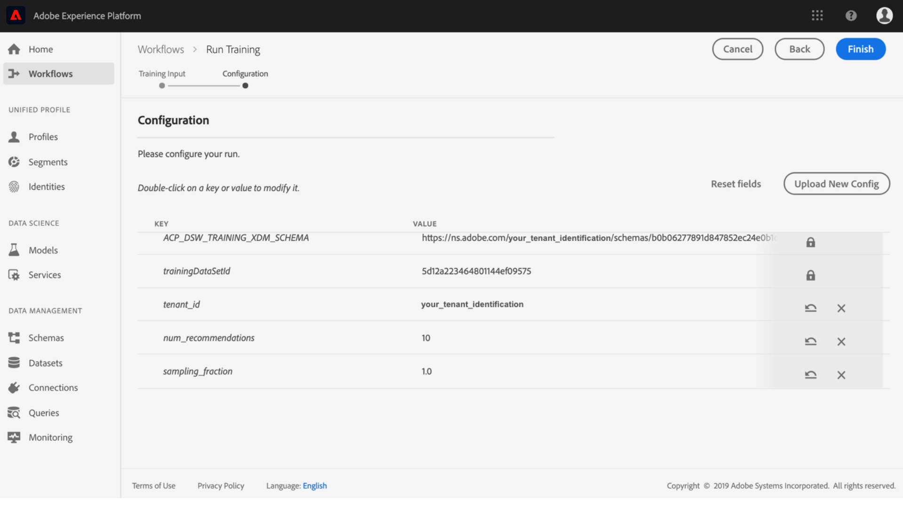
3.  An additional data point will appear on the Model evaluation chart once the new training run completes, this may take up to several minutes.
    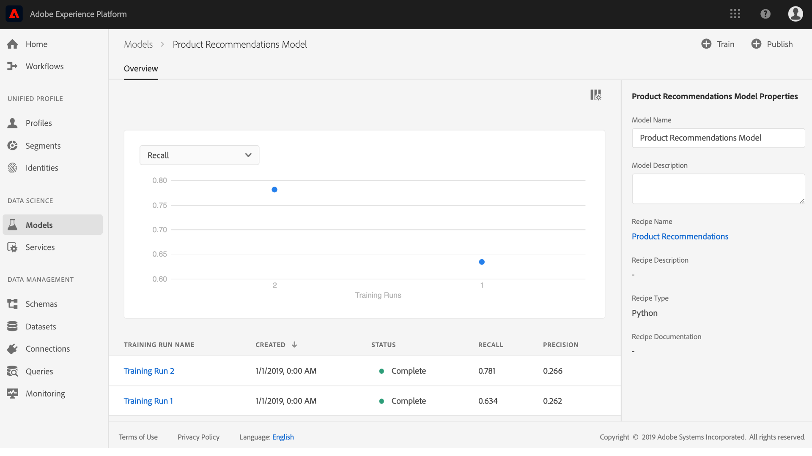

### Evaluate the Model 

Each time a training run completes, you can view the resulting evaluation metrics to determine how well the Model performed.

1.  Review the evaluation metrics (Precision and Recall) for each completed training run by clicking on the training run.
2.  Explore the information provided for each evaluation metric. The higher these metrics, the better the Model performed.
    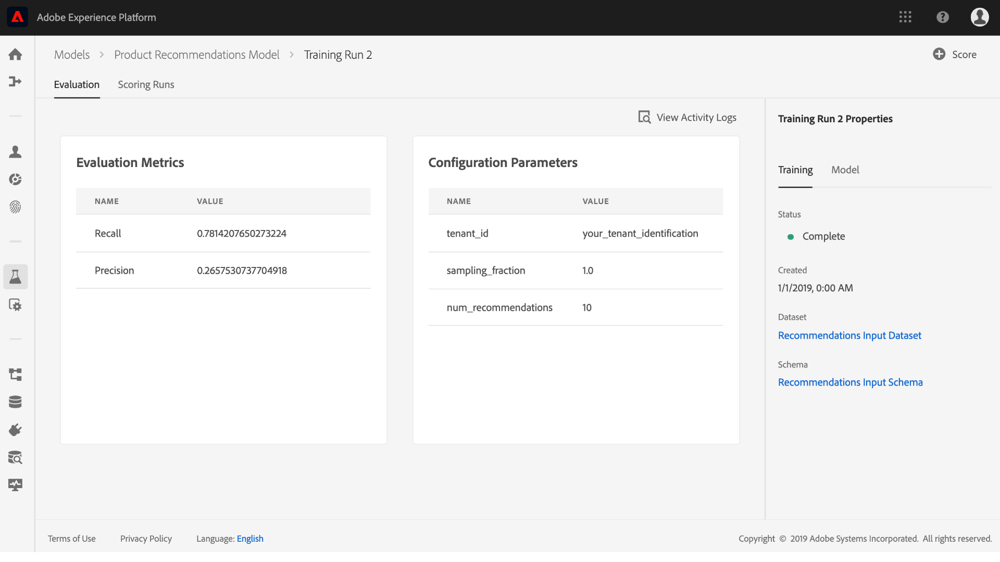
3.  You can see the dataset, schema, and configuration parameters used for each training run on the right rail.
4.  Navigate back to the Model page and identify the top performing training run by observing their evaluation metrics.

## Operationalize your Model {#operationalize-your-model}

The final step in the Data Science workflow is to operationalize your model in order to score and consume insights from your data store.

### Score and generate insights

1.  On the product recommendations Model *Overview* page, click the name of the best-performing training run, with the highest recall and precision values.
2.  On the top-right of the training run details page, click **[!UICONTROL Score]**.
3.  Select the **[!UICONTROL Recommendations Input Dataset]** as the scoring input dataset, which is the same dataset you used when you created the Model and executed its training runs. Then, click **[!UICONTROL Next]**.
    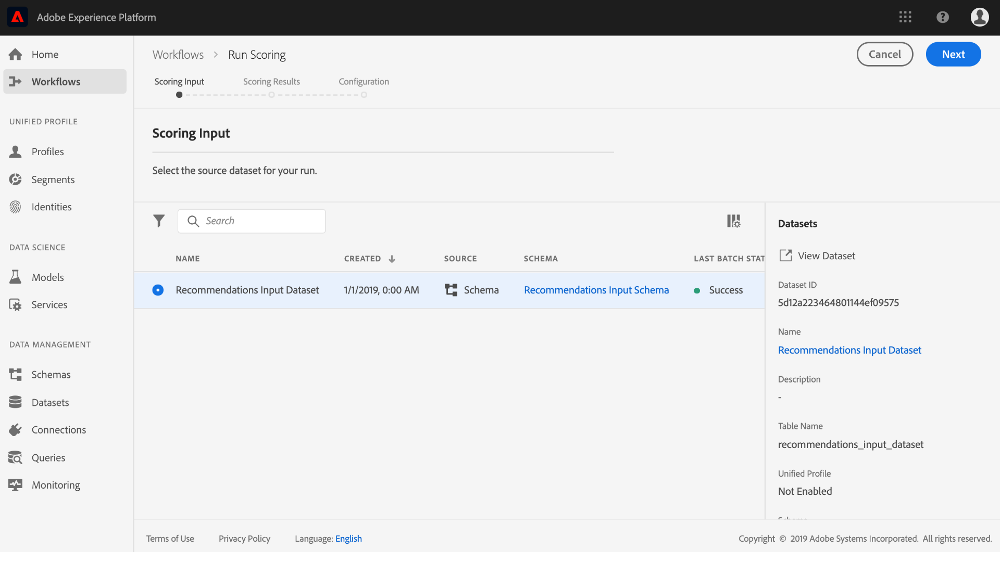
4.  Select the **[!UICONTROL Recommendations Output Dataset]** as the scoring output dataset. Scoring results will be stored in this dataset as a batch.
    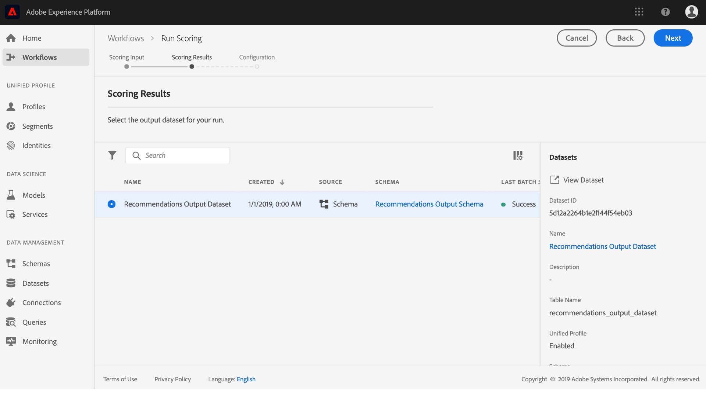
5.  Review the scoring configurations. These parameters contain the input and output datasets selected earlier along with the appropriate schemas. Click **[!UICONTROL Finish]** to begin the scoring run. The run may take several minutes to complete.
    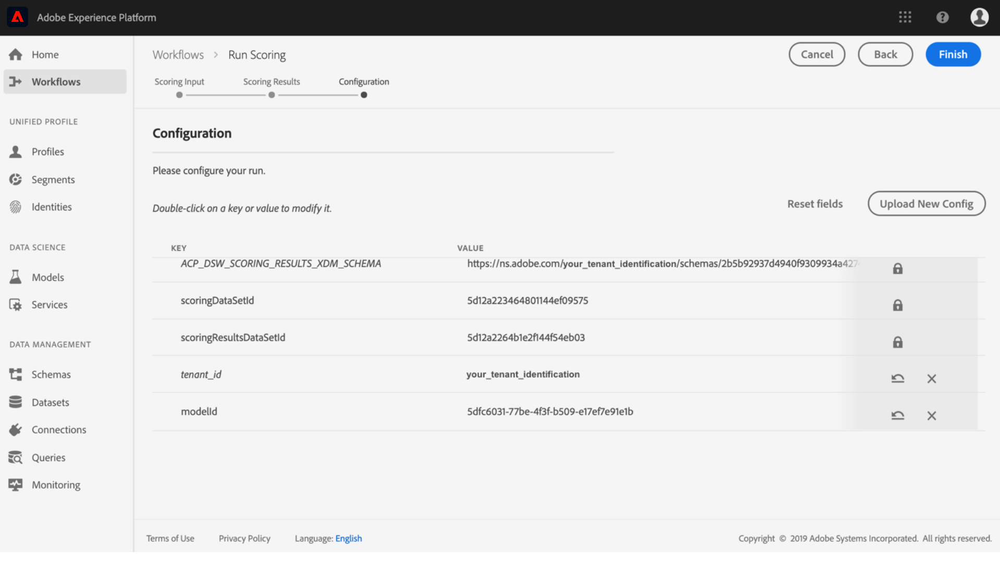

### View scored insights

Once the scoring run has successfully completed, you will be able to preview the results and view the insights generated.

1.  On the scoring runs page, click on the completed scoring run, then click **[!UICONTROL Preview Scoring Results Dataset]** on the right rail.
    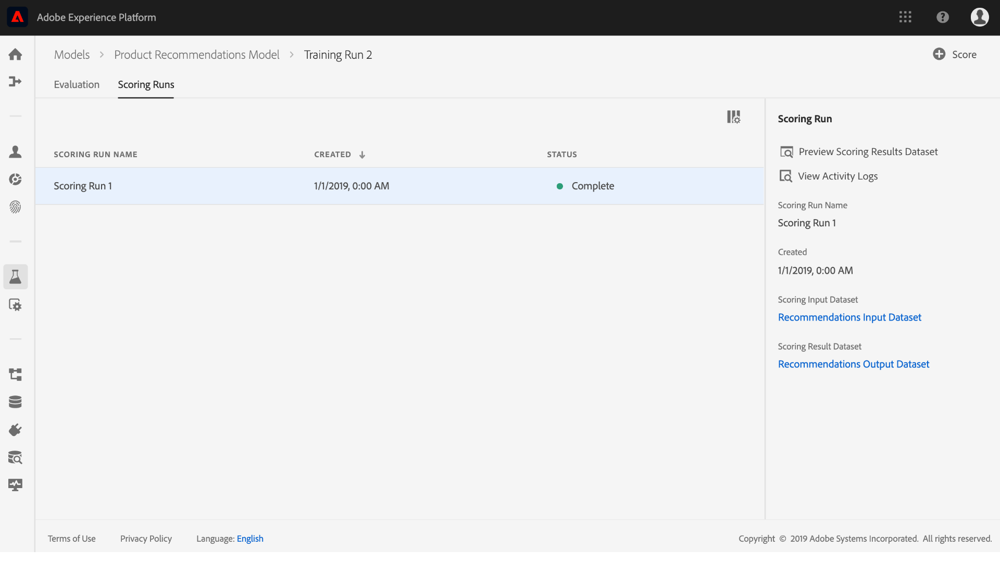
2.  In the preview table, each row contains product recommendations for a particular customer, labeled as [!UICONTROL recommendations] and [!UICONTROL userId] respectively. Since the [!UICONTROL num_recommendations] Hyperparameter was set to 10 in the sample screenshots, each row of recommendations can contain up to 10 product identities delimited by a number sign (#).
    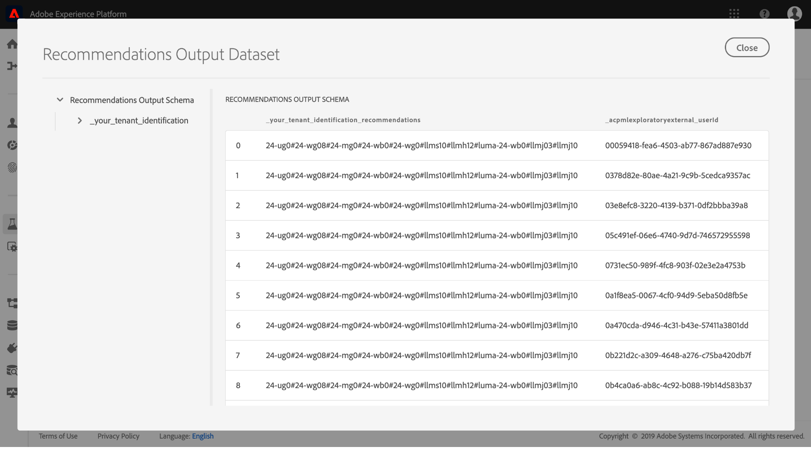

## Next steps {#next-steps}

Well done, you have successfully generated product recommendations!

This tutorial introduced you to the workflow of [!DNL Data Science Workspace], demonstrating how raw unprocessed data can be turned into useful information through machine learning. To learn more about using the [!DNL Data Science Workspace], continue to the next guide on [creating the retail sales schema and dataset](./create-retails-sales-dataset.md).