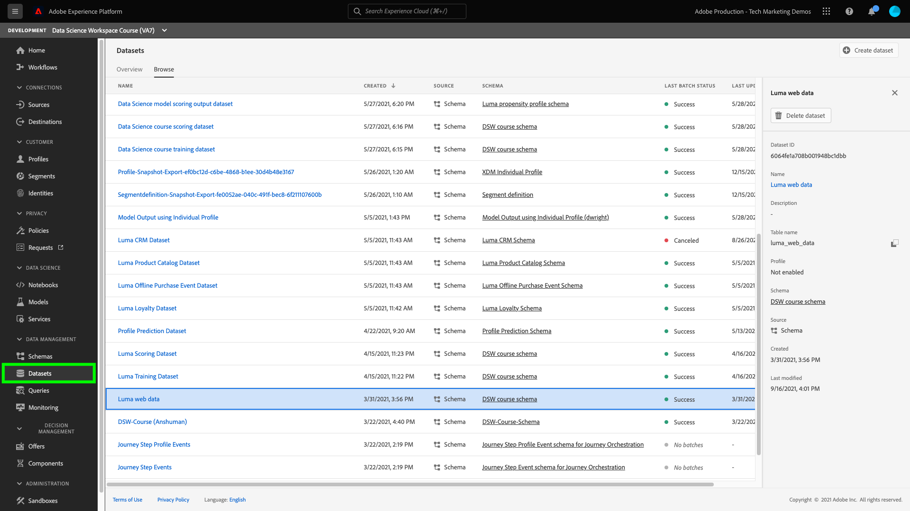
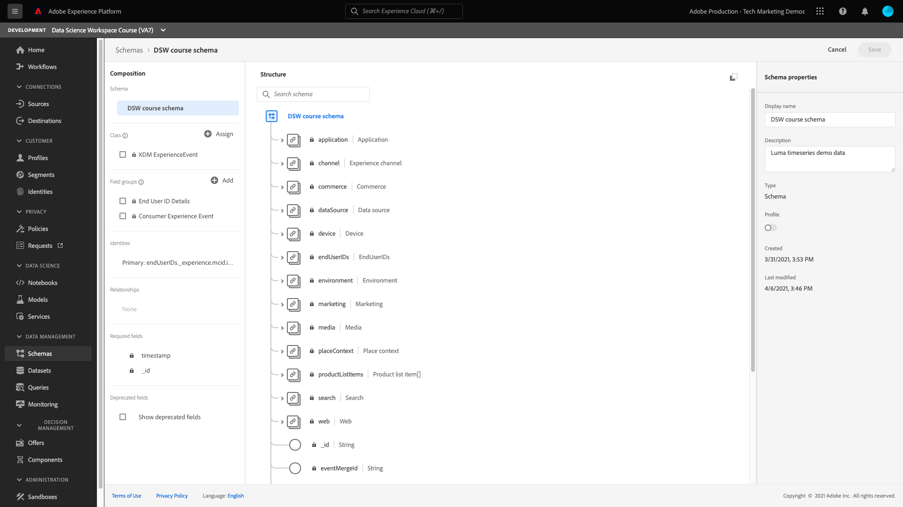

# Create and publish a machine learning model

The following guide describes the steps required to create and publish a machine learning model. Each section contains a description of what you will do and a link to the UI and API documentation to preform the described step.

## Getting started

Before starting this tutorial, you must have the following prerequisites:

-   Access to [!DNL Adobe Experience Platform]. If you do not have access to an IMS Organization in [!DNL Experience Platform], please speak to your system administrator before proceeding.

-  All Data Science Workspace tutorials use the Luma propensity model. In order to follow along, you must have created the [Luma propenstiy model schemas and datasets](./create-luma-data.md).

### Explore the data and understand the schemas

Log in to [Adobe Experience Platform](https://platform.adobe.com/) and select **[!UICONTROL Datasets]** to list all existing datasets and select the dataset that you would like to explore. In this case, you should select the **Luma web data** dataset.

The dataset activity page opens, listing information relating to your dataset. You can select **[!UICONTROL Preview Dataset]** near the top-right to examine sample records. You can also view the schema for the selected dataset. 

Select the schema link in the right-rail. A popover appears, selecting the link under **[!UICONTROL schema name]** opens the schema in a new tab.

You can further explore the data using the provided Exploratory Data Analysis (EDA) notebook. This notebook can be used to help understand patterns in the Luma data, check data sanity, and summarize the relevant data for the predictive propensity model. To learn more about Exploratory Data Analysis, visit the [EDA documenation](../jupyterlab/eda-notebook.md).

## Create the Luma propensity recipe {#author-your-model}

A main component of the [!DNL Data Science Workspace] lifecycle involves authoring Recipes and Models. The Luma propensity model is designed to generate a prediction on whether customers have a high propensity to purchase a product from Luma.

To create the Luma propensity model, the recipe builder template is used. Recipes are the basis for a Model, as they contain machine learning algorithms and logic designed to solve specific problems. More importantly, Recipes empower you to democratize machine learning across your organization, enabling other users to access a Model for disparate use cases without writing any code.

Follow the [create a model using JupyterLab Notebooks](../jupyterlab/create-a-model.md) tutorial to create the Luma propensity model recipe which is used in subsequent tutorials.

## Import and package a recipe from external sources (*optional*)

If you wish to import and package a recipe for use in Data Science Workspace, you must package your source files into an archive file. Follow the [package source files into a recipe](./package-source-files-recipe.md) tutorial. This tutorial shows you how to package source files into a recipe, which is the prerequisite step for importing a recipe into Data Science Workspace. Once the tutorial is complete, you are provided a Docker image in a Azure Container Registry, along with the corresponding image URL, in other words, an archive file.

This archive file can be used to create a recipe in Data Science Workspace by following the recipe import workflow using the [UI workflow](./import-packaged-recipe-ui.md) or the [API workflow](./import-packaged-recipe-api.md).

## Train and evaluate a model {#train-and-evaluate-your-model}

Now that your data is prepared and a recipe is ready, you have the ability to create, train, and evaluate your machine learning model further. While using the Recipe Builder, you should have already trained, scored, and evaluated your model before packaging it into a recipe. 

The Data Science Workspace UI and API allow you to publish your recipe as a model. Additionally, you can further fine-tune specific aspects of your model such as adding, removing, and changing hyperparameters.

### Create a Model

To learn more about creating a model using the UI, visit the train and evaluate a model in the Data Science Workspace [UI tutorial](./train-evaluate-model-ui.md) or [API tutorial](./train-evaluate-model-api.md). This tutorial provides an example on how to create, train, and update hyperparameters to fine tune your model.

>[!NOTE]
>
> Hyperparameters cannot be learned, therefore they must be assigned before training runs occur. Adjusting hyperparameters may change the accuracy of your trained model. Since optimizing a model is an iterative process, multiple training runs may be required before a satisfactory evaluation is achieved.

## Score a model {#score-a-model}

The next step in creating and publishing a model is to operationalize your model in order to score and consume insights from the data lake and Real-Time Customer Profile.

Scoring in Data Science Workspace can be achieved by feeding input data into an existing trained Model. Scoring results are then stored and viewable in a specified output dataset as a new batch. 

To learn how to score your model, visit the score a model [UI tutorial](./score-model-ui.md) or [API tutorial](./score-model-api.md).

## Publish a scored model as a service

Data Science Workspace allows you to publish your trained model as a service. This enables users within your IMS Organization to score data without the need to create their own models.

To learn how to publish a model as a service, visit the [UI tutorial](./publish-model-service-ui.md) or [API tutorial](./publish-model-service-api.md).

### Schedule automated training for a service

Once you have published a model as a service, you can set up scheduled scoring and training runs for your machine learning service. Automating the training and scoring process can help maintain and improve a service's efficiency through time by keeping up with patterns within your data. Visit the [schedule a model in the Data Science Workspace UI](./schedule-models-ui.md) tutorial.

>[!NOTE]
>
> You can only schedule a model for automated training and scoring from the UI.

## Next steps {#next-steps}

Adobe Experience Platform [!DNL Data Science Workspace] provides the tools and resources to create, evaluate, and utilize machine learning models to generate data predictions and insights. When machine learning insights are ingested into a [!DNL Profile]-enabled dataset, that same data is also ingested as [!DNL Profile] records which can then be segmented using [!DNL Adobe Experience Platform Segmentation Service].

 As profile and time series data is ingested, Real-Time Customer Profile automatically decides to include or exclude that data from segments through an ongoing process called streaming segmentation, before merging it with existing data and updating the union view. As a result, you can instantaneously perform computations and make decisions to deliver enhanced, individualized experiences to customers as they interact with your brand.

 Visit the tutorial for [enriching Real-Time Customer Profile with machine learning insights](./enrich-profile.md) to learn more about how you can utilize machine learning insights.
