# Enrich [!DNL Real-time Customer Profile] with machine learning insights

[!DNL Adobe Experience Platform] [!DNL Data Science Workspace] provides the tools and resources to create, evaluate, and utilize machine learning models to generate data predictions and insights. When machine learning insights are ingested into a [!DNL Profile]-enabled dataset, that same data is also ingested as [!DNL Profile] records which can then be segmented into subsets of related elements by using [!DNL Experience Platform Segmentation Service].

This document provides a step-by-step tutorial to enrich [!DNL Real-time Customer Profile] with machine learning insights, steps are broken into the following sections:

1.  [Create an output schema and dataset](#create-an-output-schema-and-dataset)
2.  [Configure an output schema and dataset](#configure-an-output-schema-and-dataset)
3.  [Create segments using the Segment Builder](#create-segments-using-the-segment-builder)

## Getting started

This tutorial requires a working understanding of the various aspects of [!DNL Adobe Experience Platform] involved in ingesting [!DNL Profile] data and creating segments. Before beginning this tutorial, please review the documentation for the following services:

*   [[!DNL Real-time Customer Profile]](../../rtcdp/overview.md): Provides a unified, real-time consumer profile based on aggregated data from multiple sources.
*   [[!DNL Identity Service]](../../identity-service/home.md): Enables [!DNL Real-time Customer Profile] by bridging identities from disparate data sources being ingested into Platform.
*   [[!DNL Experience Data Model (XDM)]](../../xdm/home.md): The standardized framework by which Platform organizes customer experience data.

In addition to the above-mentioned documents, it is highly recommended that you also review the following guides on schemas and the Schema Editor:

*   [Basics of schema composition](../../xdm/schema/composition.md): Describes XDM schemas, building blocks, principles, and best practices for composing schemas to be used in [!DNL Experience Platform].
*   [Schema Editor tutorial](../../xdm/tutorials/create-schema-ui.md): Provides detailed instructions for creating schemas using the Schema Editor within [!DNL Experience Platform].

## Create an output schema and dataset {#create-an-output-schema-and-dataset}

The first step towards enriching [!DNL Real-time Customer Profile] with scoring insights is knowing what real-world object (such as a person) your data defines. Having an understanding of your data enables you to describe and design a structure that is meaning to your data, much like designing a relational database.

Composing a schema begins by assigning a class. Classes define the behavioral aspects of the data the schema will contain (record or time-series). This section provides basic instructions to create a schema using the schema builder. For a more in-depth tutorial, refer to the tutorial on [creating a schema using the Schema Editor](../../xdm/tutorials/create-schema-ui.md).

1.  On Adobe Experience Platform, click the **[!UICONTROL Schema]** tab to access the schema browser. Click **[!UICONTROL Create Schema]** access the **Schema Editor**, where you can interactively build and create schemas.
    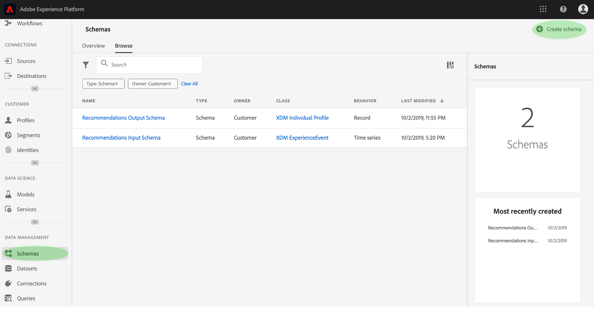

2.  Within the **Composition** window, click **[!UICONTROL Assign]** to browse your available classes.
    *   To assign an existing class, click and highlight the desired class and then click **[!UICONTROL Assign Class]**.
        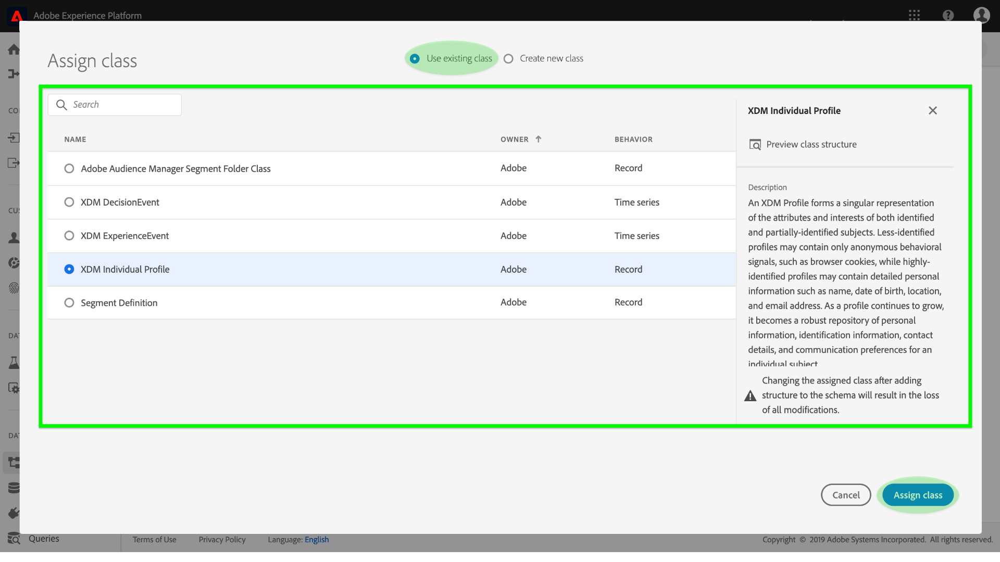

    *   To create a custom class, click **[!UICONTROL Create New Class]** found near the center-top of the browser window. Provide a class name, description, and choose the class's behavior. Click **[!UICONTROL Assign Class]** once you are finished.
        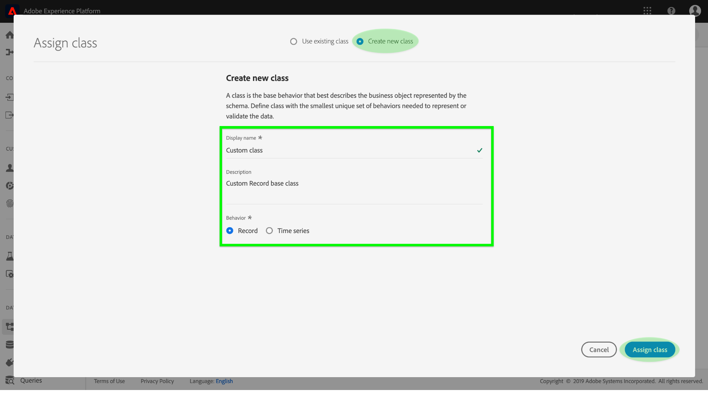

    At this point, your schema's structure should contain some class fields and you are ready to assign mixins. A mixin is a group of one or more fields that describe a particular concept.

3.  Within the **Composition** window, click **[!UICONTROL Add]** in the *Mixins* sub-section.
    *   To assign an existing mixin, click and highlight the desired mixin and then click **[!UICONTROL Add Mixin]**. Unlike classes, multiple mixins can be assigned to a single schema as long as it is appropriate to do so.
        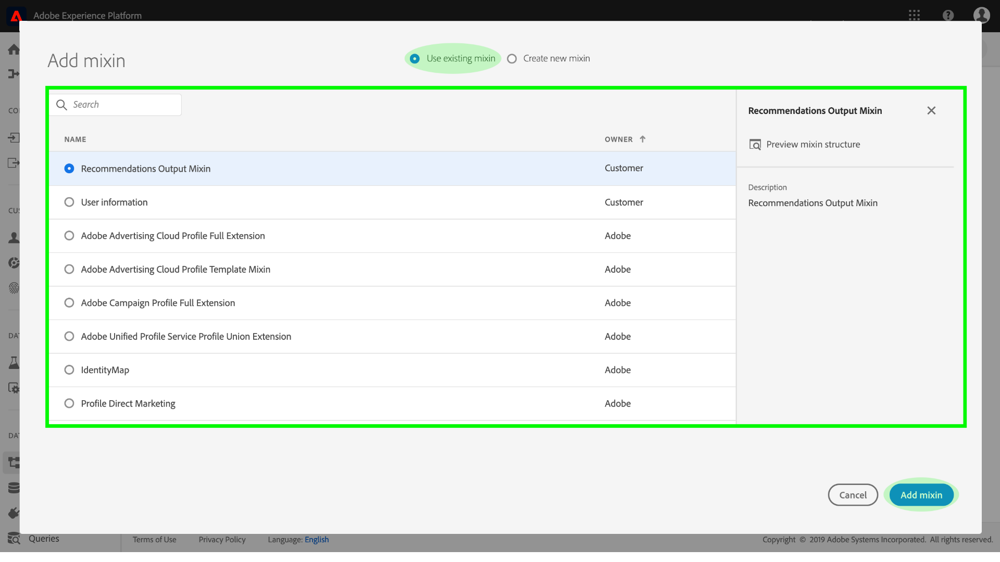

    *   To create a new mixin, click **[!UICONTROL Create New Mixin]** found near the center-top of the browser window. Provide a name and description for the mixin then click **[!UICONTROL Assign Mixin]** once you are finished.
        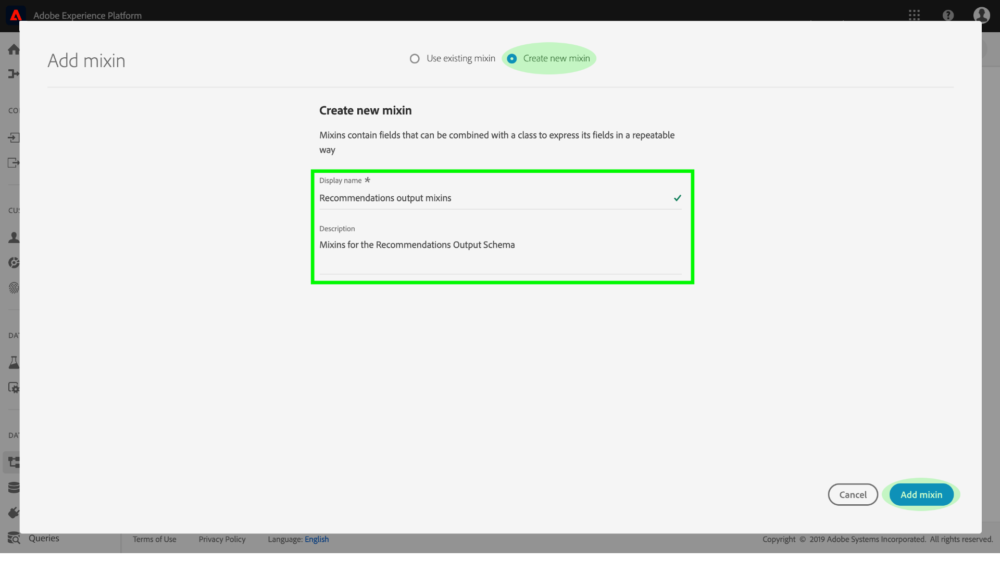

    *   To add mixin fields, click the name of the mixin inside the *Composition* window. You will then be provided the option to add mixin fields by clicking **[!UICONTROL Add Field]** within the *Structure* window. Ensure to provide mixin properties accordingly.
        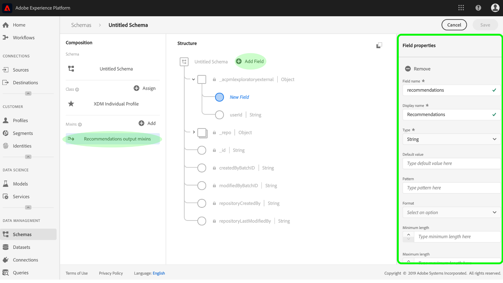

4.  Once you are done building your schema, click the top level field of your schema within the *Structure* window to display the schema's properties in the right property window. Provide a name and a description, and click **[!UICONTROL Save]** to create the schema.
    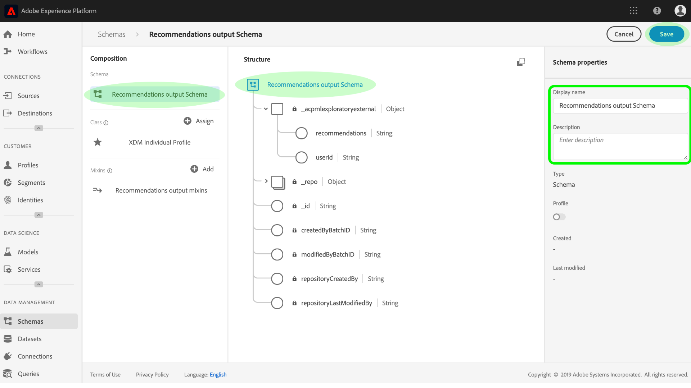

5.  Create an output dataset using your newly created schema by clicking **[!UICONTROL Datasets]** from the left navigation column, then click **[!UICONTROL Create dataset]**. On the next screen, choose **[!UICONTROL Create dataset from schema]**.
    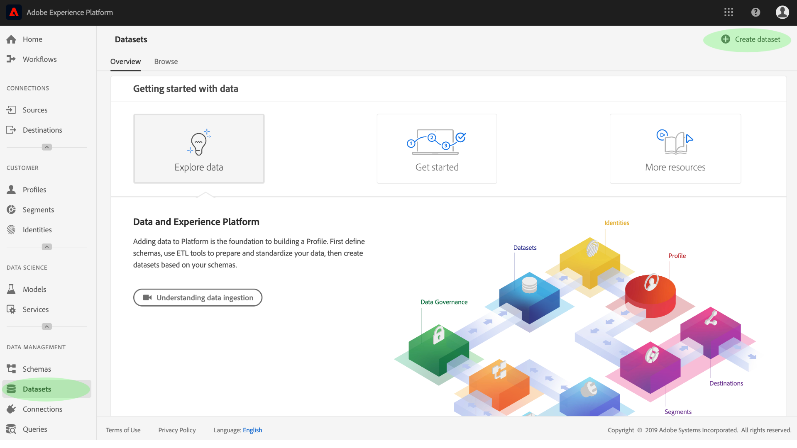

6.  Using the schema browser, find and select the newly created schema, then click **[!UICONTROL Next]**.
    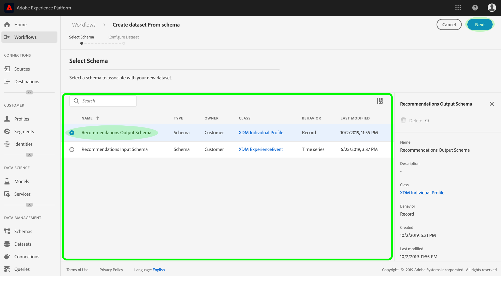

7.  Provide a name and an optional description, then click **[!UICONTROL Finish]** to create the dataset.
    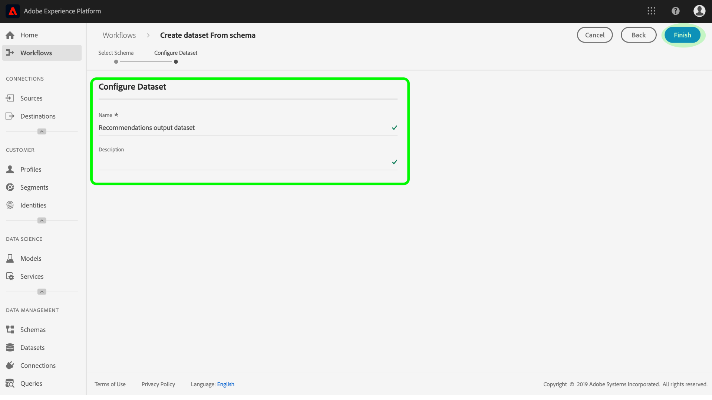

Now that you have a created an output schema dataset, you are ready continue on to the next section to configure and enable them for Profile enrichment.

## Configure an output schema and dataset {#configure-an-output-schema-and-dataset}

Before you can enable a dataset for [!DNL Profile], you need to configure the dataset's schema to having a primary identity field and then enable the schema for [!DNL Profile]. If you wish to create and enable a new schema, you can refer to the tutorial on [creating a schema using the Schema Editor](../../xdm/tutorials/create-schema-ui.md). Otherwise follow the instructions below to enable an existing schema and dataset.

1.  On Adobe Experience Platform, use the schema browser to find the output schema you wish to enable [!DNL Profile] on and click its name to view its composition.
    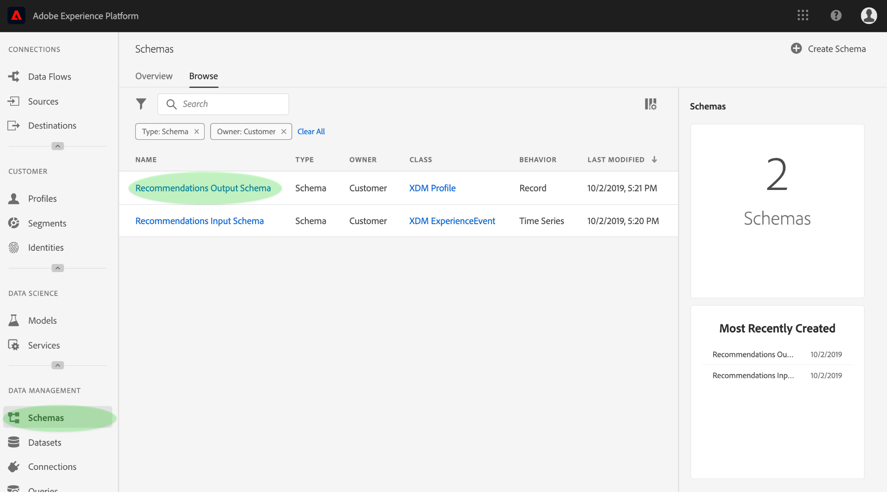

2.  Expand the schema structure and find an appropriate field to set as the primary identifier. Click the desired field to display its properties.
    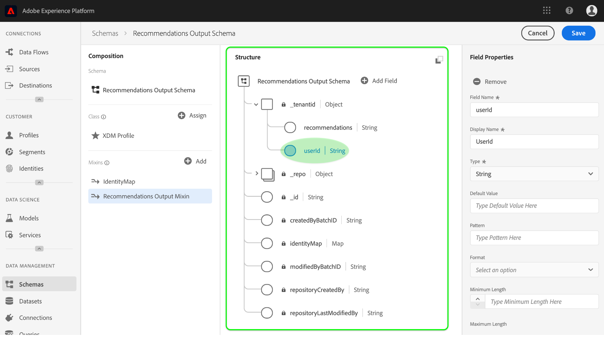

3.  Set the field as the primary identity by enabling the field's **[!UICONTROL Identity]** property, **[!UICONTROL Primary Identity]** property, and then selecting an appropriate **[!UICONTROL Identity Namespace]**. Click **[!UICONTROL Apply]** once you have made your changes.
    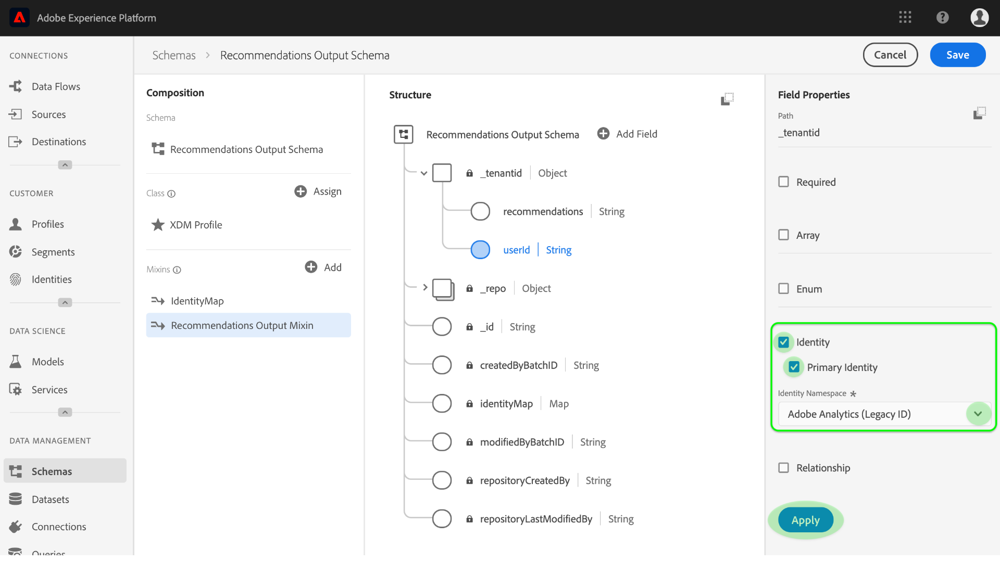

4.  Click the top-level object of your schema structure to display the schema properties and enable the schema for Profile by toggling the **[!UICONTROL Profile]** switch. Click **[!UICONTROL Save]** to finalize your changes, dataset that were created using this schema can now be enabled for Profile.
    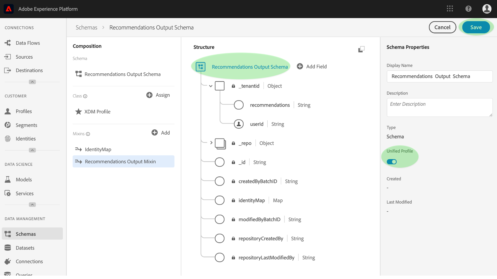

5.  Use the dataset browser to find the dataset you wish to enable [!DNL Profile] on and click its name to access its details.
    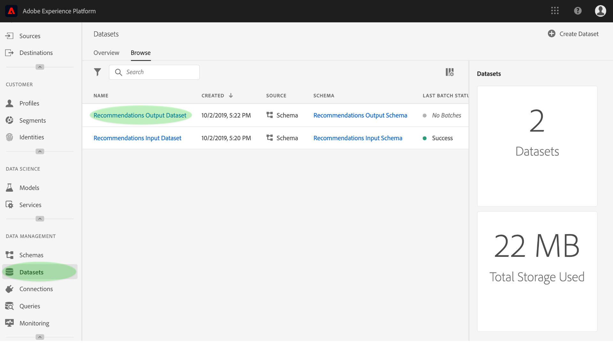

6.  Enable the dataset for [!DNL Profile] by toggling the **[!UICONTROL Profile]** switch found in the right information column. 
    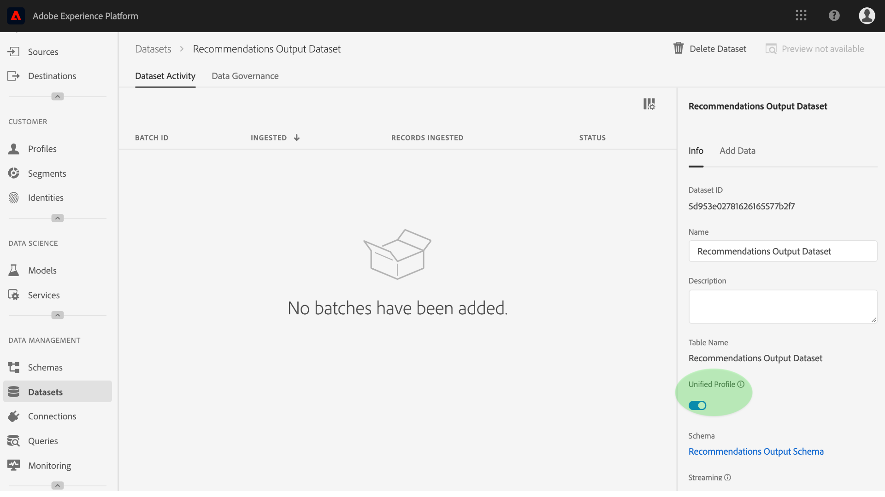

When data is ingested into a [!DNL Profile]-enabled dataset, that same data is also ingested as [!DNL Profile] records. Now that your schema and dataset is prepared, generate some data into the dataset by performing scoring runs using an appropriate model, and continue with this tutorial to create insight segments using the Segment Builder.

## Create segments using the Segment Builder {#create-segments-using-the-segment-builder}

Now that you have generated and ingested insights into your [!DNL Profile]-enabled dataset, you can manage that data by identifying subsets of related elements using the Segment Builder. Follow the steps below to build your own segments.

1.  On Adobe Experience Platform, click the **[!UICONTROL Segments]** tab followed by **[!UICONTROL Create Segment]** to access the Segment Builder.
    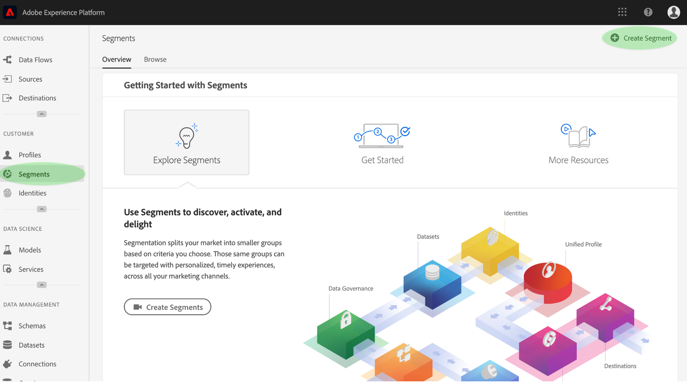

2.  Within the Segment Builder, the left rail provides access to the core building blocks of segments: attributes, events, and existing segments. Each building block appears in its own respective tab. Select the class to which your [!DNL Profile]-enabled schema extends then browse and find the building blocks for your segment.
    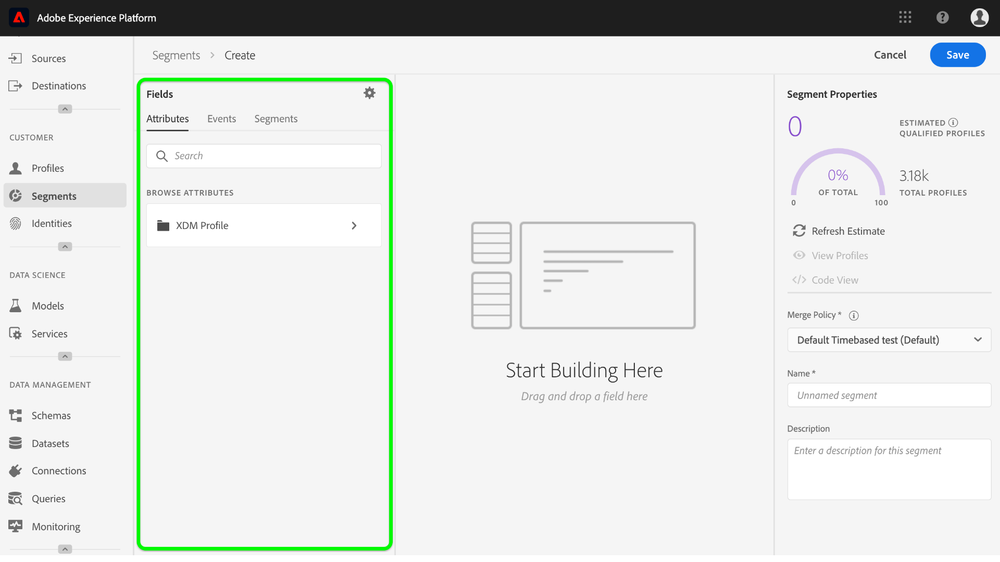

3.  Drag and drop building blocks onto the rule builder canvas, complete them by providing comparative statements.
    

4.  While you build your segment you can preview estimated segment results by observing the *Segment Properties* panel.
    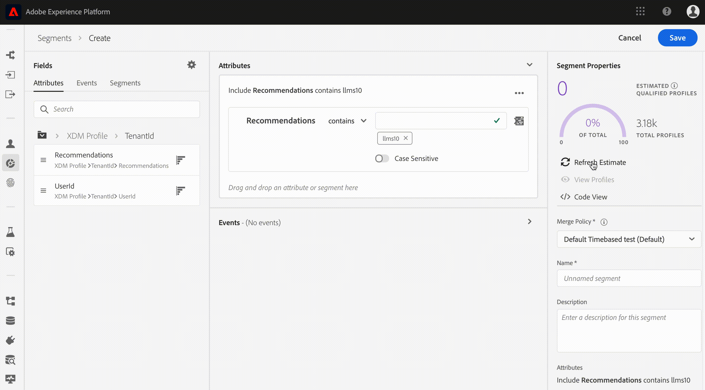

5.  Select an appropriate **[!UICONTROL Merge Policy]**, provide a name and an optional description, then click **[!UICONTROL Save]** to complete your new segment.
    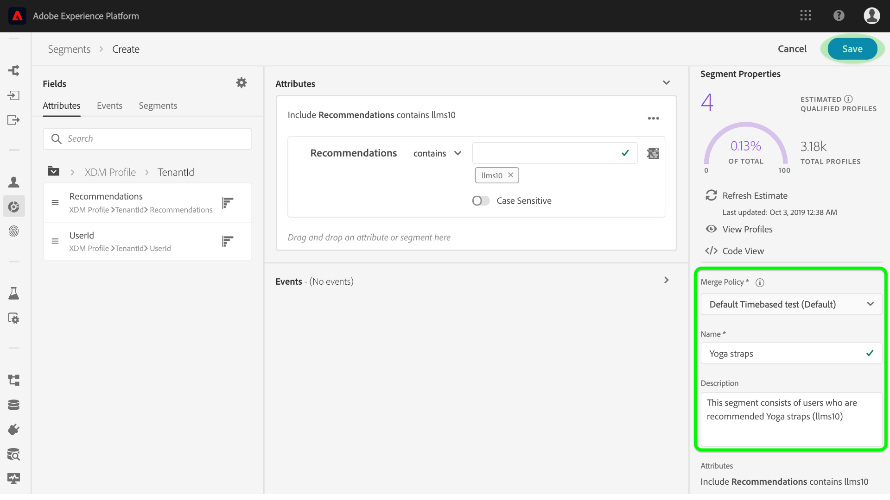

## Next steps {#next-steps}

This document walked you through the steps required to enable a schema and dataset for [!DNL Profile], and briefly demonstrated the workflow for creating insight segments using the Segment Builder. To learn more about segments and the Segment Builder, refer to the [Segmentation service overview](../../segmentation/home.md).