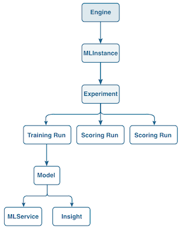

# Import a packaged recipe using the Sensei Machine Learning API

This tutorial uses the [[!DNL Sensei Machine Learning API]](https://www.adobe.io/apis/experienceplatform/home/api-reference.html#!acpdr/swagger-specs/sensei-ml-api.yaml) to create an [Engine](../api/engines.md), also known as a Recipe in the user interface. 

Before getting started, it is important to note that Adobe Experience Platform [!DNL Data Science Workspace] uses different terms to refer to similar elements within the API and UI. The API terms are used throughout this tutorial and the following table outlines the correlating terms:

| UI Term | API Term |
| ---- | ---- |
| Recipe | [Engine](../api/engines.md) |
| Model | [MLInstance](../api/mlinstances.md) |
| Training and evaluation | [Experiment](../api/experiments.md) |
| Service | [MLService](../api/mlservices.md) |

An Engine contains machine learning algorithms and logic to solve specific problems. The diagram below provides a visualization showing the API workflow in [!DNL Data Science Workspace]. This tutorial focuses on creating an Engine, the brain of a machine learning Model.



## Getting started

This tutorial requires a packaged Recipe file in the form of a Docker URL. Follow the [Package source files into a Recipe](./package-source-files-recipe.md) tutorial to create a packaged Recipe file or provide your own.
 
-   `{DOCKER_URL}`: An URL address to a Docker image of an intelligent service.

This tutorial requires you to have completed the [Authentication to Adobe Experience Platform tutorial](https://www.adobe.com/go/platform-api-authentication-en) in order to successfully make calls to [!DNL Platform] APIs. Completing the authentication tutorial provides the values for each of the required headers in all [!DNL Experience Platform] API calls, as shown below:

-   `{ACCESS_TOKEN}`: Your specific bearer token value provided after authentication.
-   `{ORG_ID}`: Your organization credentials found in your unique Adobe Experience Platform integration.
-   `{API_KEY}`: Your specific API key value found in your unique Adobe Experience Platform integration.

## Create an Engine

Engines can be created by making a POST request to the /engines endpoint. The created Engine is configured based on the form of the packaged Recipe file that must be included as part of the API request.

### Create an Engine with a Docker URL {#create-an-engine-with-a-docker-url}

In order to create an Engine with a packaged Recipe file stored in a Docker container, you must provide the Docker URL to the packaged Recipe file.

>[!CAUTION]
>
> If you are using [!DNL Python] or R use the request below. If you are using PySpark or Scala, use the PySpark/Scala request example located below the Python/R example.

**API format**

```http
POST /engines
```

**Request Python/R**

```shell
curl -X POST \
    https://platform.adobe.io/data/sensei/engines \
    -H 'Authorization: {ACCESS_TOKEN}' \
    -H 'X-API-KEY: {API_KEY}' \
    -H 'content-type: multipart/form-data' \
    -H 'x-gw-ims-org-id: {ORG_ID}' \
    -H `x-sandbox-name: {SANDBOX_NAME}` \
    -F 'engine={
        "name": "Retail Sales Engine Python",
        "description": "A description for Retail Sales Engine, this Engines execution type is Python",
        "type": "Python"
        "artifacts": {
            "default": {
                "image": {
                    "location": "{DOCKER_URL}",
                    "name": "retail_sales_python",
                    "executionType": "Python"
                }
            }
        }
    }' 
```

| Property | Description |
| -------  | ----------- |
| `engine.name` | The desired name for the Engine. The Recipe corresponding to this Engine will inherit this value to be displayed in [!DNL Data Science Workspace] user interface as the Recipe's name. |
| `engine.description` | An optional description for the Engine. The Recipe corresponding to this Engine will inherit this value to be displayed in [!DNL Data Science Workspace] user interface as the Recipe's description. Do not remove this property, let this value be an empty string if you choose not to provide a description. |
| `engine.type` | The execution type of the Engine. This value corresponds to the language in which the Docker image is developed in. When a Docker URL is provided to create an Engine, `type` is either `Python`, `R`, `PySpark`, `Spark` (Scala), or `Tensorflow`. |
| `artifacts.default.image.location` | Your `{DOCKER_URL}` goes here. A complete Docker URL has the following structure: `your_docker_host.azurecr.io/docker_image_file:version` |
| `artifacts.default.image.name` | An additional name for the Docker image file. Do not remove this property, let this value be an empty string if you choose not to provide an additional Docker image file name. |
| `artifacts.default.image.executionType` | The execution type of this Engine. This value corresponds to the language in which the Docker image is developed in. When a Docker URL is provided to create an Engine, `executionType` is either `Python`, `R`, `PySpark`, `Spark` (Scala), or `Tensorflow`. |

**Request PySpark**

```shell
curl -X POST \
  https://platform.adobe.io/data/sensei/engines \
    -H 'Authorization: Bearer {ACCESS_TOKEN}' \
    -H 'x-api-key: {API_KEY}' \
    -H 'x-gw-ims-org-id: {ORG_ID}' \
    -H 'x-sandbox-name: {SANDBOX_NAME}' \
    -H 'content-type: multipart/form-data' \
    -F 'engine={
    "name": "PySpark retail sales recipe",
    "description": "A description for this Engine",
    "type": "PySpark",
    "mlLibrary":"databricks-spark",
    "artifacts": {
        "default": {
            "image": {
                "name": "modelspark",
                "executionType": "PySpark",
                "packagingType": "docker",
                "location": "v1d2cs4mimnlttw.azurecr.io/sarunbatchtest:0.0.1"
            }
        }
    }
}'
```

| Property | Description |
| --- | --- |
| `name` | The desired name for the Engine. The Recipe corresponding to this Engine will inherit this value to be displayed in the UI as the Recipe's name. |
| `description` | An optional description for the Engine. The Recipe corresponding to this Engine will inherit this value to be displayed in UI as the Recipe's description. This property is required. If you do not want to provide a description, set its value to be an empty string. |
| `type` | The execution type of the Engine. This value corresponds to the language in which the Docker image is built upon "PySpark". |
| `mlLibrary` | A field that is required when creating engines for PySpark and Scala recipes. |
| `artifacts.default.image.location` | The location of the Docker image linked to by a Docker URL. |
| `artifacts.default.image.executionType` | The execution type of the Engine. This value corresponds to the language in which the Docker image is built upon "Spark". |
    
**Request Scala**

```shell
curl -X POST \
  https://platform.adobe.io/data/sensei/engines \
    -H 'Authorization: Bearer {ACCESS_TOKEN}' \
    -H 'x-api-key: {API_KEY}' \
    -H 'x-gw-ims-org-id: {ORG_ID}' \
    -H 'x-sandbox-name: {SANDBOX_NAME}' \
    -H 'content-type: multipart/form-data' \
    -F 'engine={
    "name": "Spark retail sales recipe",
    "description": "A description for this Engine",
    "type": "Spark",
    "mlLibrary":"databricks-spark",
    "artifacts": {
        "default": {
            "image": {
                "name": "modelspark",
                "executionType": "Spark",
                "packagingType": "docker",
                "location": "v1d2cs4mimnlttw.azurecr.io/sarunbatchtest:0.0.1"
            }
        }
    }
}'
```

| Property | Description |
| --- | --- |
| `name` | The desired name for the Engine. The Recipe corresponding to this Engine will inherit this value to be displayed in the UI as the Recipe's name. |
| `description` | An optional description for the Engine. The Recipe corresponding to this Engine will inherit this value to be displayed in UI as the Recipe's description. This property is required. If you do not want to provide a description, set its value to be an empty string. |
| `type` | The execution type of the Engine. This value corresponds to the language in which the Docker image is built upon "Spark". |
| `mlLibrary` | A field that is required when creating engines for PySpark and Scala recipes. |
| `artifacts.default.image.location` | The location of the Docker image linked to by a Docker URL. |
| `artifacts.default.image.executionType` | The execution type of the Engine. This value corresponds to the language in which the Docker image is built upon "Spark". |

**Response**

A successful response returns a payload containing the details of the newly created Engine including its unique identifier (`id`). The following example response is for a [!DNL Python] Engine. The `executionType` and `type` keys change based on the supplied POST.

```json
{
    "id": "{ENGINE_ID}",
    "name": "A name for this Engine",
    "description": "A description for this Engine",
    "type": "Python",
    "algorithm": "Classification",
    "created": "2019-01-01T00:00:00.000Z",
    "createdBy": {
        "userId": "Jane_Doe@AdobeID"
    },
    "updated": "2019-01-01T00:00:00.000Z",
    "artifacts": {
        "default": {
            "image": {
                "location": "{DOCKER_URL}",
                "name": "An additional name for the Docker image",
                "executionType": "Python",
                "packagingType": "docker"
            }
        }
    }
}
```

A successful response shows a JSON payload with information regarding the newly created Engine. The `id` key represents the unique Engine identifier and is required in the next tutorial to create an MLInstance. Ensure the Engine identifier is saved before continuing to the next steps.

## Next steps {#next-steps}

You have created an Engine using the API and a unique Engine identifier was obtained as part of the response body. You can use this Engine identifier in the next tutorial as you learn how to [create, train, and evaluate a Model using the API](./train-evaluate-model-api.md).
