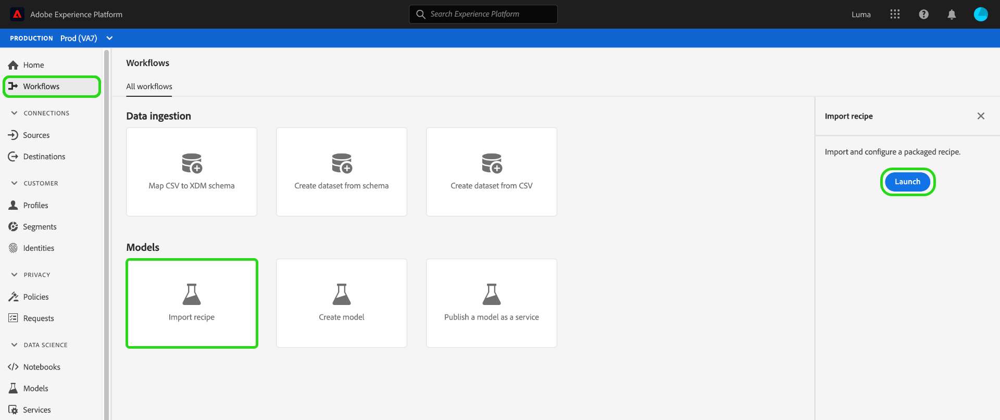
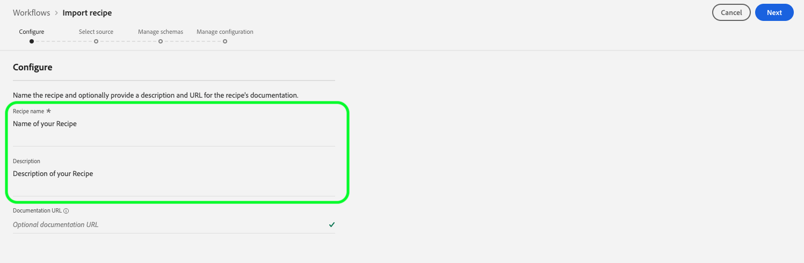
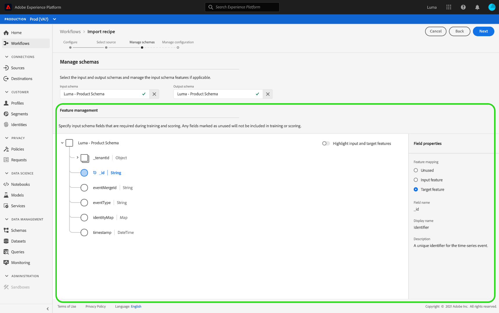
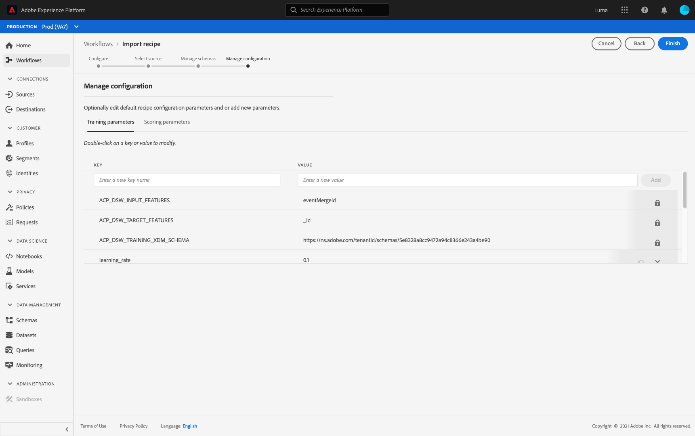
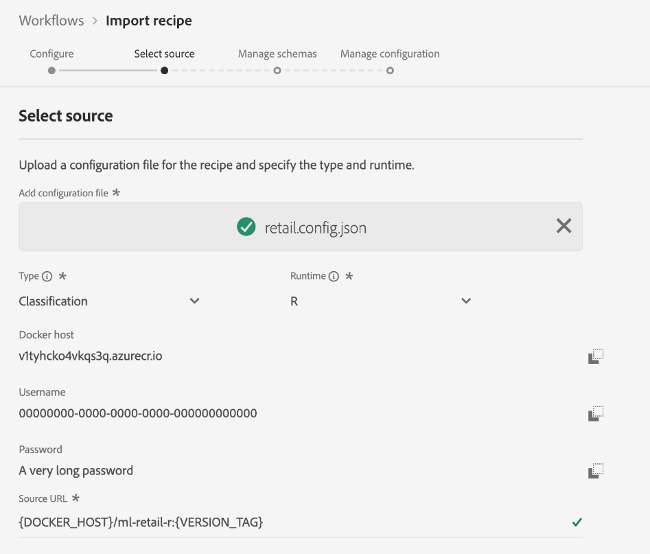
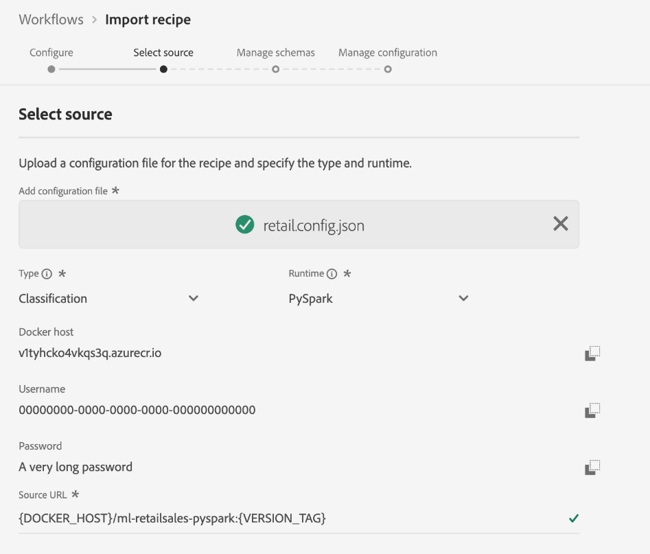
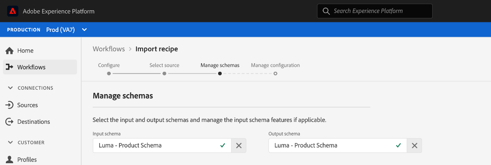
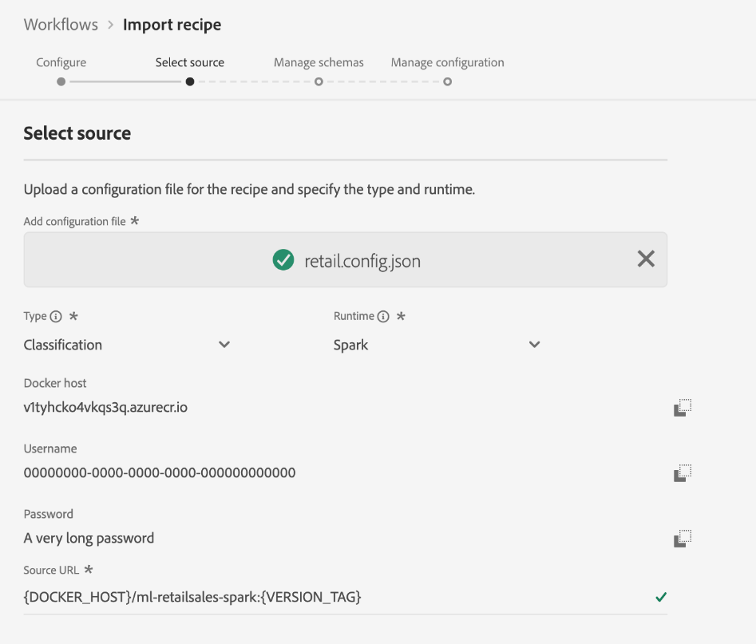

# Import a packaged recipe in the Data Science Workspace UI

This tutorial provides insight on how to configure and import a packaged recipe using the provided Retail Sales example. By the end of this tutorial, you will be ready to create, train, and evaluate a Model in Adobe Experience Platform [!DNL Data Science Workspace].

## Prerequisites

This tutorial requires a packaged recipe in the form of a Docker image URL. See the tutorial on how to [Package source files into a Recipe](./package-source-files-recipe.md) for more information.

## UI workflow

Importing a packaged recipe into [!DNL Data Science Workspace] requires specific recipe configurations, compiled into a single JavaScript Object Notation (JSON) file, this compilation of recipe configurations is referred to as the configuration file. A packaged recipe with a particular set of configurations is referred to as a recipe instance. One recipe can be used to create many recipe instances in [!DNL Data Science Workspace].

The workflow for importing a package recipe consists of the following steps:
- [Configure a recipe](#configure)
- [Import Docker based recipe - Python](#python)
- [Import Docker based recipe - R](#r)
- [Import Docker based recipe - PySpark](#pyspark)
- [Import Docker based recipe - Scala](#scala)

### Configure a recipe {#configure}

Every recipe instance in [!DNL Data Science Workspace] is accompanied with a set of configurations that tailor the recipe instance to suit a particular use case. Configuration files define the default training and scoring behaviors of a Model created using this recipe instance.

>[!NOTE]
>
>Configuration files are recipe and case specific.

Below is a sample configuration file showing default training and scoring behaviors for the Retail Sales recipe. 

```json
[
    {
        "name": "train",
        "parameters": [
            {
                "key": "learning_rate",
                "value": "0.1"  
            },
            {
                "key": "n_estimators",
                "value": "100"
            },
            {
                "key": "max_depth",
                "value": "3"
            },
            {
                "key": "ACP_DSW_INPUT_FEATURES",
                "value": "date,store,storeType,storeSize,temperature,regionalFuelPrice,markdown,cpi,unemployment,isHoliday"
            },
            {
                "key": "ACP_DSW_TARGET_FEATURES",
                "value": "weeklySales"
            },
            {
                "key": "ACP_DSW_FEATURE_UPDATE_SUPPORT",
                "value": false
            },
            {
                "key": "tenantId",
                "value": "_{TENANT_ID}"
            },
            {
                "key": "ACP_DSW_TRAINING_XDM_SCHEMA",
                "value": "{SEE BELOW FOR DETAILS}"
            },
            {
                "key": "evaluation.labelColumn",
                "value": "weeklySalesAhead"
            },
            {
                "key": "evaluation.metrics",
                "value": "MAPE,MAE,RMSE,MASE"
            }
        ]
    },
    {
        "name": "score",
        "parameters": [
            {
                "key": "tenantId",
                "value": "_{TENANT_ID}"
            },
            {
                "key":"ACP_DSW_SCORING_RESULTS_XDM_SCHEMA",
                "value":"{SEE BELOW FOR DETAILS}"
            }
        ]
    }
]
```

| Parameter key | Type | Description |
| ----- | ----- | ----- |
| `learning_rate` | Number | Scalar for gradient multiplication. |
| `n_estimators` | Number | Number of trees in the forest for Random Forest Classifier. |
| `max_depth` | Number | Maximum depth of a tree in Random Forest Classifier. |
| `ACP_DSW_INPUT_FEATURES` | String | List of comma separated input schema attributes. |
| `ACP_DSW_TARGET_FEATURES` | String | List of comma separated output schema attributes. |
| `ACP_DSW_FEATURE_UPDATE_SUPPORT` | Boolean | Determines whether input and output features are modifiable |
| `tenantId` | String | This ID ensures resources you create are namespaced properly and contained within your IMS Organization. [Follow the steps here](../../xdm/api/getting-started.md#know-your-tenant_id) to find your tenant ID. |
| `ACP_DSW_TRAINING_XDM_SCHEMA` | String | The input schema used for training a Model. Leave this empty when importing in UI, replace with training SchemaID when importing using API. |
| `evaluation.labelColumn` | String | Column label for evaluation visualizations. |
| `evaluation.metrics` | String | Comma separated list of evaluation metrics to be used for evaluating a Model. |
| `ACP_DSW_SCORING_RESULTS_XDM_SCHEMA` | String | The output schema used for scoring a Model. Leave this empty when importing in UI, replace with scoring SchemaID when importing using API. |

For the purpose of this tutorial, you can leave the default configuration files for Retail Sales recipe in the [!DNL Data Science Workspace] Reference the way they are.

### Import Docker based recipe - [!DNL Python] {#python}

Start by navigating and selecting **[!UICONTROL Workflows]** located in the top-left of the [!DNL Platform] UI. Next, select **Import recipe** and select **[!UICONTROL Launch]**.



The **Configure** page for the **Import recipe** workflow appears. Enter a name and description for the recipe then select **[!UICONTROL Next]** in the top-right corner.



>[!NOTE]
>
> In the [Package source files into a Recipe](./package-source-files-recipe.md) tutorial, a Docker URL was provided at the end of building the Retail Sales recipe using Python source files.

Once you are on the **Select source** page, paste the Docker URL corresponding to the packaged recipe built using [!DNL Python] source files in the **[!UICONTROL Source URL]** field. Next, import the provided configuration file by dragging and dropping, or use the file system **Browser**. The provided configuration file can be found at `experience-platform-dsw-reference/recipes/python/retail/retail.config.json`. Select **[!UICONTROL Python]** in the **Runtime** drop down and **[!UICONTROL Classification]** in the **Type** drop down. Once everything has been filled out, select **[!UICONTROL Next]** in the top-right corner to proceed to **Manage schemas**.

>[!NOTE]
>
> Type supports **[!UICONTROL Classification]** and **[!UICONTROL Regression]**. If your model does not fall under one of those types select **[!UICONTROL Custom]**.


Next, select the Retail Sales input and output schemas under the section **Manage Schemas**, they were created using the provided bootstrap script in the [create the retail sales schema and dataset](../models-recipes/create-retails-sales-dataset.md) tutorial. 



Under the **Feature Management** section, select on your tenant identification in the schema viewer to expand the Retail Sales input schema. Select the input and output features by highlighting the desired feature, and selecting either **[!UICONTROL Input Feature]** or **[!UICONTROL Target Feature]** in the right **[!UICONTROL Field Properties]** window. For the purpose of this tutorial, set **[!UICONTROL weeklySales]** as the  **[!UICONTROL Target Feature]** and everything else as **[!UICONTROL Input Feature]**. Select **[!UICONTROL Next]** to review your new configured recipe.

Review the recipe, add, modify, or remove configurations as necessary. Select **[!UICONTROL Finish]** to create the recipe.



Proceed to the [next steps](#next-steps) to find out how to create a Model in [!DNL Data Science Workspace] using the newly created Retail Sales recipe.

### Import Docker based recipe - R {#r}

 Start by navigating and selecting **[!UICONTROL Workflows]** located in the top-left of the [!DNL Platform] UI. Next, select **Import recipe** and select **[!UICONTROL Launch]**.


The **Configure** page for the **Import recipe** workflow appears. Enter a name and description for the recipe then select **[!UICONTROL Next]** in the top-right corner.


>[!NOTE]
>
> In the [Package source files into a Recipe](./package-source-files-recipe.md) tutorial, a Docker URL was provided at the end of building the Retail Sales recipe using R source files.

Once you are on the **Select source** page, paste the Docker URL corresponding to the packaged recipe built using R source files in the **[!UICONTROL Source URL]** field. Next, import the provided configuration file by dragging and dropping, or use the file system **Browser**. The provided configuration file can be found at `experience-platform-dsw-reference/recipes/R/Retail\ -\ GradientBoosting/retail.config.json`. Select **[!UICONTROL R]** in the **Runtime** drop down and **[!UICONTROL Classification]** in the **Type** drop down. Once everything has been filled out, select **[!UICONTROL Next]** in the top-right corner to proceed to **Manage schemas**.

>[!NOTE]
>
> *Type* supports **[!UICONTROL Classification]** and **[!UICONTROL Regression]**. If your model does not fall under one of those types select **[!UICONTROL Custom]**.



Next, select the Retail Sales input and output schemas under the section **Manage Schemas**, they were created using the provided bootstrap script in the [create the retail sales schema and dataset](../models-recipes/create-retails-sales-dataset.md) tutorial. 


Under the *Feature Management* section, select on your tenant identification in the schema viewer to expand the Retail Sales input schema. Select the input and output features by highlighting the desired feature, and selecting either **[!UICONTROL Input Feature]** or **[!UICONTROL Target Feature]** in the right **[!UICONTROL Field Properties]** window. For the purpose of this tutorial, set **[!UICONTROL weeklySales]** as the  **[!UICONTROL Target Feature]** and everything else as **[!UICONTROL Input Feature]**. Select **[!UICONTROL Next]** to review your new Configured recipe.

Review the recipe, add, modify, or remove configurations as necessary. Select **Finish** to create the recipe.


Proceed to the [next steps](#next-steps) to find out how to create a Model in [!DNL Data Science Workspace] using the newly created Retail Sales recipe.

### Import Docker based recipe - PySpark {#pyspark}

 Start by navigating and selecting **[!UICONTROL Workflows]** located in the top-left of the [!DNL Platform] UI. Next, select **Import recipe** and select **[!UICONTROL Launch]**.


The **Configure** page for the **Import recipe** workflow appears. Enter a name and description for the recipe then select **[!UICONTROL Next]** in the top-right corner to proceed.


>[!NOTE]
>
> In the [Package source files into a Recipe](./package-source-files-recipe.md) tutorial, a Docker URL was provided at the end of building the Retail Sales recipe using PySpark source files.

Once you are on the **Select source** page, paste the Docker URL corresponding to the packaged recipe built using PySpark source files in the **[!UICONTROL Source URL]** field. Next, import the provided configuration file by dragging and dropping, or use the file system **Browser**. The provided configuration file can be found at `experience-platform-dsw-reference/recipes/pyspark/retail/pipeline.json`. Select **[!UICONTROL PySpark]** in the **Runtime** drop down. Once the PySpark runtime is selected the default artifact auto populates to **[!UICONTROL Docker]**. Next, select **[!UICONTROL Classification]** in the **Type** drop down. Once everything has been filled out, select **[!UICONTROL Next]** in the top-right corner to proceed to **Manage schemas**.

>[!NOTE]
>
> *Type* supports **[!UICONTROL Classification]** and **[!UICONTROL Regression]**. If your model does not fall under one of those types select **[!UICONTROL Custom]**.



Next, select the Retail Sales input and output schemas using the **Manage Schemas** selector, the schemas were created using the provided bootstrap script in the [create the retail sales schema and dataset](../models-recipes/create-retails-sales-dataset.md) tutorial. 



Under the **Feature Management** section, select on your tenant identification in the schema viewer to expand the Retail Sales input schema. Select the input and output features by highlighting the desired feature, and selecting either **[!UICONTROL Input Feature]** or **[!UICONTROL Target Feature]** in the right **[!UICONTROL Field Properties]** window. For the purpose of this tutorial, set **[!UICONTROL weeklySales]** as the  **[!UICONTROL Target Feature]** and everything else as **[!UICONTROL Input Feature]**. Select **[!UICONTROL Next]** to review your new configured recipe.


Review the recipe, add, modify, or remove configurations as necessary. Select **[!UICONTROL Finish]** to create the recipe.


Proceed to the [next steps](#next-steps) to find out how to create a Model in [!DNL Data Science Workspace] using the newly created Retail Sales recipe.

### Import Docker based recipe - Scala {#scala}

 Start by navigating and selecting **[!UICONTROL Workflows]** located in the top-left of the [!DNL Platform] UI. Next, select **Import recipe** and select **[!UICONTROL Launch]**.


The **Configure** page for the **Import recipe** workflow appears. Enter a name and description for the recipe then select **[!UICONTROL Next]** in the top-right corner to proceed.


>[!NOTE]
>
> In the [Package source files into a Recipe](./package-source-files-recipe.md) tutorial, a Docker URL was provided at the end of building the Retail Sales recipe using Scala ([!DNL Spark]) source files.

Once you are on the **Select source** page, paste the Docker URL corresponding to the packaged recipe built using Scala source files in the Source URL field. Next, import the provided configuration file by dragging and dropping, or use the file system Browser. The provided configuration file can be found at `experience-platform-dsw-reference/recipes/scala/retail/pipelineservice.json`. Select **[!UICONTROL Spark]** in the **Runtime** drop down. Once the [!DNL Spark] runtime is selected the default artifact auto populates to **[!UICONTROL Docker]**. Next, select **[!UICONTROL Regression]** from the **Type** drop down. Once everything has been filled out, select **[!UICONTROL Next]** in the top-right corner to proceed to **Manage schemas**.

>[!NOTE]
>
> Type supports **[!UICONTROL Classification]** and **[!UICONTROL Regression]**. If your model does not fall under one of those types select **[!UICONTROL Custom]**.



Next, select the Retail Sales input and output schemas using the **Manage Schemas** selector, the schemas were created using the provided bootstrap script in the [create the retail sales schema and dataset](../models-recipes/create-retails-sales-dataset.md) tutorial. 


Under the **Feature Management** section, select on your tenant identification in the schema viewer to expand the Retail Sales input schema. Select the input and output features by highlighting the desired feature, and selecting either **[!UICONTROL Input Feature]** or **[!UICONTROL Target Feature]** in the right **[!UICONTROL Field Properties]** window. For the purpose of this tutorial, set "[!UICONTROL weeklySales]" as the  **[!UICONTROL Target Feature]** and everything else as **[!UICONTROL Input Feature]**. Select **[!UICONTROL Next]** to review your new configured recipe.


Review the recipe, add, modify, or remove configurations as necessary. Select **[!UICONTROL Finish]** to create the recipe.


Proceed to the [next steps](#next-steps) to find out how to create a Model in [!DNL Data Science Workspace] using the newly created Retail Sales recipe.

## Next steps {#next-steps}

This tutorial provided insight on configuring and importing a recipe into [!DNL Data Science Workspace]. You can now create, train, and evaluate a Model using the newly created recipe.

- [Train and evaluate a Model in the UI](./train-evaluate-model-ui.md)
- [Train and evaluate a Model using the API](./train-evaluate-model-api.md)
