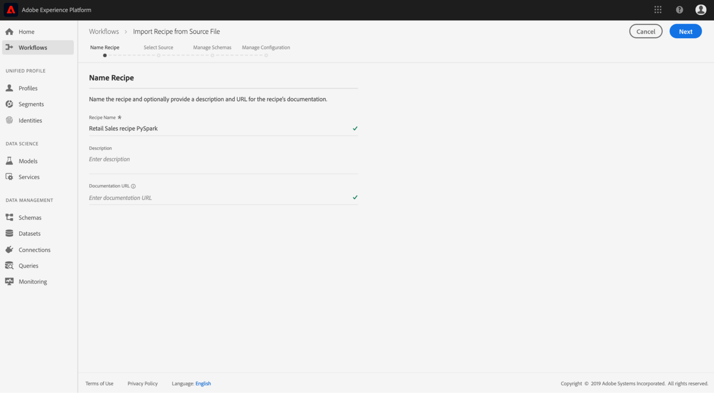
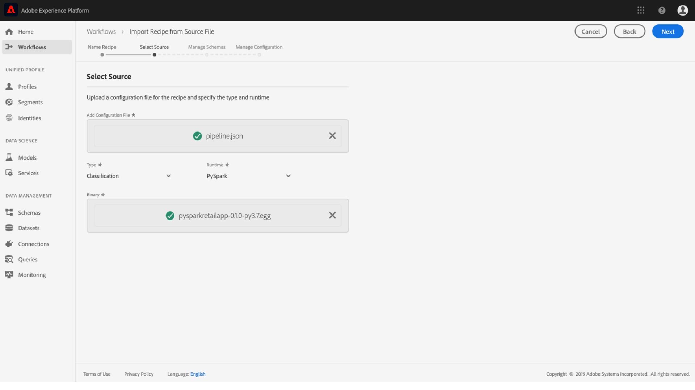

# Import a packaged recipe (UI)

This tutorial provides insight on how to configure and import a packaged recipe using the provided Retail Sales example. By the end of this tutorial, you will be ready to create, train, and evaluate a Model in Adobe Experience Platform Data Science Workspace.
- [UI workflow](#ui-workflow)
    - [Configure a recipe](#configure-a-recipe)
    - [Import binary based recipe - PySpark](#import-binary-based-recipe---pyspark)
    - [Import binary based recipe - Scala Spark](#import-binary-based-recipe---scala-spark)
    - [Import Docker based recipe - Python](#import-docker-based-recipe---python)
    - [Import Docker based recipe - R](#import-docker-based-recipe---r)
- [Next steps](#next-steps)

## Prerequisites

This tutorial requires a packaged recipe in the form of either a Docker image URL or a binary file. See the tutorial on how to [Package source files into a Recipe](./package-source-files-recipe.md) for more information.

## UI workflow

Importing a packaged recipe into Data Science Workspace requires specific recipe configurations, compiled into a single JavaScript Object Notation (JSON) file, this compilation of recipe configurations is referred to as the **configuration file**. A packaged recipe with a particular set of configurations is referred to as a **recipe instance**. One recipe can be used to create many recipe instances in Data Science Workspace.

The workflow for importing a package recipe consists of the following steps:
- [Configure a recipe](#configure-a-recipe)
- [Import binary based recipe - PySpark](#import-binary-based-recipe---pyspark)
- [Import binary based recipe - Scala Spark](#import-binary-based-recipe---scala-spark)
- [Import Docker based recipe - Python](#import-docker-based-recipe---python)
- [Import Docker based recipe - R](#import-docker-based-recipe---r)

### Configure a recipe

Every recipe instance in Data Science Workspace is accompanied with a set of configurations that tailor the recipe instance to suit a particular use case. Configuration files define the default training and scoring behaviors of a Model created using this recipe instance.

>[!NOTE] Configuration files are recipe and case specific.

Below is a sample configuration file showing default training and scoring behaviors for the Retail Sales recipe. 

```json
[
    {
        "name": "train",
        "parameters": [
            {
                "key": "learning_rate",
                "value": "0.1"  
            },
            {
                "key": "n_estimators",
                "value": "100"
            },
            {
                "key": "max_depth",
                "value": "3"
            },
            {
                "key": "ACP_DSW_INPUT_FEATURES",
                "value": "date,store,storeType,storeSize,temperature,regionalFuelPrice,markdown,cpi,unemployment,isHoliday"
            },
            {
                "key": "ACP_DSW_TARGET_FEATURES",
                "value": "weeklySales"
            },
            {
                "key": "ACP_DSW_FEATURE_UPDATE_SUPPORT",
                "value": false
            },
            {
                "key": "tenantId",
                "value": "_{TENANT_ID}"
            },
            {
                "key": "ACP_DSW_TRAINING_XDM_SCHEMA",
                "value": "{SEE BELOW FOR DETAILS}"
            },
            {
                "key": "evaluation.labelColumn",
                "value": "weeklySalesAhead"
            },
            {
                "key": "evaluation.metrics",
                "value": "MAPE,MAE,RMSE,MASE"
            }
        ]
    },
    {
        "name": "score",
        "parameters": [
            {
                "key": "tenantId",
                "value": "_{TENANT_ID}"
            },
            {
                "key":"ACP_DSW_SCORING_RESULTS_XDM_SCHEMA",
                "value":"{SEE BELOW FOR DETAILS}"
            }
        ]
    }
]
```

| Parameter key | Type | Description |
| ----- | ----- | ----- |
| `learning_rate` | Number | Scalar for gradient multiplication. |
| `n_estimators` | Number | Number of trees in the forest for Random Forest Classifier. |
| `max_depth` | Number | Maximum depth of a tree in Random Forest Classifier. |
| `ACP_DSW_INPUT_FEATURES` | String | List of comma separated input schema attributes. |
| `ACP_DSW_TARGET_FEATURES` | String | List of comma separated output schema attributes. |
| `ACP_DSW_FEATURE_UPDATE_SUPPORT` | Boolean | Determines whether input and output features are modifiable |
| `tenantId` | String | This ID ensures resources you create are namespaced properly and contained within your IMS Organization. [Follow the steps here](../../xdm/api/getting-started.md#know-your-tenant_id) to find your tenant ID. |
| `ACP_DSW_TRAINING_XDM_SCHEMA` | String | The input schema used for training a Model. Leave this empty when importing in UI, replace with training SchemaID when importing using API. |
| `evaluation.labelColumn` | String | Column label for evaluation visualizations. |
| `evaluation.metrics` | String | Comma separated list of evaluation metrics to be used for evaluating a Model. |
| `ACP_DSW_SCORING_RESULTS_XDM_SCHEMA` | String | The output schema used for scoring a Model. Leave this empty when importing in UI, replace with scoring SchemaID when importing using API. |

For the purpose of this tutorial, you can leave the default configuration files for Retail Sales recipe in the Data Science Workspace Reference the way they are.

### Import binary based recipe - PySpark

In the [Package source files into a Recipe](./package-source-files-recipe.md) tutorial, an **EGG** binary file was built using the Retail Sales PySpark source files. 

1. In [Adobe Experience Platform](https://platform.adobe.com/), find the left navigation panel and click **Workflows**. In the Workflows interface, **Launch** a new **Import Recipe from Source File** process.

2. Input an appropriate name for the Retail Sales recipe. For example, "Retail Sales recipe PySpark". Optionally include a recipe description and a documentation URL. Click **Next** when you're done.

1. Import the PySpark Retail Sales recipe that was created in the [Package source files into a Recipe](./package-source-files-recipe.md) tutorial by dragging and dropping, or use the file system **Browser**. The packaged recipe should be is located in `experience-platform-dsw-reference/recipes/pyspark/dist`.
Similarly, import the provided configuration file by dragging and dropping, or use the file system **Browser**. The provided configuration file can be found at `experience-platform-dsw-reference/recipes/pyspark/pipeline.json`. Click **Next** when both files have been supplied.

4. You may encounter errors at this point. This is normal behavior and is to be expected. Select the Retail Sales input and output schemas under the section **Manage Schemas**, they were created using the provided bootstrap script in the [Access and explore your data](../jupyterlab/access-platform-data.md) tutorial. 

Under the **Feature Manage** section, click on your tenant identification in the schema viewer to expand the Retail Sales input schema. Select the input and output features by highlighting the desired feature, and selecting either **Input Feature** or **Target Feature** in the right **Field Properties** window. For the purpose of this tutorial, set **weeklySales** as the  **Target Feature** and everything else as **Input Feature**. Click **Next** to review your new configured recipe. 
5. Review the recipe, add, modify, or remove configurations as necessary. Click **Finish** to create the recipe.


Congratulations, you've created the Retail Sales recipe! Move on to the [next steps](#next-steps) to find out how to create a Model in Data Science Workspace using the newly created Retail Sales recipe.


### Import binary based recipe - Scala Spark

In the [Package source files into a Recipe](./package-source-files-recipe.md) tutorial, a **JAR** binary file was built using the Retail Sales Scala Spark source files. 

1. In [Adobe Experience Platform](https://platform.adobe.com/), find the left navigation panel and click **Workflows**. In the Workflows interface, **Launch** a new **Import Recipe from Source File** process.

2. Input an appropriate name for the Retail Sales recipe. For example, "Retail Sales recipe Scala Spark". Optionally include a recipe description and a documentation URL. Click **Next** when you're done.

1. Import the Scala Spark Retail Sales recipe that was created in the [Package source files into a Recipe](./package-source-files-recipe.md) tutorial by dragging and dropping, or use the file system **Browser**. The packaged recipe **with dependencies** is located in `experience-platform-dsw-reference/recipes/scala/target`. Similarly, import the provided configuration file by dragging and dropping, or use the file system **Browser**. The provided configuration file can be found at `experience-platform-dsw-reference/recipes/scala/src/main/resources/pipelineservice.json`. Click **Next** when both files have been supplied.

4. You may encounter errors at this point. This is normal behavior and is to be expected. Select the Retail Sales input and output schemas under the section **Manage Schemas**, they were created using the provided bootstrap script in the [Access and explore your data](../jupyterlab/access-platform-data.md) tutorial. 

Under the **Feature Manage** section, click on your tenant identification in the schema viewer to expand the Retail Sales input schema. Select the input and output features by highlighting the desired feature, and selecting either **Input Feature** or **Target Feature** in the right **Field Properties** window. For the purpose of this tutorial, set **weeklySales** as the  **Target Feature** and everything else as **Input Feature**. Click **Next** to review your new configured recipe.
5. Review the recipe, add, modify, or remove configurations as necessary. Click **Finish** to create the recipe.


Congratulations, you've created the Retail Sales recipe! Move on to the [next steps](#next-steps) to find out how to create a Model in Data Science Workspace using the newly created Retail Sales recipe.

### Import Docker based recipe - Python

In the [Package source files into a Recipe](./package-source-files-recipe.md) tutorial, a Docker URL was provided at the end of building the Retail Sales recipe using Python source files. 

1. Paste the Docker URL corresponding to the packaged recipe built using Python source files in the **Source URL** field. Next, import the provided configuration file by dragging and dropping, or use the file system **Browser**. The provided configuration file can be found at `experience-platform-dsw-reference/recipes/python/retail/retail.config.json`. Click **Next** when both items have been supplied.

2. Select the Retail Sales input and output schemas under the section **Manage Schemas**, they were created using the provided bootstrap script in the [Access and explore your data](../jupyterlab/access-platform-data.md) tutorial. 

Under the **Feature Manage** section, click on your tenant identification in the schema viewer to expand the Retail Sales input schema. Select the input and output features by highlighting the desired feature, and selecting either **Input Feature** or **Target Feature** in the right **Field Properties** window. For the purpose of this tutorial, set **weeklySales** as the  **Target Feature** and everything else as **Input Feature**. Click **Next** to review your new configured recipe.
3. Review the recipe, add, modify, or remove configurations as necessary. Click **Finish** to create the recipe.


Congratulations, you've created the Retail Sales recipe! Move on to the [next steps](#next-steps) to find out how to create a Model in Data Science Workspace using the newly created Retail Sales recipe.

### Import Docker based recipe - R

In the [Package source files into a Recipe](./package-source-files-recipe.md) tutorial, a Docker URL was provided at the end of building the Retail Sales recipe using R source files. 

1. Paste the Docker URL corresponding to the packaged recipe built using R source files in the **Source URL** field. Next, import the provided configuration file by dragging and dropping, or use the file system **Browser**. The provided configuration file can be found at `experience-platform-dsw-reference/recipes/R/Retail\ -\ GradientBoosting/retail.config.json`. Click **Next** when both items have been supplied.

2. Select the Retail Sales input and output schemas under the section **Manage Schemas**, they were created using the provided bootstrap script in the [Access and explore your data](../jupyterlab/access-platform-data.md) tutorial. 

Under the **Feature Manage** section, click on your tenant identification in the schema viewer to expand the Retail Sales input schema. Select the input and output features by highlighting the desired feature, and selecting either **Input Feature** or **Target Feature** in the right **Field Properties** window. For the purpose of this tutorial, set **weeklySales** as the  **Target Feature** and everything else as **Input Feature**. Click **Next** to review your new configured recipe.
3. Review the recipe, add, modify, or remove configurations as necessary. Click **Finish** to create the recipe.


Congratulations, you've created the Retail Sales recipe! Move on to the [next steps](#next-steps) to find out how to create a Model in Data Science Workspace using the newly created Retail Sales recipe.

---

## Next steps

This tutorial provided insight on configuring and importing a recipe into Data Science Workspace. You can now create, train, and evaluate a Model using the newly created recipe.

- [Train and evaluate a Model in the UI](./train-evaluate-model-ui.md)
- [Train and evaluate a Model using the API](./train-evaluate-model-api.md)