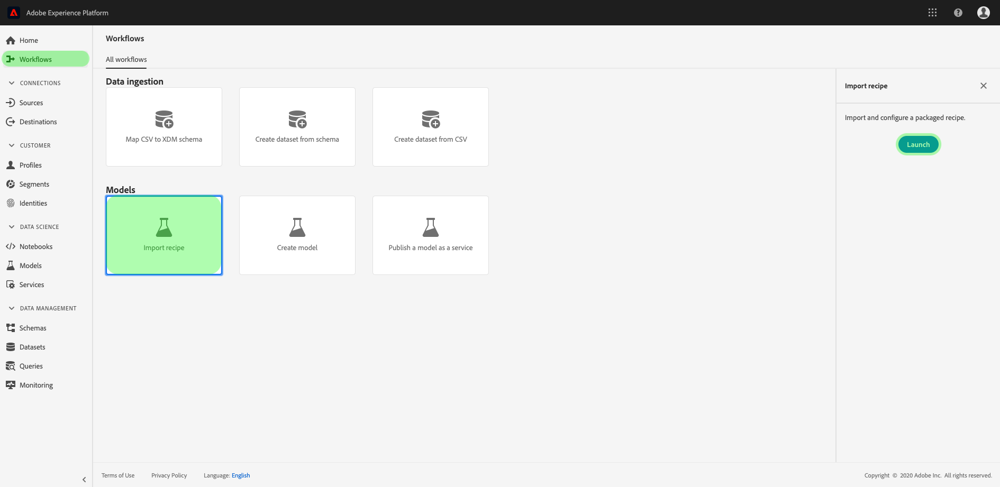
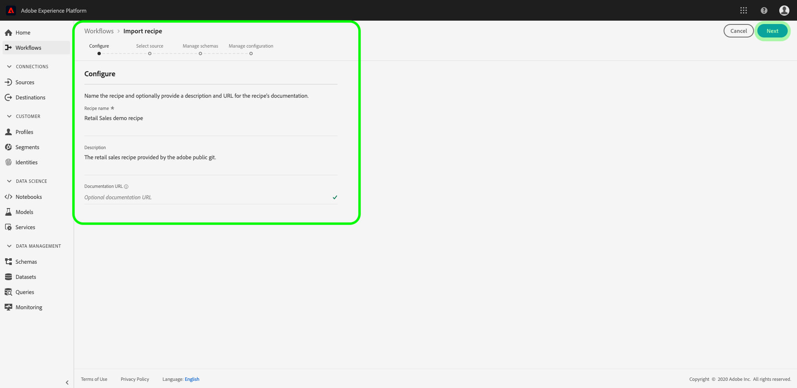
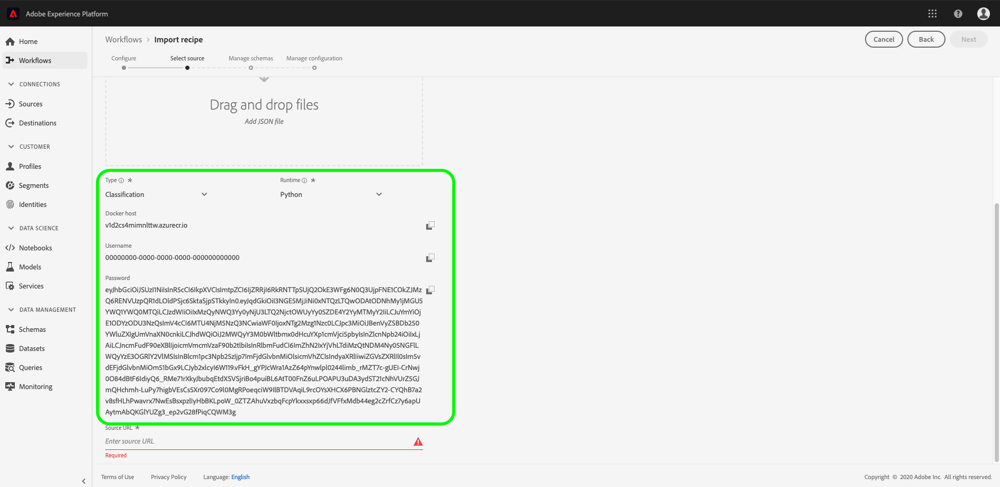

# Package source files into a recipe

This tutorial provides instructions on how you can package the provided Retail Sales sample source files into an archive file, which can be used to create a recipe in Adobe Experience Platform [!DNL Data Science Workspace] by following the recipe import workflow either in the UI or using the API.

Concepts to understand:

- **Recipes**: A recipe is Adobe's term for a Model specification and is a top-level container representing a specific machine learning, artificial intelligence algorithm or ensemble of algorithms, processing logic, and configuration required to build and execute a trained model and hence help solve specific business problems.
- **Source files**: Individual files in your project that contain the logic for a recipe.

## Prerequisites

- [[!DNL Docker]](https://docs.docker.com/install/#supported-platforms)
- [[!DNL Python 3 and pip]](https://docs.conda.io/en/latest/miniconda.html)
- [[!DNL Scala]](https://www.scala-sbt.org/download.html?_ga=2.42231906.690987621.1558478883-2004067584.1558478883)
- [[!DNL Maven]](https://maven.apache.org/install.html)

## Recipe creation

Recipe creation starts with packaging source files to build an archive file. Source files define the machine learning logic and algorithms used to solve a specific problem at hand, and are written in either [!DNL Python], R, PySpark, or Scala. Built archive files take the form of a Docker image. Once built, the packaged archive file is imported into [!DNL Data Science Workspace] to create a recipe [in the UI](./import-packaged-recipe-ui.md) or [using the API](./import-packaged-recipe-api.md).

### Docker based model authoring {#docker-based-model-authoring}

A Docker image allows a developer to package up an application with all the parts it needs, such as libraries and other dependencies, and ship it out as one package.

The built Docker image is pushed to the Azure Container Registry using credentials supplied to you during the recipe creation workflow.

To obtain your Azure Container Registry credentials, log into [Adobe Experience Platform](https://platform.adobe.com). On the left navigation column, navigate to **[!UICONTROL Workflows]**. Select **[!UICONTROL Import Recipe]** followed by selecting **[!UICONTROL Launch]**. See the screen shot below for reference.



The **[!UICONTROL Configure]** page opens. Provide an appropriate **[!UICONTROL Recipe Name]**, for example, "Retail Sales recipe", and optionally provide a description or documentation URL. Once complete, click **[!UICONTROL Next]**.



Select the appropriate *Runtime*, then choose a **[!UICONTROL Classification]** for *Type*. Your Azure Container Registry credentials are generated once complete.

>[!NOTE]
>
>*Type* is the class of machine learning problem the recipe is designed for and is used after training to help tailor evaluating the training run.

>[!TIP]
>
>- For [!DNL Python] recipes select the **[!UICONTROL Python]** runtime. 
>- For R recipes select the **[!UICONTROL R]** runtime.
>- For PySpark recipes select the **[!UICONTROL PySpark]** runtime. An artifact type auto populates. 
>- For Scala recipes select the **[!UICONTROL Spark]** runtime. An artifact type auto populates. 



Note the values for Docker host, username, and password. These are used to build and push your [!DNL Docker] image in the workflows outlined below.

>[!NOTE]
>
>The Source URL is provided after completing the steps outlined below. The configuration file is explained in subsequent tutorials found in [next steps](#next-steps).

### Package the source files

Start by obtaining the sample codebase found in the <a href="https://github.com/adobe/experience-platform-dsw-reference" target="_blank">Experience Platform Data Science Workspace Reference</a> repository.

- [Build Python Docker image](#python-docker)
- [Build R Docker image](#r-docker)
- [Build PySpark Docker image](#pyspark-docker)
- [Build Scala (Spark) Docker image](#scala-docker)

### Build [!DNL Python] Docker image {#python-docker}

If you have not done so, clone the [!DNL GitHub] repository onto your local system with the following command:

```shell
git clone https://github.com/adobe/experience-platform-dsw-reference.git
```

Navigate to the directory `experience-platform-dsw-reference/recipes/python/retail`. Here, you will find the scripts `login.sh` and `build.sh` used to login to Docker and to build the [!DNL Python Docker] image. If you have your [Docker credentials](#docker-based-model-authoring) ready, enter the following commands in order:

```BASH
# for logging in to Docker
./login.sh
 
# for building Docker image
./build.sh
```

Note that when executing the login script, you need to provide the Docker host, username, and password. When building, you are required to provide the Docker host and a version tag for the build.

Once the build script is complete, you are given a Docker source file URL in your console output. For this specific example, it will look something like:

```BASH
# URL format: 
{DOCKER_HOST}/ml-retailsales-python:{VERSION_TAG}
```

Copy this URL and move on to the [next steps](#next-steps).

### Build R [!DNL Docker] image {#r-docker}

If you have not done so, clone the [!DNL GitHub] repository onto your local system with the following command:

```BASH
git clone https://github.com/adobe/experience-platform-dsw-reference.git
```

Navigate to the directory `experience-platform-dsw-reference/recipes/R/Retail - GradientBoosting` inside your cloned repository. Here, you'll find the files `login.sh` and `build.sh` which you will use to login to Docker and to build the R Docker image. If you have your [Docker credentials](#docker-based-model-authoring) ready, enter the following commands in order:

```BASH
# for logging in to Docker
./login.sh
 
# for build Docker image
./build.sh
```

Note that when executing the login script, you need to provide the Docker host, username, and password. When building, you are required to provide the Docker host and a version tag for the build.

Once the build script is complete, you are given a Docker source file URL in your console output. For this specific example, it will look something like:

```BASH
# URL format: 
{DOCKER_HOST}/ml-retail-r:{VERSION_TAG}
```

Copy this URL and move on to the [next steps](#next-steps).

### Build PySpark Docker image {#pyspark-docker}

Start by cloning the [!DNL GitHub] repository onto your local system with the following command:

```shell
git clone https://github.com/adobe/experience-platform-dsw-reference.git
```

Navigate to the directory `experience-platform-dsw-reference/recipes/pyspark/retail`. The scripts `login.sh` and `build.sh` are located here and used to login to Docker and to build the  Docker image. If you have your [Docker credentials](#docker-based-model-authoring) ready, enter the following commands in order:

```BASH
# for logging in to Docker
./login.sh
 
# for building Docker image
./build.sh
```

Note that when executing the login script, you need to provide the Docker host, username, and password. When building, you are required to provide the Docker host and a version tag for the build.

Once the build script is complete, you are given a Docker source file URL in your console output. For this specific example, it will look something like:

```BASH
# URL format: 
{DOCKER_HOST}/ml-retailsales-pyspark:{VERSION_TAG}
```

Copy this URL and move on to the [next steps](#next-steps).

### Build Scala Docker image {#scala-docker}

Start by cloning the [!DNL GitHub] repository onto your local system with the following command in terminal:

```shell
git clone https://github.com/adobe/experience-platform-dsw-reference.git
```

Next, navigate to the directory `experience-platform-dsw-reference/recipes/scala` where you can find the scripts `login.sh` and `build.sh`. These scripts are used to login to Docker and build the Docker image. If you have your [Docker credentials](#docker-based-model-authoring) ready, enter the following commands to terminal in order:

```BASH
# for logging in to Docker
./login.sh
 
# for building Docker image
./build.sh
```

>[!TIP]
>
>If you are receiving a permission error when trying to login to Docker using the `login.sh` script, try using the command `bash login.sh`.

When executing the login script, you need to provide the Docker host, username, and password. When building, you are required to provide the Docker host and a version tag for the build.

Once the build script is complete, you are given a Docker source file URL in your console output. For this specific example, it will look something like:

```BASH
# URL format: 
{DOCKER_HOST}/ml-retailsales-spark:{VERSION_TAG}
```

Copy this URL and move on to the [next steps](#next-steps).

## Next steps {#next-steps}

This tutorial went over packaging source files into a Recipe, the prerequisite step for importing a Recipe into [!DNL Data Science Workspace]. You should now have a Docker image in Azure Container Registry along with the corresponding image URL. You are now ready to begin the tutorial on importing a packaged recipe into [!DNL Data Science Workspace]. Select one of the tutorial links below to get started:

- [Import a packaged Recipe in the UI](./import-packaged-recipe-ui.md)
- [Import a packaged Recipe using the API](./import-packaged-recipe-api.md)
