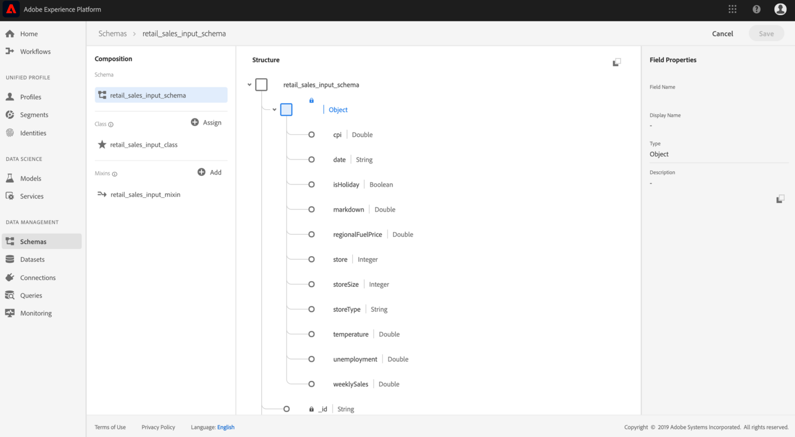
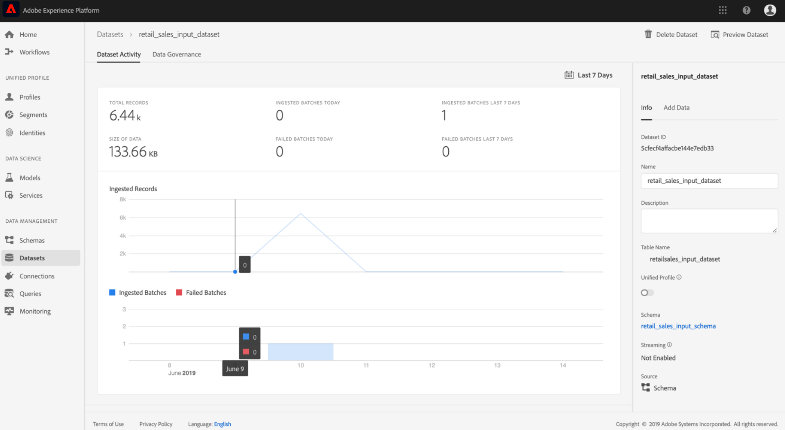
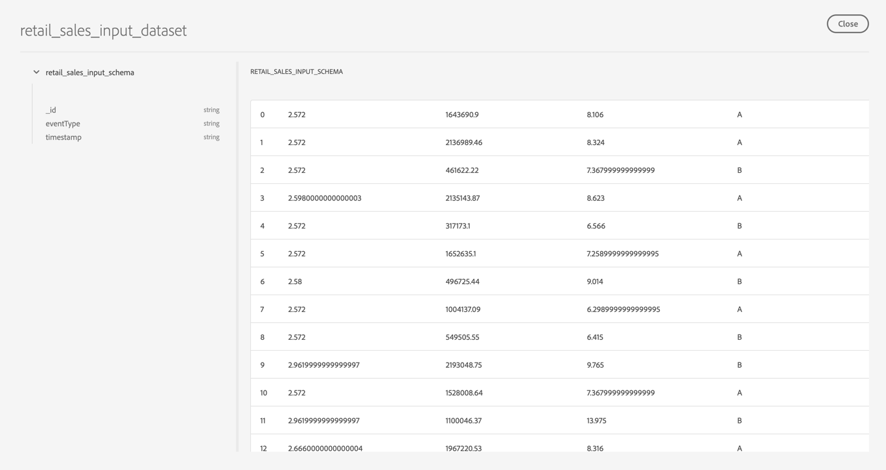

# Preview the retail sales schema and dataset

Upon successful completion of the bootstrap script from the [Create the retail sales schema and dataset](./create-retails-sales-dataset.md) tutorial. Output schemas and datasets can be viewed on [!DNL Experience Platform]. To view the schemas and datasets follow the steps below:

1.  Click the **[!UICONTROL Schemas]** link located in the left navigation column and find the input schema created by the bootstrap script. The name of the schema will correspond to what was defined in `config.yaml` from the previous step. View the schema details and it's composition by clicking into it.

    

2.  Click the **[!UICONTROL Datasets]** link located in the left navigation column and open the input dataset that was created by clicking on the name of the listing. The name of the dataset will correspond to what was defined in `config.yaml` from the previous step. 

    

3.  Click **[!UICONTROL Preview Dataset]** located at the top right preview a subset of the dataset.

    

## Next steps

You have now successfully ingested Retail Sales sample data into [!DNL Experience Platform] using the provided bootstrap script.

To continue working with the ingested data:
- [Analyze your data using Jupyter notebooks](../jupyterlab/analyze-your-data.md)
    - Use Jupyter notebooks in [!DNL Data Science Workspace] to access, explore, visualize, and understand your data.
- [Package source files into a Recipe](./package-source-files-recipe.md)
    - Follow this tutorial to learn how to bring your own Model into [!DNL Data Science Workspace] by packaging source files in an importable Recipe file.