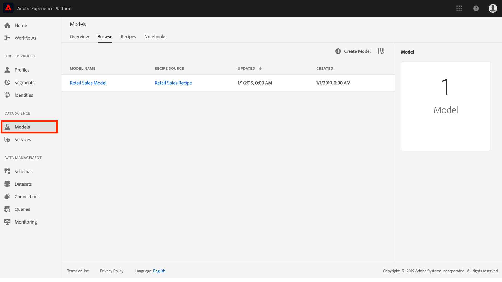
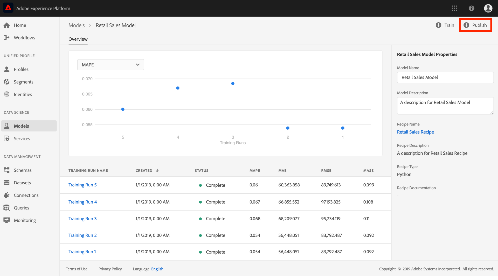
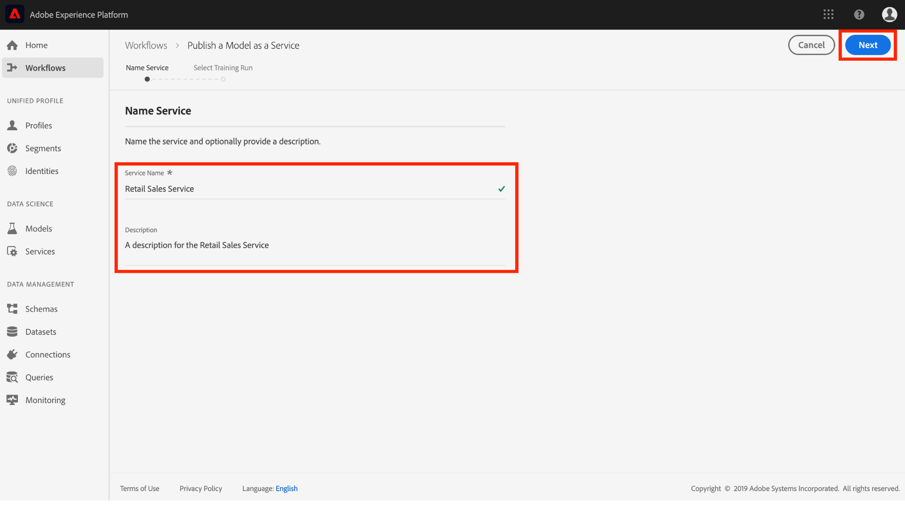
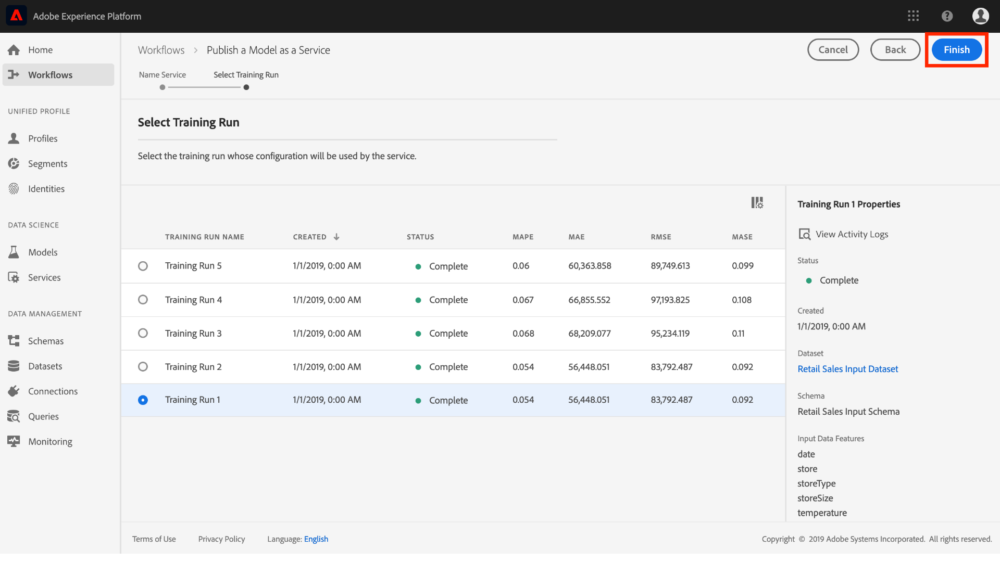
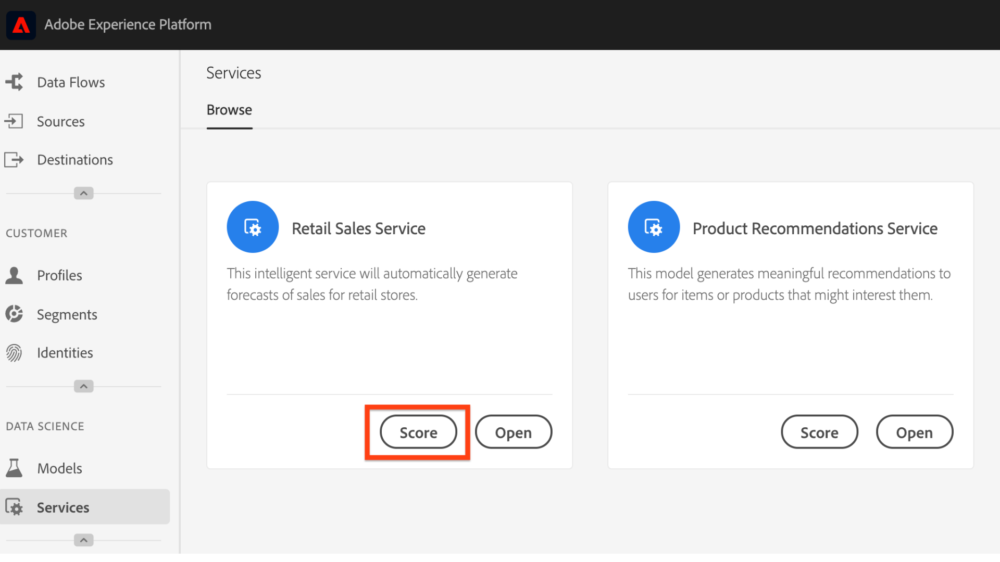
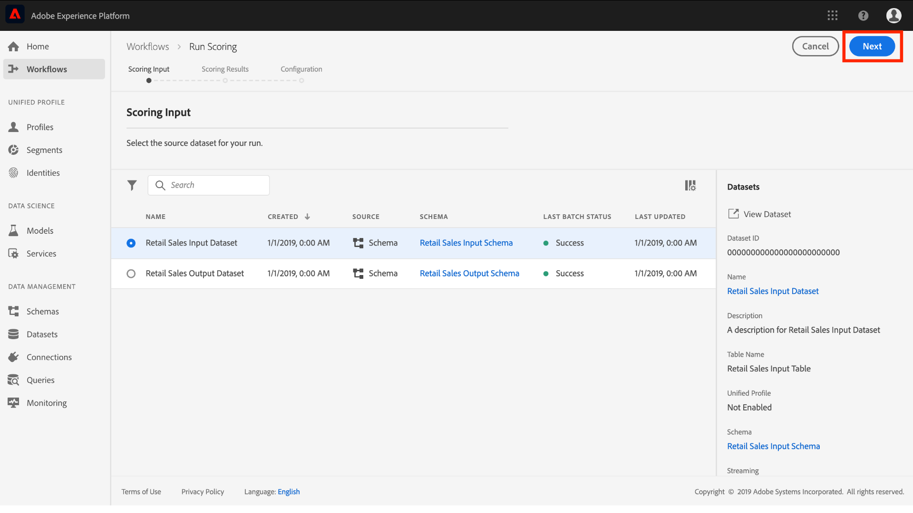
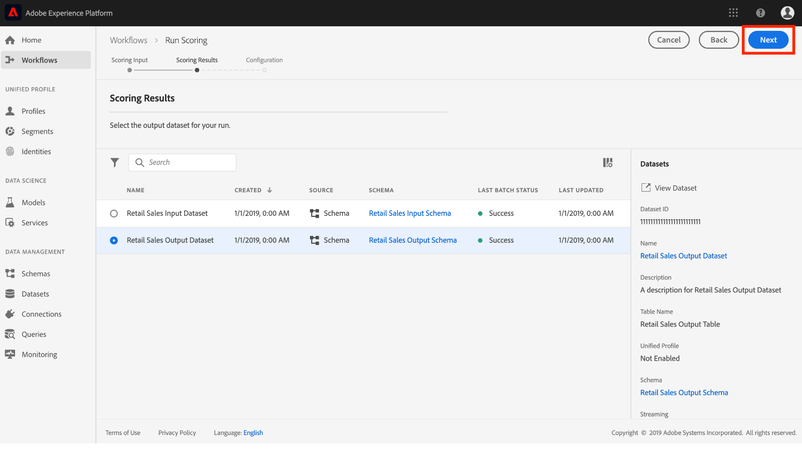
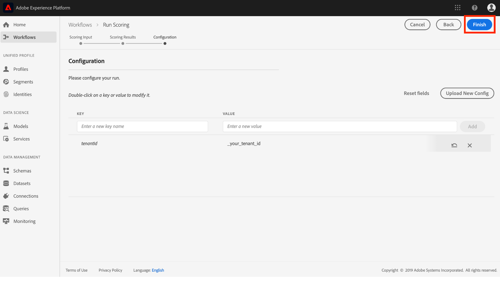
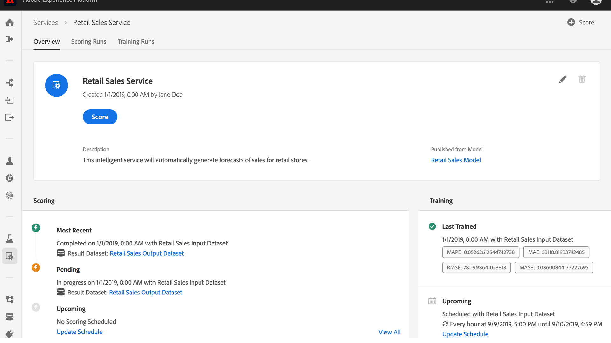

# Publish a model as a service (UI)

Adobe Experience Platform Data Science Workspace allows you to publish your trained and evaluated Model as a Service, enabling users within your IMS Organization to score data without the need for creating their own Models.

## Getting started

In order to complete this tutorial, you must have access to [!DNL Experience Platform]. If you do not have access to an IMS Organization in [!DNL Experience Platform], please speak to your system administrator before proceeding.

This tutorial requires an existing Model with a successful training run. If you do not have a publishable Model, follow the [Train and evaluate a Model in the UI](./train-evaluate-model-ui.md) tutorial before continuing.

If you prefer to publish a Model by using Sensei Machine Learning APIs, refer to the [API tutorial](./publish-model-service-api.md).

## Publish a Model {#publish-a-model}

1.  In Adobe Experience Platform, click the **[!UICONTROL Models]** link located in the left navigation column to list all existing Models. Find and click the name of the Model to be published as a Service.

2.  Click **[!UICONTROL Publish]** near the top right of the Model overview page to start a Service creation process.

3.  Input a desired name for the Service and optionally provide a Service description, click **[!UICONTROL Next]** when finished.

4.  All successful training runs for to the Model are listed. The new Service will inherit training and scoring configurations from the selected training run. 

5.  Click **[!UICONTROL Finish]** to create the Service and redirect to the **[!UICONTROL Service Gallery]** to show all available Services, including the newly created Service.

## Score using a Service {#access-a-service}

1. In Adobe Experience Platform, click the **[!UICONTROL Services]** tab located in the left navigation column to access the **[!UICONTROL Service Gallery]**. Find the Service that you wish to use and click **[!UICONTROL Score]**.

2. Select an appropriate input dataset for the scoring run, then click **[!UICONTROL Next]**.

3. Select an appropriate output dataset for the scoring results, then click **[!UICONTROL Next]**.

4. When a Service is created, it inherits default scoring configurations. You can review these configurations and adjust them as needed by double-clicking on the values. Once you are satisfied with the configurations, click **[!UICONTROL Finish]** to begin the scoring run.

5.  On the Service's **Overview** page, details of the new scoring job and its progress is shown. Once the job completes, the **[!UICONTROL Most Recent]** header within the **[!UICONTROL Scoring]** container will be updated.

## Next steps {#next-steps}

By following this tutorial, you have successfully published a Model as an accessible Service, and scored data using the new Service through the [!UICONTROL Service Gallery]. Continue to the next tutorial to learn how you can [schedule automated training and scoring runs on a Service](./schedule-models-ui.md).
