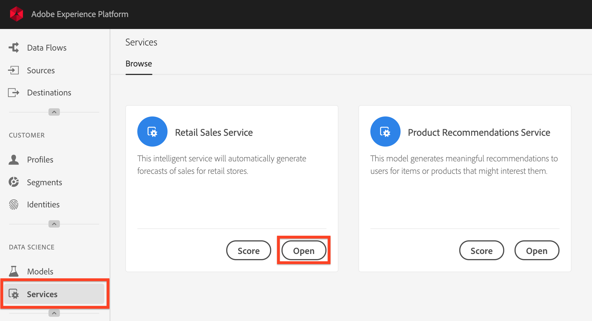
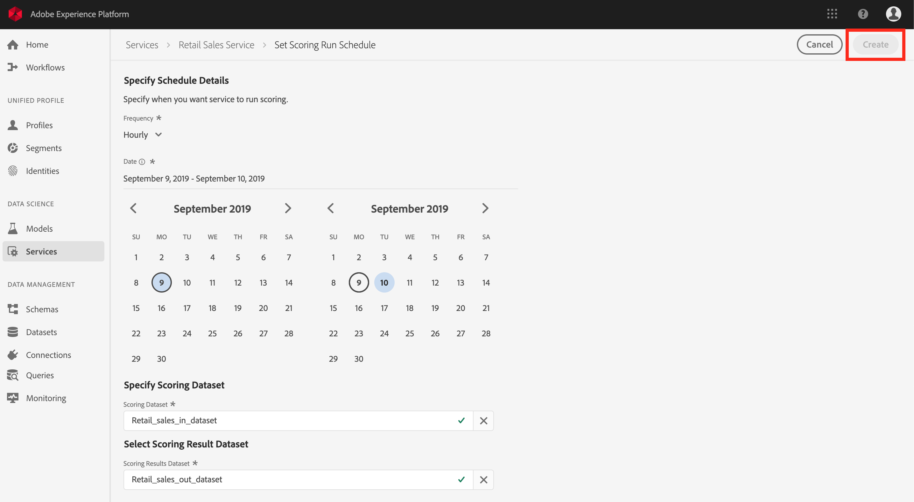
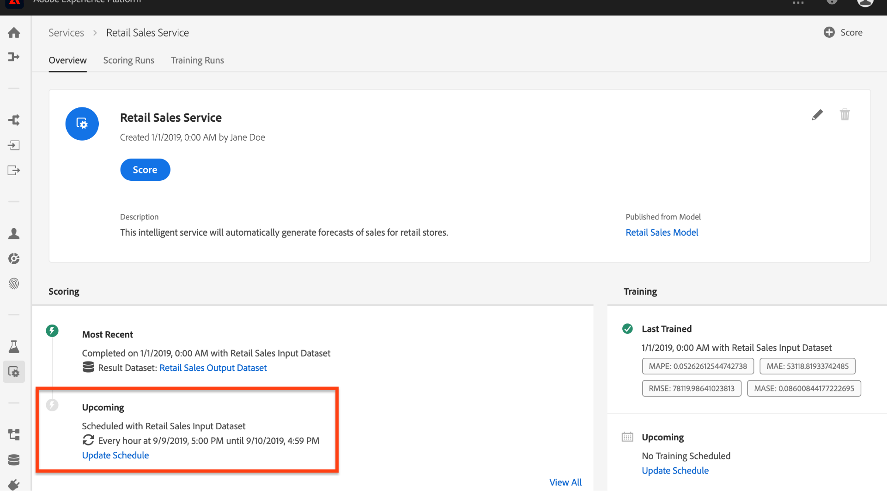
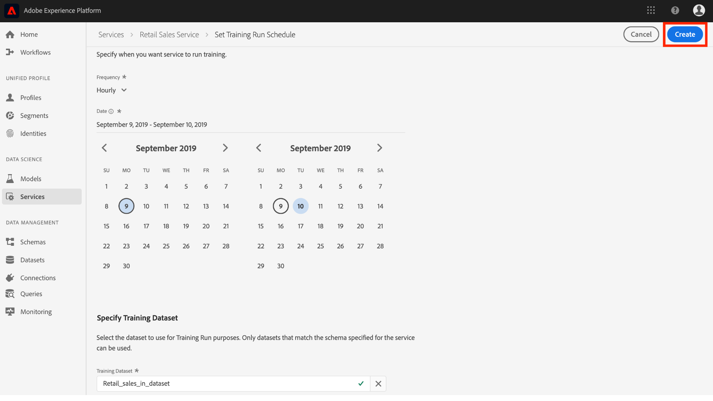
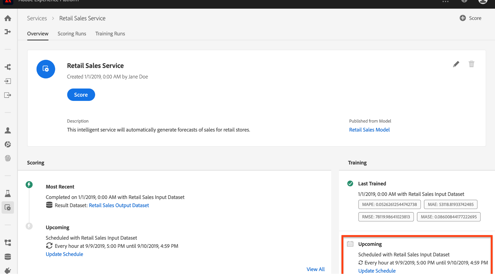

# Schedule a model (UI)

Adobe Experience Platform [!DNL Data Science Workspace] allows you to set up scheduled scoring and training runs on a machine learning Service. Automating the training and scoring process can help maintain and improve a Service's efficiency through time by keeping up with patterns within your data.

This tutorial walks through the steps to configure training and scoring schedules on an existing Service through the [!UICONTROL Service Gallery]. It is broken into the following main sections:

-   [Configure scheduled scoring](#configure-scheduled-scoring)
-   [Configure scheduled training](#configure-scheduled-training)

## Getting started

In order to complete this tutorial, you must have access to [!DNL Experience Platform]. If you do not have access to an IMS Organization in [!DNL Experience Platform], please speak to your system administrator before proceeding.

This tutorial requires an existing Service. If you do not have an accessible Service to work with, you can create one by following the [Publish your Model as a Service in the UI](./publish-model-service-ui.md) tutorial.

## Configure scheduled scoring {#configure-scheduled-scoring}

Model scoring can be configured to be an automated process on a scheduled basis. Once a Service is created, you can follow the steps below to configure and apply a scoring schedule:

1.  In Adobe Experience Platform, click the **[!UICONTROL Services]** tab located in the left navigation column to access the **[!DNL Service Gallery]**. Find the Service you wish to schedule scoring runs on and click **[!UICONTROL Open]** to view its **Overview** page.

2.  The Overview page displays the Service's scoring information. Click the **[!UICONTROL Update Schedule]** link to configure a scoring schedule.

3.  Configure the frequency, start date, end date, input dataset, and output dataset for the scoring schedule. Once you are satisfied with the configurations, click **[!UICONTROL Create]** to update the Service's scoring schedule.

4.  Your updated scoring schedule is shown in the Service's **Overview** page.

## Configure scheduled training {#configure-scheduled-training}

Configuring scheduled training runs on a Service ensures that the machine learning Model is updated to the most recent data patterns. Whenever a scheduled training run completes, the resulting trained Model is used to power the Service until the next scheduled training run. 

Once a Service is created, you can follow the steps below to configure and apply a training schedule:

1.  In Adobe Experience Platform, click the **[!UICONTROL Services]** tab located in the left navigation column to access the **[!UICONTROL Service Gallery]**. Find the Service you wish to schedule training runs on and click **[!UICONTROL Open]** to view its **Overview** page.

2.  The Overview page displays the Service's training information. Click the **[!UICONTROL Update Schedule]** link to configure a training schedule.

3.  Configure the frequency, start date, end date, and input dataset used for the training schedule. Once you are satisfied with the configurations, click **[!UICONTROL Create]** to update the Service's training schedule.

4.  Your updated training schedule is shown in the Service's **Overview** page.

## Next steps

By following this tutorial, you have successfully scheduled automated training and scoring runs on a Service, and completed the [!DNL Data Science Workspace] tutorial UI workflow. If you have not done so already, consider [restarting the tutorial](./create-retails-sales-dataset.md) and follow the API workflow to create, train, score, and publish a Model.
