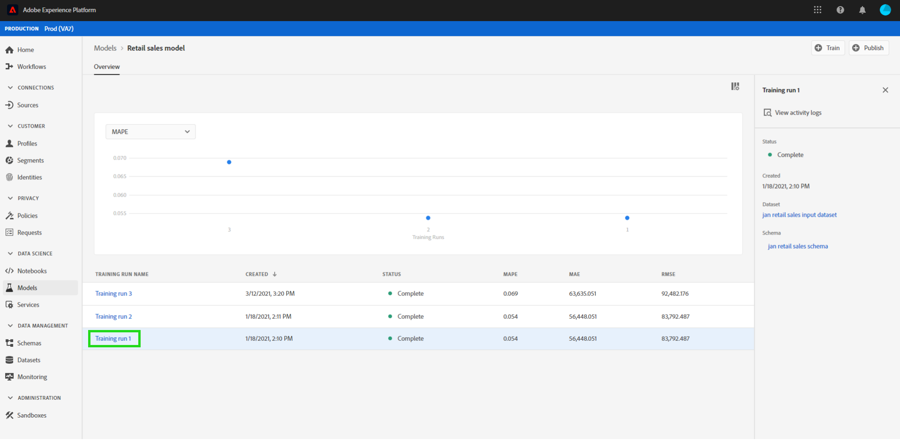
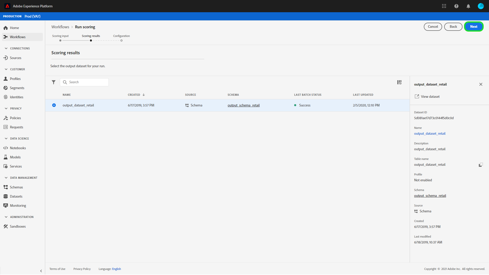
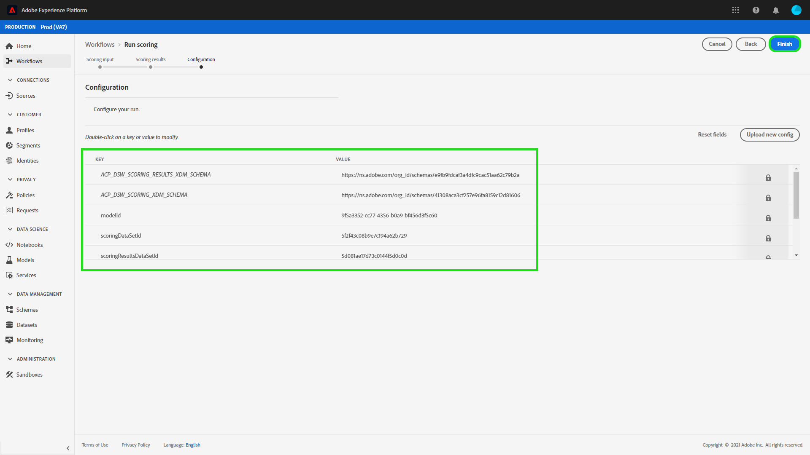
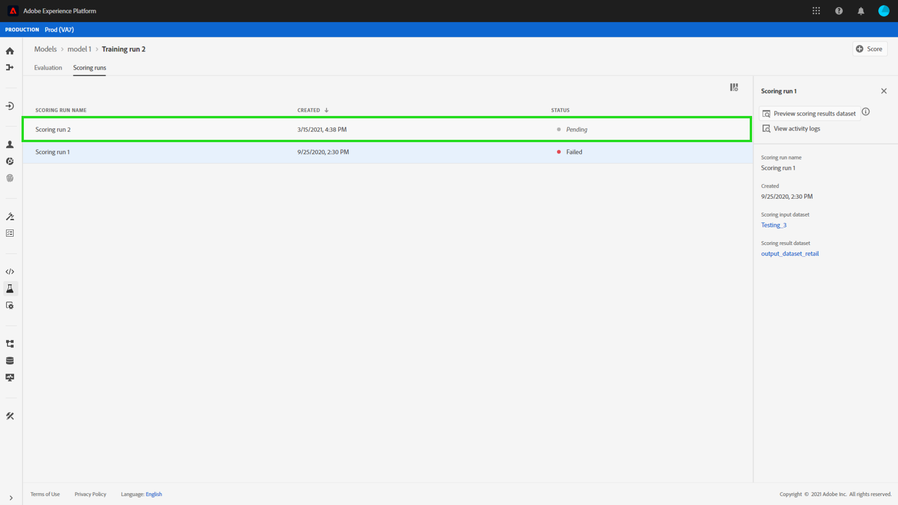
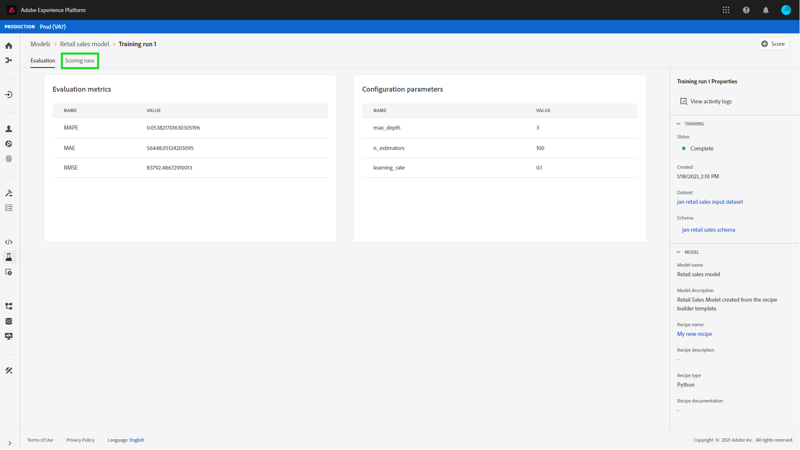
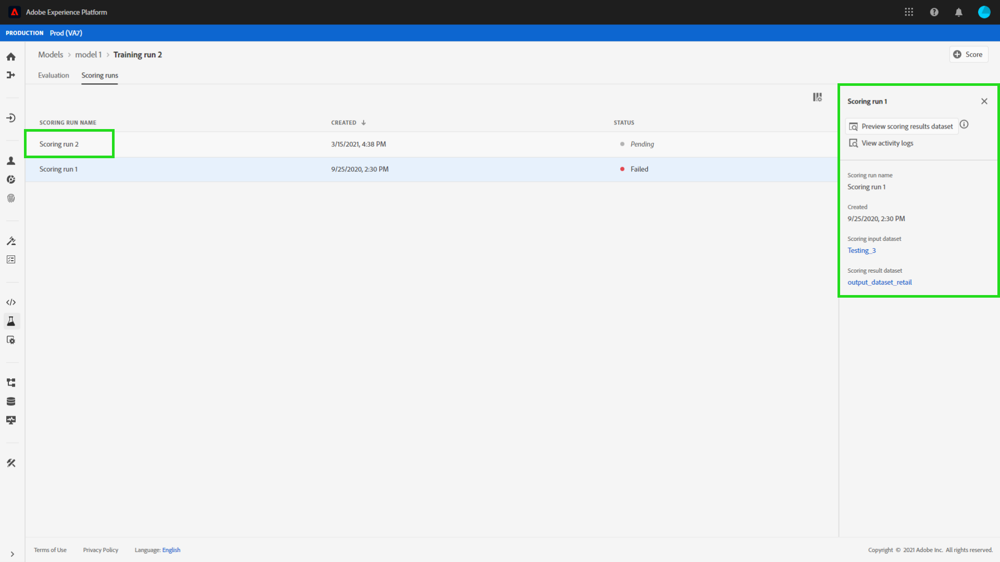
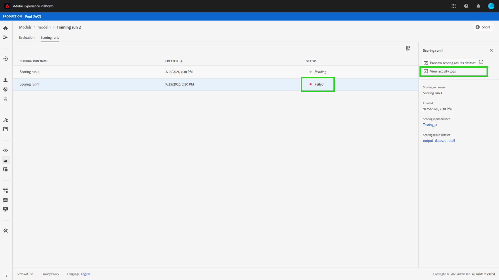
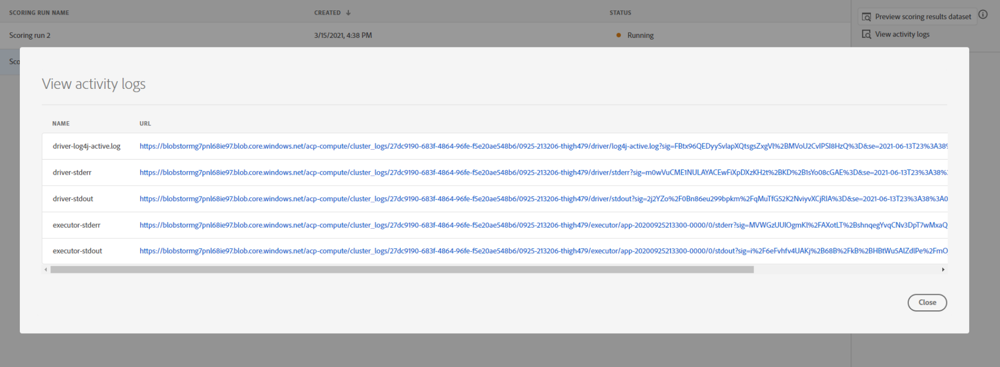
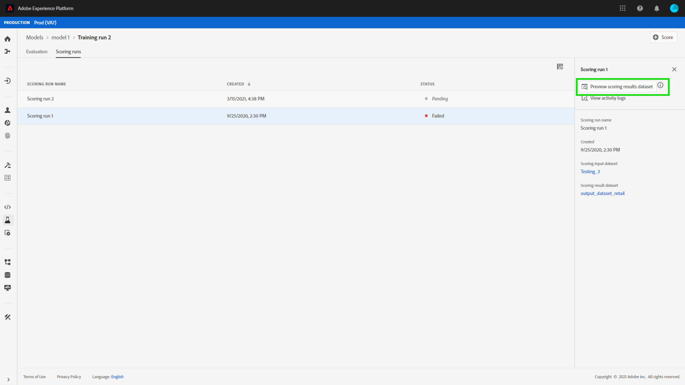
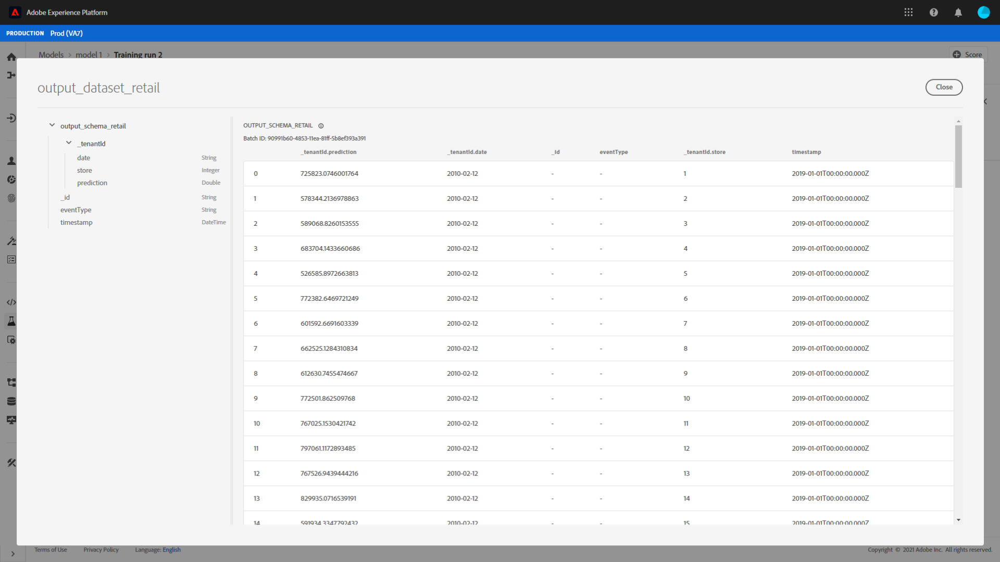

# Score a model in the Data Science Workspace UI

Scoring in Adobe Experience Platform [!DNL Data Science Workspace] can be achieved by feeding input data into an existing trained Model. Scoring results are then stored and viewable in a specified output dataset as a new batch. 

This tutorial demonstrates the steps required to score a Model in the [!DNL Data Science Workspace] user interface.

## Getting started

In order to complete this tutorial, you must have access to [!DNL Experience Platform]. If you do not have access to an organization in [!DNL Experience Platform], please speak to your system administrator before proceeding.

This tutorial requires a trained Model. If you do not have a trained Model, follow the [train and evaluate a Model in the UI](./train-evaluate-model-ui.md) tutorial before continuing.

## Create a new scoring run

A scoring run is created using optimized configurations from a previously completed and evaluated training run. The set of optimal configurations for a Model are typically determined by reviewing training run evaluation metrics.

Find the most optimal training run to use its configurations for scoring. Then, open the desired training run by selecting the hyperlink attached to its name.

From the training run **[!UICONTROL Evaluation]** tab, select **[!UICONTROL Score]** located on the top right of the screen. A new scoring workflow begins.

Select the input scoring dataset and select **[!UICONTROL Next]**.

Select the output scoring dataset, this is the dedicated output dataset where the scoring results are stored. Confirm your selection and select **[!UICONTROL Next]**.

The final step in the workflow prompts you to configure your scoring run. These configurations are used by the model for the scoring run.
Note that you cannot remove inherited parameters that were set during the models creation. You can edit or revert non-inherited parameters by double clicking the value or selecting the revert icon while hovering over the entry.

 

Review and confirm the scoring configurations and select **[!UICONTROL Finish]**  to create and execute the scoring run. You are directed to the **[!UICONTROL Scoring Runs]** tab and the new scoring run with the **[!UICONTROL Pending]** status is shown.

A scoring run can be displayed with one of the following statuses: 
- Pending
- Complete
- Failed
- Running

 Statuses are updated automatically. Proceed to the next step if the status is **[!UICONTROL Complete]** or **[!UICONTROL Failed]**.

## View scoring results

To view scoring results, start by selecting a training run.

You are redirected to the training runs **[!UICONTROL Evaluation]** page. Near the top of the training run evaluation page, select the **[!UICONTROL Scoring Runs]** tab to view a list of existing scoring runs.

Next, select a scoring run to view the run details.

If the selected scoring run has a status of either "Complete" or "Failed", the **[!UICONTROL View Activity Logs]** link is made available. If a scoring run fails, the execution logs can provide useful information for determining the reason of the failure. To download the execution logs, select **[!UICONTROL View Activity Logs]**.

The **[!UICONTROL View activity logs]** popover appears. Select a URL to automatically download the associated logs.

You also have the option to view your scoring results by selecting  **[!UICONTROL Preview scoring results dataset]**. 

A preview of the output dataset is provided.

For the complete set of scoring results, select the **[!UICONTROL Scoring Results Dataset]** link found in the right column.

## Next steps

This tutorial walked you through the steps to score data using a trained Model in [!DNL Data Science Workspace]. Follow the tutorial on [publishing a Model as a Service in the UI](./publish-model-service-ui.md) to allow users within your organization to score data by providing easy access to a machine learning Service.
