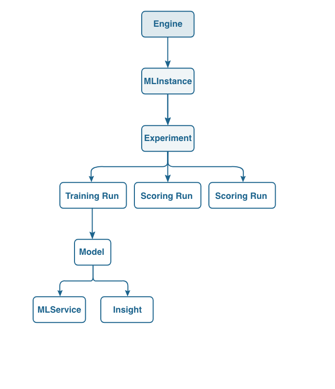

# Train and evaluate a model using the [!DNL Sensei Machine Learning] API


This tutorial will show you how to create, train, and evaluate a Model using API calls. Refer to [this document](https://www.adobe.io/apis/experienceplatform/home/api-reference.html#!acpdr/swagger-specs/sensei-ml-api.yaml) for a detailed list of API documentation.

## Prerequisites

Follow the [Import a packaged Recipe using the API](./import-packaged-recipe-api.md) for creating an Engine, which is required to train and evaluate a Model using the API.

Follow the [Experience Platform API authentication tutorial](https://www.adobe.com/go/platform-api-authentication-en) to start making API calls.

From the tutorial you should now have the following values:

- `{ACCESS_TOKEN}`: Your specific bearer token value provided after authentication.
- `{ORG_ID}`: Your IMS org credentials found in your unique Adobe Experience Platform integration.
- `{API_KEY}`: Your specific API key value found in your unique Adobe Experience Platform integration.

- Link to a Docker image of an intelligent service

## API workflow

We will be consuming the APIs to create an Experiment Run for training. For this tutorial, we will be focused on the Engines, MLInstances, and Experiments endpoints. The following chart outlines the relationship between the three and also introduces the idea of a Run and a Model. 



>[!NOTE]
>
>The terms "Engine", "MLInstance", "MLService", "Experiment", and "Model" are referred to as different terms in the UI. If you're coming from the UI, the following table maps the differences.

| UI Term | API Term |
| --- | --- |
| Recipe | Engine |
| Model | MLInstance |
| Training runs | Experiment |
| Service | MLService |

### Create an MLInstance

Creating a MLInstance can be done using the following request. You will be using the `{ENGINE_ID}` that was returned when creating an Engine from the [Import a packaged Recipe using the API](./import-packaged-recipe-ui.md) tutorial.

**Request**

```SHELL
curl -X POST \
  https://platform.adobe.io/data/sensei/mlInstances \
  -H 'Authorization: Bearer {ACCESS_TOKEN}' \
  -H 'Content-Type: application/vnd.adobe.platform.sensei+json;profile=mlInstance.v1.json' \
  -H 'x-api-key: {API_KEY}' \
  -H 'x-gw-ims-org-id: {ORG_ID}' \
  -d `{JSON_PAYLOAD}`
```

`{ACCESS_TOKEN}`: Your specific bearer token value provided after authentication.  
`{ORG_ID}`: Your IMS org credentials found in your unique Adobe Experience Platform integration.  
`{API_KEY}`: Your specific API key value found in your unique Adobe Experience Platform integration.  
`{JSON_PAYLOAD}`: The configuration of our MLInstance. The example we use in our tutorial is shown here:

```JSON
{
    "name": "Retail - Instance",
    "description": "Instance for ML Instance",
    "engineId": "{ENGINE_ID}",
    "createdBy": {
        "displayName": "John Doe",
        "userId": "johnd"
    },
    "tags": {
        "purpose": "tutorial"
    },
    "tasks": [
        {
            "name": "train",
            "parameters": [
                {
                    "key": "numFeatures",
                    "value": "10"
                },
                {
                    "key": "maxIter",
                    "value": "2"
                },
                {
                    "key": "regParam",
                    "value": "0.15"
                },
                {
                    "key": "trainingDataLocation",
                    "value": "sample_training_data.csv"
                }
            ]
        },
        {
            "name": "score",
            "parameters": [
                {
                    "key": "scoringDataLocation",
                    "value": "sample_scoring_data.csv"
                },
                {
                    "key": "scoringResultsLocation",
                    "value": "scoring_results.net"
                }
            ]
        }
    ]
}

```

>[!NOTE]
>
>In the `{JSON_PAYLOAD}`, we define parameters used for training and scoring in the `tasks` array. The `{ENGINE_ID}` is the ID of the Engine you want to use and the `tag` field is an optional parameter used to identify the Instance.

The response contains the `{INSTANCE_ID}` which represents the MLInstance that is created. Multiple model MLInstances with different configurations can be created.

**Response**

```JSON
{
    "id": "{INSTANCE_ID}",
    "name": "Retail - Instance",
    "description": "Instance for ML Instance",
    "engineId": "{ENGINE_ID}",
    "created": "2018-21-21T11:11:11.111Z",
    "createdBy": {
        "displayName": "John Doe",
        "userId": "johnd"
    },
    "updated": "2018-21-01T11:11:11.111Z",
    "deleted": false,
    "tags": {
        "purpose": "tutorial"
    },
    "tasks": [
        {
            "name": "train",
            "parameters": [...]
        },
        {
            "name": "score",
            "parameters": [...]
        }
    ]
}

```

`{ENGINE_ID}`: This ID representing the Engine the MLInstance is created under.  
`{INSTANCE_ID}`: The ID that represents the MLInstance.

### Create an Experiment

An Experiment is used by a data scientist to arrive at a high performing model while training. Multiple Experiments include changing datasets, features, learning parameters, and hardware. The following is an example of creating an Experiment.

**Request**

```SHELL
curl -X POST \
  https://platform.adobe.io/data/sensei/experiments \
  -H 'Authorization: Bearer {ACCESS_TOKEN}' \
  -H 'Content-Type: application/vnd.adobe.platform.sensei+json;profile=experiment.v1.json' \
  -H 'x-gw-ims-org-id: {ORG_ID}' \
  -H 'x-api-key: {API_KEY' \
  -d `{JSON PAYLOAD}`
```

`{ORG_ID}`: Your IMS org credentials found in your unique Adobe Experience Platform integration.  
`{ACCESS_TOKEN}`: Your specific bearer token value provided after authentication.  
`{API_KEY}`: Your specific API key value found in your unique Adobe Experience Platform integration.  
`{JSON_PAYLOAD}`: Experiment object that is created. The example we use in our tutorial is shown here:

```JSON
{
    "name": "Experiment for Retail ",
    "mlInstanceId": "{INSTANCE_ID}",
    "tags": {
        "test": "guide"
    }
}
```

`{INSTANCE_ID}`: The ID that represents the MLInstance.

The response from the Experiment creation looks like this.

**Response**

```JSON
{
    "id": "{EXPERIMENT_ID}",
    "name": "Experiment for Retail",
    "mlInstanceId": "{INSTANCE_ID}",
    "created": "2018-01-01T11:11:11.111Z",
    "updated": "2018-01-01T11:11:11.111Z",
    "deleted": false,
    "tags": {
        "test": "guide"
    }
}
```

`{EXPERIMENT_ID}`: The ID that represents the Experiment you have just created.
`{INSTANCE_ID}`: The ID that represents the MLInstance.

### Create a scheduled Experiment for training

Scheduled Experiments are used so that we do not need to create each single Experiment Runs via an API call. Instead, we provide all necessary parameters during Experiment creation and each run will be created periodically.  

To indicate the creation of a scheduled Experiment, we must add a `template` section in the body of the request. In `template`, all necessary parameters for scheduling runs are included such as `tasks`, which indicate what action, and `schedule`, which indicates the timing of the scheduled runs.

**Request**

```Shell
curl -X POST \
  https://platform.adobe.io/data/sensei/experiments \
  -H 'Authorization: Bearer {ACCESS_TOKEN}' \
  -H 'Content-Type: application/vnd.adobe.platform.sensei+json;profile=experiment.v1.json' \
  -H 'x-gw-ims-org-id: {ORG_ID}' \
  -H 'x-api-key: {API_KEY}' \
  -d '{JSON_PAYLOAD}`

```

`{ORG_ID}`: Your IMS org credentials found in your unique Adobe Experience Platform integration.  
`{ACCESS_TOKEN}`: Your specific bearer token value provided after authentication.  
`{API_KEY}`: Your specific API key value found in your unique Adobe Experience Platform integration.  
`{JSON_PAYLOAD}`: Data set to be posted. The example we use in our tutorial is shown here:

```JSON
{
    "name": "Experiment for Retail",
    "mlInstanceId": "{INSTANCE_ID}",
    "template": {
        "tasks": [{
            "name": "train",
            "parameters": [
                   {
                        "value": "1000",
                        "key": "numFeatures"
                    }
            ],
            "specification": {
                "type": "SparkTaskSpec",
                "executorCores": 5,
                "numExecutors": 5
            }
        }],
        "schedule": {
            "cron": "*/20 * * * *",
            "startTime": "2018-11-11",
            "endTime": "2019-11-11"
        }
    }
}
```

When we create an Experiment, the body, `{JSON_PAYLOAD}`, should contain either the `mlInstanceId` or the `mlInstanceQuery` parameter. In this example, a scheduled Experiment will invoke a run every 20 minutes, set in the `cron` parameter, starting from the `startTime` until the `endTime`.

**Response**

```JSON
{
    "id": "{EXPERIMENT_ID}",
    "name": "Experiment for Retail",
    "mlInstanceId": "{INSTANCE_ID}",
    "created": "2018-11-11T11:11:11.111Z",
    "updated": "2018-11-11T11:11:11.111Z",
    "deleted": false,
    "workflowId": "endid123_0379bc0b_8f7e_4706_bcd9_1a2s3d4f5g_abcdf",
    "template": {
        "tasks": [
            {
                "name": "train",
                "parameters": [...],
                "specification": {
                    "type": "SparkTaskSpec",
                    "executorCores": 5,
                    "numExecutors": 5
                }
            }
        ],
        "schedule": {
            "cron": "*/20 * * * *",
            "startTime": "2018-07-04",
            "endTime": "2018-07-06"
        }
    }
}
```

`{EXPERIMENT_ID}`: The ID that represents the Experiment.  
`{INSTANCE_ID}`: The ID that represents the MLInstance.  


### Create an Experiment Run for training

With an Experiment entity created, a training run can be created and run using the call below. You will need the `{EXPERIMENT_ID}` and state what `mode` you want to trigger in the request body.

**Request**

```Shell
curl -X POST \
  https://platform.adobe.io/data/sensei/experiments/{EXPERIMENT_ID}/runs \
  -H 'Authorization: Bearer {ACCESS_TOKEN}' \
  -H 'Content-Type: application/vnd.adobe.platform.sensei+json;profile=experimentRun.v1.json' \
  -H 'x-gw-ims-org-id: {ORG_ID}' \
  -H 'x-api-key: {API_KEY}' \
  -d '{JSON_PAYLOAD}'
```

`{EXPERIMENT_ID}`: The ID corresponding to the Experiment you want to target. This can be found in the response when creating your Experiment.  
`{ORG_ID}`: Your IMS org credentials found in your unique Adobe Experience Platform integration.  
`{ACCESS_TOKEN}`: Your specific bearer token value provided after authentication.  
`{API_KEY}`: Your specific API key value found in your unique Adobe Experience Platform integration.  
`{JSON_PAYLOAD}`: To create a training run, you will have to include the following in the body:

```JSON
{
    "mode":"Train"
}
```

You can also override the configuration parameters by including a `tasks` array:

```JSON
{
   "mode":"Train",
   "tasks": [
        {
           "name": "train",
           "parameters": [
                {
                   "key": "numFeatures",
                   "value": "2"
                }
            ]
        }
    ]
}
```

You will get the following response which will let you know the `{EXPERIMENT_RUN_ID}` and the configuration under `tasks`.

**Response**

```JSON
{
    "id": "{EXPERIMENT_RUN_ID}",
    "mode": "train",
    "experimentId": "{EXPERIMENT_ID}",
    "created": "2018-01-01T11:11:11.903Z",
    "updated": "2018-01-01T11:11:11.903Z",
    "deleted": false,
    "tasks": [
        {
            "name": "Train",
            "parameters": [...]
        }
    ]
}
```

`{EXPERIMENT_RUN_ID}`:  The ID that represents the Experiment Run.  
`{EXPERIMENT_ID}`: The ID that represents the Experiment which the Experiment Run is under.  

### Retrieve an Experiment Run status

The status of the Experiment run can be queried with the `{EXPERIMENT_RUN_ID}`.

**Request**

```shell
curl -X GET \
  https://platform.adobe.io/data/sensei/experiments/{EXPERIMENT_ID}/runs/{EXPERIMENT_RUN_ID}/status \
  -H 'Authorization: Bearer {ACCESS_TOKEN}' \
  -H 'x-gw-ims-org-id: {ORG_ID}' \
  -H 'x-api-key: {API_KEY}'
```

`{EXPERIMENT_ID}`: The ID that represents the Experiment.  
`{EXPERIMENT_RUN_ID}`: The ID that represents the Experiment Run.  
`{ACCESS_TOKEN}`: Your specific bearer token value provided after authentication.  
`{ORG_ID}`: Your IMS org credentials found in your unique Adobe Experience Platform integration.  
`{API_KEY}`: Your specific API key value found in your unique Adobe Experience Platform integration.  

**Response**

The GET call will provide the status in the `state` parameter as shown below:

```JSON
{
    "id": "{EXPERIMENT_ID}",
    "name": "RunStatus for experimentRunId {EXPERIMENT_RUN_ID}",
    "experimentRunId": "{EXPERIMENT_RUN_ID}",
    "deleted": false,
    "status": {
        "tasks": [
            {
                "id": "{MODEL_ID}",
                "state": "DONE",
                "tasklogs": [
                    {
                        "name": "execution",
                        "url": "https://mlbaprod1sapwd7jzid.file.core.windows.net/..."
                    },
                    {
                        "name": "stderr",
                        "url": "https://mlbaprod1sapwd7jzid.file.core.windows.net/..."
                    },
                    {
                        "name": "stdout",
                        "url": "https://mlbaprod1sapwd7jzid.file.core.windows.net/..."
                    }
                ]
            }
        ]
    }
}
```

`{EXPERIMENT_RUN_ID}`:  The ID that represents the Experiment Run.  
`{EXPERIMENT_ID}`: The ID that represents the Experiment which the Experiment Run is under.  

In addition to the `DONE` state, other states include:
- `PENDING`
- `RUNNING`
- `FAILED`

To get more information, the detailed logs can be found under the `tasklogs` parameter.

### Retrieve the trained Model

In order to get the trained Model created above during training, we make the following request:

**Request**

```Shell
curl -X GET \
  'https://platform.adobe.io/data/sensei/models/?property=experimentRunId=={EXPERIMENT_RUN_ID}' \
  -H 'Authorization: Bearer {ACCESS_TOKEN}' \
  -H 'x-gw-ims-org-id: {ORG_ID}'
```

`{EXPERIMENT_RUN_ID}`: The ID corresponding to the Experiment Run you want to target. This can be found in the response when creating your Experiment Run.  
`{ACCESS_TOKEN}`: Your specific bearer token value provided after authentication.  
`{ORG_ID}`: Your IMS org credentials found in your unique Adobe Experience Platform integration.  

The response represents the trained Model that was created.

**Response**

```JSON
{
    "children": [
        {
            "id": "{MODEL_ID}",
            "name": "Tutorial trained Model",
            "experimentId": "{EXPERIMENT_ID}",
            "experimentRunId": "{EXPERIMENT_RUN_ID}",
            "description": "trained model for ID",
            "modelArtifactUri": "wasb://test-models@mlpreprodstorage.blob.core.windows.net/{MODEL_ID}",
            "created": "2018-01-01T11:11:11.011Z",
            "updated": "2018-01-01T11:11:11.011Z",
            "deleted": false
        }
    ],
    "_page": {
        "property": "ExperimentRunId=={EXPERIMENT_RUN_ID},deleted!=true",
        "count": 1
    }
}
```

`{MODEL_ID}`: The ID corresponding to the Model.  
`{EXPERIMENT_ID}`:  The ID corresponding to the Experiment the Experiment Run is under.  
`{EXPERIMENT_RUN_ID}`: The ID corresponding to the Experiment Run.  

### Stop and delete a scheduled Experiment

If you want to stop execution of a scheduled Experiment before its `endTime`, this can be done by querying a DELETE request to the `{EXPERIMENT_ID}`

**Request**

```Shell
curl -X DELETE \
  'https://platform.adobe.io/data/sensei/experiments/{EXPERIMENT_ID}' \
  -H 'Authorization: Bearer {ACCESS_TOKEN}' \
  -H 'x-gw-ims-org-id: {ORG_ID}'
```

`{EXPERIMENT_ID}`:  The ID corresponding to the Experiment.  
`{ACCESS_TOKEN}`: Your specific bearer token value provided after authentication.  
`{ORG_ID}`: Your IMS org credentials found in your unique Adobe Experience Platform integration.  

>[!NOTE]
>
>The API call will disable creation of new Experiment runs. However, it will not stop execution of already running Experiment Runs.

The following is the Response notifying that the Experiment is successfully deleted.

**Response**

```JSON
{
    "title": "Success",
    "status": 200,
    "detail": "Experiment successfully deleted"
}
```

## Next steps

This tutorial went over how to consume the APIs to create an Engine, an Experiment, scheduled Experiment Runs, and trained Models. In the [next exercise](./score-model-api.md), you will be making predictions by scoring a new dataset using the top performing trained model.
