# Train and evaluate a model in the Data Science Workspace UI

In Adobe Experience Platform Data Science Workspace, a machine learning Model is created by incorporating an existing Recipe that is appropriate for the Model's intent. The Model is then trained and evaluated to optimize its operating efficiency and efficacy by fine-tuning its associated Hyperparameters. Recipes are reusable, meaning that multiple Models can be created and tailored to specific purposes with a single Recipe.

This tutorial walks through the steps to create, train, and evaluate a Model.

## Getting started

In order to complete this tutorial, you must have access to [!DNL Experience Platform]. If you do not have access to an IMS Organization in [!DNL Experience Platform], please speak to your system administrator before proceeding.

This tutorial requires an existing Recipe. If you do not have a Recipe, follow the [Import a packaged Recipe in the UI](./import-packaged-recipe-ui.md) tutorial before continuing.

## Create a Model

In Experience Platform, select the **[!UICONTROL Models]** tab located in the left navigation, then select the browse tab to view your existing Models. Select **[!UICONTROL Create Model]** near the top right of the page to begin a Model creation process.

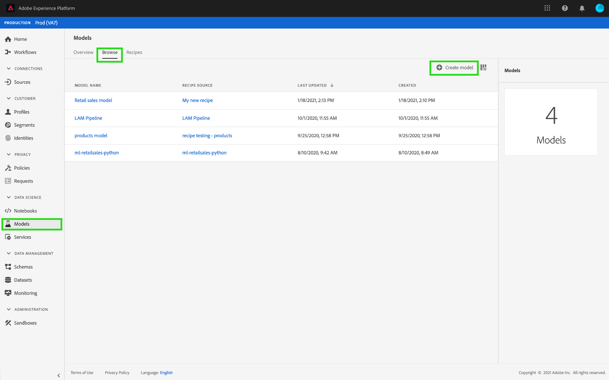

Browse through the list of existing Recipes, find and select the Recipe to be used to create the Model and select **[!UICONTROL Next]**.
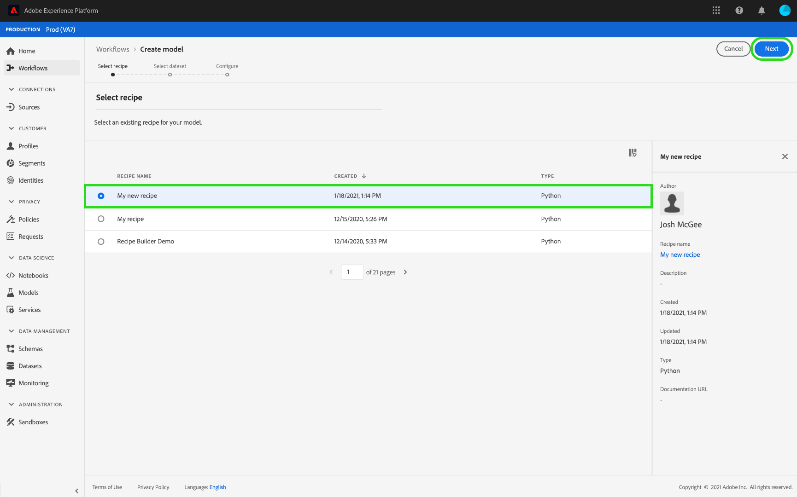

Select an appropriate input dataset and select **[!UICONTROL Next]**. This will set the default input training dataset for the Model. 
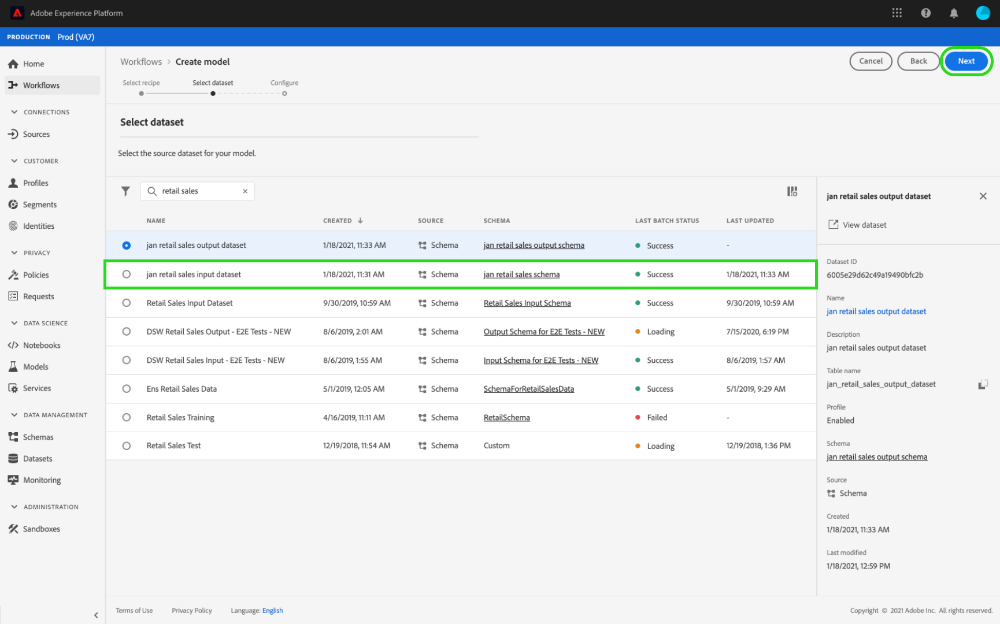

Provide a name for the Model and review the default Model configurations. Default configurations were applied during Recipe creation, review and modify the configuration values by double-clicking the values.

To provide a new set of configurations, select **[!UICONTROL Upload New Config]** and drag a JSON file containing Model configurations into the browser window. Select **[!UICONTROL Finish]** to create the Model.

>[!NOTE]
>
>Configurations are unique and specific to their intended Recipe, this means that configurations for the Retail Sales Recipe will not work for the Product Recommendations Recipe. See the [reference](#reference) section for a list of Retail Sales Recipe configurations.

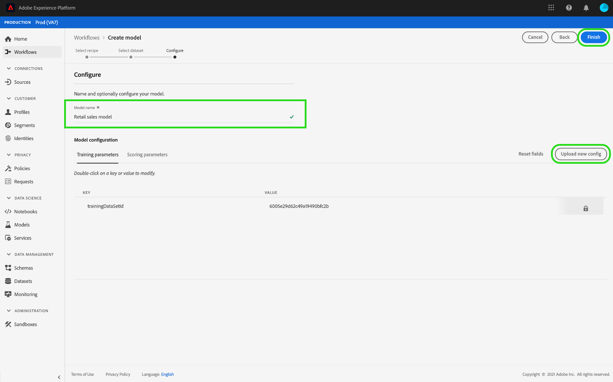

## Create a training Run

In Experience Platform, select the **[!UICONTROL Models]** tab located in the left navigation, then select the browse tab to view your existing Models. Find and select the hyperlink attached to the name of the Model you wish to train.

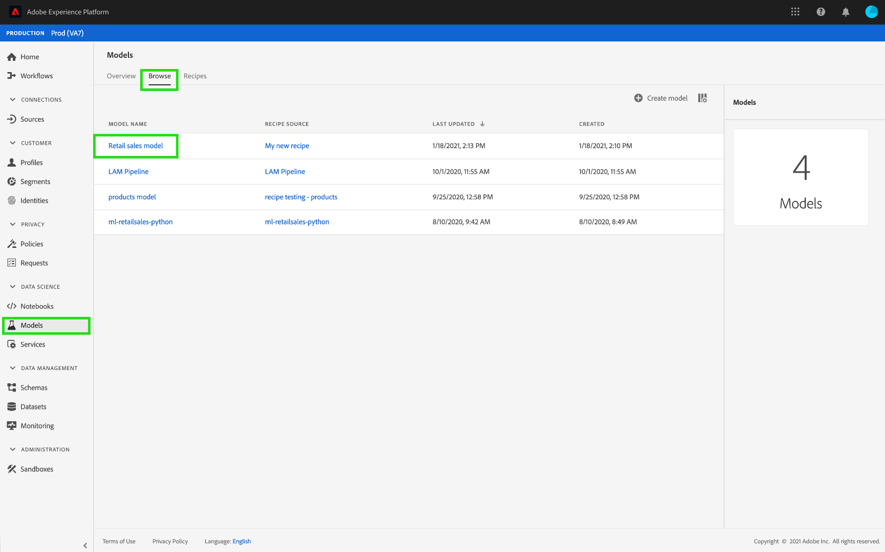

All existing training runs with their current training statuses are listed. For Models created using the [!DNL Data Science Workspace] user interface, a training run is automatically generated and executed using the default configurations and input training dataset.

Create a new training run by selecting **[!UICONTROL Train]** near the top-right of the Model overview page.

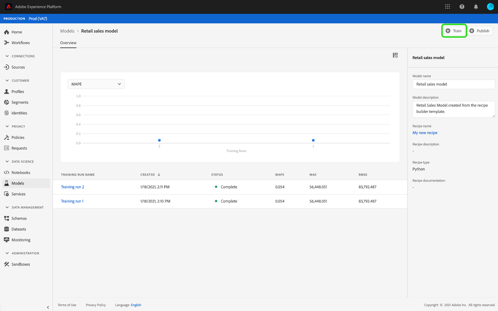

Select the training input dataset for the training run, then select **[!UICONTROL Next]**.

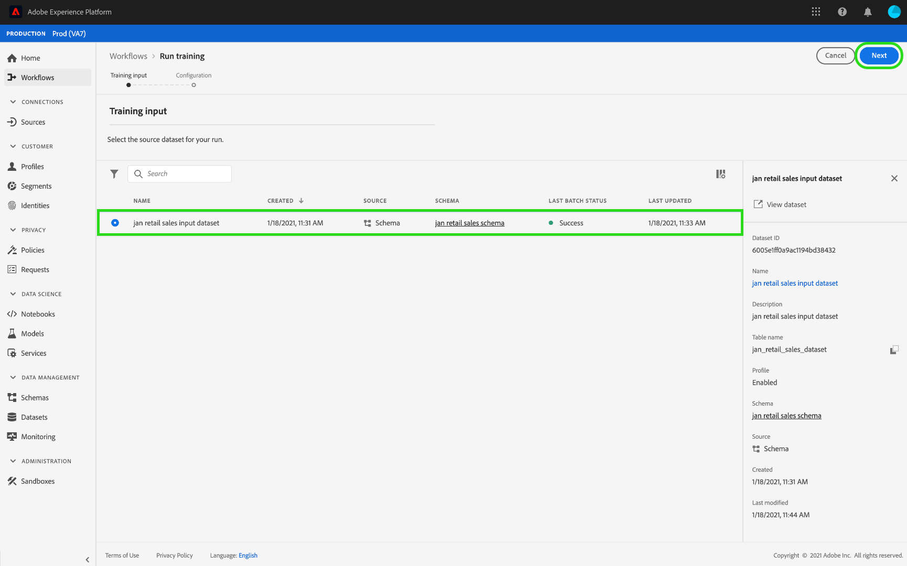

Default configurations provided during the Model's creation are shown, change and modify these accordingly by double-clicking the values. Select **[!UICONTROL Finish]** to create and execute the training run.

>[!NOTE]
>
>Configurations are unique and specific to their intended Recipe, this means that configurations for the Retail Sales Recipe will not work for the Product Recommendations Recipe. See the [reference](#reference) section for a list of Retail Sales Recipe configurations.

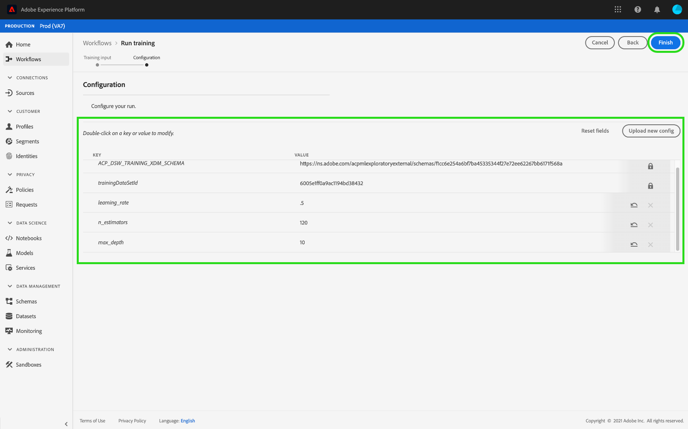

## Evaluate the Model

In Experience Platform, select the **[!UICONTROL Models]** tab located in the left navigation, then select the browse tab to view your existing Models. Find and select the hyperlink attached to the name of the Model you wish to evaluate.

All existing training runs with their current training statuses are listed. With multiple completed training runs, evaluation metrics can be compared across different training runs in the Model evaluation chart. Select an evaluation metric using the dropdown list above the graph.

The Mean Absolute Percent Error (MAPE) metric expresses accuracy as a percentage of the error. This is used to identify the top performing Experiment. The lower the MAPE, the better.

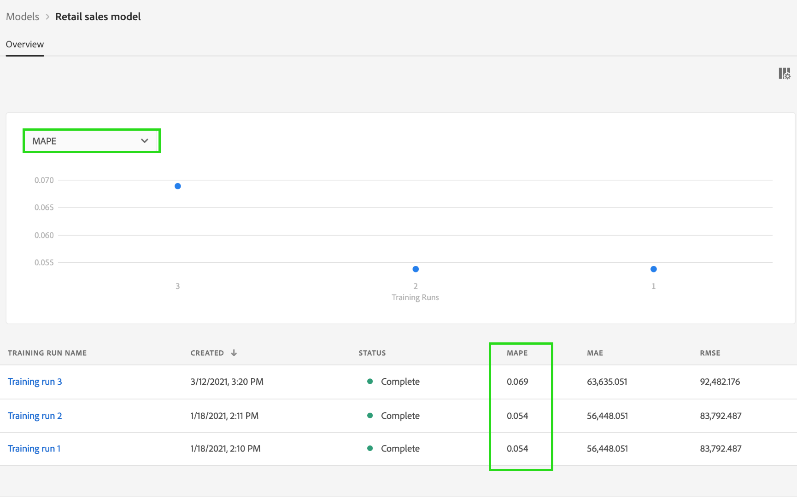

The "Precision" metric describes the percentage of relevant Instances compared with the total *retrieved* Instances. Precision can be seen as the probability that a randomly selected outcome is correct.

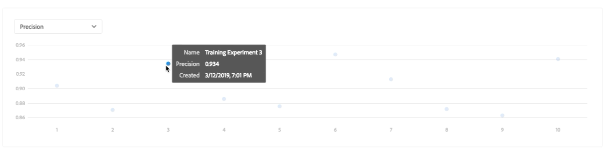

Selecting a specific training run provides the details of that run by opening the evaluation page. This can be done even before the run has been completed. On the evaluation page, you are able to see other evaluation metrics, configuration parameters, and visualizations specific to the training run. 

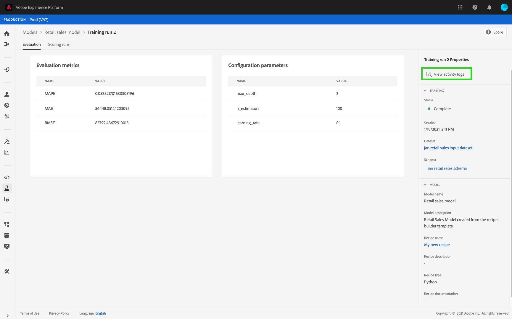

You can also download activity logs to see the details of the run. Logs are particularly useful for failed runs to see what went wrong.

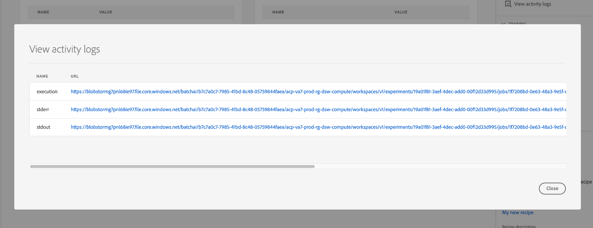

Hyperparameters cannot be trained and a Model must be optimized by testing different combinations of Hyperparameters. Repeat this Model training and evaluation process until you have arrived at an optimized Model.

## Next steps

This tutorial walked you through creating, training, and evaluating a Model in [!DNL Data Science Workspace]. Once you have arrived at an optimized Model, you can use the trained Model to generate insights by following the [Score a Model in the UI](./score-model-ui.md) tutorial.

## Reference {#reference}

### Retail Sales Recipe configurations

Hyperparameters determine the Model's training behavior, modifying Hyperparameters will affect the Model's accuracy and precision:

| Hyperparameter | Description | Recommended Range |
| --- | --- | --- |
|learning_rate | Learning rate shrinks the contribution of each tree by learning_rate. There is a trade-off between learning_rate and n_estimators. | 0.1 |
| n_estimators | The number of boosting stages to perform. Gradient boosting is fairly robust to over-fitting so a large number usually results in better performance. | 100 |
| max_depth | Maximum depth of the individual regression estimators. The maximum depth limits the number of nodes in the tree. Tune this parameter for best performance; the best value depends on the interaction of the input variables. | 3 |

Additional parameters determine the Model's technical properties:

| Parameter key | Type | Description |
| ----- | ----- | ----- |
| `ACP_DSW_INPUT_FEATURES` | String | List of comma separated input schema attributes. |
| `ACP_DSW_TARGET_FEATURES` | String | List of comma separated output schema attributes. |
| `ACP_DSW_FEATURE_UPDATE_SUPPORT` | Boolean | Determines whether input and output features are modifiable |
| `tenantId` | String | This ID ensures resources you create are namespaced properly and contained within your IMS Organization. [Follow the steps here](../../xdm/api/getting-started.md#know-your-tenant_id) to find your tenant ID. |
| `ACP_DSW_TRAINING_XDM_SCHEMA` | String | The input schema used for training a Model. |
| `evaluation.labelColumn` | String | Column label for evaluation visualizations. |
| `evaluation.metrics` | String | Comma separated list of evaluation metrics to be used for evaluating a Model. |
| `ACP_DSW_SCORING_RESULTS_XDM_SCHEMA` | String | The output schema used for scoring a Model. |
