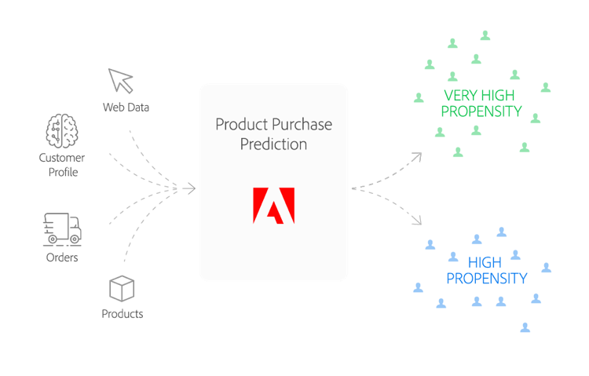

# Product purchase prediction recipe

The Product Purchase Prediction recipe enables you to predict the likelihood of a certain type of customer purchase event - a product purchase, for instance.

The following document will answer questions such as:
* Who is this recipe built for?
* What does this recipe do?

## Who is this recipe built for?

Your brand seeks to boost quarterly sales for your product line through effective and targeted promotions to your customers. However, not all customers are alike and you want your money's worth. Whom do you target? Which of your customers are most likely to respond without finding your promotion intrusive? How do you customize your promotions to each customer? What channels should you rely on and when should you send out promotions?

## What does this recipe do?

The Product Purchase Prediction recipe utilizes machine learning to predict customer purchase behavior. It does this by applying a customized random forest classifier and a two-tiered Experience Data Model (XDM) to predict the probability of a purchase event. The model utilizes input data incorporating customer profile information and past purchase history and defaults to pre-determined configuration parameters determined by our Data Scientists to enhance predictive accuracy. 

## Data schema

This recipe uses [XDM schemas](../../xdm/home.md) to model the data. The schema used for this recipe is shown below:

| Field Name | Type |
| --- | --- |
| userId | String |
| genderRatio | Number |
| ageY | Number |
| ageM | Number |
| optinEmail | Boolean |
| optinMobile | Boolean |
| optinAddress | Boolean |
| created | Integer |
| totalOrders | Number |
| totalItems | Number |
| orderDate1 | Number |
| shippingDate1 | Number |
| totalPrice1 | Number |
| tax1 | Number |
| orderDate2 | Number |
| shippingDate2 | Number |
| totalPrice2 | Number |

## Algorithm

First, the training dataset in the *ProductPrediction* schema is loaded. From here, the model is trained using a [random forest classifier](https://scikit-learn.org/stable/modules/generated/sklearn.ensemble.RandomForestClassifier.html). Random forest classifier is a type of ensembled algorithm which refers to an algorithm that combines multiple algorithms to obtain improved predictive performance. The idea behind the algorithm is that the random forest classifier builds multiple decision trees and merges them to create a more accurate and stable prediction.

This process starts with creating a set of decision trees that randomly selects subsets of training data. Afterwards, the results of each decision tree is averaged.
