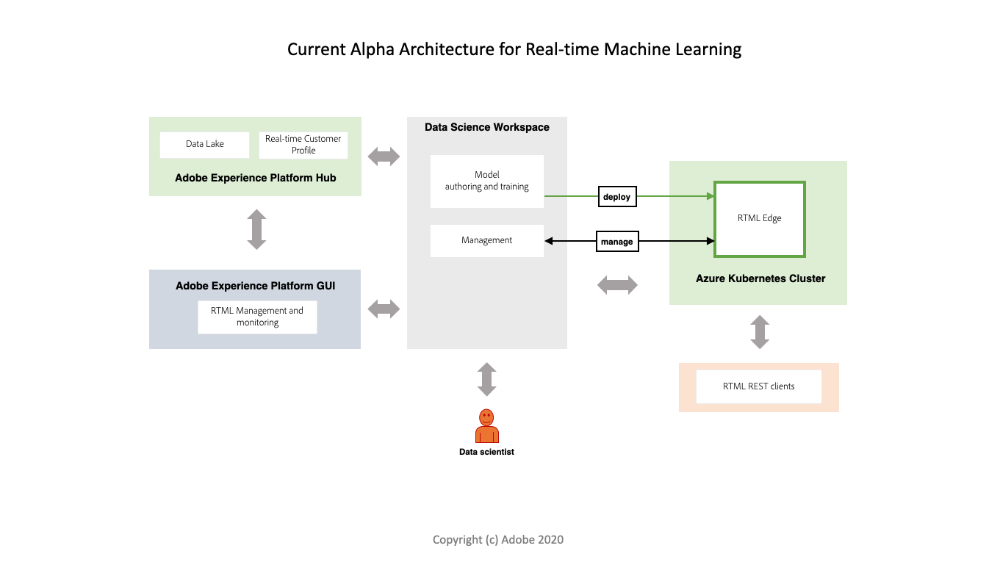
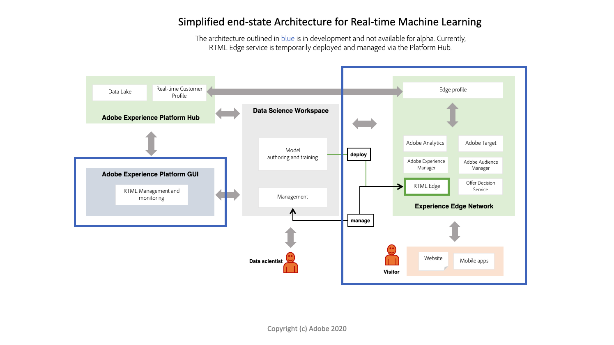

# Real-time Machine Learning overview (Alpha)

>[!IMPORTANT]
>
>Real-time Machine Learning is not available to all users yet. This feature is in alpha and still being tested. This document is subject to change.

Real-time Machine Learning can dramatically enhance the relevance of your digital experience content for your end-users. This is made possible by leveraging real-time inferencing and continuous learning on the [!DNL Experience Edge].

A combination of seamless computation on both the Hub and the [!DNL Edge] dramatically reduces the latency that is traditionally involved in powering hyper-personalized experiences that are both relevant and responsive. Hence, Real-time Machine Learning provides inferences with incredibly low latency for synchronous decision-making. Examples include rendering personalized web page content or surfacing of an offer or discount to reduce churn and increase conversions on a web store.

## Real-time Machine Learning architecture {#architecture}

The following diagrams provide a overview for the Real-time Machine Learning architecture. Currently, alpha has a more simplified version.

## Real-time Machine Learning workflow

The following workflow outlines the typical steps and results involved in creating and utilizing a Real-time Machine Learning model.

### Data ingestion and preparations

Data is ingested and transformed with the [!DNL Experience Data Model] (XDM) on Adobe Experience Platform. This data is used for model training. To learn more about XDM, visit the [XDM overview](../../xdm/home.md).

### Authoring

Create a Real-time Machine Learning model by authoring it from scratch or bringing it in as a pre-trained serialized ONNX model in Adobe Experience Platform Jupyter Notebooks.

### Deployment

Deploy your model to [!DNL Experience Edge] to create a Real-time Machine Learning service in the [!UICONTROL Service Gallery] using the Prediction API endpoint.

### Inference

Use the Prediction REST API endpoint to generate machine learning insights in real time.

### Delivery

Marketers can then define segments and rules that map Real-time Machine Learning scores to experiences using Adobe Target. This allows for visitors of your brand's website to be shown a same or next-page hyper-personalized experience in real time.

## Current functionality 

Real-time Machine Learning is currently in alpha. The functionality outlined below is subject to change as more features and nodes are made available.

>[!NOTE]
>
> Alpha limitations:
> - Currently, only ONNX based models are supported.
> - Functions used in nodes cannot be serialized. For example, a lambda function used in a Pandas node.
> - There is a 20 second sleep after [!DNL Edge] deployment is done manually.
> - For deep learning, your data needs to be sent in such a way that when `df.values` is called it returns an array that is acceptable by your DL model. This is because the ONNX model scoring node uses `df.values` and sends the output to score against the model.

### Features:

| | Alpha (May) |
| --- | --- |
| **Features** | - Using the RTML notebook template, author, test, and deploy a custom machine learning model.   - Support for importing pre-trained machine learning models.   - Real-time Machine Learning SDK.   - Starter set of authoring nodes.   - Deployed to Adobe Experience Platform Hub. |
| **Availability** | North America |
| **Authoring Nodes** | - Pandas   - ScikitLearn   - ONNXNode   - Split   - ModelUpload   - OneHotEncoder |
| **Scoring run times** | ONNX |

## Next steps

You can begin by following the [getting started](./getting-started.md) guide. This guide walks you through setting up all the required prerequisites for creating a Real-time Machine Learning model.
