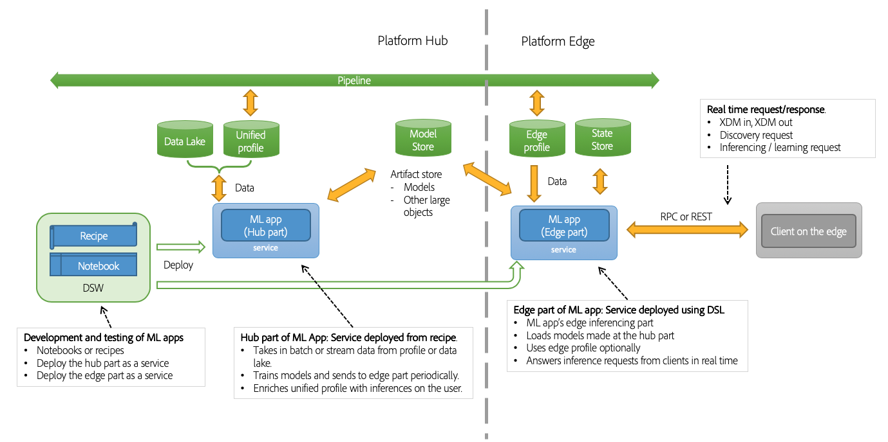

# Real-time Machine Learning overview

>[!IMPORTANT]
>Real-time Machine Learning is not available to all users yet. This feature is in alpha and still being tested. This document is subject to change.

Adobe Experience Platform's Real-time Machine Learning framework enables you to unleash the power of machine learning to deliver the right experiences to the right end-users at the right time in the right channels with a sub-second time frame.

## Benefits

Real-time Machine Learning can dramatically enhance the relevance of your digital experience content for your end-users. This is made possible by leveraging real-time inferencing and continuous learning on the Experience Edge.

A combination of seamless computation on both the Hub and the Edge dramatically reduces the latency that is traditionally involved in powering hyper-personalized experiences that are both relevant and responsive. Hence, Real-time Machine Learning provides inferences with incredibly low latency for synchronous decision-making. Examples include rendering personalized web page content or surfacing of an offer or discount to reduce churn and increase conversions on a web store.

## Real-time Machine Learning architecture

The following diagram provides a high level view of the Real-time Machine Learning architecture.

## Real-time Machine Learning workflow (Alpha)

### Data ingestion and preparations

Data is ingested and transformed with the Experience Data Model (XDM) on Adobe Experience Platform. This data is used for model training. To learn more about XDM, visit the [XDM overview](../../xdm/home.md).

### Authoring

Create a Real-time Machine Learning model by authoring it from scratch or bringing it in as a pre-trained serialized model (ONNX) in Adobe Experience Platform Jupyter Notebooks.

### Deployment

Deploy your model to the Experience Edge to create a Real-time Machine Learning service in the Service Gallery using the Prediction API endpoint.

### Inference

Use the Prediction REST API endpoint to generate machine learning insights in real-time.

### Delivery

Marketers can then define segments and rules that map Real-time Machine Learning scores to experience using Adobe Target's Experience Targeting Activity feature. This allows for visitors of your brands website to be shown a same or next-page hyper-personalized experience in real time (under 100ms).

## Next steps

You can begin by following the [getting started](./getting-started.md) guide. This guide walks you through setting up all the required prerequisites for creating a Real-time Machine Learning model.

