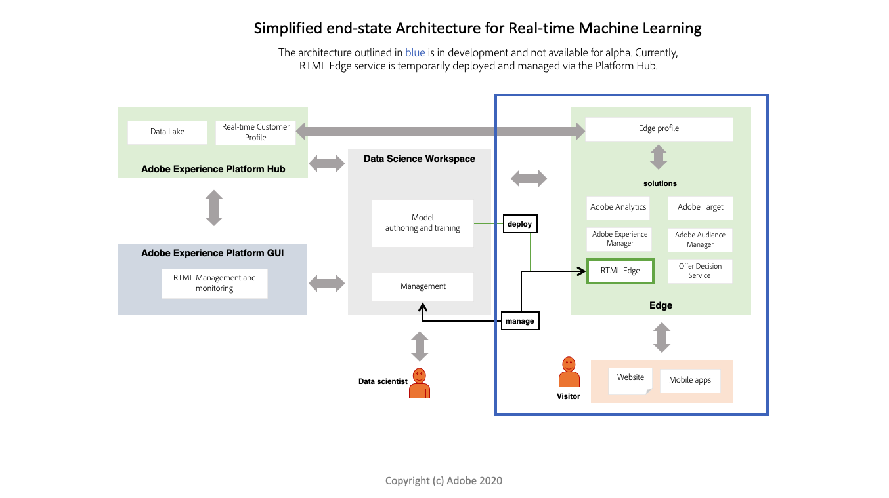

# Real-time Machine Learning overview

>[!IMPORTANT]
>Real-time Machine Learning is not available to all users yet. This feature is in alpha and still being tested. This document is subject to change.

Adobe Experience Platform's Real-time Machine Learning framework enables you to use machine learning to deliver the right experiences to the right end-users at the right time in the right channels with a sub-second time frame.

## Benefits

Real-time Machine Learning can dramatically enhance the relevance of your digital experience content for your end-users. This is made possible by leveraging real-time inferencing and continuous learning on the Experience Edge.

A combination of seamless computation on both the Hub and the Edge dramatically reduces the latency that is traditionally involved in powering hyper-personalized experiences that are both relevant and responsive. Hence, Real-time Machine Learning provides inferences with incredibly low latency for synchronous decision-making. Examples include rendering personalized web page content or surfacing of an offer or discount to reduce churn and increase conversions on a web store.

## Real-time Machine Learning architecture

The following diagram provides a overview for the Real-time Machine Learning architecture. Currently, alpha has a more simplified version.

## Real-time Machine Learning workflow (Alpha)

The following workflow outlines the typical steps and results involved in creating and utilizing a Real-time Machine Learning model.

### Data ingestion and preparations

Data is ingested and transformed with the Experience Data Model (XDM) on Adobe Experience Platform. This data is used for model training. To learn more about XDM, visit the [XDM overview](../../xdm/home.md).

### Authoring

Create a Real-time Machine Learning model by authoring it from scratch or bringing it in as a pre-trained serialized ONNX model in Adobe Experience Platform Jupyter Notebooks.

### Deployment

Deploy your model to Experience Edge to create a Real-time Machine Learning service in the Service Gallery using the Prediction API endpoint.

### Inference

Use the Prediction REST API endpoint to generate machine learning insights in real-time.

### Delivery

Marketers can then define segments and rules that map Real-time Machine Learning scores to experiences using Adobe Target. This allows for visitors of your brand's website to be shown a same or next-page hyper-personalized experience in real time.

## Current functionality 

Real-time Machine Learning is currently in Alpha. This functionality is going to update over time.

>[!NOTE]
> Alpha limitations:
> - Functions used in nodes cannot be serialized. For example, a lambda function used in a Pandas node.
> - There is a 60 second sleep after edge deployment is done manually.
> - For deep learning, your data needs to be sent in such a way that when `df.values` is called it returns an array that is acceptable by your DL model. This is because the ONNX model scoring node does `df.values` and sends the output to score against the model.

### Features:

<table>
    <th></th>
    <th>Alpha (May)</th>
    <tr>
        <td>
            <strong>Features</strong>
        </td>
        <td>
            <li>Data Science Workspace bring your own Model and author via Notebook launcher integration.</li>
            <li>Starter set of authoring nodes.</li>
            <li>Deploy to Hub</li>
            <li>Scikit Learn based Models.</li>
        </td>
    </tr>
    <tr>
        <td>
            <strong>Availability</strong>
        </td>
        <td>
            North America
        </td>
    </tr>
    <tr>
        <td>
            <strong>Authoring</strong>
        </td>
        <td>
            <li>Python support</li>
            <li>Real-time Machine Learning SDK</li>
            <li>Python authoring nodes: Pandas, ScikitLearn, ONNXNode, Split, ModelUpload, OneHotEncoder.</li>
        </td>
    </tr>
    <tr>
        <td>
            <strong>Scoring run times</strong>
        </td>
        <td>
            ONNX
        </td>
    </tr>
</table>

## Next steps

You can begin by following the [getting started](./getting-started.md) guide. This guide walks you through setting up all the required prerequisites for creating a Real-time Machine Learning model.

