# Manage Real-time Machine Learning notebooks (Alpha)

>[!IMPORTANT]
>
>Real-time Machine Learning is not available to all users yet. This feature is in alpha and still being tested. This document is subject to change.

The following guide outlines the steps needed to build a Real-time Machine Learning application. Using the Adobe provided **[!UICONTROL Real-time ML]** Python notebook template, this guide covers training a model, creating a DSL, publishing DSL to Edge, and scoring the request. As you progress through implementing your Real-time Machine Learning model, it's expected that you modify the template to fit the needs of your dataset.

## Create a Real-time Machine Learning notebook

In the Adobe Experience Platform UI, select **[!UICONTROL Notebooks]** from within **Data Science**. Next, select **[!UICONTROL JupyterLab]** and allow some time for the environment to load.

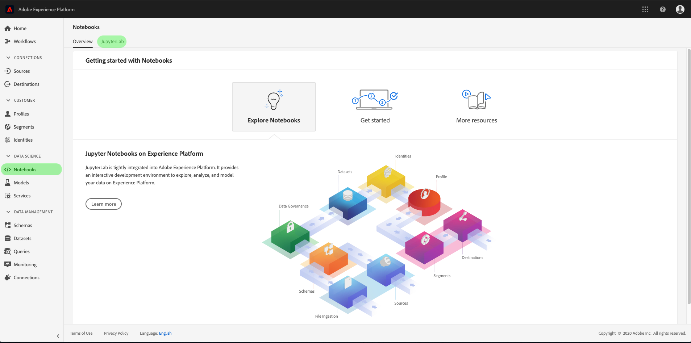

The [!DNL JupyterLab] launcher appears. Scroll down to *Real-Time Machine Learning* and select the **[!UICONTROL Real-time ML]** notebook. A template opens containing example notebook cells with an example dataset.

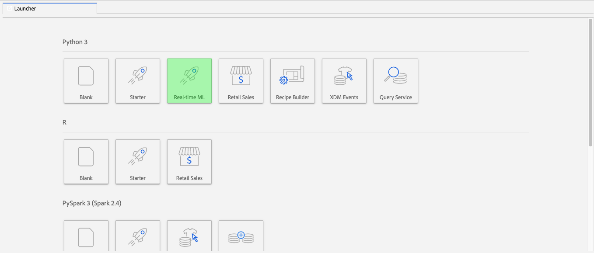

## Import and discover nodes

Start by importing all the required packages for your model. Make sure any package you plan on using for node authoring is imported.

>[!NOTE]
>
>Your list of imports might differ based on the model you wish to make. This list is going to change as new nodes are added over time. Please refer to the [node reference guide](./node-reference.md) for a complete list of available nodes.

```python
from pprint import pprint
import pandas as pd
import numpy as np
import json
import uuid
from shutil import copyfile
from pathlib import Path
from datetime import date, datetime, timedelta
from platform_sdk.dataset_reader import DatasetReader

from rtml_nodelibs.nodes.standard.preprocessing.json_to_df import JsonToDataframe
from rtml_sdk.edge.utils import EdgeUtils
from rtml_sdk.graph.utils import GraphBuilder
from rtml_nodelibs.nodes.standard.ml.onnx import ONNXNode
from rtml_nodelibs.core.nodefactory import NodeFactory as nf
from rtml_nodelibs.nodes.standard.preprocessing.pandasnode import Pandas
from rtml_nodelibs.nodes.standard.preprocessing.one_hot_encoder import OneHotEncoder
from rtml_nodelibs.nodes.standard.ml.artifact_utils import ModelUpload
from rtml_nodelibs.core.nodefactory import NodeFactory as nf
from rtml_nodelibs.core.datamsg import DataMsg
```

The following code cell prints a list of available nodes.

```python
# Discover Nodes
pprint(nf.discover_nodes())
```

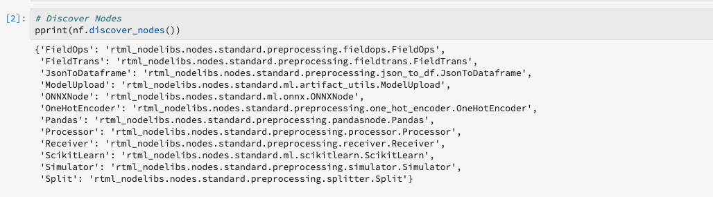

## Training a Real-time Machine Learning model

Using one of the following options, you are going to write [!DNL Python] code to read, preprocess, and analyze data. Next, you need to train your own ML model, serialize it into ONNX format then upload it to Real-time Machine Learning model store.

- [Training your own model in JupyterLab notebooks](#training-your-own-model)
- [Uploading your own pre-trained ONNX model to JupyterLab notebooks](#pre-trained-model-upload)

### Training your own model {#training-your-own-model}

Start by loading your training data.

>[!NOTE]
>
>In the **Real-time ML** template, the [car insurance CSV dataset](https://github.com/adobe/experience-platform-dsw-reference/tree/master/datasets/insurance) is grabbed from [!DNL Github].

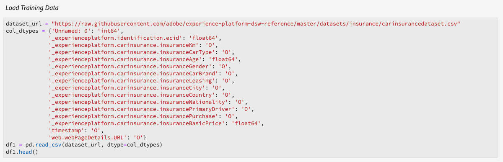

If you wish to use a dataset from within Adobe Experience Platform, uncomment the cell below. Next, you need to replace `DATASET_ID` with the appropriate value.

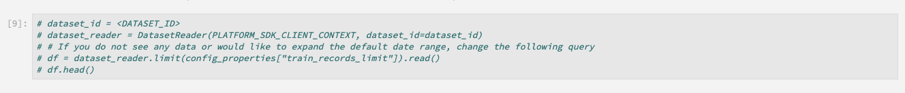

To access a dataset in your [!DNL JupyterLab] notebook, select the **Data** tab in the left-navigation of [!DNL JupyterLab]. The **[!UICONTROL Datasets]** and **[!UICONTROL Schemas]** directories appear. Select **[!UICONTROL Datasets]** and right-click, then select the **[!UICONTROL Explore Data in Notebook]** option from the dropdown menu on the dataset you wish to use. An executable code entry appears at the bottom of the notebook. This cell has your `dataset_id`.

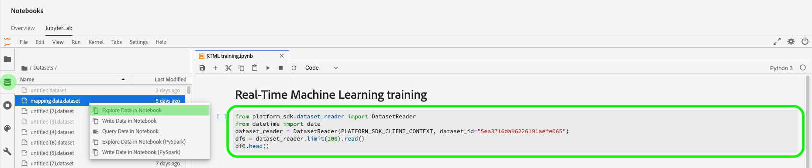

Once complete, right-click and delete the cell that you generated at the bottom of the notebook.

### Training properties

Using the template provided, modify any of the training properties within `config_properties`.

```python
config_properties = {
    "train_records_limit":1000000,
    "n_estimators": "80",
    "max_depth": "5",
    "ten_id": "_experienceplatform"  
}
```

### Prepare your model

Using the **[!UICONTROL Real-time ML]** template, you need to analyze, pre-process, train, and evaluate your ML model. This is done by applying data transformations and building a training pipeline.

**Data transformations**

The **[!UICONTROL Real-time ML]** templates **Data Transformations** cell needs to be modified to work with your own dataset. Typically this involves renaming columns, data rollup, and data preparation/feature engineering. 

>[!NOTE]
>
>The following example has been condensed for readability purposes using `[ ... ]`. Please view and expand the *Real-time ML* templates data transformations section for the complete code cell.

```python
df1.rename(columns = {config_properties['ten_id']+'.identification.ecid': 'ecid',
                     [ ... ]}, inplace=True)
df1 = df1[['ecid', 'km', 'cartype', 'age', 'gender', 'carbrand', 'leasing', 'city', 
       'country', 'nationality', 'primaryuser', 'purchase', 'pricequote', 'timestamp']]
print("df1 shape 1", df1.shape)
#########################################
# Data Rollup
######################################### 
df1['timestamp'] = pd.to_datetime(df1.timestamp)
df1['hour'] = df1['timestamp'].dt.hour.astype(int)
df1['dayofweek'] = df1['timestamp'].dt.dayofweek

df1.loc[(df1['purchase'] == 'yes'), 'purchase'] = 1
df1.purchase.fillna(0, inplace=True)
df1['purchase'] = df1['purchase'].astype(int)

[ ... ]

print("df1 shape 2", df1.shape)

#########################################
# Data Preparation/Feature Engineering
#########################################      

df1['carbrand'] = df1['carbrand'].str.lower()
df1['country'] = df1['country'].str.lower()
df1.loc[(df1['carbrand'] == 'vw'), 'carbrand'] = 'volkswagen'

[ ... ]

df1['age'].fillna(df1['age'].median(), inplace=True)
df1['gender'].fillna('notgiven', inplace=True)

[ ... ]

df1['city'] = df1.groupby('country')['city'].transform(lambda x: x.fillna(x.mode()))
df1.dropna(subset = ['pricequote'], inplace=True)
print("df1 shape 3", df1.shape)
print(df1)

#grouping
grouping_cols = ['carbrand', 'cartype', 'city', 'country']

for col in grouping_cols:
    df_idx = pd.DataFrame(df1[col].value_counts().head(6))

    def grouping(x):
        if x in df_idx.index:
            return x
        else:
            return "Others"
    df1[col] = df1[col].apply(lambda x: grouping(x))

def age(x):
    if x < 20:
        return "u20"
    elif x > 19 and x < 29:
    [ ... ]
    else: 
        return "Others"

df1['age'] = df1['age'].astype(int)
df1['age_bucket'] = df1['age'].apply(lambda x: age(x))

df_final = df1[['hour', 'dayofweek','age_bucket', 'gender', 'city',  
   'country', 'carbrand', 'cartype', 'leasing', 'pricequote', 'purchase']]
print("df final", df_final.shape)

cat_cols = ['age_bucket', 'gender', 'city', 'dayofweek', 'country', 'carbrand', 'cartype', 'leasing']
df_final = pd.get_dummies(df_final, columns = cat_cols)
```

Run the provided cell to see an example result. The output table returned from the `carinsurancedataset.csv` dataset returns the modifications you defined.

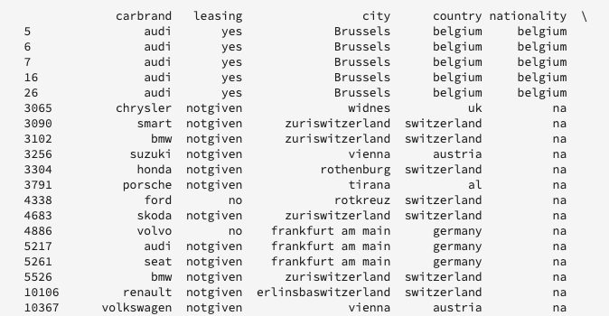

**Training pipeline**

Next you need to create the training pipeline. This is going to look similar to any other training pipeline file except you need to convert and generate an ONNX file.

Using the data transformations defined in your previous cell, modify the template. The following code highlighted below is used for generating an ONNX file in your feature pipeline. Please view the *Real-time ML* template for the complete pipeline code cell.

```python
#for generating onnx
def generate_onnx_resources(self):        
    install_dir = os.path.expanduser('~/my-workspace')
    print("Generating Onnx")
        
    from skl2onnx import convert_sklearn
    from skl2onnx.common.data_types import FloatTensorType
        
    # ONNX-ification
    initial_type = [('float_input', FloatTensorType([None, self.feature_len]))]

    print("Converting Model to Onnx")
    onx = convert_sklearn(self.model, initial_types=initial_type)
             
    with open("model.onnx", "wb") as f:
        f.write(onx.SerializeToString())
            
    print("Model onnx created")
```

Once you have completed your training pipeline and modified your data through data transformations, use the following cell to run training.

```python
model = train(config_properties, df_final)
```

### Generate and upload an ONNX model

Once you have completed a successful training run, you need to generate an ONNX model and upload the trained model to the Real-time Machine Learning model store. After running the following cells, your ONNX model appears in the left-rail alongside all your other notebooks.

```python
import os
import skl2onnx, subprocess

model.generate_onnx_resources()
```

>[!NOTE]
>
>Change the `model_path` string value (`model.onnx`) to change the name of your model.

```python
model_path = "model.onnx"
```

>[!NOTE]
>
>The following cell is not editable or deletable and required for your Real-time Machine Learning application to work.

```python
model = ModelUpload(params={'model_path': model_path})
msg_model = model.process(None, 1)
model_id = msg_model.model['model_id']
 
print("Model ID: ", model_id)
```

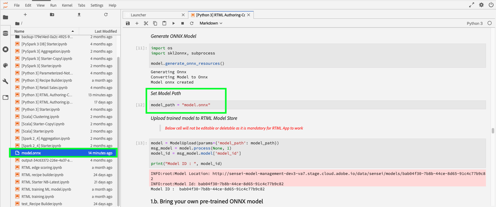

### Uploading your own pre-trained ONNX model {#pre-trained-model-upload}

Using the upload button located in [!DNL JupyterLab] notebooks, upload your pre-trained ONNX model to the [!DNL Data Science Workspace] notebooks environment.

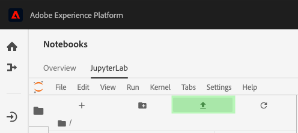

Next, change the `model_path` string value in the *Real-time ML* notebook to match your ONNX model name. Once complete, run the *Set model path* cell and then run the *Upload your model to RTML Model Store* cell. Your model location and model ID are both returned in the response when successful.


## Domain specific language (DSL) creation

This section outlines creating a DSL. You are going to author the nodes that includes any preprocessing of data along with ONNX node. Next, a DSL graph is created using nodes and edges. Edges connect nodes using tuple based format (node_1, node_2). The graph should not have cycles.

>[!IMPORTANT]
>
>Using the ONNX node is mandatory. Without the ONNX node, the application will be unsuccessful.

### Node authoring

>[!NOTE]
>
> You are likely to have multiple nodes based on the type of data being used. The following example outlines only a single node in the *Real-time ML* template. Please view the *Real-time ML* templates *Node Authoring* section for the complete code cell.

The Pandas node below uses `"import": "map"` to import the method name as a string in the parameters, followed by inputting the parameters as a map function. The example below does this by using `{'arg': {'dataLayerNull': 'notgiven', 'no': 'no', 'yes': 'yes', 'notgiven': 'notgiven'}}`. After you have the map in place, you have the option to set `inplace` as `True` or `False`. Set `inplace` as `True` or `False` based on whether you want to apply transformation inplace or not. By default `"inplace": False` creates a new column. Support to provide a new column name is set to be added in a subsequent release. The last line `cols` can be a single column name or a list of columns. Specify the columns on which you want to apply the transformation. In this example `leasing` is specified. For more information on the available nodes and how to use them, visit the [node reference guide](./node-reference.md).

```python
# Renaming leasing column using Pandas Node
leasing_mapper_node = Pandas(params={'import': 'map',
                                'kwargs': {'arg': {
                                    'dataLayerNull': 'notgiven', 
                                    'no': 'no', 
                                    'yes': 'yes', 
                                    'notgiven': 'notgiven'}},
                                'inplace': True,
                                'cols': 'leasing'})
```

### Build the DSL graph

With your nodes created, the next step is to chain the nodes together to create a graph. 

Start by listing all the nodes that are a part of the graph by building an array.

```python
nodes = [json_df_node, 
        to_datetime_node,
        hour_node,
        dayofweek_node,
        age_fillna_node,
        carbrand_fillna_node,
        country_fillna_node,
        cartype_primary_nationality_km_fillna_node,
        carbrand_mapper_node,
        cartype_mapper_node,
        country_mapper_node,
        gender_mapper_node,
        leasing_mapper_node,
        age_to_int_node,
        age_bins_node,
        dummies_node, 
        onnx_node]
```

Next, connect the nodes with edges. Each tuple is an [!DNL Edge] connection.

>[!TIP]
>
> As the nodes are linearly dependent on each other (each node depends on previous node's output), you can create links using a simple Python list comprehension. Please add your own connections if a node depends on multiple inputs.

```python
edges = [(nodes[i], nodes[i+1]) for i in range(len(nodes)-1)]
```

Once your nodes are connected, build the graph. The cell below is mandatory and cannot be edited or deleted.

```python
dsl = GraphBuilder.generate_dsl(nodes=nodes, edges=edges)
pprint(json.loads(dsl))
```

Once complete, an `edge` object is returned containing each of the nodes and the parameters that were mapped to them.

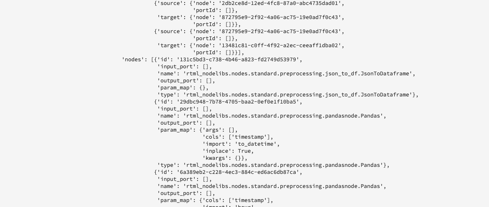

## Publish to Edge (Hub)

>[!NOTE]
>
>Real-time Machine Learning is temporarily deployed to and managed by the Adobe Experience Platform Hub. For additional details, visit the overview section on [Real-time Machine Learning architecture](./home.md#architecture).

Now that you have created a DSL graph, you can deploy your graph to the [!DNL Edge].

>[!IMPORTANT]
>
>Do not publish to [!DNL Edge] often, this can overload the [!DNL Edge] nodes. Publishing the same model multiple times is not recommended.

```python
edge_utils = EdgeUtils()
(edge_location, service_id) = edge_utils.publish_to_edge(dsl=dsl)
print(f'Edge Location: {edge_location}')
print(f'Service ID: {service_id}')
```

### Updating your DSL and re-publishing to Edge (optional)

If you do not need to update your DSL, you can skip to [scoring](#scoring).

>[!NOTE]
>
>The following cells are only required if you wish to update an existing DSL that has been published to Edge.

Your models are likely to continue to develop. Rather than creating a whole new service, it is possible to update an existing service with your new model. You can define a node you wish to update, assign it a new ID, then re-upload the new DSL to the [!DNL Edge]. 

In the example below, node 0 is updated with a new ID.

```python
# Update the id of Node 0 with a random uuid.

dsl_dict = json.loads(dsl)
print(f"ID of Node 0 in current DSL: {dsl_dict['edge']['applicationDsl']['nodes'][0]['id']}")

new_node_id = str(uuid.uuid4())
print(f'Updated Node ID: {new_node_id}')

dsl_dict['edge']['applicationDsl']['nodes'][0]['id'] = new_node_id
```

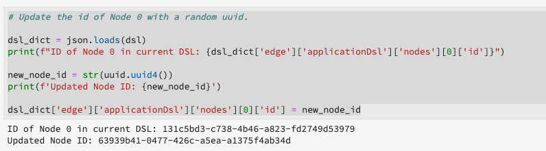

After updating the node ID, you're able to re-publish an updated DSL to the Edge.

```python
# Republish the updated DSL to Edge
(edge_location_ret, service_id, updated_dsl) = edge_utils.update_deployment(dsl=json.dumps(dsl_dict), service_id=service_id)
print(f'Updated dsl: {updated_dsl}')
```

You are returned the updated DSL.

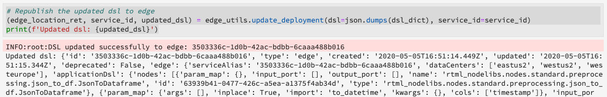

## Scoring {#scoring}

After publishing to [!DNL Edge], scoring is done by a POST request from a client. Typically, this can be done from a client application that needs ML scores. You can also do it from Postman. The **[!UICONTROL Real-time ML]** template uses EdgeUtils to demonstrate this process.

>[!NOTE]
>
>A small processing time is required before scoring starts.

```python
# Wait for the app to come up
import time
time.sleep(20)
```

Using the same schema that was used in training, sample scoring data is generated. This data is used to build a scoring dataframe then converted into a scoring dictionary. Please view the *Real-time ML* template for the complete code cell.

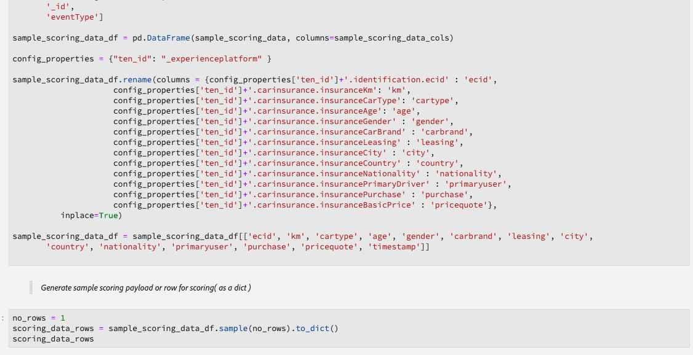

### Score against the Edge endpoint

Use the following cell within the *Real-time ML* template to score against your [!DNL Edge] service.

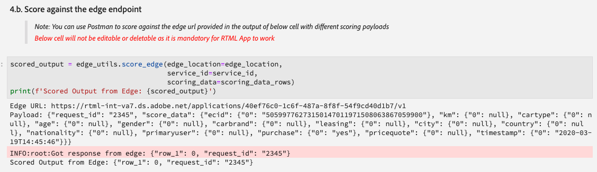

Once scoring is complete, the [!DNL Edge] URL, Payload, and scored output from the [!DNL Edge] are returned. 

## List your deployed apps from the [!DNL Edge]

To generate a list of your currently deployed apps on the [!DNL Edge], run the following code cell. This cell cannot be edited or deleted.

```python
services = edge_utils.list_deployed_services()
print(services)
```

The response returned is an array of your deployed services.

```json
[
    {
        "created": "2020-05-25T19:18:52.731Z",
        "deprecated": false,
        "id": "40eq76c0-1c6f-427a-8f8f-54y9cdf041b7",
        "type": "edge",
        "updated": "2020-05-25T19:18:52.731Z"
    }
]
```

## Delete a deployed app or service id from the [!DNL Edge] (optional)

>[!CAUTION]
>
>This cell is used to delete your deployed Edge application. Do not use the following cell unless you need to delete a deployed [!DNL Edge] application. 

```python
if edge_utils.delete_from_edge(service_id=service_id):
    print(f"Deleted service id {service_id} successfully")
else:
    print(f"Failed to delete service id {service_id}")
```

## Next steps

By following the tutorial above, you have successfully trained and uploaded an ONNX model to the Real-time Machine Learning model store. Additionally, you have scored and deployed your Real-time Machine Learning model. If you wish to learn more about the nodes available for model authoring, visit the [node reference guide](./node-reference.md).
