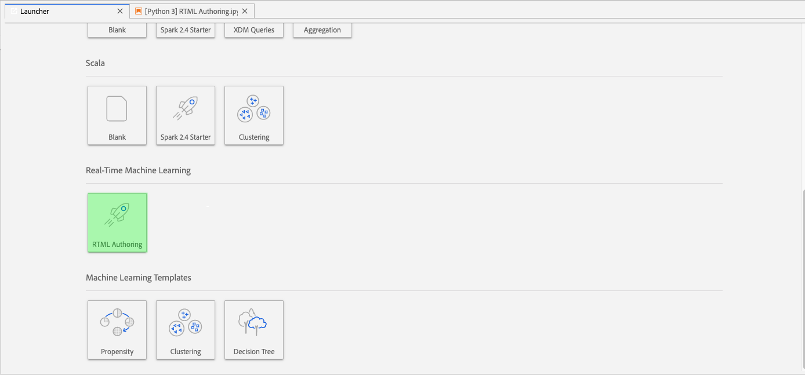

# Real-time Machine Learning authoring notebook user guide

>[!IMPORTANT]
>Real-time Machine Learning is not available to all users yet. This feature is in alpha and still being tested. This document is subject to change.

The following guide outlines the steps needed to build a Real-time Machine Learning application. Using the Adobe provided **[!UICONTROL RTML Authoring]** notebook template, this guide covers training a model, creating a DSL, publishing DSL to Edge, and scoring the request.

## Create a RTML authoring notebook

In the Adobe Experience Platform UI, select **[!UICONTROL Notebooks]** from within *Data Science*. Next, select **[!UICONTROL JupyterLab]** and allow some time for the environment to load.


Start by selecting the **RTML Authoring notebook** from within the JupyterLab launcher.



## Import and discover nodes

Start by importing all the required packages for your model. Make sure any packages you plan on using for node authoring are imported.

>[!NOTE]
>Your list of imports might differ based on the model you wish to make. This list is going to change as new nodes are added over time. Please refer to the [node reference guide](./node-reference.md) for a complete list of available nodes.

```python
from pprint import pprint
import pandas as pd
import numpy as np
import json
import uuid
from shutil import copyfile
from pathlib import Path
from datetime import date, datetime, timedelta
from platform_sdk.dataset_reader import DatasetReader

from rtml_nodelibs.nodes.standard.preprocessing.json_to_df import JsonToDataframe
from rtml_sdk.edge.utils import EdgeUtils
from rtml_sdk.graph.utils import GraphBuilder
from rtml_nodelibs.nodes.standard.ml.onnx import ONNXNode
from rtml_nodelibs.core.nodefactory import NodeFactory as nf
from rtml_nodelibs.nodes.standard.preprocessing.pandasnode import Pandas
from rtml_nodelibs.nodes.standard.preprocessing.one_hot_encoder import OneHotEncoder
from rtml_nodelibs.nodes.standard.ml.artifact_utils import ModelUpload
from rtml_nodelibs.core.nodefactory import NodeFactory as nf
from rtml_nodelibs.core.datamsg import DataMsg
```

The following code cell creates a list of available nodes.

```python
# Discover Nodes
pprint(nf.discover_nodes())
```

The response received is a list of nodes.


## Training a Real-time Machine Learning model

Using one of the following options, you are going to write python code to read, preprocess, and analyze data. Next, you need to train your own ML model, serialize it into ONNX format, and finally upload it to Real-time Machine Learning model store.

- [Training your own model](#training-your-own-model)
- [Uploading your own pre-trained ONNX model]()

### Training your own model {#training-your-own-model}

Start by loading your training data. In the **RTML Authoring** template, the CSV dataset is grabbed from Github. If you wish to use a dataset from within Adobe Experience Platform, uncomment the cell below *Load Training Data*. Next you need to replace the `dataset_id` with the appropriate value. 

To access a dataset in your JupyterLab notebook, select the **Data** tab in the left-navigation of JupyterLab. The *Datasets* and *Schemas* directories appear. Select **[!UICONTROL Datasets]** and right-click, then select the **[!UICONTROL Explore Data in Notebook]** option from the dropdown menu on the dataset you wish to use. An executable code entry appears at the bottom of the notebook. This cell has your `dataset_id`. 


After uncommenting, copy and paste the `dataset_id` in the following cell. 


Once complete, right-click and delete the cell that you generated at the bottom of the notebook.

### Training properties


